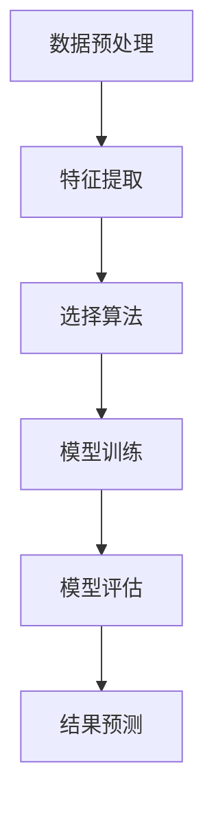
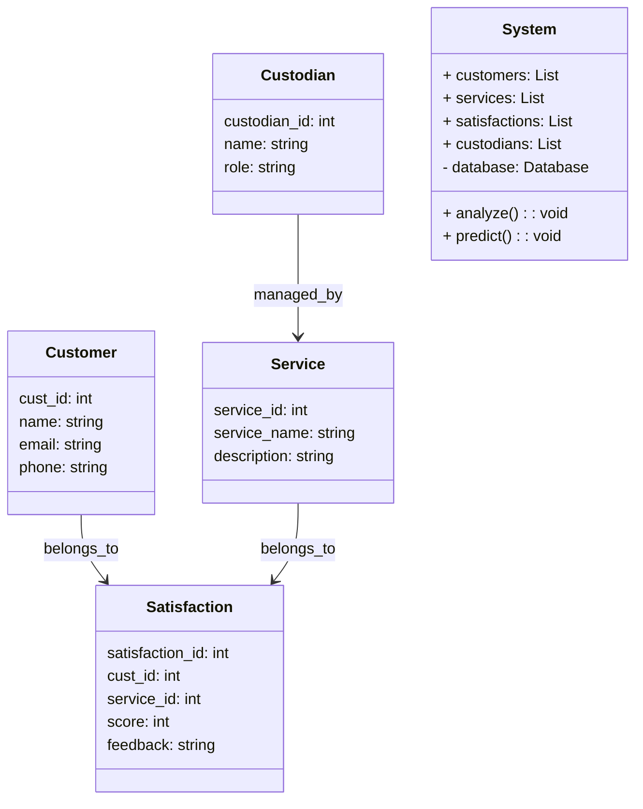
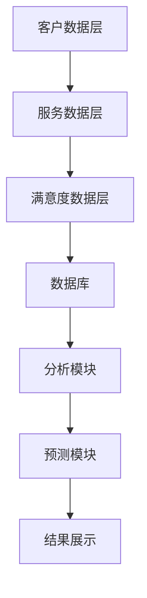
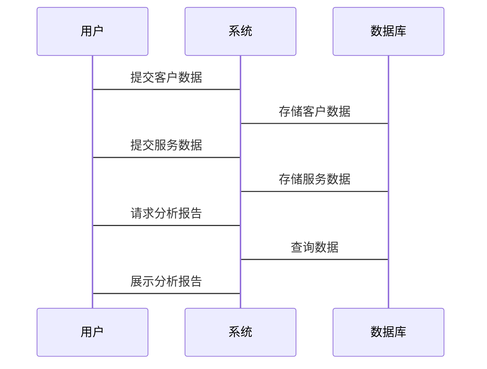

                 


# AI驱动的客户满意度分析：预测公司的长期成功

> **关键词**：AI技术，客户满意度分析，机器学习，长期成功预测，数据驱动决策

> **摘要**：本文探讨了如何利用人工智能技术进行客户满意度分析，预测公司的长期成功。通过分析客户数据，构建数学模型，优化算法，设计系统架构，并结合实际案例，展示AI在客户满意度分析中的应用及其对公司战略决策的深远影响。

---

# 第一部分: AI驱动的客户满意度分析基础

## 第1章: 客户满意度分析概述

### 1.1 客户满意度分析的基本概念

#### 1.1.1 客户满意度的定义

客户满意度是客户对公司产品或服务的满意程度的度量。它反映了客户对公司在产品质量、服务效率、响应速度、问题解决等方面的综合评价。客户满意度通常通过调查问卷、反馈系统等方式收集数据，并通过统计方法进行分析。

#### 1.1.2 客户满意度分析的重要性

客户满意度是企业成功的关键因素之一。高客户满意度通常意味着客户更可能重复购买、推荐公司产品或服务，从而提高公司的市场份额和盈利能力。此外，客户满意度高的公司通常具有更强的客户忠诚度和品牌影响力。

#### 1.1.3 客户满意度与公司长期成功的关系

客户满意度与公司长期成功密切相关。高客户满意度不仅能够提升公司的品牌形象，还能降低客户的流失率，增加客户的忠诚度和参与度。通过分析客户满意度数据，公司可以识别客户的需求和痛点，优化产品和服务，从而实现长期的成功。

### 1.2 AI在客户满意度分析中的作用

#### 1.2.1 AI技术的基本概念

人工智能（AI）是指模拟人类智能的计算机系统，包括学习、推理、自我改进等功能。AI技术广泛应用于数据分析、模式识别、自然语言处理等领域。

#### 1.2.2 AI在客户满意度分析中的优势

AI技术能够快速处理大量数据，识别数据中的模式和趋势，从而提高客户满意度分析的效率和准确性。AI还可以通过机器学习算法，预测客户的潜在需求和行为，帮助公司制定更有效的客户管理策略。

#### 1.2.3 AI驱动客户满意度分析的未来趋势

随着AI技术的不断发展，客户满意度分析将更加智能化和个性化。未来的AI系统将能够实时分析客户的反馈，动态调整产品和服务策略，从而实现更精准的客户满意度管理。

## 第2章: 客户满意度分析的核心概念与联系

### 2.1 客户满意度分析的原理

#### 2.1.1 数据采集与处理

客户满意度分析的第一步是数据采集，通常通过问卷调查、在线反馈、客服记录等方式获取客户数据。数据处理包括数据清洗、数据转换和数据预处理，以确保数据的准确性和一致性。

#### 2.1.2 数据分析与建模

数据分析是客户满意度分析的核心步骤。通过统计分析、机器学习算法等方法，构建客户满意度模型，识别影响客户满意度的关键因素。

#### 2.1.3 结果解读与应用

模型分析结果需要进行解读，找出影响客户满意度的主要因素，并制定相应的改进措施。例如，如果客户对服务响应速度不满意，公司可以优化客户服务流程，提高响应速度。

### 2.2 核心概念对比表格

#### 2.2.1 不同客户满意度分析方法的对比

| 方法                | 优点                          | 缺点                          |
|---------------------|-------------------------------|-------------------------------|
| 统计分析            | 简单易懂，适合小数据集        | 易受数据分布影响，结果可能不够精确 |
| 机器学习            | 能够处理复杂数据，预测能力强    | 需要大量数据，计算复杂          |
| 自然语言处理        | 能够分析文本数据，提取情感信息  | 需要大量训练数据，结果可能不够直观 |

#### 2.2.2 AI与其他分析方法的优劣势对比

| 方法                | 优点                          | 缺点                          |
|---------------------|-------------------------------|-------------------------------|
| AI技术              | 高准确性，能够处理大量数据     | 需要大量计算资源，技术门槛高    |
| 统计分析            | 易操作，适合初步分析           | 结果可能不够深入                |
| 自然语言处理        | 能够分析文本数据，提取情感信息  | 需要大量训练数据，结果可能不够直观 |

### 2.3 ER实体关系图

以下是客户满意度分析的ER实体关系图：

```mermaid
er
  customer(cust_id, name, email, phone)
  service(service_id, service_name, description)
  satisfaction(satisfaction_id, cust_id, service_id, score, feedback)
  custodian(custodian_id, name, role)
  belongs_to(cust_id, satisfaction_id)
  managed_by(custodian_id, service_id)
```

图中展示了客户（customer）、服务（service）、满意度（satisfaction）、 custodian（管理者）之间的关系。客户和满意度之间存在“属于”关系，服务和管理者之间存在“管理”关系。

---

## 第3章: 客户满意度分析的算法原理

### 3.1 算法原理概述

#### 3.1.1 机器学习的基本概念

机器学习是一种人工智能技术，通过训练数据模型，使其能够从数据中学习并进行预测或分类。机器学习算法可以分为监督学习、无监督学习和半监督学习。

#### 3.1.2 常见算法在客户满意度分析中的应用

常用的机器学习算法包括线性回归、逻辑回归、支持向量机（SVM）、随机森林等。这些算法可以用于客户满意度预测、客户细分、情感分析等任务。

### 3.2 算法流程图

以下是客户满意度分析的算法流程图：



流程图展示了从数据预处理到结果预测的整个过程。

### 3.3 算法实现代码

以下是一个简单的客户满意度预测的Python代码示例：

```python
import pandas as pd
from sklearn.model_selection import train_test_split
from sklearn.linear_model import LinearRegression
from sklearn.metrics import mean_squared_error

# 加载数据
data = pd.read_csv('customer_satisfaction.csv')

# 数据预处理
X = data.drop('score', axis=1)
y = data['score']

# 划分训练集和测试集
X_train, X_test, y_train, y_test = train_test_split(X, y, test_size=0.2, random_state=42)

# 选择算法
model = LinearRegression()

# 模型训练
model.fit(X_train, y_train)

# 模型预测
y_pred = model.predict(X_test)

# 模型评估
mse = mean_squared_error(y_test, y_pred)
print('均方误差:', mse)
print('回归系数:', model.coef_)
print('回归截距:', model.intercept_)
```

### 3.4 数学模型与公式

#### 3.4.1 线性回归模型

线性回归模型的公式为：

$$ y = \beta_0 + \beta_1 x_1 + \beta_2 x_2 + \ldots + \beta_n x_n + \epsilon $$

其中，$y$ 是目标变量（客户满意度得分），$x_i$ 是自变量（影响客户满意度的因素），$\beta_i$ 是回归系数，$\epsilon$ 是误差项。

#### 3.4.2 逻辑回归模型

逻辑回归模型的公式为：

$$ P(y=1|x) = \frac{e^{\beta_0 + \beta_1 x_1 + \ldots + \beta_n x_n}}{1 + e^{\beta_0 + \beta_1 x_1 + \ldots + \beta_n x_n}} $$

其中，$P(y=1|x)$ 是客户对某项服务满意的概率，$x_i$ 是自变量，$\beta_i$ 是回归系数。

#### 3.4.3 支持向量机模型

支持向量机的公式较为复杂，通常涉及核函数的选择和优化。常用的核函数包括线性核、多项式核、径向基函数（RBF）核等。

---

## 第4章: 客户满意度分析的数学模型与公式

### 4.1 线性回归模型

线性回归模型用于预测客户满意度得分。假设我们有以下数据：

| 客户ID | 服务响应时间（秒） | 满意度得分 |
|-------|------------------|------------|
| 1     | 30               | 85         |
| 2     | 45               | 70         |
| 3     | 20               | 90         |

线性回归模型的公式为：

$$ \text{满意度得分} = \beta_0 + \beta_1 \times \text{服务响应时间} $$

通过训练数据，我们可以得到回归系数 $\beta_0$ 和 $\beta_1$，并使用这些系数来预测新客户的服务满意度。

### 4.2 逻辑回归模型

逻辑回归模型用于分类任务，例如预测客户是否会投诉。假设我们有以下数据：

| 客户ID | 服务响应时间（秒） | 投诉（是/否） |
|-------|------------------|--------------|
| 1     | 30               | 否           |
| 2     | 45               | 是           |
| 3     | 20               | 否           |

逻辑回归模型的公式为：

$$ P(\text{投诉}=1|\text{服务响应时间}) = \frac{e^{\beta_0 + \beta_1 \times \text{服务响应时间}}}{1 + e^{\beta_0 + \beta_1 \times \text{服务响应时间}}} $$

通过训练数据，我们可以估计出回归系数 $\beta_0$ 和 $\beta_1$，并使用这些系数来预测客户投诉的概率。

### 4.3 支持向量机模型

支持向量机模型用于分类任务，例如预测客户满意度等级。假设我们有以下数据：

| 客户ID | 服务响应时间（秒） | 服务质量评分 | 满意度等级（低/中/高） |
|-------|------------------|--------------|-----------------------|
| 1     | 30               | 75           | 中                   |
| 2     | 45               | 60           | 低                   |
| 3     | 20               | 85           | 高                   |

支持向量机模型的公式较为复杂，通常涉及核函数的选择和优化。常用的核函数包括线性核、多项式核、径向基函数（RBF）核等。以下是RBF核的公式：

$$ K(x, x') = \exp(-\gamma ||x - x'||^2) $$

其中，$\gamma$ 是一个调节参数，控制数据的拟合程度。

---

# 第二部分: 系统分析与架构设计

## 第5章: 系统分析与架构设计方案

### 5.1 问题场景介绍

我们希望通过构建一个客户满意度分析系统，帮助公司预测客户满意度，优化产品和服务策略。系统将整合客户数据、服务数据和反馈数据，利用AI技术进行分析和预测。

### 5.2 系统功能设计

以下是系统功能设计的类图：



类图展示了系统中的各个实体及其关系。

### 5.3 系统架构设计

以下是系统架构设计的架构图：



架构图展示了系统各个模块之间的关系和数据流。

### 5.4 系统接口设计

系统接口设计包括数据接口、算法接口和用户接口。数据接口用于获取客户数据和服务数据，算法接口用于调用AI算法进行分析和预测，用户接口用于展示分析结果和预测结果。

### 5.5 系统交互流程

以下是系统交互的序列图：



---

## 第6章: 项目实战

### 6.1 环境安装

为了运行本文中的代码，您需要安装以下环境和库：

- Python 3.x
- Pandas
- Scikit-learn
- Mermaid

安装命令：

```bash
pip install pandas scikit-learn
```

### 6.2 系统核心实现源代码

以下是客户满意度分析系统的Python代码实现：

```python
import pandas as pd
from sklearn.model_selection import train_test_split
from sklearn.linear_model import LinearRegression
from sklearn.metrics import mean_squared_error

# 加载数据
data = pd.read_csv('customer_satisfaction.csv')

# 数据预处理
X = data.drop('score', axis=1)
y = data['score']

# 划分训练集和测试集
X_train, X_test, y_train, y_test = train_test_split(X, y, test_size=0.2, random_state=42)

# 选择算法
model = LinearRegression()

# 模型训练
model.fit(X_train, y_train)

# 模型预测
y_pred = model.predict(X_test)

# 模型评估
mse = mean_squared_error(y_test, y_pred)
print('均方误差:', mse)
print('回归系数:', model.coef_)
print('回归截距:', model.intercept_)
```

### 6.3 代码应用解读与分析

上述代码实现了一个简单的客户满意度预测模型。首先，数据预处理部分将数据分为特征变量和目标变量。然后，使用线性回归算法进行模型训练和预测。最后，评估模型的均方误差，并输出回归系数和截距。

### 6.4 实际案例分析

假设我们有一个客户数据集，包括客户ID、服务响应时间和服务质量评分。我们可以通过上述代码预测客户的满意度得分，并根据结果优化服务流程。

### 6.5 项目小结

通过本项目的实战，我们了解了如何利用AI技术进行客户满意度分析，并将理论应用于实际。通过代码实现和案例分析，我们验证了AI技术在客户满意度分析中的有效性。

---

## 第7章: 最佳实践、小结、注意事项、拓展阅读

### 7.1 最佳实践

- 数据预处理是关键：确保数据的准确性和完整性。
- 选择合适的算法：根据数据特征和任务需求选择合适的算法。
- 模型评估：使用多种评估指标，如均方误差、准确率、召回率等。

### 7.2 小结

本文详细介绍了AI驱动的客户满意度分析的理论和实践。通过构建数学模型、设计系统架构和实际案例分析，展示了AI在客户满意度分析中的广泛应用。

### 7.3 注意事项

- 数据隐私：在处理客户数据时，必须遵守相关法律法规，保护客户隐私。
- 模型解释性：复杂的模型可能难以解释，需要选择适合业务需求的模型。
- 持续优化：根据实时数据和业务需求，持续优化模型和系统。

### 7.4 拓展阅读

- 《机器学习实战》
- 《Python机器学习》
- 《深度学习入门》

---

# 结语

通过本文的介绍和分析，我们了解了AI技术在客户满意度分析中的重要性及其应用。希望本文能够为读者提供有价值的见解，并为公司的长期成功提供有效的决策支持。

---

