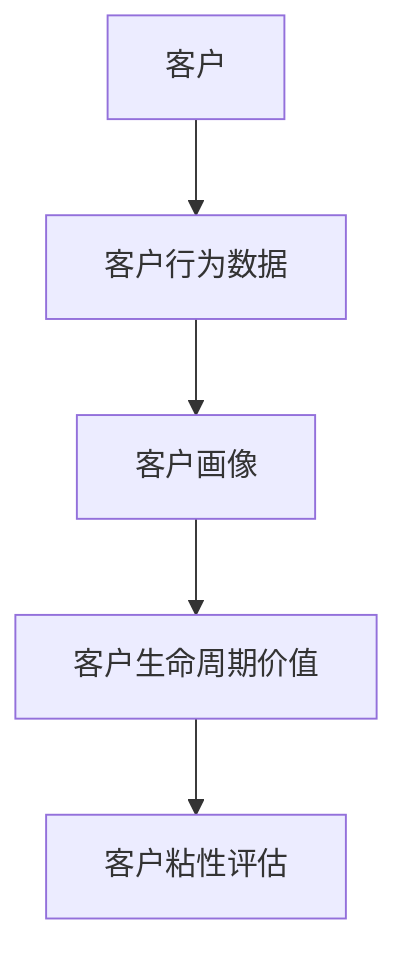
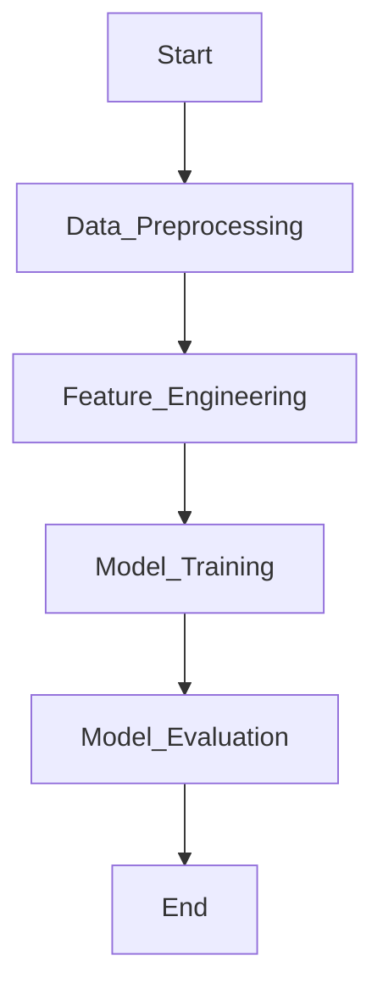
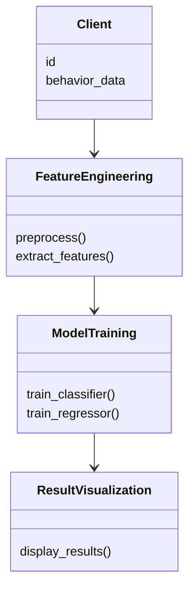

                 


# AI驱动的客户粘性分析：评估公司的长期收入质量

## 关键词
AI技术，客户粘性分析，长期收入质量，客户画像，AI算法，客户生命周期价值

## 摘要
本文深入探讨了AI技术在客户粘性分析中的应用，通过构建客户画像和分析客户生命周期价值，评估公司的长期收入质量。文章从背景介绍、核心概念、算法原理、系统架构设计到项目实战，全面解析了AI驱动的客户粘性分析方法，并提供了实际案例和最佳实践，帮助读者掌握如何利用AI技术提升客户粘性，优化收入结构。

---

## 第一部分：客户粘性分析的背景与核心概念

### 第1章：客户粘性分析的背景与问题描述

#### 1.1 客户粘性的定义与重要性
- **1.1.1 客户粘性的定义**：客户粘性是指客户对公司产品或服务的依赖程度，高粘性意味着客户更可能持续消费。
- **1.1.2 客户粘性对收入质量的影响**：高粘性客户能带来稳定的收入来源，降低客户获取成本，提升整体收入质量。
- **1.1.3 客户粘性分析的商业价值**：通过分析客户粘性，企业可以优化营销策略，提升客户忠诚度，增加市场份额。

#### 1.2 问题背景与挑战
- **1.2.1 传统客户分析方法的局限性**：传统方法依赖经验判断，缺乏数据支持，难以准确评估客户粘性。
- **1.2.2 数据驱动分析的必要性**：通过大量数据和AI技术，可以更精准地识别高价值客户，优化客户管理。
- **1.2.3 AI技术在客户粘性分析中的优势**：AI能够快速处理海量数据，发现潜在模式，提供实时分析。

#### 1.3 问题解决与边界
- **1.3.1 通过AI提升客户粘性的核心路径**：数据采集、特征提取、模型训练、结果应用。
- **1.3.2 客户粘性分析的边界与外延**：聚焦于客户行为分析，不涉及产品设计和市场策略。
- **1.3.3 核心要素与组成结构**：客户画像、行为数据、生命周期价值。

### 第2章：客户粘性分析的核心概念与联系

#### 2.1 核心概念原理
- **2.1.1 数据驱动的客户行为分析**：通过收集客户数据，分析其购买频率、金额、渠道等行为特征。
- **2.1.2 AI技术在客户画像构建中的应用**：利用聚类算法将客户分为不同群体，识别高价值客户。
- **2.1.3 客户生命周期价值模型**：预测客户在未来一段时间内的消费潜力，优化资源配置。

#### 2.2 核心概念对比分析
- **2.2.1 不同客户分析方法的特征对比**：
  | 方法 | 优点 | 缺点 |
  |------|------|------|
  | 传统方法 | 易操作 | 结果主观 |
  | 数据驱动 | 精准 | 需大量数据 |
  | AI驱动 | 高效 | 技术复杂 |

- **2.2.2 AI驱动与传统驱动的对比分析**：AI分析速度快、精度高，但需要处理复杂技术；传统方法简单，但结果可能不准确。
- **2.2.3 数据质量与分析结果的关系**：高质量数据提升分析准确性，数据缺失或噪声会影响结果。

#### 2.3 实体关系图与数据流分析


---

## 第二部分：AI驱动的客户粘性分析算法原理

### 第3章：AI驱动的客户粘性分析算法

#### 3.1 算法原理概述
- **3.1.1 数据预处理与特征工程**：
  - 数据清洗：处理缺失值、异常值。
  - 特征提取：从行为数据中提取关键特征，如购买频率、客单价、留存率。
- **3.1.2 模型选择与训练**：
  - 分类模型：如随机森林、神经网络，用于预测客户粘性。
  - 回归模型：用于预测客户生命周期价值。
- **3.1.3 模型评估与优化**：
  - 使用准确率、召回率等指标评估模型性能。
  - 调参优化，提升模型预测精度。

#### 3.2 算法流程图


#### 3.3 数学模型与公式
- **客户粘性预测模型**：
  使用逻辑回归模型，预测客户是否为高粘性客户。
  $$ P(y=1|x) = \frac{1}{1 + e^{-\beta x}} $$
  其中，$x$是特征向量，$\beta$是模型参数。

- **客户生命周期价值模型**：
  使用线性回归预测未来收入。
  $$ \text{LCV} = \alpha + \beta_1 x_1 + \beta_2 x_2 + \dots + \beta_n x_n $$

---

## 第三部分：系统分析与架构设计方案

### 第4章：系统分析与架构设计

#### 4.1 问题场景介绍
- 系统目标：构建AI驱动的客户粘性分析系统，评估公司长期收入质量。
- 业务需求：快速分析客户行为，提供决策支持。
- 约束条件：数据隐私、系统性能、用户友好性。

#### 4.2 系统功能设计
- 数据预处理模块：处理原始数据，提取特征。
- 模型训练模块：训练分类和回归模型。
- 结果可视化模块：展示客户粘性分析结果。

#### 4.3 系统架构设计


---

## 第四部分：项目实战

### 第5章：项目实战与代码实现

#### 5.1 环境安装
- Python 3.8+
- 安装库：pandas、scikit-learn、matplotlib

#### 5.2 核心代码实现
```python
import pandas as pd
from sklearn.ensemble import RandomForestClassifier
from sklearn.metrics import accuracy_score

# 加载数据
data = pd.read_csv('customer_data.csv')

# 特征工程
X = data[['frequency', 'recency', 'monetary']]
y = data['is_high黏性']

# 模型训练
model = RandomForestClassifier()
model.fit(X, y)

# 模型预测
predictions = model.predict(X)
print("准确率:", accuracy_score(y, predictions))
```

#### 5.3 代码解读与分析
- 数据加载：读取客户数据，提取特征和标签。
- 模型训练：使用随机森林分类器预测客户粘性。
- 结果分析：输出模型准确率，评估预测效果。

#### 5.4 实际案例分析
- 数据准备：收集过去一年的客户购买数据。
- 模型应用：预测哪些客户是高粘性客户。
- 结果应用：针对高粘性客户制定个性化营销策略。

---

## 第五部分：最佳实践

### 第6章：最佳实践与小结

#### 6.1 最佳实践
- 数据质量：确保数据准确、完整，避免偏差。
- 模型选择：根据业务需求选择合适的模型，进行调参优化。
- 结果解释：将AI分析结果转化为可执行的商业策略。

#### 6.2 小结
AI驱动的客户粘性分析能够帮助企业精准识别高价值客户，优化收入结构。通过数据驱动的方法，企业可以更高效地管理客户关系，提升长期收入质量。

#### 6.3 注意事项
- 数据隐私：遵守相关法律法规，保护客户隐私。
- 技术门槛：AI分析需要专业团队支持，确保模型准确可靠。
- 持续优化：定期更新模型，适应市场变化。

#### 6.4 拓展阅读
- 《机器学习实战》：学习更多机器学习算法和应用。
- 《数据分析的艺术》：了解如何从数据中提取有价值的信息。

---

通过以上结构和内容，您可以撰写一篇详细且专业的技术博客，全面解析AI驱动的客户粘性分析方法，帮助读者提升公司的长期收入质量。

