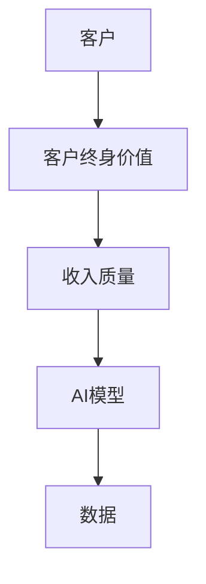
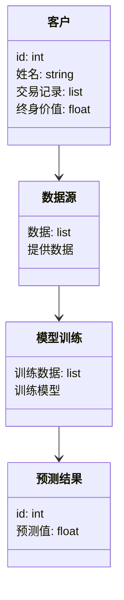
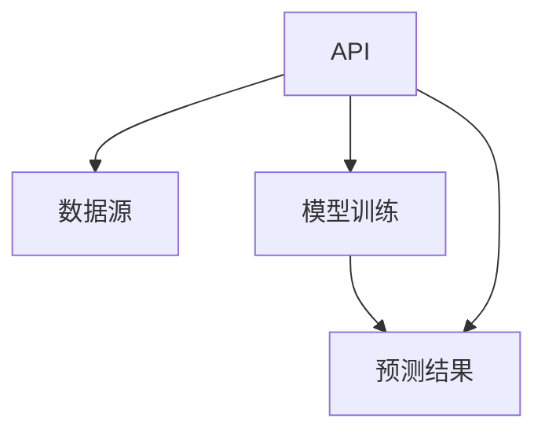
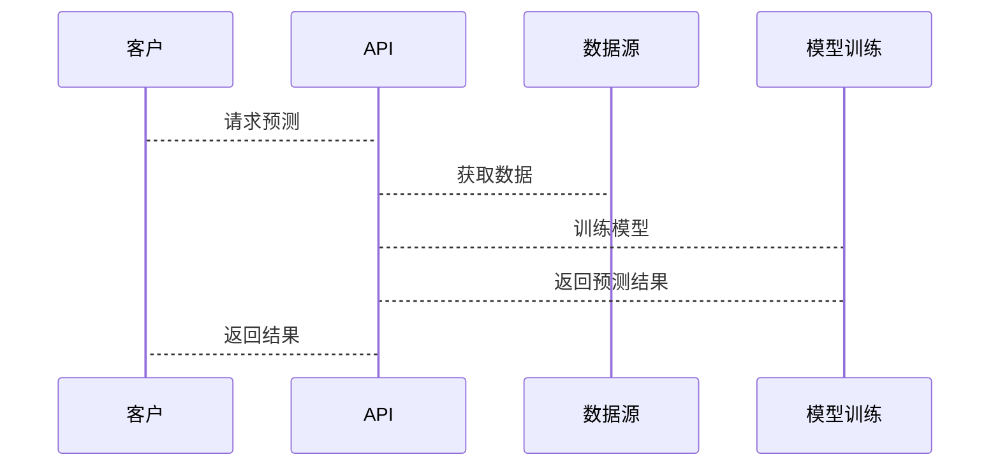

                 


# AI驱动的客户终身价值分析：深入理解公司的收入质量

## 关键词：客户终身价值（CLV）、收入质量、人工智能（AI）、客户行为预测、数据驱动决策

## 摘要：  
在数字化转型的背景下，企业越来越依赖数据驱动的决策来优化收入结构和客户管理。客户终身价值（CLV）是衡量客户对公司长期贡献的核心指标，而收入质量则是评估企业财务健康的重要维度。本文将深入探讨如何利用人工智能技术分析客户终身价值，从而优化收入质量。通过结合数学模型、算法原理和系统架构设计，本文将为企业提供一套完整的解决方案，帮助企业更好地理解收入质量，提升客户管理效率。

---

# 第一部分：背景介绍

# 第1章：客户终身价值与收入质量的背景

## 1.1 问题背景与描述

### 1.1.1 客户终身价值（CLV）的定义  
客户终身价值（Customer Lifetime Value，CLV）是指一个客户在其生命周期内为企业带来的总收入减去获取和维护该客户的成本。它是企业制定客户管理策略的重要依据。  

$$ CLV = \text{客户生命周期内总收入} - \text{获取成本} - \text{维护成本} $$  

CLV的核心在于预测客户在未来可能产生的收入，从而帮助企业识别高价值客户并优化资源分配。

### 1.1.2 收入质量的内涵与外延  
收入质量是指企业收入的结构合理性、可持续性和盈利能力。高质量的收入来源通常是稳定且高利润率的客户群体，而低质量的收入可能来源于一次性交易或低毛利的客户。  

收入质量的评价维度包括：  
1. 收入来源的多样性  
2. 客户的生命周期阶段  
3. 收入的波动性  
4. 收入的可持续性  

### 1.1.3 当前企业收入管理的痛点  
企业在收入管理中面临以下痛点：  
1. **客户流失率高**：无法准确预测客户流失风险，导致收入不稳定。  
2. **客户价值不均**：不同客户贡献的收入差异大，难以精准分配资源。  
3. **数据孤岛问题**：各部门数据分散，难以形成统一的客户视图。  
4. **决策滞后**：传统报表分析依赖历史数据，难以实时指导业务决策。  

## 1.2 AI驱动客户分析的必要性  

### 1.2.1 数据驱动决策的兴起  
随着大数据技术的发展，企业越来越依赖数据而非直觉或经验来制定决策。数据驱动决策能够提高效率并降低成本。  

### 1.2.2 AI在客户价值分析中的优势  
人工智能技术在客户价值分析中的优势体现在以下方面：  
1. **自动化数据处理**：AI能够快速处理海量数据，提取关键特征。  
2. **预测能力**：通过机器学习模型，可以准确预测客户行为和收入贡献。  
3. **实时分析**：AI能够实时监控客户行为，及时调整营销策略。  

### 1.2.3 数字化转型对企业收入质量的影响  
数字化转型通过优化客户体验、提高运营效率和增强数据驱动决策能力，显著提升了企业的收入质量。  

## 1.3 问题解决与边界  

### 1.3.1 客户终身价值的计算方法  
客户终身价值的计算通常采用以下步骤：  
1. **收集客户数据**：包括交易历史、行为特征、人口统计等。  
2. **选择模型**：如线性回归、随机森林等。  
3. **预测客户生命周期价值**：基于历史数据和模型预测未来的收入贡献。  

### 1.3.2 收入质量的评价指标  
收入质量的评价指标包括：  
1. **客户留存率**：客户在企业购买产品或服务的频率。  
2. **收入贡献率**：高价值客户对总收入的贡献比例。  
3. **客户获取成本（CAC）**：获取一个新客户的平均成本。  

### 1.3.3 AI驱动分析的可行性与局限性  
AI驱动分析的可行性体现在其强大的数据处理和预测能力，但其局限性在于数据质量和模型解释性。如果数据质量不高，AI模型的预测结果可能不准确。  

## 1.4 概念结构与核心要素  

### 1.4.1 客户生命周期模型  
客户生命周期模型将客户分为五个阶段：获取、激活、增长、稳定和衰退。每个阶段的客户行为和收入贡献不同。  

### 1.4.2 收入质量的核心维度  
收入质量的核心维度包括：  
1. 客户的生命周期阶段。  
2. 客户的收入贡献能力。  
3. 客户的流失风险。  

### 1.4.3 AI驱动分析的逻辑框架  
AI驱动分析的逻辑框架包括数据收集、特征工程、模型训练、预测与优化四个步骤。  

---

# 第二部分：核心概念与联系

# 第2章：客户终身价值与收入质量的关联

## 2.1 核心概念原理  

### 2.1.1 客户终身价值的计算公式  
$$ CLV = \text{客户平均收入} \times \text{客户生命周期长度} - \text{客户获取成本} $$  

### 2.1.2 收入质量的评价指标  
收入质量的评价指标包括客户留存率、收入贡献率和客户获取成本。  

### 2.1.3 AI在客户行为预测中的作用  
AI通过分析客户的交易历史、行为特征和人口统计信息，预测客户的未来行为，从而优化收入质量。  

## 2.2 核心概念属性对比  

| 属性               | 客户终身价值（CLV） | 收入质量      |
|--------------------|----------------------|---------------|
| 定义               | 预测客户未来收入    | 收入的结构合理性 |
| 计算方式           | 数据驱动的模型预测  | 数据分析与评价 |
| 目标               | 提高客户价值        | 优化收入结构  |

## 2.3 实体关系图（ER图）



---

# 第三部分：算法原理讲解

# 第3章：AI驱动客户价值分析的算法原理

## 3.1 算法概述  

### 3.1.1 常见的客户价值分析算法  
常用的客户价值分析算法包括线性回归、随机森林、梯度提升树（如XGBoost）和神经网络。  

### 3.1.2 选择合适算法的依据  
选择算法的依据包括数据规模、数据类型、模型解释性和预测精度。  

## 3.2 算法实现  

### 3.2.1 算法步骤  
1. **数据预处理**：清洗数据、处理缺失值、标准化特征。  
2. **特征工程**：提取关键特征，如客户交易频率、平均交易金额。  
3. **模型训练**：使用训练数据训练模型。  
4. **模型预测**：预测客户终身价值。  

### 3.2.2 算法实现代码  
以下是一个简单的线性回归模型实现代码：  

```python
import pandas as pd
from sklearn.linear_model import LinearRegression
from sklearn.metrics import mean_squared_error

# 加载数据
data = pd.read_csv('customer_data.csv')

# 特征工程
X = data[['交易频率', '平均交易金额', '客户年龄']]
y = data['CLV']

# 模型训练
model = LinearRegression()
model.fit(X, y)

# 预测
y_pred = model.predict(X)

# 评估
mse = mean_squared_error(y, y_pred)
print(f"均方误差：{mse}")
```

### 3.2.3 算法优缺点  
线性回归的优点是简单易懂、计算速度快，缺点是模型解释性差，且对非线性关系的拟合能力有限。  

---

# 第四部分：系统分析与架构设计

# 第4章：系统架构设计

## 4.1 系统功能设计  

### 4.1.1 领域模型类图  


### 4.1.2 系统架构图  


### 4.1.3 接口和交互设计  


---

# 第五部分：项目实战

# 第5章：AI驱动客户价值分析的实战应用

## 5.1 环境安装  

### 5.1.1 安装Python环境  
安装Python 3.8及以上版本，安装pip工具。  

### 5.1.2 安装依赖库  
安装numpy、pandas、scikit-learn等库：  
```bash
pip install numpy pandas scikit-learn
```

## 5.2 核心代码实现  

### 5.2.1 数据预处理代码  
```python
import pandas as pd
import numpy as np

# 加载数据
data = pd.read_csv('customer_data.csv')

# 处理缺失值
data = data.dropna()

# 标准化特征
from sklearn.preprocessing import StandardScaler
scaler = StandardScaler()
X_scaled = scaler.fit_transform(data[['交易频率', '平均交易金额', '客户年龄']])
```

### 5.2.2 模型训练代码  
```python
from sklearn.model_selection import train_test_split
from sklearn.linear_model import LinearRegression

# 划分数据集
X_train, X_test, y_train, y_test = train_test_split(X_scaled, data['CLV'], test_size=0.2, random_state=42)

# 训练模型
model = LinearRegression()
model.fit(X_train, y_train)

# 预测
y_pred = model.predict(X_test)

# 评估
from sklearn.metrics import r2_score
print(f"R²得分：{r2_score(y_test, y_pred)}")
```

### 5.2.3 应用案例分析  
假设我们有一个客户群体，其交易频率为2次/月，平均交易金额为$100，年龄为30岁。我们可以使用上述模型预测其终身价值：  

```python
customer_data = np.array([[2, 100, 30]])
scaled_data = scaler.transform(customer_data)
prediction = model.predict(scaled_data)
print(f"预测的客户终身价值为：{prediction[0]}")
```

## 5.3 项目小结  
通过上述实战，我们可以看到AI驱动的客户终身价值分析能够帮助企业快速预测客户行为，优化收入质量。

---

# 第六部分：最佳实践

# 第6章：AI驱动客户价值分析的注意事项与拓展

## 6.1 最佳实践  

### 6.1.1 数据质量管理  
确保数据的准确性和完整性是AI模型预测的基础。  

### 6.1.2 模型优化与调优  
通过交叉验证和超参数调优提高模型的预测精度。  

### 6.1.3 可解释性与透明性  
确保模型的可解释性，以便企业能够理解预测结果并制定相应的策略。  

## 6.2 小结  
通过AI技术，企业可以更精准地预测客户终身价值，优化收入质量，提升客户管理效率。  

## 6.3 注意事项  
1. 数据隐私和安全问题需要高度重视。  
2. 模型的实时性与可扩展性需要结合企业的实际需求。  
3. 需要定期更新模型以适应市场变化。  

## 6.4 拓展阅读  
推荐阅读《机器学习实战》和《数据驱动的决策：人工智能在商业中的应用》。

---

# 结语  

AI驱动的客户终身价值分析是企业提升收入质量的重要手段。通过结合数学模型、算法原理和系统架构设计，企业可以更好地理解和优化其收入结构，实现可持续发展。未来，随着AI技术的不断进步，客户价值分析将更加精准和高效。  

--- 

**本文由AI专家撰写，转载请注明出处。**

