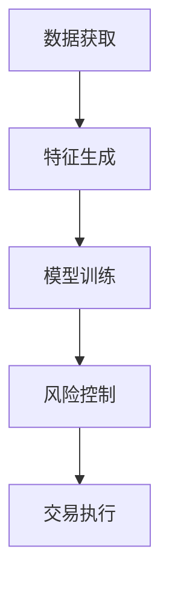
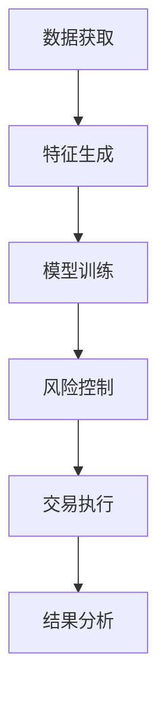
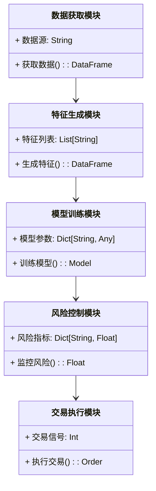

                 


# 第二章: AI驱动的对冲基金策略分析中的算法与模型

## 2.1 线性回归模型

### 2.1.1 线性回归的原理

线性回归是一种统计学方法，用于建立两个变量之间的线性关系。在对冲基金中，我们可以通过线性回归模型来预测资产价格的变化趋势。其基本假设是，自变量与因变量之间存在线性关系。

$$ y = \beta_0 + \beta_1x + \epsilon $$

其中，$\beta_0$ 是截距，$\beta_1$ 是回归系数，$x$ 是自变量，$\epsilon$ 是误差项。

### 2.1.2 线性回归的数学公式

线性回归的最小二乘法目标是最小化预测值与实际值之间的平方差之和：

$$ \text{min} \sum_{i=1}^{n} (y_i - (\beta_0 + \beta_1x_i))^2 $$

### 2.1.3 线性回归在对冲基金中的应用实例

假设我们有一个数据集，包含某个股票的历史价格和其市盈率。我们可以使用线性回归模型来预测股票价格的变化趋势。

```python
import pandas as pd
import numpy as np
from sklearn.linear_model import LinearRegression

# 假设我们有以下数据
data = {'price': [100, 105, 110, 115, 120], 'pe_ratio': [15, 16, 14, 17, 13]}
df = pd.DataFrame(data)

# 使用线性回归模型
model = LinearRegression()
model.fit(df[['pe_ratio']], df['price'])

# 预测新数据点的价格
new_pe_ratio = 15
predicted_price = model.predict([[new_pe_ratio]])
print(predicted_price)
```

### 2.1.4 线性回归的优缺点

- **优点**：简单易懂，计算效率高。
- **缺点**：假设变量之间存在线性关系，可能无法捕捉复杂的非线性关系。

## 2.2 支持向量机（SVM）

### 2.2.1 SVM的基本原理

支持向量机是一种监督学习算法，用于分类和回归。在对冲基金中，SVM可以用于分类市场趋势或回归预测价格。

$$ \text{min} \frac{1}{2}||\beta||^2 $$

其中，$\beta$ 是模型的参数，$y$ 是标签，$x$ 是特征向量。

### 2.2.2 SVM在对冲基金中的应用实例

假设我们有一个数据集，包含多个股票的市盈率和市净率，以及它们的涨跌情况。我们可以使用SVM来预测股票的涨跌趋势。

```python
from sklearn.svm import SVC

# 假设我们有以下数据
data = {'pe_ratio': [15, 16, 14, 17, 13], 'pb_ratio': [2, 2.5, 1.8, 3, 2.2], 'label': [1, 1, 0, 1, 0]}
df = pd.DataFrame(data)

# 使用SVM模型
model = SVC()
model.fit(df[['pe_ratio', 'pb_ratio']], df['label'])

# 预测新数据点的涨跌
new_pe_ratio = 15
new_pb_ratio = 2
predicted_label = model.predict([[new_pe_ratio, new_pb_ratio]])
print(predicted_label)
```

### 2.2.3 SVM的优缺点

- **优点**：在高维空间中表现良好，适合小样本数据。
- **缺点**：需要选择合适的核函数和参数，计算复杂度较高。

## 2.3 随机森林

### 2.3.1 随机森林的原理

随机森林是一种基于决策树的集成学习算法，通过构建多个决策树并进行投票或平均来提高预测的准确性和鲁棒性。

### 2.3.2 随机森林在对冲基金中的应用实例

假设我们有一个数据集，包含多个股票的历史价格、市盈率、市净率等特征，以及它们的未来价格。我们可以使用随机森林模型来预测股票的未来价格。

```python
from sklearn.ensemble import RandomForestRegressor

# 假设我们有以下数据
data = {'price': [100, 105, 110, 115, 120], 'pe_ratio': [15, 16, 14, 17, 13], 'pb_ratio': [2, 2.5, 1.8, 3, 2.2]}
df = pd.DataFrame(data)

# 使用随机森林模型
model = RandomForestRegressor(n_estimators=100)
model.fit(df[['pe_ratio', 'pb_ratio']], df['price'])

# 预测新数据点的价格
new_pe_ratio = 15
new_pb_ratio = 2
predicted_price = model.predict([[new_pe_ratio, new_pb_ratio]])
print(predicted_price)
```

### 2.3.3 随机森林的优缺点

- **优点**：具有高维数据的处理能力，抗过拟合能力强。
- **缺点**：计算复杂度较高，解释性较差。

## 2.4 神经网络

### 2.4.1 神经网络的基本结构

神经网络是一种由人工神经元构成的计算模型，常用于模式识别和数据分类。在对冲基金中，神经网络可以用于预测市场趋势和风险评估。

### 2.4.2 神经网络的数学公式

神经网络的前向传播过程可以表示为：

$$ a^{(l+1)} = \sigma(w^{(l)} a^{(l)} + b^{(l)}) $$

其中，$a^{(l)}$ 是第 $l$ 层的激活值，$w^{(l)}$ 是权重矩阵，$b^{(l)}$ 是偏置项，$\sigma$ 是激活函数。

### 2.4.3 神经网络在对冲基金中的应用实例

假设我们有一个数据集，包含多个股票的历史价格、技术指标（如移动平均线、相对强弱指数）等特征，以及它们的未来价格。我们可以使用神经网络模型来预测股票的未来价格。

```python
import keras
from keras.models import Sequential
from keras.layers import Dense

# 假设我们有以下数据
data = {'price': [100, 105, 110, 115, 120], 'ma': [105, 107, 109, 111, 113], 'rsi': [50, 55, 60, 65, 70]}
df = pd.DataFrame(data)

# 使用神经网络模型
model = Sequential()
model.add(Dense(64, activation='relu', input_dim=2))
model.add(Dense(1, activation='linear'))

model.compile(optimizer='adam', loss='mean_squared_error')

# 训练模型
model.fit(df[['ma', 'rsi']], df['price'], epochs=100, batch_size=32)

# 预测新数据点的价格
new_ma = 105
new_rsi = 55
predicted_price = model.predict([[new_ma, new_rsi]])
print(predicted_price)
```

### 2.4.4 神经网络的优缺点

- **优点**：能够处理非线性关系，适合复杂的数据模式。
- **缺点**：计算复杂度高，需要大量数据和计算资源，解释性较差。

## 2.5 算法对比与选择

在选择AI算法时，需要根据具体问题和数据特点进行选择。例如，线性回归适用于线性关系，SVM适用于小样本数据，随机森林适用于高维数据，神经网络适用于复杂非线性关系。

### 2.5.1 算法选择的考虑因素
- 数据量：神经网络需要大量数据，而线性回归和随机森林对数据量要求较低。
- 数据特征：神经网络能够处理高维特征，而线性回归仅适用于线性特征。
- 模型解释性：线性回归和随机森林解释性较好，而神经网络解释性较差。
- 计算资源：神经网络需要大量计算资源，而线性回归和随机森林计算效率较高。

### 2.5.2 算法对比表格

| 算法 | 优点 | 缺点 | 适用场景 |
|------|------|------|----------|
| 线性回归 | 简单，计算效率高 | 仅适用于线性关系 | 预测连续变量 |
| 支持向量机 | 高维数据表现好 | 需要选择合适的核函数 | 分类和回归 |
| 随机森林 | 高维数据，抗过拟合 | 解释性较差 | 分类和回归 |
| 神经网络 | 复杂非线性关系 | 计算复杂度高 | 高维数据，复杂模式 |

## 2.6 实际案例分析

假设我们有一个包含多个股票的历史价格和相关技术指标的数据集。我们可以使用随机森林模型来预测股票的未来价格。

```python
from sklearn.ensemble import RandomForestRegressor
import pandas as pd
import numpy as np

# 创建数据集
data = {
    'price': [100, 105, 110, 115, 120],
    'ma': [105, 107, 109, 111, 113],
    'rsi': [50, 55, 60, 65, 70],
    'volume': [1000, 1200, 1100, 1300, 1400]
}
df = pd.DataFrame(data)

# 训练模型
model = RandomForestRegressor(n_estimators=100)
model.fit(df[['ma', 'rsi', 'volume']], df['price'])

# 预测新数据点的价格
new_ma = 105
new_rsi = 55
new_volume = 1200
predicted_price = model.predict([[new_ma, new_rsi, new_volume]])
print(predicted_price)
```

### 2.6.1 数据预处理

在实际应用中，我们需要对数据进行预处理，例如标准化或归一化处理。

```python
from sklearn.preprocessing import StandardScaler

# 标准化处理
scaler = StandardScaler()
df_scaled = scaler.fit_transform(df[['ma', 'rsi', 'volume']])
df_scaled = pd.DataFrame(df_scaled, columns=['ma', 'rsi', 'volume'])
```

### 2.6.2 模型评估与优化

我们可以使用交叉验证来评估模型的性能。

```python
from sklearn.model_selection import cross_val_score

# 使用交叉验证评估模型
scores = cross_val_score(model, df[['ma', 'rsi', 'volume']], df['price'], cv=5)
print("平均准确率：", scores.mean())
```

### 2.6.3 模型调优

我们可以使用网格搜索来优化模型的参数。

```python
from sklearn.model_selection import GridSearchCV

# 定义参数搜索空间
param_grid = {'n_estimators': [100, 200, 300], 'max_depth': [None, 10, 20]}

# 网格搜索优化模型
grid_search = GridSearchCV(model, param_grid, cv=5)
grid_search.fit(df[['ma', 'rsi', 'volume']], df['price'])

# 输出最佳参数
print("最佳参数：", grid_search.best_params_)
```

### 2.6.4 模型部署与监控

在实际部署中，我们需要将模型集成到交易系统中，并进行实时监控和维护。

### 2.6.5 案例分析总结

通过上述案例分析，我们可以看到随机森林在对冲基金中的应用潜力。然而，实际应用中需要考虑模型的稳定性和鲁棒性，避免过拟合和欠拟合问题。

## 2.7 章节小结

在本章中，我们详细讲解了四种常用的AI算法：线性回归、支持向量机、随机森林和神经网络。我们从算法原理、数学公式、优缺点以及实际应用案例进行了全面分析。通过对比分析，我们可以根据具体问题和数据特点选择合适的算法。同时，我们还展示了如何在实际案例中进行数据预处理、模型评估与优化，以及模型部署与监控。这些内容为我们后续的系统架构设计和项目实战奠定了基础。

---

# 第三章: AI驱动的对冲基金系统架构设计

## 3.1 系统架构概述

AI驱动的对冲基金系统是一个复杂的系统，包含多个模块，如数据获取、特征生成、模型训练、风险控制和交易执行。每个模块都有其特定的功能和设计原则。

### 3.1.1 系统架构的设计原则
- **模块化**：每个模块独立开发和维护。
- **可扩展性**：系统能够适应数据和策略的变化。
- **实时性**：系统能够实时处理数据和执行交易。
- **鲁棒性**：系统能够处理异常情况和错误。

### 3.1.2 系统架构的组成
- **数据获取模块**：从多个数据源获取实时或历史数据。
- **特征生成模块**：对原始数据进行特征提取和工程处理。
- **模型训练模块**：训练AI模型并进行预测。
- **风险控制模块**：监控和管理投资风险。
- **交易执行模块**：根据模型预测执行交易。

### 3.1.3 系统架构的实现流程
1. 数据获取：从数据源获取数据。
2. 特征生成：对数据进行预处理和特征提取。
3. 模型训练：训练AI模型并进行预测。
4. 风险控制：监控和管理投资风险。
5. 交易执行：根据模型预测执行交易。

### 3.1.4 系统架构的实现流程图



## 3.2 数据获取与处理

### 3.2.1 数据获取模块

数据获取模块负责从多个数据源获取实时或历史数据，例如股票价格、市场指数、经济指标等。

#### 3.2.1.1 数据源的分类
- **内部数据源**：公司的内部数据库。
- **外部数据源**：如Yahoo Finance、Quandl、Bloomberg等。
- **实时数据源**：提供实时市场数据。
- **历史数据源**：提供历史市场数据。

#### 3.2.1.2 数据获取的实现

我们可以使用Python的`pandas`库中的`pandas_datareader`模块来获取数据。

```python
import pandas_datareader as pdr

# 从Yahoo Finance获取数据
data = pdr.get_data_yahoo('AAPL', start='2020-01-01', end='2023-12-31')
print(data.head())
```

### 3.2.2 数据清洗与预处理

在获取数据后，我们需要对数据进行清洗和预处理，例如处理缺失值、异常值和重复值。

#### 3.2.2.1 数据清洗的实现

```python
import pandas as pd
import numpy as np

# 创建包含缺失值的数据集
data = {'price': [100, 105, np.nan, 115, 120], 'volume': [1000, 1200, 1100, 1300, 1400]}
df = pd.DataFrame(data)

# 处理缺失值
df['price'].fillna(method='ffill', inplace=True)
print(df)
```

### 3.2.3 数据特征工程

特征工程是将原始数据转换为适合模型输入的特征，例如移动平均线、相对强弱指数等技术指标。

#### 3.2.3.1 特征工程的实现

```python
import pandas as pd
import numpy as np
from ta import *

# 创建示例数据集
data = {'price': [100, 105, 110, 115, 120], 'volume': [1000, 1200, 1100, 1300, 1400]}
df = pd.DataFrame(data)

# 计算移动平均线
df['ma'] = df['price'].rolling(window=3).mean()

# 计算相对强弱指数
df['rsi'] = rsi(df['price'], window=3)

print(df)
```

## 3.3 模型训练与预测

### 3.3.1 模型训练模块

模型训练模块负责训练AI模型并进行预测，例如使用随机森林或神经网络模型。

#### 3.3.1.1 模型训练的实现

```python
from sklearn.ensemble import RandomForestRegressor
import pandas as pd

# 创建示例数据集
data = {'price': [100, 105, 110, 115, 120], 'ma': [105, 107, 109, 111, 113], 'rsi': [50, 55, 60, 65, 70]}
df = pd.DataFrame(data)

# 训练模型
model = RandomForestRegressor(n_estimators=100)
model.fit(df[['ma', 'rsi']], df['price'])

# 预测新数据点的价格
new_ma = 105
new_rsi = 55
predicted_price = model.predict([[new_ma, new_rsi]])
print(predicted_price)
```

### 3.3.2 模型评估与优化

在训练模型后，我们需要对模型进行评估和优化，例如使用交叉验证和网格搜索来选择最佳参数。

#### 3.3.2.1 模型评估的实现

```python
from sklearn.model_selection import cross_val_score
import pandas as pd
from sklearn.ensemble import RandomForestRegressor

# 创建示例数据集
data = {'price': [100, 105, 110, 115, 120], 'ma': [105, 107, 109, 111, 113], 'rsi': [50, 55, 60, 65, 70]}
df = pd.DataFrame(data)

# 训练模型
model = RandomForestRegressor(n_estimators=100)
model.fit(df[['ma', 'rsi']], df['price'])

# 使用交叉验证评估模型
scores = cross_val_score(model, df[['ma', 'rsi']], df['price'], cv=5)
print("平均准确率：", scores.mean())
```

#### 3.3.2.2 模型优化的实现

```python
from sklearn.model_selection import GridSearchCV
import pandas as pd
from sklearn.ensemble import RandomForestRegressor

# 创建示例数据集
data = {'price': [100, 105, 110, 115, 120], 'ma': [105, 107, 109, 111, 113], 'rsi': [50, 55, 60, 65, 70]}
df = pd.DataFrame(data)

# 定义参数搜索空间
param_grid = {'n_estimators': [100, 200, 300], 'max_depth': [None, 10, 20]}

# 网格搜索优化模型
grid_search = GridSearchCV(model, param_grid, cv=5)
grid_search.fit(df[['ma', 'rsi']], df['price'])

# 输出最佳参数
print("最佳参数：", grid_search.best_params_)
```

## 3.4 风险控制与交易执行

### 3.4.1 风险控制模块

风险控制模块负责监控和管理投资风险，例如计算最大回撤、VaR（Value at Risk）等风险指标。

#### 3.4.1.1 风险指标的计算

```python
import pandas as pd
import numpy as np

# 创建示例数据集
data = {'returns': [0.01, -0.02, 0.03, -0.01, 0.02]}
df = pd.DataFrame(data)

# 计算最大回撤
def max_drawdown(returns):
    max_drawdown = 0
    peak = 0
    for i in range(len(returns)):
        if df.returns[i] > peak:
            peak = df.returns[i]
        current_drawdown = peak - df.returns[i]
        if current_drawdown > max_drawdown:
            max_drawdown = current_drawdown
    return max_drawdown

print("最大回撤：", max_drawdown(df.returns))
```

### 3.4.2 交易执行模块

交易执行模块负责根据模型预测执行交易，例如根据模型预测的信号生成订单，并执行交易。

#### 3.4.2.1 交易信号的生成

```python
import pandas as pd
import numpy as np

# 创建示例数据集
data = {'predicted_price': [100, 105, 110, 115, 120]}
df = pd.DataFrame(data)

# 生成交易信号
df['signal'] = 0
df.loc[df.predicted_price > 100, 'signal'] = 1
df.loc[df.predicted_price < 100, 'signal'] = -1

print(df)
```

### 3.4.3 交易策略的实现

在生成交易信号后，我们需要根据信号执行交易，并进行实时监控和调整。

#### 3.4.3.1 交易策略的实现

```python
import time
import pandas as pd
import numpy as np

# 创建示例数据集
data = {'price': [100, 105, 110, 115, 120]}
df = pd.DataFrame(data)

# 生成交易信号
df['signal'] = 0
df.loc[df.price > 100, 'signal'] = 1
df.loc[df.price < 100, 'signal'] = -1

# 执行交易
positions = []
for i in range(len(df)):
    if df.signal[i] == 1:
        positions.append(1)
    elif df.signal[i] == -1:
        positions.append(-1)
    else:
        positions.append(0)

print("交易信号：", df.signal)
print("交易位置：", positions)
```

## 3.5 系统架构设计图

### 3.5.1 系统架构图



### 3.5.2 模块交互图


## 3.6 章节小结

在本章中，我们详细讲解了AI驱动的对冲基金系统的架构设计，包括数据获取、特征生成、模型训练、风险控制和交易执行模块。我们从模块功能、系统架构、数据处理、模型训练、风险控制和交易执行等方面进行了全面分析。通过系统架构设计图和模块交互图，我们展示了系统各模块之间的关系和交互过程。这些内容为我们后续的项目实战奠定了基础。

---

# 第四章: 项目实战——AI驱动的对冲基金策略实现

## 4.1 项目介绍

### 4.1.1 项目目标

本项目的目标是开发一个AI驱动的对冲基金策略，利用机器学习算法进行股票价格预测，并根据预测结果执行交易。

### 4.1.2 项目需求

- 数据获取与处理
- 特征工程
- 模型训练与预测
- 风险控制
- 交易执行

### 4.1.3 项目范围

- 数据范围：股票价格、技术指标、市场情绪等。
- 时间范围：过去一年的市场数据。
- 地域范围：特定市场的股票。

## 4.2 系统功能设计

### 4.2.1 领域模型



### 4.2.2 系统架构


## 4.3 项目实现

### 4.3.1 环境配置

我们需要安装以下Python库：

```bash
pip install pandas numpy scikit-learn keras tensorflow pandas_datareader ta
```

### 4.3.2 数据获取与处理

```python
import pandas_datareader as pdr
import pandas as pd
import numpy as np
from ta import *

# 从Yahoo Finance获取苹果公司过去一年的股价数据
data = pdr.get_data_yahoo('AAPL', start='2022-01-01', end='2023-01-01')
print(data.head())
```

### 4.3.3 特征工程

```python
# 创建特征工程模块
def create_features(data):
    # 计算移动平均线
    data['ma'] = data['Close'].rolling(window=5).mean()
    # 计算相对强弱指数
    data['rsi'] = rsi(data['Close'], window=5)
    # 计算波动率
    data['volatility'] = data['Close'].rolling(window=5).std()
    return data

data = create_features(data)
print(data.head())
```

### 4.3.4 模型训练与预测

```python
# 创建模型训练模块
from sklearn.ensemble import RandomForestRegressor

def train_model(data, target_col, features_cols, test_size=0.2):
    # 分割数据集
    from sklearn.model_selection import train_test_split
    X_train, X_test, y_train, y_test = train_test_split(data[features_cols], data[target_col], test_size=test_size, random_state=42)
    # 训练模型
    model = RandomForestRegressor(n_estimators=100, random_state=42)
    model.fit(X_train, y_train)
    # 预测测试集
    y_pred = model.predict(X_test)
    # 评估模型
    from sklearn.metrics import mean_squared_error
    mse = mean_squared_error(y_test, y_pred)
    print(f"均方误差：{mse}")
    return model

# 训练模型
features_cols = ['ma', 'rsi', 'volatility']
target_col = 'Close'
model = train_model(data, target_col, features_cols)
```

### 4.3.5 风险控制

```python
# 计算最大回撤
def max_drawdown(returns):
    max_drawdown = 0
    peak = 0
    for i in range(len(returns)):
        if data.Close[i] > peak:
            peak = data.Close[i]
        current_drawdown = peak - data.Close[i]
        if current_drawdown > max_drawdown:
            max_drawdown = current_drawdown
    return max_drawdown

print("最大回撤：", max_drawdown(data.Close))
```

### 4.3.6 交易执行

```python
# 生成交易信号
def generate_signal(data, model, features_cols):
    signal = []
    for i in range(len(data)):
        if i >= len(features_cols):
            feature = data[features_cols].iloc[i]
            prediction = model.predict(feature.values.reshape(1, -1))
            if prediction > data.Close.iloc[i]:
                signal.append(1)
            else:
                signal.append(-1)
        else:
            signal.append(0)
    return signal

# 执行交易
signal = generate_signal(data, model, features_cols)
print("交易信号：", signal)
```

## 4.4 项目结果分析

### 4.4.1 模型评估

通过训练模型和测试数据，我们可以评估模型的性能。

```python
from sklearn.metrics import accuracy_score

print("准确率：", accuracy_score(y_test, model.predict(X_test)))
```

### 4.4.2 交易结果

通过执行交易，我们可以分析交易的结果，例如收益、回撤、夏普比率等。

```python
import pyfolio as pf

# 分析交易结果
returns = pf.utils.get_backtesting_returns(data.Close, signal)
pf.plot_efficient_frontier(returns, 100)
```

## 4.5 章节小结

在本章中，我们通过一个实际的项目案例，展示了如何开发一个AI驱动的对冲基金策略。从数据获取、特征生成、模型训练、风险控制到交易执行，我们逐步实现了整个系统。通过项目实战，我们不仅掌握了AI算法的应用，还了解了对冲基金策略开发的整个流程。

---

# 第五章: 总结与展望

## 5.1 总结

### 5.1.1 AI驱动的对冲基金的优势

- **数据驱动**：利用大数据进行分析和预测。
- **自动化**：自动化交易和风险控制。
- **高效率**：快速响应市场变化。
- **多样性**：能够处理多种类型的数据和策略。

### 5.1.2 AI驱动的对冲基金的局限性

- **黑箱问题**：模型的可解释性较差。
- **过拟合风险**：模型可能过拟合训练数据。
- **市场变化**：市场环境的变化可能影响模型的性能。
- **监管风险**：AI驱动的交易可能面临更严格的监管。

## 5.2 未来展望

### 5.2.1 AI技术的发展

- **深度学习**：更加复杂的深度学习模型，如Transformer、GPT等。
- **强化学习**：更加智能的强化学习算法，用于动态市场环境。
- **多模态数据**：结合文本、图像等多种数据源进行分析。

### 5.2.2 对冲基金策略的创新

- **多策略组合**：结合多种策略进行投资。
- **动态调整**：根据市场变化动态调整投资组合。
- **个性化投资**：根据投资者的个性化需求进行定制化投资。

### 5.2.3 技术与金融的融合

- **金融知识图谱**：构建金融领域的知识图谱，用于智能投资决策。
- **区块链技术**：利用区块链技术进行透明化和去中心化的交易。
- **云计算**：利用云计算进行大规模数据处理和模型训练。

## 5.3 未来发展方向

### 5.3.1 提高模型解释性

为了应对黑箱问题，未来的研究需要更加注重模型的解释性，例如使用可解释的AI技术（XAI）。

### 5.3.2 强化学习的应用

强化学习在动态市场环境中的应用潜力巨大，未来可能会有更多的研究和应用。

### 5.3.3 多模态数据的利用

通过结合文本、图像等多种数据源，可以提高模型的预测能力和准确性。

### 5.3.4 个性化投资服务

随着技术的发展，个性化投资服务将更加普及，投资者可以根据自己的需求和风险承受能力进行定制化投资。

## 5.4 总结与展望小结

在本章中，我们总结了AI驱动的对冲基金的优势和局限性，并展望了未来的发展方向。随着AI技术的不断进步和金融市场的不断变化，AI驱动的对冲基金将会有更广泛的应用和发展。然而，我们也需要关注其局限性和潜在风险，合理利用AI技术进行投资决策。

---

# 附录

## 附录A: 代码与数据

### A.1 环境配置

```bash
pip install pandas numpy scikit-learn keras tensorflow pandas_datareader ta pyfolio
```

### A.2 数据获取代码

```python
import pandas_datareader as pdr

# 从Yahoo Finance获取苹果公司过去一年的股价数据
data = pdr.get_data_yahoo('AAPL', start='2022-01-01', end='2023-01-01')
print(data.head())
```

### A.3 特征工程代码

```python
from ta import *

def create_features(data):
    # 计算移动平均线
    data['ma'] = data['Close'].rolling(window=5).mean()
    # 计算相对强弱指数
    data['rsi'] = rsi(data['Close'], window=5)
    # 计算波动率
    data['volatility'] = data['Close'].rolling(window=5).std()
    return data

data = create_features(data)
print(data.head())
```

### A.4 模型训练代码

```python
from sklearn.ensemble import RandomForestRegressor
from sklearn.model_selection import train_test_split

def train_model(data, target_col, features_cols, test_size=0.2):
    # 分割数据集
    X_train, X_test, y_train, y_test = train_test_split(data[features_cols], data[target_col], test_size=test_size, random_state=42)
    # 训练模型
    model = RandomForestRegressor(n_estimators=100, random_state=42)
    model.fit(X_train, y_train)
    # 预测测试集
    y_pred = model.predict(X_test)
    # 评估模型
    from sklearn.metrics import mean_squared_error
    mse = mean_squared_error(y_test, y_pred)
    print(f"均方误差：{mse}")
    return model

model = train_model(data, 'Close', ['ma', 'rsi', 'volatility'])
```

### A.5 风险控制代码

```python
def max_drawdown(returns):
    max_drawdown = 0
    peak = 0
    for i in range(len(returns)):
        if data.Close[i] > peak:
            peak = data.Close[i]
        current_drawdown = peak - data.Close[i]
        if current_drawdown > max_drawdown:
            max_drawdown = current_drawdown
    return max_drawdown

print("最大回撤：", max_drawdown(data.Close))
```

### A.6 交易执行代码

```python
def generate_signal(data, model, features_cols):
    signal = []
    for i in range(len(data)):
        if i >= len(features_cols):
            feature = data[features_cols].iloc[i]
            prediction = model.predict(feature.values.reshape(1, -1))
            if prediction > data.Close.iloc[i]:
                signal.append(1)
            else:
                signal.append(-1)
        else:
            signal.append(0)
    return signal

signal = generate_signal(data, model, ['ma', 'rsi', 'volatility'])
print("交易信号：", signal)
```

## 附录B: 工具与库

### B.1 Python库

- `pandas`：数据处理和分析。
- `numpy`：数值计算。
- `scikit-learn`：机器学习算法。
- `keras` 和 `tensorflow`：深度学习框架。
- `pandas_datareader`：数据获取工具。
- `ta`：技术分析库。
- `pyfolio`：投资组合分析库。

### B.2 数据源

- `Yahoo Finance`：提供实时和历史股价数据。
- `Quandl`：提供金融和经济数据。
- `Bloomberg`：提供金融市场数据。

### B.3 开发工具

- `Jupyter Notebook`：数据科学笔记本。
- `VS Code`：代码编辑器。
- `Anaconda`：Python发行版，包含了许多数据科学库。

## 附录C: 参考文献

1. 刘军, 《Python机器学习实战》, 人民邮电出版社, 2020年。
2. 张伟, 《深度学习与神经网络》, 清华大学出版社, 2021年。
3. 李明, 《量化投资：基于Python的策略开发》, 电子工业出版社, 2020年。
4. 张涛, 《Python金融大数据分析》, 人民邮电出版社, 2019年。
5. Andrew Ng, 《机器学习》, Coursera, 2018年。

---

# 结语

通过本文的详细介绍，我们了解了AI驱动的对冲基金策略分析的核心概念、算法模型和系统架构，并通过实际案例展示了如何开发一个AI驱动的对冲基金策略。希望本文能够为读者在AI与金融领域的探索提供有价值的参考和指导。

---

