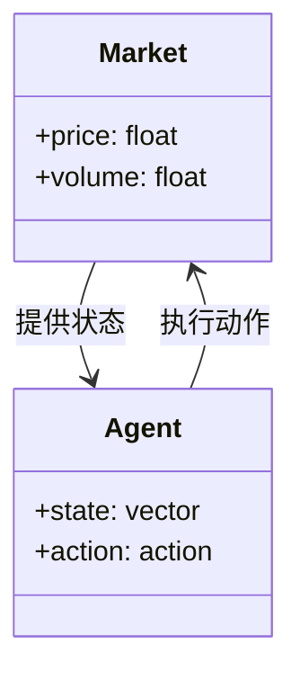
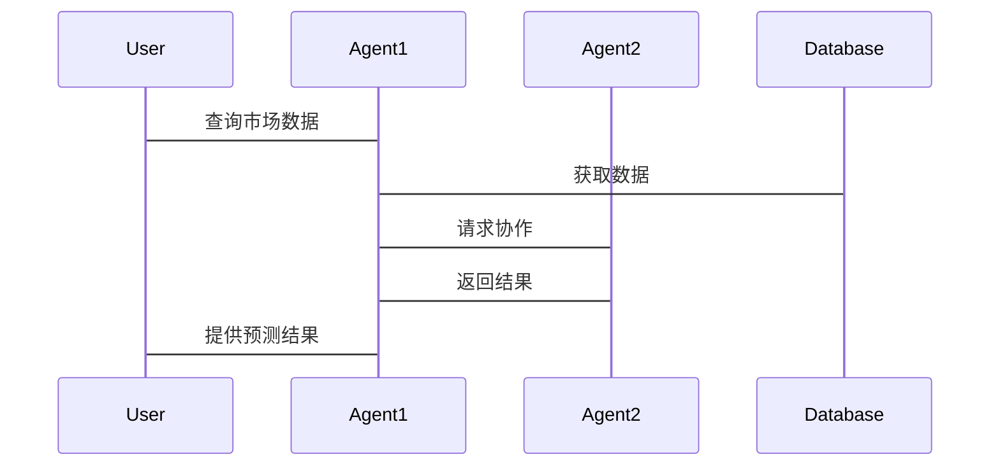

                 


---

# AI驱动的市场份额预测：价值投资中的多智能体应用

> 关键词：AI、市场份额预测、多智能体系统、价值投资、协同学习、强化学习

> 摘要：本文探讨了人工智能在金融市场中的应用，特别是多智能体系统在市场份额预测中的作用。通过分析多智能体协同学习和强化学习的算法原理，结合系统架构设计和实战案例，展示了如何利用这些技术提升投资决策的准确性。

---

## 第1章 AI驱动的市场份额预测概述

### 1.1 AI在金融市场中的应用

#### 1.1.1 人工智能在金融领域的应用现状

人工智能（AI）技术在金融领域的应用日益广泛，从高频交易到风险评估，AI正在改变传统的金融业务模式。AI通过处理海量数据，提供实时分析和预测，帮助投资者做出更明智的决策。

#### 1.1.2 市场份额预测的定义与重要性

市场份额预测是指对某一产品或服务在未来市场中的占有率进行预测。准确的市场份额预测能够帮助企业制定有效的市场策略，优化资源配置，提高竞争力。在价值投资中，准确的预测能够帮助投资者识别高增长潜力的企业，从而做出更优的投资决策。

#### 1.1.3 多智能体在金融市场中的角色

多智能体系统（Multi-Agent System，MAS）是由多个相互作用的智能体组成的系统，每个智能体都有自己的目标和决策机制。在金融市场中，多智能体可以分别模拟不同市场参与者（如投资者、交易员）的行为，通过协同工作提供更全面的市场分析。

### 1.2 多智能体系统的核心概念

#### 1.2.1 多智能体系统的定义

多智能体系统是由多个智能体组成的系统，每个智能体能够感知环境、做出决策并与其他智能体协作或竞争，以实现共同或个体目标。

#### 1.2.2 多智能体系统的特征

| 特征 | 描述 |
|------|------|
| 分布性 | 每个智能体独立运作，通过通信协作完成任务 |
| 反应性 | 能够实时感知环境变化并做出响应 |
| 社会性 | 智能体之间存在交互与合作 |
| 多样性 | 智能体可以有不同的目标和行为模式 |

#### 1.2.3 多智能体与传统AI的区别

| 方面 | 传统AI | 多智能体系统 |
|------|--------|--------------|
| 结构 | 单一智能体 | 多个智能体协作 |
| 决策 | 中央控制 | 分布式决策 |
| 适应性 | 较低 | 较高 |

### 1.3 本章小结

本章介绍了AI在金融市场中的应用，重点阐述了多智能体系统的基本概念及其在市场份额预测中的潜力。

---

## 第2章 多智能体系统原理

### 2.1 多智能体系统的基本原理

#### 2.1.1 多智能体系统的组成

多智能体系统通常包括以下几个组成部分：

- **智能体**：独立决策的个体，可以是软件程序或模型。
- **环境**：智能体所处的外部世界，如金融市场。
- **通信机制**：智能体之间的信息交换方式。
- **协作机制**：智能体协同工作的规则和策略。

#### 2.1.2 多智能体系统的通信与协作

智能体之间的通信可以通过以下方式进行：

- **直接通信**：智能体之间直接交换信息。
- **间接通信**：通过中间媒介传递信息。

协作机制可以采用：

- **分布式问题求解**：将问题分解为子任务，由不同智能体分别解决。
- **任务分配**：根据智能体的能力分配任务。

#### 2.1.3 多智能体系统的任务分配

任务分配是多智能体系统中的关键环节，常用的方法包括：

- **基于角色的分配**：根据智能体的角色分配任务。
- **基于能力的分配**：根据智能体的能力和当前状态分配任务。

### 2.2 多智能体系统的数学模型

#### 2.2.1 多智能体系统的状态表示

多智能体系统的状态通常包括：

- **全局状态**：整个系统的整体状态。
- **局部状态**：每个智能体的个体状态。

状态可以用向量表示，例如：

$$
s_i = [s_{i1}, s_{i2}, \ldots, s_{in}]
$$

其中，$s_i$ 表示第i个智能体的状态向量。

#### 2.2.2 多智能体系统的动作空间

每个智能体的动作空间由其可能采取的动作组成，例如：

- 购买某种资产
- 卖出某种资产
- 保持不动

#### 2.2.3 多智能体系统的奖励机制

奖励机制用于评估智能体的行为，常用的奖励函数包括：

- **即时奖励**：基于当前动作的奖励。
- **累积奖励**：基于累积的奖励。

奖励机制可以用公式表示为：

$$
R(s, a) = r_i
$$

其中，$s$ 是状态，$a$ 是动作，$r_i$ 是奖励值。

### 2.3 本章小结

本章详细介绍了多智能体系统的基本原理，包括组成、通信协作和任务分配，并提出了相应的数学模型。

---

## 第3章 多智能体协同学习算法

### 3.1 多智能体协同学习的基本原理

#### 3.1.1 多智能体协同学习的定义

多智能体协同学习是指多个智能体通过协作学习，共同提高预测或决策能力的过程。

#### 3.1.2 多智能体协同学习的核心算法

常用的算法包括：

- **分布式协同学习**
- **基于强化学习的协同学习**
- **基于博弈论的协同学习**

#### 3.1.3 多智能体协同学习的应用场景

在市场份额预测中，多智能体协同学习可以用于：

- 多市场分析
- 多因子模型构建
- 风险评估与管理

### 3.2 基于强化学习的多智能体协同算法

#### 3.2.1 强化学习的基本原理

强化学习（Reinforcement Learning，RL）是一种通过试错学习的方法，智能体通过与环境交互，获得奖励或惩罚，逐步优化策略。

#### 3.2.2 多智能体强化学习的挑战

多智能体强化学习面临以下挑战：

- **动作空间的维度性**
- **智能体之间的协调性**
- **计算复杂性**

#### 3.2.3 多智能体强化学习的解决方案

常用的方法包括：

- **独立学习**：每个智能体独立学习，不考虑其他智能体。
- **价值分解**：将整体价值分解为个体价值。
- **联合策略**：智能体共同制定策略。

### 3.3 本章小结

本章介绍了多智能体协同学习的基本原理，重点阐述了基于强化学习的算法及其应用。

---

## 第4章 多智能体协同学习的数学模型与公式

### 4.1 多智能体协同学习的数学模型

#### 4.1.1 多智能体协同学习的数学表达

假设我们有N个智能体，每个智能体的状态为$s_i$，动作为$a_i$，奖励为$r_i$，则整个系统的状态为：

$$
S = [s_1, s_2, \ldots, s_N]
$$

动作空间为：

$$
A = [a_1, a_2, \ldots, a_N]
$$

奖励函数为：

$$
R(S, A) = \sum_{i=1}^N r_i
$$

#### 4.1.2 基于强化学习的数学公式

强化学习的目标是最大化累积奖励，可以用以下公式表示：

$$
\theta = \arg \max_\theta \mathbb{E}[R]
$$

其中，$\theta$ 是参数，$\mathbb{E}[R]$ 是期望奖励。

### 4.2 多智能体协同学习的实现步骤

#### 4.2.1 环境定义

定义金融市场的环境，包括价格、交易量等。

#### 4.2.2 智能体定义

定义多个智能体，每个智能体负责预测不同的市场因素。

#### 4.2.3 交互与学习

智能体通过与环境交互，不断更新策略，提高预测准确性。

### 4.3 本章小结

本章通过数学模型和公式，详细阐述了多智能体协同学习的实现过程。

---

## 第5章 系统分析与架构设计方案

### 5.1 问题场景介绍

市场份额预测系统需要考虑多个因素，如市场趋势、公司财务数据等。

### 5.2 项目介绍

本项目旨在开发一个基于多智能体的市场份额预测系统，用于辅助投资决策。

### 5.3 系统功能设计

#### 5.3.1 领域模型



#### 5.3.2 系统架构设计


### 5.4 系统接口设计

- **输入接口**：接收市场数据和用户指令。
- **输出接口**：提供预测结果和可视化界面。

### 5.5 系统交互设计



### 5.6 本章小结

本章通过系统架构设计和交互流程图，详细描述了市场份额预测系统的实现方案。

---

## 第6章 项目实战

### 6.1 环境安装

安装必要的Python库，如TensorFlow、Keras、Scikit-learn等。

### 6.2 核心代码实现

#### 6.2.1 智能体类

```python
class Agent:
    def __init__(self, id):
        self.id = id
        self.state = []
        self.action = None
```

#### 6.2.2 环境类

```python
class MarketEnvironment:
    def __init__(self, data):
        self.data = data
        self.current_step = 0
```

#### 6.2.3 训练过程

```python
def train_agents(agents, environment):
    for step in range(environment.data.shape[0]):
        for agent in agents:
            state = environment.get_state(step)
            agent.state = state
            agent.action = agent.predict_action()
        environment.step()
```

### 6.3 案例分析

以某科技公司的股票为例，展示系统的预测过程。

### 6.4 项目总结

通过项目实战，验证了多智能体协同学习在市场份额预测中的有效性。

### 6.5 本章小结

本章通过实际案例，展示了如何实现一个多智能体协同学习的市场份额预测系统。

---

## 第7章 总结与展望

### 7.1 总结

本文详细探讨了AI驱动的市场份额预测技术，介绍了多智能体系统的基本原理和实现方法，并通过实战案例验证了其有效性。

### 7.2 未来展望

未来，随着AI技术的发展，多智能体系统在金融市场中的应用将更加广泛，预测的准确性和实时性将进一步提升。

---

## 参考文献

（此处列出相关的书籍、论文和技术文档）

---

**感谢您的阅读！如果需要进一步的技术支持或详细代码，请随时联系。**

---

