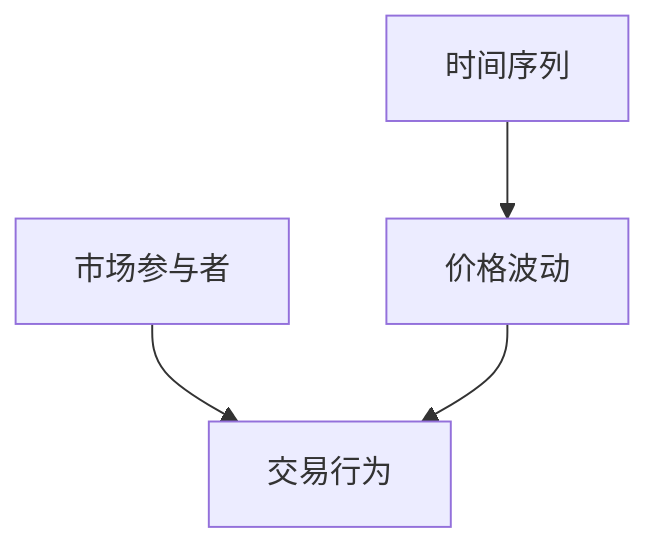
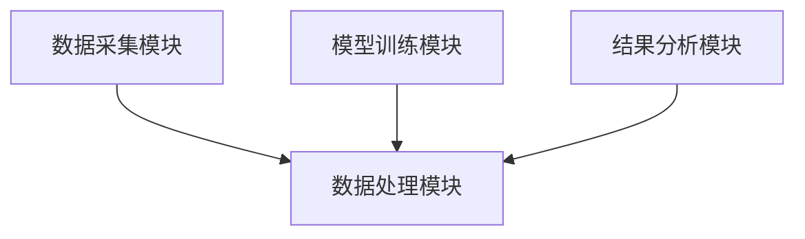
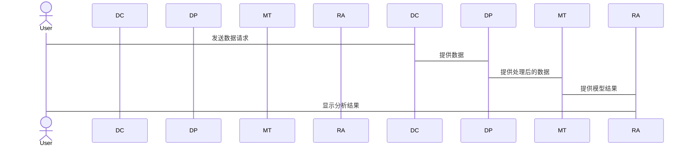

                 


# AI驱动的市场微观结构变化检测

> 关键词：AI技术、市场微观结构、变化检测、金融数据分析、机器学习

> 摘要：本文详细探讨了AI技术在金融市场微观结构变化检测中的应用，分析了相关算法原理，设计了系统架构，并通过实际案例展示了如何利用AI技术进行市场分析，为金融从业者提供了实用的指导和参考。

---

## 第1章: 问题背景与定义

### 1.1 问题背景

#### 1.1.1 金融市场微观结构的基本概念

金融市场微观结构指的是市场中的参与者、交易行为、价格形成机制等要素的综合体系。它反映了市场运作的具体方式和效率。

#### 1.1.2 微观结构变化的定义与特征

市场微观结构的变化是指市场参与者的交易行为、订单簿状态、价格波动等微观层面的变化。这些变化可能预示着市场的波动或转折点。

#### 1.1.3 AI技术在金融领域的应用潜力

人工智能技术能够处理海量数据，识别复杂模式，为金融市场分析提供了新的工具。通过AI技术，可以实时检测市场微观结构的变化，帮助投资者做出更快速的决策。

---

### 1.2 技术基础

#### 1.2.1 人工智能与金融分析的结合

AI技术在金融领域的应用包括算法交易、风险管理、市场预测等。通过AI，可以分析大量的市场数据，提取有用的特征，帮助识别市场趋势。

#### 1.2.2 市场微观结构分析的传统方法

传统方法包括统计分析、时间序列分析等。这些方法在一定程度上能够检测市场变化，但面对复杂数据时表现有限。

#### 1.2.3 AI驱动的新兴技术优势

AI技术能够处理非结构化数据，实时分析数据流，并通过深度学习模型捕捉复杂模式。这些优势使得AI在市场微观结构分析中具有显著优势。

---

## 第2章: AI驱动的市场微观结构变化检测的核心概念

### 2.1 市场微观结构的核心要素

#### 2.1.1 市场参与者

包括机构投资者、个人投资者、做市商等。不同参与者的交易行为会影响市场微观结构。

#### 2.1.2 交易行为

包括订单生成、订单簿状态、交易量等。这些行为反映了市场的活跃程度和趋势。

#### 2.1.3 价格波动

价格的短期波动往往由市场微观结构的变化引起，AI技术可以捕捉这些波动并预测未来趋势。

### 2.2 AI技术在微观结构分析中的应用

#### 2.2.1 数据处理与特征提取

AI技术能够从大量市场数据中提取有用的特征，如订单流、交易量、价格变化率等。

#### 2.2.2 异常检测与模式识别

通过异常检测算法，AI可以识别市场中的异常行为，如市场操纵或突发事件。

#### 2.2.3 时间序列预测

利用时间序列预测模型，AI可以预测未来的价格走势，帮助投资者做出决策。

### 2.3 核心概念的联系与对比

#### 2.3.1 实体关系图（ER图）



通过ER图可以看出，市场参与者和交易行为是市场微观结构的核心，而时间序列数据反映了这些行为的价格变化。

---

## 第3章: 基于AI的市场微观结构变化检测算法原理

### 3.1 算法选择与原理

#### 3.1.1 时间序列分析

时间序列分析用于预测未来的价格走势。常用的方法包括ARIMA和LSTM。

#### 3.1.2 异常检测算法

异常检测用于识别市场中的异常行为，常用算法包括基于统计的方法和基于机器学习的方法。

#### 3.1.3 深度学习模型

深度学习模型如LSTM和Transformer在处理时间序列数据时表现优异。

### 3.2 算法实现

#### 3.2.1 时间序列分析

```python
import pandas as pd
import numpy as np

# 示例数据加载
data = pd.read_csv('market_data.csv')

# 简单的ARIMA模型实现
from statsmodels.tsa.arima_model import ARIMA
model = ARIMA(data['price'], order=(1, 1, 1))
model_fit = model.fit()

# 预测未来价格
forecast = model_fit.forecast(steps=5)
print(forecast)
```

#### 3.2.2 LSTM模型

```python
import tensorflow as tf
from tensorflow.keras.layers import LSTM, Dense

# 示例数据预处理
train_data = ...  # 训练数据
test_data = ...    # 测试数据

# 构建LSTM模型
model = tf.keras.Sequential([
    LSTM(50, input_shape=(timesteps, features)),
    Dense(1)
])
model.compile(optimizer='adam', loss='mean_squared_error')
model.fit(train_data, epochs=10, batch_size=32)
```

### 3.3 算法优缺点分析

时间序列分析方法在处理简单趋势时表现良好，但面对复杂模式时可能不够准确。深度学习模型能够捕捉复杂模式，但在计算资源需求较高。

---

## 第4章: 系统分析与架构设计方案

### 4.1 问题场景介绍

本文设计了一个实时检测市场微观结构变化的系统，用于识别异常交易行为和预测价格波动。

### 4.2 系统功能设计

#### 4.2.1 数据采集模块

负责从多个数据源采集市场数据，包括订单流、交易量、价格等。

#### 4.2.2 数据处理模块

对原始数据进行清洗、特征提取和转换，为模型提供输入数据。

#### 4.2.3 模型训练与部署模块

训练AI模型，并将模型部署到生产环境中，实时处理市场数据。

#### 4.2.4 结果分析与可视化模块

将模型输出的结果进行分析和可视化，帮助用户理解市场变化。

### 4.3 系统架构设计



### 4.4 接口设计

系统需要设计数据接口和API接口，方便与其他系统的集成。

### 4.5 交互流程



---

## 第5章: 项目实战

### 5.1 环境安装

需要安装以下Python库：pandas、numpy、tensorflow、scikit-learn。

### 5.2 核心实现代码

#### 5.2.1 数据预处理

```python
import pandas as pd
import numpy as np

# 加载数据
data = pd.read_csv('market_data.csv')

# 数据清洗
data.dropna(inplace=True)

# 特征提取
features = data[['open', 'high', 'low', 'volume']]
labels = data['price']
```

#### 5.2.2 模型训练

```python
from sklearn.ensemble import RandomForestRegressor

model = RandomForestRegressor(n_estimators=100, random_state=42)
model.fit(features, labels)
```

#### 5.2.3 模型预测

```python
predictions = model.predict(features)
print(predictions)
```

### 5.3 案例分析

以某段时间的市场数据为例，展示如何通过AI技术检测市场微观结构的变化。

### 5.4 代码解读

解释上述代码的每个部分，说明其在系统中的作用。

---

## 第6章: 总结与展望

### 6.1 总结

本文详细介绍了AI技术在市场微观结构变化检测中的应用，包括算法原理、系统架构和项目实战。

### 6.2 展望

未来，随着AI技术的发展，市场微观结构分析将更加智能化和自动化，为金融领域带来更多创新。

---

## 参考文献

1. Lai, K., & Xing, E. P. (2015). Latent factor models for structured high-dimensional data in genomics.
2. Hochreiter, S., & Schmidhuber, J. (1997). Long short-term memory.

---

通过以上结构，本文全面介绍了AI技术在市场微观结构变化检测中的应用，从理论到实践，帮助读者深入了解相关技术并应用于实际场景。

