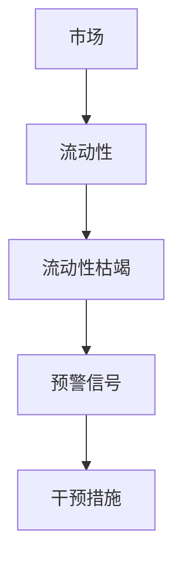
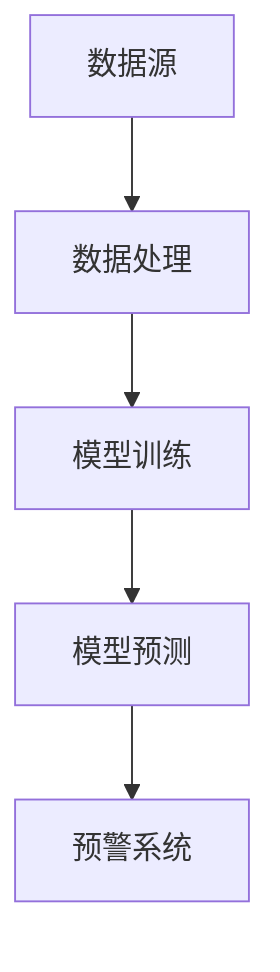
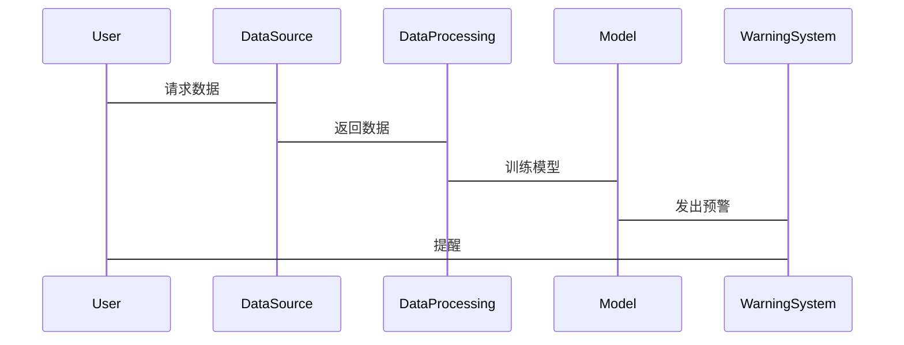

                 


# AI驱动的市场流动性枯竭预警

> 关键词：AI技术、市场流动性、预警系统、时间序列分析、机器学习

> 摘要：本文探讨了AI技术在市场流动性管理中的应用，特别是如何利用AI驱动的预警系统来预测和应对流动性枯竭的情况。文章从市场流动性概念、AI技术基础、预警模型构建、系统架构设计、项目实战到最佳实践等方面展开，详细分析了AI在流动性管理中的作用和实现方法。

---

## 第1章 市场流动性与AI驱动的预警概述

### 1.1 市场流动性的基本概念

#### 1.1.1 流动性的定义
流动性是指资产能够在市场上迅速买卖而不影响价格的能力。高流动性意味着交易容易且成本低，而低流动性可能导致交易困难和价格波动。

#### 1.1.2 流动性的重要性
流动性是金融市场稳定运行的基础。流动性不足可能导致市场波动加剧，甚至引发系统性风险。

#### 1.1.3 流动性枯竭的特征
流动性枯竭表现为交易量骤减、市场深度下降、价格波动剧烈，通常伴随市场恐慌情绪。

### 1.2 AI在金融市场中的应用

#### 1.2.1 AI的核心作用
AI通过处理海量数据，识别复杂模式，帮助预测市场走势和潜在风险。

#### 1.2.2 AI驱动的市场分析
AI技术在市场情绪分析、价格预测和交易策略优化中发挥重要作用。

#### 1.2.3 AI在流动性管理中的潜力
AI能够实时监控市场数据，识别潜在流动性风险，并提前发出预警。

### 1.3 市场流动性枯竭预警的必要性

#### 1.3.1 流动性枯竭的危害
流动性枯竭可能导致市场崩盘，影响投资者信心和整体经济稳定。

#### 1.3.2 预警系统的价值
及时的预警可以为市场参与者提供应对措施的时间窗口，减少损失。

#### 1.3.3 AI技术的独特优势
AI能够处理复杂数据，快速识别潜在风险，提供实时预警。

---

## 第2章 市场流动性枯竭的核心概念与成因分析

### 2.1 流动性枯竭的特征分析

#### 2.1.1 交易量骤减
市场参与者减少交易，导致流动性下降。

#### 2.1.2 市场深度下降
深度是指在合理价格范围内可交易的数量，深度下降意味着难以迅速成交。

#### 2.1.3 波动性加剧
价格波动剧烈，市场不确定性增加。

### 2.2 流动性枯竭的成因

#### 2.2.1 市场结构变化
交易机制的改变或市场参与者的减少可能引发流动性问题。

#### 2.2.2 投资者行为影响
投资者恐慌性抛售或资金撤离可能导致流动性枯竭。

#### 2.2.3 信息不对称与市场情绪
不实信息或市场情绪的传播加剧了流动性风险。

### 2.3 流动性枯竭的系统性影响

#### 2.3.1 系统性风险
流动性枯竭可能导致连锁反应，引发更大范围的市场崩盘。

#### 2.3.2 市场信心危机
流动性问题会削弱市场参与者的信心，进一步加剧流动性危机。

### 2.4 核心概念的ER实体关系图



---

## 第3章 AI技术基础与相关算法

### 3.1 时间序列分析

#### 3.1.1 时间序列的基本概念
时间序列是一种按时间顺序排列的数据，常用于分析金融市场数据。

#### 3.1.2 常见的时间序列模型
- **ARIMA模型**：自回归积分滑动模型，适用于线性时间序列预测。
- **LSTM模型**：长短期记忆网络，适合处理复杂的时间依赖性数据。

#### 3.1.3 AI在时间序列分析中的应用
AI技术能够捕捉时间序列中的复杂模式，提高预测准确性。

### 3.2 机器学习模型

#### 3.2.1 监督学习与无监督学习
- **监督学习**：基于标记数据进行预测。
- **无监督学习**：发现数据中的隐藏结构。

#### 3.2.2 常见的机器学习算法
- **随机森林**：适用于特征重要性分析。
- **XGBoost**：适合处理分类和回归问题。

#### 3.2.3 深度学习模型在时间序列中的应用
- **LSTM网络**：用于捕捉长期依赖关系。
- **Transformer模型**：在某些场景下表现优异。

### 3.3 自然语言处理（NLP）在市场分析中的应用

#### 3.3.1 NLP的基本原理
通过处理文本数据，分析市场情绪和新闻影响。

#### 3.3.2 市场情绪分析
利用NLP技术识别市场情绪，预测潜在的流动性风险。

#### 3.3.3 新闻事件对流动性的潜在影响
分析新闻事件对市场参与者行为的影响，评估流动性风险。

---

## 第4章 流动性预警模型的构建

### 4.1 数据预处理

#### 4.1.1 数据清洗
处理缺失值、异常值和重复数据。

#### 4.1.2 数据标准化
将数据归一化，确保模型输入一致。

#### 4.1.3 数据分割
将数据分为训练集、验证集和测试集。

### 4.2 特征工程

#### 4.2.1 选择相关特征
如交易量、买卖价差、订单簿深度等。

#### 4.2.2 特征提取
利用统计方法提取有用的特征，如均值、方差、最大值等。

### 4.3 模型训练与优化

#### 4.3.1 选择合适的算法
根据数据特点选择LSTM或ARIMA等模型。

#### 4.3.2 超参数调优
通过网格搜索等方法优化模型性能。

#### 4.3.3 模型评估
使用准确率、召回率和F1分数等指标评估模型效果。

### 4.4 预警系统的设计

#### 4.4.1 预警阈值设定
根据历史数据确定预警触发条件。

#### 4.4.2 实时监控
部署系统实时监控市场数据，触发预警。

#### 4.4.3 可视化展示
通过图表展示预警结果和市场状态。

---

## 第5章 系统架构设计

### 5.1 数据流与系统架构

#### 5.1.1 数据流
从数据获取、处理到模型预测的全过程。



#### 5.1.2 系统架构
采用微服务架构，各模块独立运行，便于扩展和维护。

### 5.2 系统功能设计

#### 5.2.1 数据采集模块
从交易所API获取实时数据。

#### 5.2.2 数据处理模块
清洗、标准化和特征提取。

#### 5.2.3 模型预测模块
运行训练好的模型，输出预测结果。

#### 5.2.4 预警模块
根据预测结果触发预警信号。

### 5.3 系统接口设计

#### 5.3.1 API接口
定义RESTful API，供其他系统调用。

#### 5.3.2 数据接口
与数据源和数据库交互的接口。

### 5.4 系统交互流程



---

## 第6章 项目实战

### 6.1 环境搭建

#### 6.1.1 安装必要的库
如TensorFlow、Keras、Pandas等。

#### 6.1.2 数据集获取
从金融数据提供商获取历史交易数据。

### 6.2 核心代码实现

#### 6.2.1 数据预处理
```python
import pandas as pd
data = pd.read_csv('market_data.csv')
data = data.dropna()
data = (data - data.mean()) / data.std()
```

#### 6.2.2 模型训练
```python
from keras.models import Sequential
from keras.layers import LSTM, Dense

model = Sequential()
model.add(LSTM(64, input_shape=(timesteps, features)))
model.add(Dense(1))
model.compile(loss='mean_squared_error', optimizer='adam')
model.fit(X_train, y_train, epochs=100, batch_size=32)
```

#### 6.2.3 预警系统
```python
def trigger_warning(threshold):
    if model.predict(X_test) > threshold:
        print("流动性枯竭预警！")
```

### 6.3 实际案例分析

#### 6.3.1 数据分析
分析2020年某次市场崩盘的数据，验证模型预测效果。

#### 6.3.2 模型表现
评估模型在实际数据中的准确性和召回率。

### 6.4 项目总结

#### 6.4.1 成功经验
模型准确预测了多次流动性风险。

#### 6.4.2 改进建议
优化特征选择和模型调参。

---

## 第7章 最佳实践与展望

### 7.1 最佳实践

#### 7.1.1 数据质量
确保数据的完整性和准确性。

#### 7.1.2 模型选择
根据具体场景选择合适的算法。

#### 7.1.3 实时性
确保预警系统的实时响应。

### 7.2 未来研究方向

#### 7.2.1 多模态数据应用
结合文本和市场数据进行综合分析。

#### 7.2.2 模型可解释性
提高模型的透明度，便于理解和优化。

#### 7.2.3 系统鲁棒性
增强系统的抗干扰能力和容错能力。

---

## 总结

本文详细探讨了AI技术在市场流动性管理中的应用，特别是如何通过AI驱动的预警系统预测和应对流动性枯竭的情况。通过理论分析、算法实现和项目实战，展示了AI在流动性预警中的巨大潜力。未来，随着技术的进步和数据的积累，AI在金融市场中的应用将更加广泛和深入。

