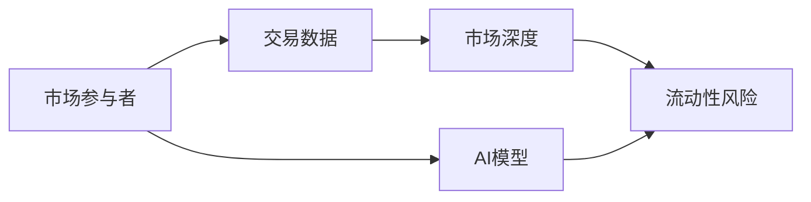

                 


# AI驱动的市场流动性风险预警

## 关键词：AI技术、市场流动性、风险管理、机器学习、时间序列分析、LSTM、金融预警系统

## 摘要：  
本文详细探讨了AI技术在市场流动性风险预警中的应用，从理论基础到算法实现，从系统设计到项目实战，全面解析了如何利用AI技术构建高效、智能的市场流动性风险预警系统。文章首先介绍了市场流动性风险的基本概念及其在金融领域的应用背景，随后分析了AI技术在流动性风险预警中的核心作用，详细讲解了基于时间序列分析和深度学习的算法原理，并通过系统架构设计和项目实战，展示了如何将这些技术应用于实际场景。最后，本文总结了AI驱动的市场流动性风险预警系统的优缺点，并展望了未来的发展方向。

---

# 第一部分: AI驱动的市场流动性风险预警概述

## 第1章: 市场流动性风险与AI技术的结合

### 1.1 市场流动性风险的定义与特征

市场流动性风险是指在金融市场中，资产在短时间内以合理价格买卖的难度，导致资产价格波动或交易成本增加的风险。其核心特征包括：

- **时间性**：流动性风险通常在特定时间段内集中表现。
- **波动性**：市场波动可能导致流动性风险突然加剧。
- **传染性**：流动性风险可能通过市场参与者迅速蔓延，引发系统性风险。

市场流动性风险可以分为以下几类：
1. **交易流动性风险**：由于市场深度不足导致的交易执行难度。
2. **融资流动性风险**：由于市场参与者资金不足导致的融资困难。
3. **资产流动性风险**：特定资产本身的流动性问题。

---

### 1.2 AI技术在金融领域的应用背景

随着AI技术的快速发展，其在金融领域的应用越来越广泛。AI技术在金融领域的优势体现在以下几个方面：
- **数据处理能力**：AI能够快速处理海量金融数据，提取有价值的信息。
- **预测能力**：通过机器学习算法，AI可以预测市场走势和风险。
- **实时监控能力**：AI能够实时监控市场动态，及时发现潜在风险。

在市场流动性风险预警中，AI技术的应用场景包括：
- **实时监控市场深度**：通过AI算法实时分析市场订单簿，预测流动性风险。
- **异常检测**：利用AI技术发现市场中的异常交易行为，提前预警流动性风险。
- **个性化风险评估**：根据市场参与者的交易行为和资金流动情况，个性化评估流动性风险。

---

### 1.3 AI驱动的市场流动性风险预警的核心概念

AI驱动的市场流动性风险预警系统的核心目标是通过AI技术，提前发现和预警市场流动性风险。其核心概念包括：
- **风险预警**：通过AI算法对市场数据进行分析，预测潜在的流动性风险。
- **AI技术**：利用机器学习、深度学习等技术，构建流动性风险预警模型。
- **实时监控**：通过实时数据流处理，快速响应市场变化。

---

## 1.4 本章小结

本章从市场流动性风险的基本概念出发，分析了AI技术在金融领域的应用背景，并重点介绍了AI驱动的市场流动性风险预警的核心概念。通过对市场流动性风险的分类和AI技术的优势的分析，为后续的算法实现和系统设计奠定了理论基础。

---

# 第二部分: AI驱动的市场流动性风险预警核心概念与联系

## 第2章: 市场流动性风险预警的核心概念分析

### 2.1 市场流动性风险的构成要素

市场流动性风险的构成要素包括以下几个方面：
- **市场深度**：市场的订单量和交易量，反映了市场的交易活跃程度。
- **市场广度**：市场的参与者数量和类型，反映了市场的多样性。
- **市场稳定性**：市场的波动性和稳定性，反映了市场的风险承受能力。

---

### 2.2 AI技术在风险预警中的关键作用

AI技术在市场流动性风险预警中的关键作用体现在以下几个方面：
- **数据分析能力**：AI能够快速处理和分析海量市场数据，提取潜在的风险信号。
- **模型预测能力**：通过机器学习算法，AI可以预测市场流动性风险，帮助决策者提前采取措施。
- **实时监控能力**：AI能够实时监控市场动态，及时发现异常情况，降低流动性风险。

---

### 2.3 核心概念的属性特征对比

以下是对市场流动性风险和AI技术的属性特征对比：

| 属性       | 市场流动性风险                     | AI技术                     |
|------------|------------------------------------|-----------------------------|
| 数据来源    | 市场订单数据、交易数据             | 交易数据、市场数据、新闻数据 |
| 数据特征    | 高维、时序、非线性                | 高维、时序、非结构化         |
| 数据处理    | 需要实时处理，对延迟敏感          | 需要高效处理，对计算能力要求高 |
| 风险预测    | 预测市场深度、广度和稳定性         | 预测市场风险和波动性          |

---

### 2.4 ER实体关系图架构



通过上述ER图可以看出，市场流动性风险的预警需要市场参与者、交易数据、市场深度等多方面的信息，而AI模型则是连接这些信息的核心桥梁。

---

## 2.5 本章小结

本章详细分析了市场流动性风险的核心概念及其构成要素，探讨了AI技术在风险预警中的关键作用，并通过属性特征对比和ER实体关系图，展示了市场流动性风险预警系统的核心架构。这为后续的算法实现和系统设计奠定了坚实的基础。

---

# 第三部分: AI驱动的市场流动性风险预警算法原理

## 第3章: 基于时间序列分析的流动性风险预警算法

### 3.1 时间序列分析的基本原理

时间序列分析是一种通过分析历史数据，预测未来趋势的方法。其基本步骤包括：
1. **数据预处理**：对数据进行清洗、归一化等处理。
2. **模型选择**：根据数据特征选择合适的模型。
3. **模型训练**：利用历史数据训练模型。
4. **模型预测**：利用训练好的模型预测未来趋势。

---

### 3.2 基于LSTM的流动性风险预测算法

LSTM（长短期记忆网络）是一种特殊的循环神经网络，特别适合处理时间序列数据。其基本原理如下：

1. **输入门控**：决定哪些信息可以进入细胞状态。
   $$ f_t = \sigma(W_f \cdot [h_{t-1}, x_t] + b_f) $$
2. **遗忘门控**：决定哪些信息可以从细胞状态中遗忘。
   $$ i_t = \sigma(W_i \cdot [h_{t-1}, x_t] + b_i) $$
3. **输出门控**：决定哪些信息可以从细胞状态中输出。
   $$ o_t = \sigma(W_o \cdot [h_{t-1}, x_t] + b_o) $$
4. **细胞状态更新**：结合输入门控、遗忘门控和输出门控，更新细胞状态。
   $$ c_t = f_t \cdot c_{t-1} + i_t \cdot tanh(W_c \cdot [h_{t-1}, x_t] + b_c) $$
5. **隐藏层状态更新**：根据细胞状态和输出门控，更新隐藏层状态。
   $$ h_t = o_t \cdot tanh(c_t) $$

---

### 3.3 算法实现的步骤

1. **数据预处理**：将市场深度数据归一化，处理缺失值和异常值。
2. **模型训练**：使用LSTM模型对归一化后的数据进行训练。
3. **模型预测**：利用训练好的模型预测未来市场深度，判断流动性风险。

---

### 3.4 本章小结

本章详细讲解了时间序列分析的基本原理，并重点介绍了基于LSTM的流动性风险预测算法。通过对LSTM模型的数学公式和实现步骤的分析，展示了如何利用AI技术预测市场流动性风险。

---

## 第4章: 基于机器学习的流动性风险预警系统设计

### 4.1 系统功能设计

流动性风险预警系统的功能模块包括：
1. **数据采集**：实时采集市场订单数据、交易数据等。
2. **数据处理**：对数据进行清洗、归一化等处理。
3. **模型训练**：利用机器学习算法训练流动性风险预警模型。
4. **风险预警**：根据模型预测结果，实时预警流动性风险。

---

### 4.2 系统架构设计


---

## 4.3 本章小结

本章从系统功能设计和架构设计两个方面，详细介绍了基于机器学习的流动性风险预警系统的设计思路。通过对系统功能模块和架构图的分析，展示了如何利用AI技术构建高效的流动性风险预警系统。

---

# 第四部分: AI驱动的市场流动性风险预警系统实现

## 第5章: 项目实战

### 5.1 环境安装

1. 安装Python和必要的库：
   ```bash
   pip install numpy pandas scikit-learn keras tensorflow
   ```

2. 安装金融数据接口：
   ```bash
   pip install pandas_datareader
   ```

---

### 5.2 核心实现代码

1. 数据预处理代码：
   ```python
   import pandas as pd
   import pandas_datareader as pdr

   # 采集数据
   df = pdr.get_datayahoo('AAPL', start='2020-01-01', end='2023-01-01')
   ```

2. LSTM模型实现代码：
   ```python
   from keras.models import Sequential
   from keras.layers import LSTM, Dense

   # 模型构建
   model = Sequential()
   model.add(LSTM(64, input_shape=(timesteps, features)))
   model.add(Dense(1))
   model.compile(optimizer='adam', loss='mean_squared_error')
   ```

---

### 5.3 案例分析

以苹果公司（AAPL）的股价数据为例，利用LSTM模型预测其市场深度变化，判断流动性风险。

1. 数据可视化：
   ```python
   import matplotlib.pyplot as plt
   plt.plot(df['Adj Close'])
   plt.title('AAPL Stock Price')
   plt.xlabel('Date')
   plt.ylabel('Price')
   plt.show()
   ```

2. 模型训练与预测：
   ```python
   model.fit(x_train, y_train, epochs=100, batch_size=32)
   predictions = model.predict(x_test)
   ```

---

## 5.4 本章小结

本章通过实际案例，详细讲解了AI驱动的市场流动性风险预警系统的实现过程。从环境安装到代码实现，再到案例分析，展示了如何利用AI技术构建高效的流动性风险预警系统。

---

# 第五部分: 总结与展望

## 第6章: 总结与展望

### 6.1 本章总结

本文详细探讨了AI技术在市场流动性风险预警中的应用，从理论基础到算法实现，从系统设计到项目实战，全面解析了如何利用AI技术构建高效的流动性风险预警系统。通过对时间序列分析和LSTM模型的深入讲解，展示了AI技术在金融领域的强大能力。

---

### 6.2 未来展望

未来，AI技术在市场流动性风险预警中的应用将更加广泛和深入。随着深度学习技术的不断发展，模型的预测精度将进一步提高，预警系统的实时性和智能化将不断提升。同时，多模态数据的融合分析也将成为未来研究的重点方向。

---

## 6.3 最佳实践 tips

1. 数据质量是模型性能的关键，需注重数据的清洗和归一化。
2. 模型调优是提升预测精度的重要步骤，需尝试不同的超参数组合。
3. 系统的实时性是流动性风险预警的核心，需优化数据处理和模型推理的速度。

---

## 6.4 本章小结

本章总结了全文的主要内容，并展望了AI技术在市场流动性风险预警中的未来发展方向。通过本文的分析，读者可以全面了解AI技术在流动性风险预警中的应用，并为后续的研究和实践提供参考。

---

# 结语

AI技术的快速发展为市场流动性风险预警提供了新的解决方案。通过对AI技术的深入分析和实际应用，本文展示了如何利用AI技术构建高效的流动性风险预警系统。未来，随着技术的进步，AI在金融领域的应用将更加广泛和深入，为市场风险的管理和控制提供更强大的支持。

