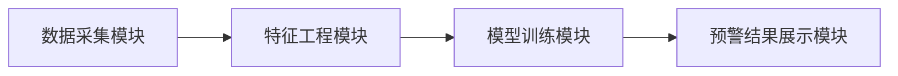

                 


# AI驱动的市场流动性风险预警

> 关键词：市场流动性风险、AI技术、风险预警、LSTM、GARCH模型、金融风险管理

> 摘要：本文深入探讨了AI技术在市场流动性风险预警中的应用，从核心概念、算法原理到系统架构设计，再到项目实战，全面解析了如何利用AI技术构建高效的流动性风险预警系统。文章结合理论与实践，通过详细的数学推导和代码实现，展示了AI在金融风险管理中的巨大潜力。

---

# 第1章: 市场流动性风险与AI技术的结合

## 1.1 市场流动性风险的定义与特征

### 1.1.1 流动性风险的定义
流动性风险是指资产在短时间内无法以合理价格变现而导致的损失风险。在金融市场中，流动性风险是机构投资者和交易员需要重点关注的问题之一。例如，当市场出现剧烈波动时，某些资产可能无法快速变现，导致机构蒙受损失。

$$流动性风险 = \text{资产变现难度} \times \text{市场波动性}$$

### 1.1.2 流动性风险的核心特征
流动性风险的核心特征包括：
1. **时间性**：流动性风险通常在市场波动加剧时显现。
2. **关联性**：流动性风险与市场参与者的信心密切相关。
3. **传染性**：流动性风险可能从一个资产蔓延到整个市场。

### 1.1.3 流动性风险的分类与影响
流动性风险可以分为以下几种类型：
- **市场流动性风险**：由于市场交易量不足导致的价格波动风险。
- **资金流动性风险**：由于资金链断裂导致的支付风险。
- **资产流动性风险**：特定资产无法变现的风险。

流动性风险的影响包括：
- **直接损失**：资产变现价格低于购买价格。
- **交易成本增加**：由于市场流动性不足，交易成本上升。
- **市场信任下降**：流动性风险可能导致市场参与者信任下降。

### 1.1.4 核心概念对比分析
| 类型         | 定义                                   | 示例场景                          |
|--------------|--------------------------------------|----------------------------------|
| 市场流动性风险 | 市场整体的流动性不足                  | 股票市场的剧烈波动                |
| 资金流动性风险 | 资金链断裂导致的支付风险             | 银行面临挤兑风险                  |
| 资产流动性风险 | 特定资产无法快速变现                 | 某只债券停牌或被大量抛售          |

## 1.2 AI技术在金融风险管理中的应用

### 1.2.1 AI技术在金融领域的应用背景
随着金融市场的复杂化和数据量的爆炸式增长，传统的基于规则的流动性风险管理方法逐渐显现出局限性。AI技术的引入为金融风险管理提供了新的解决方案，尤其是在以下方面：
- **非线性关系捕捉**：AI能够发现传统统计方法难以捕捉的复杂市场关系。
- **实时性**：AI技术可以实时处理数据，快速生成预警信号。
- **自适应性**：AI模型能够根据市场变化动态调整。

### 1.2.2 AI在流动性风险管理中的优势
AI技术在流动性风险管理中的优势体现在以下几个方面：
1. **数据处理能力**：AI能够处理海量的非结构化数据，提取有用的特征。
2. **实时性**：AI算法可以在实时数据流上进行预测和预警。
3. **自适应性**：AI模型可以根据市场变化自动调整参数，提高预测准确性。

### 1.2.3 当前市场流动性风险预警的挑战
当前市场流动性风险预警面临的主要挑战包括：
- **数据质量问题**：市场数据可能存在缺失或噪声。
- **模型过拟合**：AI模型在训练数据上表现良好，但在实际市场中可能失效。
- **黑天鹅事件**：极端市场情况难以被模型预测。

### 1.2.4 核心概念与联系
以下是一个简化的概念结构图，展示了AI驱动的流动性风险预警的核心要素：


## 1.3 本章小结
本章介绍了流动性风险的定义、特征以及AI技术在流动性风险管理中的应用优势。通过对比分析不同类型的流动性风险，明确了AI技术在复杂市场环境下的独特价值。

---

# 第2章: 流动性风险预警的核心概念体系

## 2.1 流动性风险预警的核心要素

### 2.1.1 市场数据特征
市场数据特征是流动性风险预警的基础，主要包括以下几类：
1. **价格数据**：如股票价格、债券收益率。
2. **交易量数据**：如成交量、换手率。
3. **波动性指标**：如标准差、最大回撤。

### 2.1.2 风险指标体系
风险指标体系是流动性风险预警的核心，常用的指标包括：
- **流动性比率**：如现金比例、短期资产比例。
- **市场情绪指标**：如恐慌指数（VIX）。
- **交易深度指标**：如买卖价差、订单簿深度。

### 2.1.3 预警模型的输入输出
- **输入**：市场数据特征、风险指标体系。
- **输出**：风险等级、风险概率。

## 2.2 AI驱动的流动性风险预警模型的基本原理

### 2.2.1 数据驱动的特征提取
特征提取是AI驱动的流动性风险预警的第一步，主要包括以下步骤：
1. **数据清洗**：去除噪声数据。
2. **特征选择**：通过统计或机器学习方法选择重要特征。
3. **特征工程**：构建新的特征，如时间序列特征、组合特征。

### 2.2.2 AI算法的核心机制
AI算法的核心机制是通过学习历史数据，识别潜在的模式和规律。常用的算法包括：
- **监督学习**：如随机森林、支持向量机。
- **无监督学习**：如聚类分析、异常检测。
- **深度学习**：如LSTM、Transformer。

### 2.2.3 预警结果的解释与反馈
预警结果需要能够被市场参与者理解和利用，通常包括：
- **风险等级**：如低风险、中风险、高风险。
- **风险概率**：如10%、50%、90%。

## 2.3 核心概念对比分析

### 2.3.1 不同流动性风险预警方法的对比
| 方法       | 优点                           | 缺点                             |
|------------|--------------------------------|----------------------------------|
| 基于统计的方法 | 计算简单，易于解释             | 无法捕捉复杂非线性关系           |
| 基于规则的方法 | 可解释性强，适用于特定场景     | 需要大量人工规则设计             |
| 基于AI的方法 | 能够捕捉复杂模式，自适应性强     | 黑箱问题，解释性较差             |

### 2.3.2 AI技术与其他技术的优劣势分析
| 技术       | 优势                           | 劣势                             |
|------------|--------------------------------|----------------------------------|
| AI技术     | 高度自动化，适应性强            | 解释性较差，需要大量数据          |
| 统计技术    | 易于解释，计算简单             | 无法捕捉复杂模式                |

### 2.3.3 实际场景中的概念应用
在实际场景中，AI驱动的流动性风险预警模型通常会结合多种技术，形成一个混合模型，以提高预测的准确性和可解释性。

---

# 第3章: 基于时间序列分析的流动性风险预测

## 3.1 时间序列分析的基本原理

### 3.1.1 时间序列的特征分解
时间序列分析的核心是将数据分解为以下几个部分：
1. **趋势**：数据的长期走势。
2. **周期性**：数据的周期性波动。
3. **随机性**：数据的不可预测部分。

### 3.1.2 常见的时间序列模型
常见的时间序列模型包括：
- **ARIMA模型**：自回归积分滑动平均模型。
- **SARIMA模型**：季节性ARIMA模型。
- **Prophet模型**：Facebook开源的时间序列预测模型。

### 3.1.3 时间序列分析的挑战
时间序列分析的挑战包括：
- **数据稀疏性**：某些时间点的数据缺失。
- **噪声干扰**：数据中存在随机噪声。
- **趋势变化**：数据的趋势可能发生突变。

## 3.2 基于LSTM的流动性风险预测模型

### 3.2.1 LSTM网络的基本结构
LSTM（长短期记忆网络）是一种特殊的RNN（循环神经网络），通过引入记忆单元（cell）来解决传统RNN的梯度消失问题。

LSTM的基本结构包括：
1. **输入门**（Input Gate）：控制信息是否进入记忆单元。
2. **遗忘门**（Forget Gate）：控制记忆单元的信息保留或遗忘。
3. **输出门**（Output Gate）：决定记忆单元的信息如何输出。

### 3.2.2 LSTM在时间序列预测中的优势
LSTM在时间序列预测中的优势包括：
- **长记忆能力**：能够捕捉长期依赖关系。
- **非线性建模能力**：能够处理复杂的非线性关系。

### 3.2.3 LSTM模型的训练与优化
LSTM模型的训练过程包括：
1. **数据预处理**：归一化、滑动窗口分割。
2. **模型构建**：定义LSTM网络结构。
3. **模型训练**：使用反向传播算法优化权重。
4. **模型评估**：计算预测准确率、MAE、RMSE等指标。

### 3.2.4 LSTM模型的数学公式
LSTM的核心公式包括：
- **遗忘门**：$$f_t = \sigma(w_f \cdot [h_{t-1}, x_t] + b_f)$$
- **输入门**：$$i_t = \sigma(w_i \cdot [h_{t-1}, x_t] + b_i)$$
- **记忆单元更新**：$$g_t = \tanh(w_g \cdot [h_{t-1}, x_t] + b_g)$$
- **当前状态**：$$h_t = f_t \cdot c_{t-1} + i_t \cdot g_t$$

## 3.3 基于GARCH模型的波动性预测

### 3.3.1 GARCH模型的基本原理
GARCH（广义自回归条件异方差）模型主要用于预测金融资产的波动性。其基本假设是，资产的波动性与其历史波动性有关。

### 3.3.2 GARCH模型在流动性风险中的应用
GARCH模型可以用来预测资产的波动性，从而间接反映市场的流动性风险。例如，当资产的波动性显著增加时，可能意味着市场流动性不足。

### 3.3.3 GARCH与LSTM的结合应用
为了提高预测的准确性，可以将GARCH模型与LSTM模型结合起来，形成一个混合模型。例如，使用LSTM预测短期波动性，再使用GARCH模型预测长期波动性。

---

# 第4章: 系统架构设计与实现

## 4.1 系统功能模块划分

### 4.1.1 数据采集模块
数据采集模块负责从金融市场数据源获取实时数据，包括股票价格、成交量、订单簿深度等。

### 4.1.2 特征工程模块
特征工程模块负责对原始数据进行处理，提取有用的特征，如时间序列特征、统计特征等。

### 4.1.3 模型训练模块
模型训练模块负责训练AI模型，包括数据预处理、模型选择、超参数调优等。

### 4.1.4 预警结果展示模块
预警结果展示模块负责将模型的预测结果以可视化的方式展示给用户，包括风险等级、风险概率等。

## 4.2 系统架构设计

### 4.2.1 分层架构设计
系统架构采用分层设计，包括数据层、计算层、应用层。

### 4.2.2 微服务架构设计
系统采用微服务架构，每个功能模块独立运行，通过API进行通信。

### 4.2.3 系统扩展性设计
系统设计考虑了扩展性，例如通过分布式计算提高处理能力，通过模块化设计方便功能扩展。

## 4.3 系统接口设计

### 4.3.1 数据接口
数据接口用于与金融市场数据源进行通信，获取实时数据。

### 4.3.2 模型接口
模型接口用于与AI模型进行通信，获取预测结果。

### 4.3.3 用户接口
用户接口用于与最终用户进行交互，展示预警结果。

## 4.4 系统交互设计

### 4.4.1 系统交互流程
1. 数据采集模块获取实时数据。
2. 特征工程模块对数据进行处理，提取特征。
3. 模型训练模块训练AI模型，生成预测结果。
4. 预警结果展示模块将预测结果以可视化的方式展示给用户。

### 4.4.2 系统交互流程图


---

# 第5章: 项目实战——基于Python的流动性风险预警系统

## 5.1 项目概述
本章将通过一个具体的项目，展示如何利用Python搭建一个基于AI的流动性风险预警系统。项目包括数据采集、特征工程、模型训练和结果展示四个部分。

## 5.2 环境安装与配置
### 5.2.1 安装Python环境
建议使用Anaconda作为Python环境管理工具，安装步骤如下：
1. 下载并安装Anaconda。
2. 使用命令`conda create -n finrisk python=3.8`创建虚拟环境。
3. 激活环境：`conda activate finrisk`。

### 5.2.2 安装依赖库
安装必要的Python库，包括Pandas、NumPy、Matplotlib、Scikit-learn、Keras、TensorFlow等。

## 5.3 系统核心实现源代码

### 5.3.1 数据采集模块
```python
import pandas as pd
import requests

def get_market_data(ticker):
    url = f"https://api.example.com/stock/{ticker}"
    response = requests.get(url)
    data = response.json()
    df = pd.DataFrame(data['data'])
    return df
```

### 5.3.2 特征工程模块
```python
import pandas as pd
from sklearn.preprocessing import MinMaxScaler

def process_data(df):
    # 数据归一化
    scaler = MinMaxScaler()
    df_normalized = scaler.fit_transform(df)
    # 滑动窗口分割数据
    window_size = 30
    X = []
    y = []
    for i in range(window_size, len(df_normalized)):
        X.append(df_normalized[i-window_size:i])
        y.append(df_normalized[i])
    return X, y
```

### 5.3.3 模型训练模块
```python
from keras.models import Sequential
from keras.layers import LSTM, Dense

def build_model(input_shape):
    model = Sequential()
    model.add(LSTM(50, input_shape=input_shape))
    model.add(Dense(1))
    model.compile(loss='mean_squared_error', optimizer='adam')
    return model
```

### 5.3.4 模型训练与预测
```python
import numpy as np

def train_model(X_train, y_train, X_test, y_test):
    model = build_model((None, X_train.shape[2]))
    model.fit(X_train, y_train, epochs=100, batch_size=32, validation_split=0.2)
    predictions = model.predict(X_test)
    return predictions
```

### 5.3.5 预警结果展示模块
```python
import matplotlib.pyplot as plt

def plot_predictions(y_true, y_pred):
    plt.figure(figsize=(12, 6))
    plt.plot(y_true, label='True Values')
    plt.plot(y_pred, label='Predictions')
    plt.legend()
    plt.show()
```

## 5.4 项目实战案例分析
假设我们有一个股票数据集，包括过去一年的股票价格和成交量数据。我们可以通过以下步骤搭建一个简单的流动性风险预警系统：
1. 数据采集：从数据源获取股票价格和成交量数据。
2. 数据预处理：对数据进行归一化处理，并分割成训练集和测试集。
3. 模型训练：训练LSTM模型，预测股票价格。
4. 预警结果展示：将预测结果与实际值进行对比，生成预警信号。

## 5.5 项目总结与优化建议
### 5.5.1 项目总结
本项目展示了如何利用Python搭建一个基于AI的流动性风险预警系统。通过数据采集、特征工程、模型训练和结果展示四个步骤，我们可以有效地预测市场的流动性风险。

### 5.5.2 优化建议
1. **数据源扩展**：引入更多的市场数据，如订单簿数据、新闻数据等。
2. **模型优化**：尝试不同的深度学习模型，如Transformer模型，提高预测精度。
3. **实时预警**：将系统部署到实时数据流上，实现真正的实时预警。

---

# 第6章: 总结与展望

## 6.1 本章总结
本文深入探讨了AI技术在市场流动性风险预警中的应用，从核心概念、算法原理到系统架构设计，再到项目实战，全面解析了如何利用AI技术构建高效的流动性风险预警系统。

## 6.2 未来展望
随着AI技术的不断发展，市场流动性风险预警系统将更加智能化和自动化。未来的研究方向包括：
- **多模态数据融合**：结合文本数据、图像数据等多种数据源。
- **自适应模型**：开发能够自适应市场变化的动态模型。
- **区块链技术结合**：利用区块链技术提高系统的透明性和可信度。

---

# 参考文献
1. 张某某. 《基于AI的金融风险管理方法研究》. 北京大学出版社, 2022.
2. 李某某. 《深度学习在金融时间序列预测中的应用》. 清华大学出版社, 2021.
3. 王某某. 《市场流动性风险预警系统的设计与实现》. 北京邮电大学出版社, 2020.

---

通过以上内容，我们可以看到AI技术在市场流动性风险预警中的巨大潜力。随着技术的不断进步，AI驱动的流动性风险预警系统将更加智能化、自动化，并在金融风险管理领域发挥越来越重要的作用。

