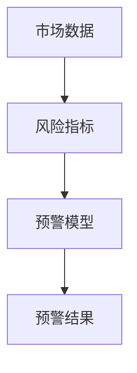
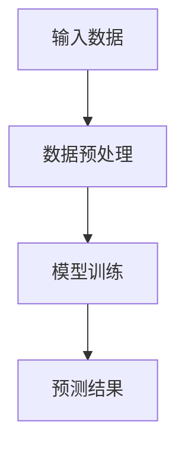
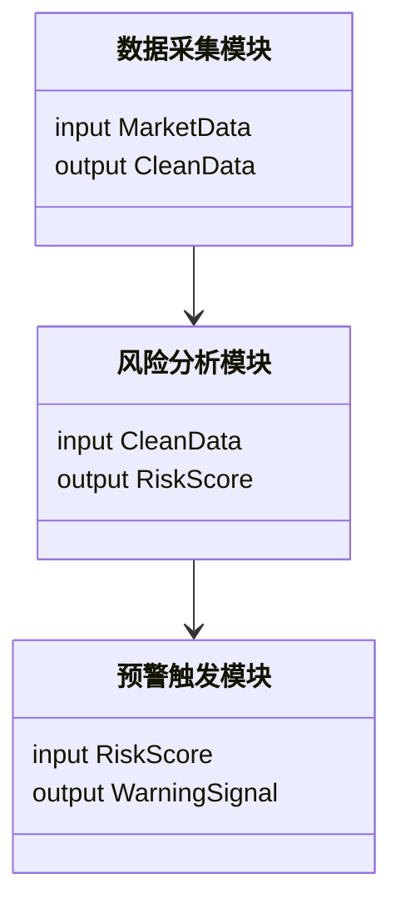
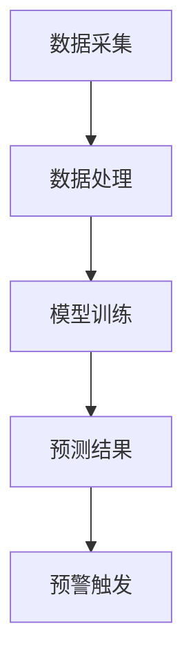
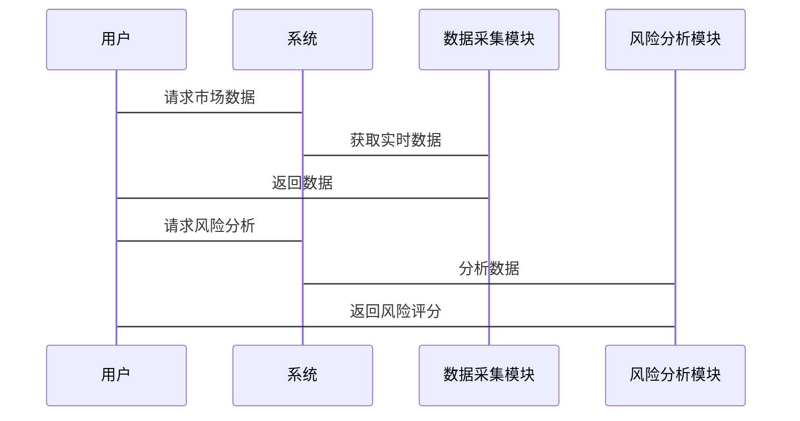

                 


# AI驱动的市场流动性风险预警系统

> 关键词：AI、市场流动性、风险预警、机器学习、金融系统、LSTM、时间序列分析

> 摘要：本文探讨了如何利用AI技术构建市场流动性风险预警系统。通过分析市场流动性风险的核心概念，结合AI算法，提出了基于时间序列分析和深度学习的解决方案。文章详细介绍了系统架构设计、算法实现、项目实战以及最佳实践，为读者提供了一个全面的视角来理解和应用AI驱动的市场流动性风险预警系统。

---

## 第一部分：背景介绍

### 第1章：市场流动性风险预警系统概述

#### 1.1 问题背景与定义
- 1.1.1 市场流动性风险的定义与特征
  - 市场流动性是指资产在短时间内以合理价格买卖的能力。
  - 流动性风险是指资产因市场流动性不足而无法以合理价格变现的风险。
- 1.1.2 市场流动性风险的来源与影响
  - 来源：市场波动、交易量骤减、突发事件等。
  - 影响：可能导致资产贬值、交易成本增加、市场信任危机等。
- 1.1.3 AI技术在风险预警中的作用
  - AI能够通过历史数据和实时数据，识别潜在风险并提前预警。

#### 1.2 问题描述与解决思路
- 1.2.1 市场流动性风险的预警需求
  - 投资者和金融机构需要实时监控市场流动性，避免因流动性不足而遭受损失。
- 1.2.2 基于AI的预警系统的核心目标
  - 实时监控市场流动性指标，预测潜在风险，提供预警信息。
- 1.2.3 系统解决思路与技术路线
  - 数据采集：获取市场数据。
  - 数据处理：清洗和特征提取。
  - 模型训练：基于机器学习和深度学习算法构建预测模型。
  - 预警触发：根据预测结果生成预警信号。

#### 1.3 系统的边界与外延
- 1.3.1 系统的功能边界
  - 仅关注市场流动性风险，不涉及其他类型的风险。
- 1.3.2 系统的适用范围与限制
  - 适用于股票、债券等标准化金融资产。
  - 无法预测不可预见的黑天鹅事件。
- 1.3.3 系统与其他系统的交互关系
  - 与交易系统、投资管理系统等其他金融系统无缝对接。

#### 1.4 核心概念与组成要素
- 1.4.1 数据采集模块
  - 从金融市场获取实时或历史数据。
- 1.4.2 风险分析模块
  - 对数据进行分析，识别潜在流动性风险。
- 1.4.3 预警触发模块
  - 根据分析结果生成预警信号。
- 1.4.4 用户反馈模块
  - 提供预警信息和应对策略。

---

## 第二部分：核心概念与联系

### 第2章：AI驱动的市场流动性风险预警系统原理

#### 2.1 核心概念与原理
- 2.1.1 市场流动性风险的数学模型
  - 使用时间序列分析和机器学习模型进行预测。
- 2.1.2 AI算法在风险预警中的应用
  - 使用LSTM（长短期记忆网络）进行时间序列预测。
- 2.1.3 系统的整体架构与流程
  - 数据采集 → 数据处理 → 模型训练 → 预警触发 → 用户反馈。

#### 2.2 核心概念对比分析
- 2.2.1 不同AI模型的对比分析
  | 模型类型 | 优点 | 缺点 |
  |----------|------|------|
  | ARIMA    | 简单易用 | 无法捕捉复杂模式 |
  | LSTM      | 能捕捉时间依赖性 | 计算复杂度高 |
  | GRU       | 计算效率高 | 表现略逊于LSTM |
- 2.2.2 不同预警指标的对比分析
  | 指标类型 | 优点 | 缺点 |
  |----------|------|------|
  | VWAP     | 反映交易活跃度 | 易受市场操纵影响 |
  | ATR      | 衡量市场波动性 | 不能直接反映流动性 |
  | 市值加权 | 衡量市场整体流动性 | 计算复杂 |
- 2.2.3 不同风险级别的对比分析
  | 风险级别 | 定义 | 应对策略 |
  |----------|------|----------|
  | 低风险   | 市场流动性充足 | 维持现状 |
  | 中风险   | 市场流动性开始下降 | 加强监控 |
  | 高风险   | 市场流动性严重不足 | 紧急措施 |

#### 2.3 ER实体关系图


---

## 第三部分：算法原理讲解

### 第3章：基于时间序列分析的AI算法

#### 3.1 算法原理
- 3.1.1 时间序列分析的基本原理
  - 时间序列分析是一种通过历史数据预测未来趋势的方法。
- 3.1.2 基于LSTM的深度学习模型
  - LSTM是一种特殊的RNN（循环神经网络），能够有效捕捉时间序列中的长-term依赖关系。
- 3.1.3 算法的数学模型与公式
  - LSTM的结构包括输入门、遗忘门和输出门。
  - 输入门：$i = \sigma(W_i x_t + U_i h_{t-1})$
  - 遗忘门：$f = \sigma(W_f x_t + U_f h_{t-1})$
  - 输出门：$o = \sigma(W_o x_t + U_o h_{t-1})$
  - 隐藏状态更新：$h_t = i \cdot \tanh(W_c x_t + U_c h_{t-1})$
  - 输出：$y_t = h_t W_y + b_y$

#### 3.2 算法实现


#### 3.3 代码实现
```python
import numpy as np
from tensorflow.keras.models import Sequential
from tensorflow.keras.layers import LSTM, Dense, Dropout

# 示例代码：基于LSTM的时间序列预测
model = Sequential()
model.add(LSTM(128, input_shape=(timesteps, features)))
model.add(Dropout(0.2))
model.add(Dense(1, activation='sigmoid'))
model.compile(loss='binary_crossentropy', optimizer='adam', metrics=['accuracy'])
```

---

## 第四部分：系统分析与架构设计方案

### 第4章：系统架构设计

#### 4.1 问题场景介绍
- 系统用于实时监控市场流动性，帮助投资者和金融机构提前预警潜在风险。

#### 4.2 项目介绍
- 项目目标：构建一个基于AI的市场流动性风险预警系统。
- 项目范围：涵盖数据采集、处理、分析和预警触发。

#### 4.3 系统功能设计


#### 4.4 系统架构设计


#### 4.5 系统接口设计
- 数据采集接口：接收市场数据。
- 预警触发接口：发送预警信号。

#### 4.6 系统交互


---

## 第五部分：项目实战

### 第5章：系统实现与案例分析

#### 5.1 环境安装
- 安装Python和必要的库：`numpy`, `pandas`, `tensorflow`, `matplotlib`.

#### 5.2 核心代码实现
```python
import numpy as np
import pandas as pd
from tensorflow.keras.models import Sequential
from tensorflow.keras.layers import LSTM, Dense, Dropout
from sklearn.preprocessing import MinMaxScaler

# 数据预处理
data = pd.read_csv('market_data.csv')
data = data.values
data = data.astype('float32')

# 归一化
scaler = MinMaxScaler()
data_scaled = scaler.fit_transform(data)

# 划分训练集和测试集
train_size = int(len(data_scaled) * 0.8)
train_data = data_scaled[:train_size]
test_data = data_scaled[train_size:]

# 构建数据集
def create_dataset(dataset, look_back=1):
    X = []
    y = []
    for i in range(len(dataset) - look_back):
        X.append(dataset[i:i+look_back])
        y.append(dataset[i+look_back])
    return np.array(X), np.array(y)

X_train, y_train = create_dataset(train_data, look_back=10)
X_test, y_test = create_dataset(test_data, look_back=10)

# 模型训练
model = Sequential()
model.add(LSTM(128, input_shape=(10, 1)))
model.add(Dropout(0.2))
model.add(Dense(1))
model.compile(loss='mean_squared_error', optimizer='adam')
model.fit(X_train, y_train, epochs=50, batch_size=32, verbose=1)

# 预测与评估
y_pred = model.predict(X_test)
y_pred = scaler.inverse_transform(y_pred)
y_true = scaler.inverse_transform(y_test)
```

#### 5.3 案例分析
- 使用真实市场数据进行训练，展示模型预测结果。
- 对比实际值和预测值，评估模型的准确性。

#### 5.4 项目小结
- 项目实现了基于LSTM的市场流动性风险预警系统。
- 系统能够实时监控市场数据，并提供预警信号。

---

## 第六部分：最佳实践

### 第6章：总结与展望

#### 6.1 小结
- 本文详细介绍了AI驱动的市场流动性风险预警系统的设计与实现。
- 系统通过AI技术，能够有效预测市场流动性风险，帮助投资者和金融机构避免损失。

#### 6.2 注意事项
- 数据质量：确保数据的准确性和完整性。
- 模型调优：根据实际情况调整模型参数。
- 风险控制：结合其他风险指标进行综合判断。

#### 6.3 拓展阅读
- 推荐阅读相关书籍和论文，深入理解AI在金融领域的应用。

---

通过本文的详细讲解，读者可以全面了解AI驱动的市场流动性风险预警系统的构建过程，并能够将其应用到实际的金融风险管理中。

