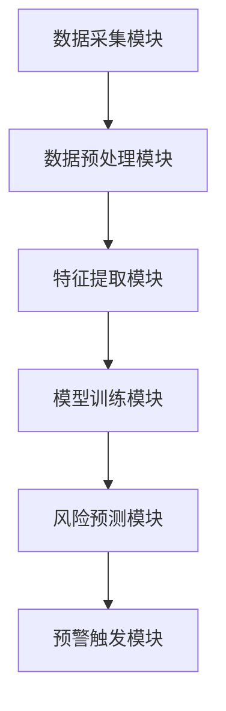
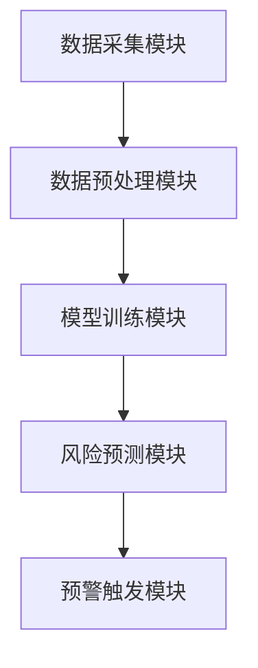

                 


# AI驱动的市场流动性风险预警系统

> 关键词：市场流动性风险，AI驱动，风险预警系统，机器学习，金融风险管理

> 摘要：本文详细探讨了AI在市场流动性风险预警中的应用，从理论基础到系统实现，结合实际案例，深入分析了基于机器学习的流动性风险预警系统的构建过程，包括数据处理、模型选择、系统架构设计等内容，为金融从业者提供了一套完整的解决方案。

---

# 正文

## 第1章 引言

### 1.1 背景介绍
随着金融市场的日益复杂化，流动性风险已成为金融机构面临的核心挑战之一。市场流动性风险是指资产在短时间内无法以合理价格变现的风险，其波动性往往受到市场情绪、宏观经济指标和政策变化的影响。传统的流动性风险管理方法依赖于人工分析和统计模型，存在数据处理能力有限、预警及时性不足等问题。

近年来，人工智能（AI）技术的快速发展为金融风险管理带来了新的机遇。通过机器学习算法，我们可以从海量数据中提取特征，构建高精度的预测模型，从而实现对市场流动性风险的实时预警。

### 1.2 问题描述
市场流动性风险的预警需要解决以下几个关键问题：
1. 如何从多源数据中提取有效的风险特征？
2. 如何构建高精度的预测模型？
3. 如何设计高效的预警系统架构？

### 1.3 问题解决
AI技术通过以下方式解决了上述问题：
1. **数据处理能力**：利用机器学习算法处理海量非结构化数据。
2. **实时性**：通过流数据处理技术实现实时预警。
3. **准确性**：基于历史数据训练高精度模型。

### 1.4 边界与外延
本系统仅关注市场流动性风险，不涉及信用风险和操作风险。系统的外延包括数据源的多样性、模型的可解释性和预警的实时性。

---

## 第2章 市场流动性风险概述

### 2.1 核心概念与术语
| 术语 | 定义 |
|------|------|
| 流动性风险 | 资产在短时间内无法变现的风险 |
| 时间序列 | 有序排列的时间数据 |
| 风险特征 | 影响流动性风险的关键因素 |

### 2.2 流动性风险的来源
1. **市场因素**：市场波动、投资者情绪。
2. **机构因素**：金融机构的资产负债结构。
3. **政策因素**：监管政策的变化。

### 2.3 流动性风险的影响
1. 市场波动加剧。
2. 金融机构面临资金链断裂风险。
3. 投资者信心下降。

### 2.4 传统方法的局限性
1. **数据维度有限**：传统方法主要依赖市场成交量、波动率等单一指标。
2. **预测精度不足**：统计模型难以捕捉复杂市场动态。
3. **计算效率低**：难以处理实时数据流。

---

## 第3章 AI驱动的市场流动性风险预警系统

### 3.1 系统定义与优势
AI驱动的市场流动性风险预警系统是一种基于机器学习技术的智能预警系统，能够从多源数据中提取特征，构建高精度预测模型，并实时触发预警信号。

#### 优势：
1. **高精度**：利用机器学习算法提升预测准确性。
2. **实时性**：支持流数据处理，实现实时预警。
3. **可扩展性**：能够处理大规模数据。

### 3.2 系统工作原理
系统通过以下步骤实现风险预警：
1. 数据采集：从多个数据源获取市场数据。
2. 特征提取：利用机器学习算法提取风险特征。
3. 模型训练：训练预测模型。
4. 风险预测：基于模型预测未来风险。
5. 预警触发：当预测结果达到阈值时，触发预警。

### 3.3 系统架构图


---

## 第4章 算法原理与实现

### 4.1 算法选择
系统采用以下两种算法：
1. **长短期记忆网络（LSTM）**：适用于时间序列预测。
2. **集成学习（Ensemble Learning）**：通过组合多个模型提升预测精度。

#### LSTM模型
LSTM是一种特殊的时间序列模型，能够有效捕捉数据的长-term依赖关系。其核心公式如下：
$$
f_t = \sigma(W_f \cdot [h_{t-1}, x_t] + b_f)
$$
$$
i_t = \sigma(W_i \cdot [h_{t-1}, x_t] + b_i)
$$
$$
o_t = \sigma(W_o \cdot [h_{t-1}, x_t] + b_o)
$$
$$
h_t = f_t \cdot c_{t-1} + i_t \cdot x_t
$$
$$
c_t = h_t \cdot o_t
$$

#### 集成学习
集成学习通过组合多个基模型的结果来提升预测精度。常见的集成方法包括投票法（Voting）和加权投票法（Weighted Voting）。

### 4.2 算法实现
以下是一个简单的LSTM实现示例：
```python
import tensorflow as tf
from tensorflow.keras.layers import LSTM, Dense

model = tf.keras.Sequential()
model.add(LSTM(64, input_shape=(timesteps, features)))
model.add(Dense(1, activation='sigmoid'))
model.compile(loss='binary_crossentropy', optimizer='adam')
```

---

## 第5章 系统设计与实现

### 5.1 系统设计
系统分为以下几个模块：
1. **数据采集模块**：从股票、期货等市场获取数据。
2. **数据预处理模块**：清洗数据并提取特征。
3. **模型训练模块**：训练预测模型。
4. **风险预测模块**：基于模型预测风险。
5. **预警触发模块**：当风险超过阈值时触发预警。

### 5.2 系统架构图


---

## 第6章 项目实战

### 6.1 环境搭建
1. **安装必要的库**：如TensorFlow、Keras、Pandas等。
2. **数据获取**：从Yahoo Finance获取股票数据。

### 6.2 数据处理
```python
import pandas as pd
import numpy as np

# 获取数据
data = pd.read_csv('stock_data.csv')

# 数据清洗
data = data.dropna()
data = (data - data.mean()) / data.std()
```

### 6.3 模型实现
```python
from tensorflow.keras.models import Sequential
from tensorflow.keras.layers import LSTM, Dense

# 模型训练
model = Sequential()
model.add(LSTM(64, input_shape=(timesteps, features)))
model.add(Dense(1, activation='sigmoid'))
model.compile(loss='binary_crossentropy', optimizer='adam', metrics=['accuracy'])
model.fit(x_train, y_train, epochs=10, batch_size=32)
```

### 6.4 结果分析
通过混淆矩阵和ROC曲线评估模型性能。

---

## 第7章 结论

### 7.1 总结
本文详细探讨了AI驱动的市场流动性风险预警系统的构建过程，从理论到实践，为金融从业者提供了一套完整的解决方案。

### 7.2 注意事项
1. 数据质量直接影响模型性能。
2. 模型需要定期更新以适应市场变化。
3. 系统需要考虑计算资源限制。

### 7.3 未来展望
随着AI技术的不断发展，未来的市场流动性风险预警系统将更加智能化和个性化，能够适应不同金融机构的需求。

---

## 第8章 最佳实践

### 8.1 实用建议
1. 使用云平台（如AWS、Google Cloud）部署系统。
2. 定期进行压力测试，确保系统的稳定性。
3. 结合专家经验，优化模型参数。

### 8.2 书籍推荐
1. 《机器学习实战》
2. 《时间序列分析》

### 8.3 拓展阅读
1. [FinTech相关文章](#)
2. [AI在金融风险管理中的应用](#)

---

通过本文的详细讲解，读者可以深入了解AI驱动的市场流动性风险预警系统的构建过程，并将其应用于实际的金融风险管理中。

