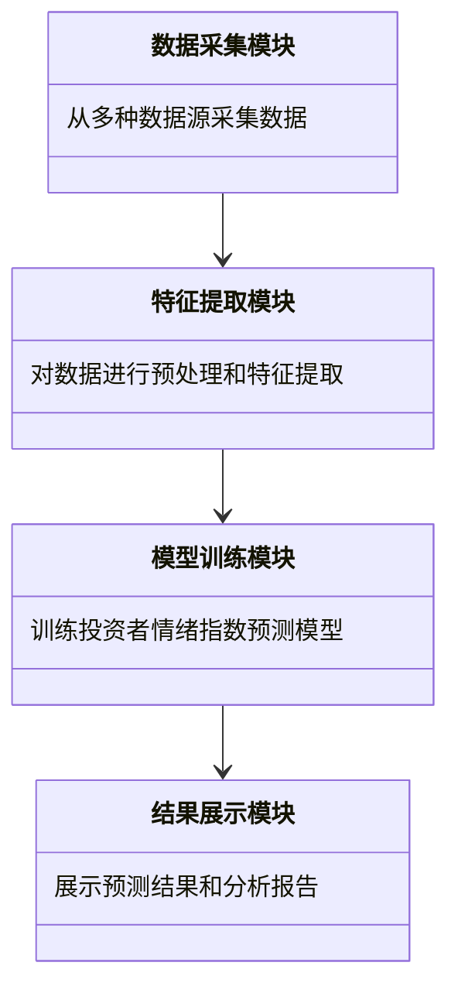

                 


# AI驱动的投资者情绪指数开发

## 关键词：投资者情绪指数、人工智能、自然语言处理、LSTM、系统架构

## 摘要：本文详细探讨了利用人工智能技术开发投资者情绪指数的方法，涵盖从数据采集、特征提取到模型构建的完整流程。通过分析投资者情绪指数的核心概念、自然语言处理技术的应用、基于LSTM的情绪预测模型，以及系统架构设计，本文为读者提供了一个全面的视角，展示如何通过AI技术实现投资者情绪的量化与预测。

---

# 第1章: 投资者情绪指数概述

## 1.1 投资者情绪指数的定义与作用

### 1.1.1 投资者情绪指数的定义

投资者情绪指数（Investor Sentiment Index）是用来量化市场参与者乐观或悲观情绪的指标。它通过分析市场参与者的交易行为、言论和市场数据，反映市场整体或特定资产的情绪状态。

### 1.1.2 投资者情绪指数的作用与意义

投资者情绪指数在金融分析中具有重要作用，它可以帮助投资者预测市场趋势、评估风险，并辅助制定投资策略。情绪指数还能帮助机构理解市场参与者的心理变化，从而优化投资组合和风险管理。

### 1.1.3 投资者情绪指数的分类与特点

投资者情绪指数可以分为整体市场指数和特定资产指数。整体市场指数反映全市场的平均情绪，而特定资产指数则针对某个资产或行业的市场情绪。其特点包括实时性、可量化和可预测性。

---

## 1.2 AI在金融领域的应用背景

### 1.2.1 人工智能在金融行业的应用现状

人工智能在金融领域的应用日益广泛，包括风险评估、投资决策、市场预测等方面。AI技术的引入显著提高了金融分析的效率和准确性。

### 1.2.2 投资者情绪分析的挑战与机遇

投资者情绪分析具有挑战性，主要体现在数据的多样性和实时性。然而，AI技术的应用为情绪分析提供了新的可能性，特别是深度学习和自然语言处理技术的进步，使得情绪分析更加精准和高效。

### 1.2.3 AI驱动投资者情绪指数的必要性

传统的投资者情绪分析方法存在主观性和滞后性问题。AI驱动的方法能够实时捕捉市场情绪变化，提供更精准的指数，帮助投资者做出更快的决策。

---

## 1.3 本章小结

本章介绍了投资者情绪指数的基本概念、作用和分类，并探讨了AI在金融领域的应用背景，强调了AI驱动投资者情绪指数的必要性和优势。

---

# 第2章: 自然语言处理与投资者情绪分析

## 2.1 自然语言处理技术简介

### 2.1.1 NLP的核心技术与工具

自然语言处理（NLP）技术包括文本预处理、词袋模型、词嵌入和预训练语言模型等。常用工具包括Python的NLTK库、 SpaCy 和深度学习框架如TensorFlow和PyTorch。

### 2.1.2 NLP在金融领域的应用

NLP在金融领域的应用包括新闻情感分析、社交媒体情绪分析和公司财报分析等。通过NLP技术，可以提取文本中的情感信息，帮助投资者分析市场情绪。

### 2.1.3 情感分析的原理与方法

情感分析的原理是通过机器学习模型对文本进行分类，判断其情感倾向。常用方法包括基于规则的分类、传统机器学习模型（如SVM）和深度学习模型（如LSTM和Transformer）。

---

## 2.2 投资者情绪分析的NLP实现

### 2.2.1 文本预处理与特征提取

文本预处理包括分词、去除停用词、词干提取和词嵌入等。特征提取通过将文本转化为数值形式，如使用词袋模型或词嵌入技术。

### 2.2.2 基于深度学习的情绪分类模型

深度学习模型如LSTM和Transformer在情感分类中表现出色。这些模型能够捕捉文本中的时序信息和上下文关系，提高情感分类的准确性。

### 2.2.3 情绪强度分析与情感词典构建

情绪强度分析通过量化情感的程度，帮助投资者更精确地理解市场情绪。情感词典构建是通过收集和标注情感词汇，建立一个情感词汇表，用于辅助情感分析。

---

## 2.3 本章小结

本章详细介绍了自然语言处理技术在投资者情绪分析中的应用，包括文本预处理、模型选择和情感强度分析等内容。

---

# 第3章: 投资者情绪指数的数据特征与建模

## 3.1 投资者情绪指数的数据来源

### 3.1.1 市场数据与投资者情绪的关系

市场数据包括股票价格、成交量等，这些数据与投资者情绪密切相关。例如，高成交量可能反映出市场的活跃和强烈情绪。

### 3.1.2 社交媒体数据的特征分析

社交媒体数据如Twitter和Reddit中的帖子可以反映投资者情绪。通过分析这些数据，可以捕捉市场参与者的即时情绪变化。

### 3.1.3 新闻与财经数据的处理方法

新闻数据的处理包括信息提取和情感分析。通过分析新闻标题和正文，可以量化新闻对市场情绪的影响。

---

## 3.2 投资者情绪指数的建模方法

### 3.2.1 时间序列分析方法

时间序列分析如ARIMA模型适用于捕捉情绪指数的时序特征。然而，传统的时间序列模型在捕捉复杂的情绪变化方面存在局限性。

### 3.2.2 机器学习模型的选择与优化

机器学习模型如随机森林和XGBoost在情绪指数预测中表现良好。这些模型能够处理多维数据，并捕捉非线性关系。

### 3.2.3 深度学习模型在情绪指数中的应用

深度学习模型如LSTM和Transformer在情绪指数预测中表现出色。这些模型能够捕捉复杂的时序关系和长距离依赖，提高预测精度。

---

## 3.3 本章小结

本章探讨了投资者情绪指数的数据来源和建模方法，分析了传统时间序列模型、机器学习模型和深度学习模型的特点及其在情绪指数预测中的应用。

---

# 第4章: 基于LSTM的情绪指数预测模型

## 4.1 LSTM模型的工作原理

### 4.1.1 LSTM的基本结构与工作流程

LSTM模型由遗忘门、输入门和输出门组成。通过这些门控机制，LSTM能够有效捕捉时序数据中的长距离依赖。

### 4.1.2 LSTM在时间序列预测中的优势

LSTM在时间序列预测中的优势在于其能够处理梯度消失问题，并捕捉复杂的时序模式。

### 4.1.3 LSTM的变体与优化方法

LSTM的变体包括双向LSTM和多层LSTM。优化方法包括学习率调整、批量归一化和早停等。

---

## 4.2 情绪指数预测模型的设计与实现

### 4.2.1 数据预处理与特征工程

数据预处理包括标准化和归一化。特征工程通过提取有用的特征，如情绪强度和市场指标，提高模型性能。

### 4.2.2 LSTM模型的搭建与训练

LSTM模型的搭建包括定义网络结构、选择优化器和损失函数。训练过程采用监督学习，通过反向传播优化模型参数。

### 4.2.3 模型的评估与优化

模型评估通过均方误差（MSE）和相关系数等指标进行。优化方法包括模型调参和交叉验证。

---

## 4.3 本章小结

本章详细介绍了基于LSTM的情绪指数预测模型的设计与实现，包括数据预处理、模型搭建和评估等内容。

---

# 第5章: 系统架构与实现方案

## 5.1 系统整体架构设计

### 5.1.1 系统模块划分与功能描述

系统分为数据采集模块、特征提取模块、模型训练模块和结果展示模块。各模块协同工作，实现投资者情绪指数的预测与展示。

### 5.1.2 系统架构的Mermaid类图



### 5.1.3 系统架构的可扩展性分析

系统架构设计充分考虑了可扩展性，支持数据源和模型的灵活扩展。

---

## 5.2 数据采集与处理模块

### 5.2.1 数据源的选择与获取

数据来源包括社交媒体API、新闻爬虫和金融数据接口。数据采集模块负责从这些源获取实时数据。

### 5.2.2 数据清洗与特征提取

数据清洗包括去除噪声和填补缺失值。特征提取通过提取文本特征和市场指标，构建输入向量。

### 5.2.3 数据存储与管理

数据存储采用数据库和文件系统，确保数据的安全性和高效性。

---

## 5.3 情绪分析与预测模块

### 5.3.1 情绪分析算法的选择与实现

选择基于LSTM的情绪分析算法，实现投资者情绪指数的预测。

### 5.3.2 情绪指数预测模型的训练与部署

模型训练采用批量训练，部署到云平台，提供实时预测服务。

### 5.3.3 结果展示与分析

结果展示模块通过可视化图表展示情绪指数预测结果，并提供分析报告。

---

## 5.4 本章小结

本章详细描述了系统的整体架构和实现方案，包括数据采集、特征提取和模型训练等模块的设计。

---

# 第6章: 项目实战

## 6.1 环境安装与配置

### 6.1.1 安装必要的Python库

安装Python、TensorFlow、Keras、NLTK和pandas等库。

### 6.1.2 数据源的获取与预处理

从社交媒体API获取文本数据，并进行清洗和特征提取。

---

## 6.2 核心实现代码

### 6.2.1 数据预处理代码

```python
import pandas as pd
from sklearn.model_selection import train_test_split
from tensorflow.keras.preprocessing.text import Tokenizer
from tensorflow.keras.preprocessing.sequence import pad_sequences

# 加载数据
data = pd.read_csv('sentiment_data.csv')

# 分割训练集和测试集
train_data, test_data = train_test_split(data, test_size=0.2)

# 文本分词
tokenizer = Tokenizer(num_words=10000)
tokenizer.fit_on_texts(train_data['text'])
train_sequences = tokenizer.texts_to_sequences(train_data['text'])
test_sequences = tokenizer.texts_to_sequences(test_data['text'])

# 填充序列
max_length = 500
train_sequences_padded = pad_sequences(train_sequences, maxlen=max_length)
test_sequences_padded = pad_sequences(test_sequences, maxlen=max_length)

# 标签转换
train_labels = train_data['label'].tolist()
test_labels = test_data['label'].tolist()
```

### 6.2.2 LSTM模型实现

```python
from tensorflow.keras.models import Sequential
from tensorflow.keras.layers import LSTM, Dense, Dropout, Embedding

model = Sequential()
model.add(Embedding(input_dim=10000, output_dim=32, input_length=500))
model.add(LSTM(units=64, dropout=0.2, recurrent_dropout=0.2))
model.add(Dense(1, activation='sigmoid'))

model.compile(loss='binary_crossentropy', optimizer='adam', metrics=['accuracy'])

model.summary()
```

### 6.2.3 模型训练与评估

```python
model.fit(train_sequences_padded, train_labels, epochs=10, batch_size=32, validation_data=(test_sequences_padded, test_labels))

loss, accuracy = model.evaluate(test_sequences_padded, test_labels)
print(f"Loss: {loss}, Accuracy: {accuracy}")
```

---

## 6.3 实际案例分析

### 6.3.1 数据来源与处理

使用Twitter数据和股票价格数据，构建投资者情绪指数。

### 6.3.2 模型训练与结果展示

训练LSTM模型，预测股票市场的投资者情绪指数，并与实际情绪指数进行对比分析。

### 6.3.3 模型优化与效果提升

通过调整模型参数和引入外部数据，进一步优化模型性能。

---

## 6.4 本章小结

本章通过实际案例展示了投资者情绪指数开发的完整流程，包括数据预处理、模型训练和结果展示。

---

# 第7章: 总结与展望

## 7.1 本章总结

本文详细探讨了AI驱动的投资者情绪指数开发的各个方面，包括数据处理、模型构建和系统设计。

## 7.2 未来展望

未来的研究方向包括结合更多数据源、优化模型结构和实时分析。投资者情绪指数在金融领域具有广阔的应用前景。

---

## 7.3 注意事项

在实际应用中，需注意数据隐私和模型的实时性，确保系统的稳定性和高效性。

---

## 7.4 最佳实践 Tips

- 数据预处理是关键，需仔细清洗和特征提取。
- 模型选择需根据数据特点和任务需求进行。
- 系统设计需注重模块化和可扩展性。

---

## 7.5 本章小结

本文总结了AI驱动的投资者情绪指数开发的核心内容，并展望了未来的发展方向。

---

# 结语

通过本文的探讨，读者可以全面了解AI驱动的投资者情绪指数开发的过程和方法，掌握从数据处理到模型构建的完整流程。希望本文能为相关领域的研究和实践提供有价值的参考。

