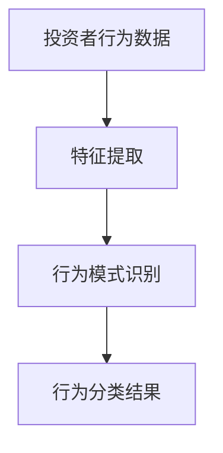
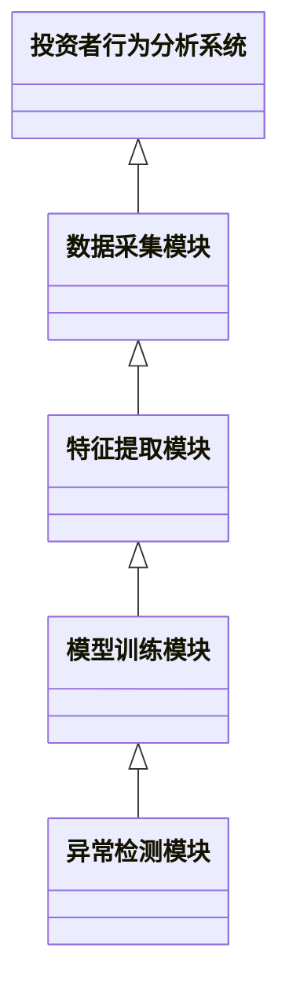
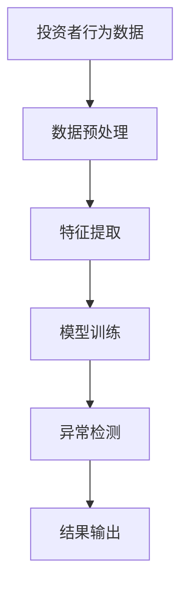

                 


# AI驱动的投资者行为模式识别与异常预警

## 关键词：人工智能，投资者行为，模式识别，异常检测，金融风险

## 摘要：本文探讨了人工智能在投资者行为分析中的应用，重点介绍了如何利用AI技术识别投资者的行为模式并进行异常预警。通过结合传统金融分析与现代AI算法，本文提出了一种基于深度学习的行为分析框架，旨在帮助投资者和金融机构更好地理解和预测市场行为，从而降低风险，提升投资决策的准确性。

---

## 第1章: AI驱动的投资者行为模式识别与异常预警概述

### 1.1 问题背景与描述
投资者行为分析是金融领域的重要研究方向。传统上，投资者行为分析依赖于统计学和心理学方法，但随着市场数据的复杂化和投资者行为的多样化，传统方法难以应对日益复杂的市场环境。投资者行为模式的识别与异常检测对于风险控制、投资策略优化具有重要意义。

#### 1.1.1 投资者行为分析的背景
- 投资者行为分析是研究投资者在不同市场环境下的决策模式。
- 传统方法依赖于统计分析和心理学模型，但难以捕捉复杂市场环境下的行为特征。

#### 1.1.2 传统投资者行为分析的局限性
- 数据维度有限，难以全面捕捉投资者行为特征。
- 对异常行为的识别能力较弱，难以应对市场中的突发事件。

#### 1.1.3 异常行为对投资决策的影响
- 异常行为可能导致市场波动，影响投资收益。
- 异常行为识别可以帮助投资者及时调整策略，降低风险。

### 1.2 问题解决与边界
通过引入人工智能技术，可以更高效地识别投资者行为模式，并实时检测异常行为。

#### 1.2.1 AI在投资者行为分析中的作用
- 提供高效的特征提取和模式识别能力。
- 实现对投资者行为的实时监控和预警。

#### 1.2.2 异常行为识别的边界与外延
- 异常行为识别的边界包括投资者行为的动态变化和市场环境的复杂性。
- 异常行为的外延涉及市场风险、投资策略优化等领域。

#### 1.2.3 核心概念与要素组成
- 核心概念包括投资者行为模式、异常行为、行为特征等。
- 要素组成包括数据采集、特征提取、模型训练、异常检测等。

---

## 第2章: 投资者行为模式识别的核心概念

### 2.1 投资者行为分类
投资者行为可以根据其决策模式和市场环境分为理性投资者和非理性投资者两类。

#### 2.1.1 理性投资者与非理性投资者的分类
- 理性投资者：基于理性决策，追求最大化的投资收益。
- 非理性投资者：受情绪、认知偏差等因素影响，决策偏离理性。

#### 2.1.2 不同市场环境下的行为特征
- 牛市：投资者情绪乐观，交易活跃。
- 熊市：投资者情绪悲观，交易保守。

#### 2.1.3 行为模式的动态变化
- 投资者行为模式会随着市场环境的变化而动态调整。

### 2.2 行为特征与模式识别
投资者行为模式识别的核心是提取行为特征并构建分类模型。

#### 2.2.1 行为特征的提取方法
- 交易频率：投资者的交易次数。
- 交易时间：投资者的交易时间分布。
- 交易金额：投资者的交易规模。

#### 2.2.2 模式识别的核心算法
- 监督学习：如随机森林、支持向量机（SVM）。
- 无监督学习：如聚类分析。

#### 2.2.3 行为模式与投资决策的关系
- 行为模式可以通过分析投资者的交易数据，预测其未来的投资决策。

### 2.3 核心概念与联系
通过行为特征对比表和ER实体关系图，可以更清晰地理解投资者行为模式识别的核心概念。

#### 2.3.1 行为特征对比表
| 特征类型   | 特征描述       |
|------------|----------------|
| 交易频率   | 高频交易或低频交易 |
| 交易时间   | 白天交易或夜间交易 |
| 交易金额   | 大额交易或小额交易 |

#### 2.3.2 行为模式识别的ER实体关系图
```mermaid
erDiagram
   投资者 <--- 行为特征
    行为特征 <--- 交易数据
    交易数据 <--- 市场环境
```

#### 2.3.3 行为模式识别的Mermaid流程图


---

## 第3章: 异常行为识别的算法原理

### 3.1 异常行为识别的定义与分类
异常行为识别是指通过分析投资者的行为数据，识别出与正常行为模式不符的行为。

#### 3.1.1 异常行为的定义
- 异常行为是指投资者在特定市场环境下表现出的与预期行为模式不一致的行为。

#### 3.1.2 异常行为的分类
- 交易异常：如异常交易频率、异常交易时间。
- 投资决策异常：如偏离理性决策的行为。

#### 3.1.3 异常行为的特征提取
- 数据分布：分析数据的分布特征，识别异常值。
- 时间序列分析：通过分析交易时间序列，识别异常交易行为。

### 3.2 异常检测算法原理
异常检测算法可以通过监督学习和无监督学习实现。

#### 3.2.1 监督学习与无监督学习的区别
- 监督学习：需要标记的训练数据。
- 无监督学习：无需标记的训练数据。

#### 3.2.2 基于深度学习的异常检测
- 使用深度学习模型，如循环神经网络（RNN），对时间序列数据进行建模。

#### 3.2.3 基于聚类的异常检测
- 使用聚类算法，如K-means，将数据分成若干簇，识别异常簇。

### 3.3 异常检测的数学模型
异常检测可以通过多种数学模型实现。

#### 3.3.1 异常检测的损失函数
$$ L = \sum_{i=1}^{n} (y_i - \hat{y_i})^2 $$
其中，$y_i$是真实值，$\hat{y_i}$是预测值。

#### 3.3.2 基于深度学习的异常检测模型
- 使用自动编码器（Autoencoder）对数据进行降维和重建，识别异常数据。

#### 3.3.3 异常检测的评价指标
- 准确率（Accuracy）：正确识别的异常行为占所有异常行为的比例。
- 召回率（Recall）：识别出的异常行为占所有异常行为的比例。

### 3.4 本章小结
本章介绍了异常行为识别的定义与分类，以及基于监督学习和无监督学习的异常检测算法。通过数学模型和算法原理的分析，为后续的系统设计奠定了基础。

---

## 第4章: AI算法在投资者行为分析中的应用

### 4.1 监督学习在投资者行为分析中的应用
监督学习可以通过标记的训练数据，实现投资者行为模式的分类。

#### 4.1.1 分类算法
- 随机森林：通过特征重要性分析，识别关键行为特征。
- 支持向量机（SVM）：通过非线性分类，实现投资者行为的分类。

#### 4.1.2 回归算法
- 线性回归：用于预测投资者的行为模式。
- 非线性回归：用于复杂行为模式的预测。

#### 4.1.3 分类算法的比较
- 随机森林和SVM在分类任务中表现相似，但在特征工程和数据规模上有所不同。

### 4.2 无监督学习在投资者行为分析中的应用
无监督学习可以通过聚类算法，实现投资者行为模式的识别。

#### 4.2.1 聚类算法
- K-means：将投资者行为数据分成若干簇，识别不同的行为模式。
- DBSCAN：基于密度的聚类算法，识别异常行为模式。

#### 4.2.2 聚类算法的比较
- K-means适用于数据分布均匀的情况，DBSCAN适用于数据分布不均匀的情况。

### 4.3 深度学习在投资者行为分析中的应用
深度学习可以通过神经网络模型，实现投资者行为模式的识别。

#### 4.3.1 循环神经网络（RNN）
- RNN可以用于时间序列数据的建模，识别投资者行为的动态变化。

#### 4.3.2 递归神经网络（RNN）的变体
- 长短期记忆网络（LSTM）：适用于长期依赖关系的建模。

#### 4.3.3 LSTM网络的结构
$$ LSTM = \text{cell}(\text{input}, \text{state}) $$

### 4.4 本章小结
本章介绍了监督学习、无监督学习和深度学习在投资者行为分析中的应用，重点分析了分类算法、聚类算法和深度学习模型的实现原理。

---

## 第5章: 系统架构与设计

### 5.1 系统功能设计
投资者行为分析系统的功能设计包括数据采集、特征提取、模型训练和异常检测。

#### 5.1.1 领域模型


#### 5.1.2 系统功能流程


### 5.2 系统架构设计
投资者行为分析系统的架构设计包括前端、后端和数据存储。

#### 5.2.1 系统架构图


#### 5.2.2 系统接口设计
- 前端接口：提供投资者行为数据的输入和结果的展示。
- 后端接口：负责数据的处理和模型的训练。

#### 5.2.3 系统交互流程
```mermaid
sequenceDiagram
    投资者 --> 前端：提交交易数据
    前端 --> 后端：请求数据处理
    后端 --> 数据库：查询历史数据
    数据库 --> 后端：返回历史数据
    后端 --> 前端：返回异常检测结果
```

### 5.3 本章小结
本章通过系统功能设计和架构设计，详细描述了投资者行为分析系统的实现过程。

---

## 第6章: 项目实战

### 6.1 环境安装
- Python 3.8及以上版本
- 安装必要的库：numpy、pandas、scikit-learn、tensorflow

### 6.2 核心代码实现
#### 6.2.1 数据预处理
```python
import pandas as pd

# 读取数据
data = pd.read_csv('investor_behavior.csv')

# 数据清洗
data = data.dropna()
```

#### 6.2.2 特征提取
```python
from sklearn.preprocessing import StandardScaler

# 标准化数据
scaler = StandardScaler()
scaled_data = scaler.fit_transform(data)
```

#### 6.2.3 模型训练
```python
from sklearn.ensemble import RandomForestClassifier

# 训练随机森林模型
model = RandomForestClassifier()
model.fit(scaled_data, labels)
```

#### 6.2.4 异常检测
```python
from sklearn.svm import OneClassSVM

# 训练异常检测模型
outlier_model = OneClassSVM()
outlier_model.fit(scaled_data)
```

### 6.3 案例分析
- 通过实际交易数据，训练投资者行为分析模型，识别异常交易行为。

### 6.4 项目总结
- 通过项目实战，验证了AI算法在投资者行为分析中的有效性。

---

## 第7章: 总结与展望

### 7.1 本章总结
- 本文介绍了AI在投资者行为分析中的应用，提出了基于深度学习的行为分析框架。

### 7.2 最佳实践 tips
- 数据预处理是投资者行为分析的关键步骤。
- 特征工程是提高模型性能的重要环节。

### 7.3 未来展望
- 结合自然语言处理技术，实现投资者情绪分析。
- 引入强化学习，优化投资者行为预测模型。

---

## 结语
通过本文的介绍，读者可以全面了解AI在投资者行为模式识别与异常预警中的应用。从算法原理到系统设计，再到项目实战，本文为投资者和金融机构提供了理论与实践相结合的解决方案。

