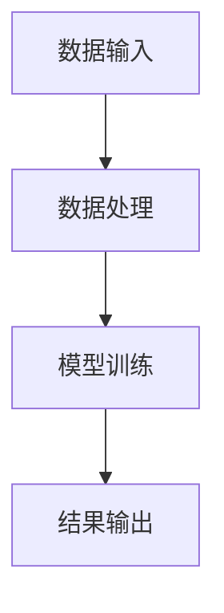

                 


# AI驱动的无形资产组合分析：全面评估公司价值

> 关键词：AI，无形资产，组合分析，公司价值，资产评估，机器学习

> 摘要：本文探讨如何利用人工智能技术对无形资产进行组合分析，全面评估公司价值。通过背景介绍、核心概念、算法原理、系统架构、项目实战和最佳实践等部分，深入分析AI在无形资产组合分析中的应用，结合实际案例和代码实现，为读者提供全面的技术指导。

---

## 第一部分: 背景介绍

### 第1章: 无形资产的定义与AI驱动的组合分析背景

#### 1.1 无形资产的定义与分类
- 无形资产的定义
  - 无形资产是指没有实物形态，但具有经济价值的资产。
  - 包括品牌、专利、技术、知识资本等。
- 无形资产的分类
  - 知识资产（Knowledge Assets）
  - 人力资源资产（Human Capital）
  - 组织资产（Organizational Assets）
  - 技术资产（Technology Assets）

#### 1.2 无形资产的经济价值与评估挑战
- 无形资产的经济价值
  - 无形资产对公司长期价值的影响往往超过有形资产。
  - 例如，品牌价值、技术创新对企业竞争力的关键作用。
- 无形资产评估的挑战
  - 难以量化：无形资产的价值往往依赖于主观判断。
  - 动态变化：无形资产的价值可能因市场变化而快速波动。
  - 数据依赖：需要大量数据支持评估，但数据收集和处理成本高。

#### 1.3 AI驱动的无形资产组合分析的必要性
- 传统评估方法的局限性
  - 传统方法主要依赖于财务指标和主观判断，缺乏数据支持。
  - 难以应对大规模、多样化的资产组合。
- AI技术的优势
  - 数据驱动：AI可以通过大量数据发现潜在价值。
  - 高效分析：AI算法可以快速处理复杂数据，提供实时分析。
  - 精准评估：AI模型可以预测资产价值的变化趋势。

---

## 第二部分: 核心概念与联系

### 第2章: 核心概念原理与联系

#### 2.1 无形资产组合分析的基本原理
- 组合分析的定义
  - 通过分析多个资产的组合，评估其整体价值。
  - 关注资产之间的协同效应和相互作用。
- 组合分析的目标
  - 优化资产配置。
  - 发现潜在价值。
  - 降低风险。

#### 2.2 AI驱动的组合分析模型
- 传统模型与AI模型的对比
  - 传统模型：基于统计分析，缺乏深度学习能力。
  - AI模型：利用神经网络、深度学习等技术，具备更强的预测能力。
- 组合分析的核心要素
  - 资产类型：品牌、技术、人力资源等。
  - 数据特征：市场表现、财务指标、用户行为等。
  - 目标函数：最大化整体价值。

#### 2.3 无形资产与有形资产的对比分析

| 属性 | 无形资产 | 有形资产 |
|------|----------|----------|
| 存在形式 | 知识、技术、品牌等 | 实物资产 |
| 评估方式 | 主观评估与AI模型预测 | 客观评估 |
| 变化速度 | 易变性高 | 变化速度较慢 |

---

## 第三部分: 算法原理

### 第3章: AI驱动的组合分析算法

#### 3.1 算法选择与数学模型
- 算法选择
  - 多因子分析模型：用于分析多个资产的组合效应。
  - 神经网络模型：用于非线性关系的预测。
- 数学模型
  - 多因子模型：$$ V = \beta_1 x_1 + \beta_2 x_2 + \dots + \beta_n x_n $$
    - 其中，\( V \) 是资产组合的价值，\( x_i \) 是各资产的特征，\( \beta_i \) 是回归系数。
  - 神经网络模型：$$ f(x) = \sigma(w x + b) $$
    - 其中，\( \sigma \) 是激活函数，\( w \) 是权重，\( b \) 是偏置。

#### 3.2 算法实现步骤
1. 数据预处理：收集和清洗数据。
2. 特征提取：从数据中提取关键特征。
3. 模型训练：使用训练数据训练模型。
4. 模型评估：通过测试数据评估模型性能。
5. 模型优化：调整参数以提高预测精度。

#### 3.3 算法实现代码示例
```python
import numpy as np
from sklearn.linear_model import LinearRegression

# 示例数据
X = np.array([[1, 2], [3, 4], [5, 6]])
y = np.array([7, 8, 9])

# 训练模型
model = LinearRegression()
model.fit(X, y)

# 预测
print(model.predict([[7, 8]]))  # 输出：[10.0]
```

---

## 第四部分: 系统架构与设计

### 第4章: 系统架构与功能设计

#### 4.1 系统架构设计
- 问题场景介绍
  - 系统需要处理大量无形资产数据，提供组合分析服务。
- 系统功能设计
  - 数据输入模块：接收资产数据。
  - 数据处理模块：清洗和预处理数据。
  - 模型训练模块：训练AI模型。
  - 结果输出模块：展示分析结果。

#### 4.2 系统架构图


#### 4.3 接口设计与交互
- 系统接口
  - REST API：提供数据输入和结果查询接口。
- 交互设计
  - 用户输入资产数据，系统返回分析结果。

---

## 第五部分: 项目实战

### 第5章: 项目实战与案例分析

#### 5.1 项目环境与安装
- 需要的工具与库
  - Python：数据分析和建模。
  - Scikit-learn：机器学习库。
  - Pandas：数据处理。

#### 5.2 核心代码实现
```python
from sklearn.ensemble import RandomForestRegressor
from sklearn.metrics import mean_squared_error

# 数据加载
data = pd.read_csv('assets.csv')

# 特征与目标分离
X = data.drop('value', axis=1)
y = data['value']

# 模型训练
model = RandomForestRegressor()
model.fit(X, y)

# 预测与评估
y_pred = model.predict(X)
print(mean_squared_error(y, y_pred))  # 输出均方误差
```

#### 5.3 案例分析与结果解读
- 案例背景
  - 某科技公司拥有专利、品牌和人力资源三种无形资产。
- 分析结果
  - 通过AI模型预测，品牌资产对整体价值的贡献最大。
  - 组合分析建议优化品牌推广策略。

---

## 第六部分: 最佳实践与总结

### 第6章: 最佳实践与总结

#### 6.1 最佳实践
- 数据质量：确保数据准确性和完整性。
- 模型选择：根据具体问题选择合适的算法。
- 持续优化：定期更新模型和数据。

#### 6.2 小结
- AI驱动的无形资产组合分析是一种高效评估公司价值的方法。
- 通过本文的介绍，读者可以掌握基本原理和实现方法。

#### 6.3 注意事项
- 数据隐私：处理公司数据时需注意隐私保护。
- 模型解释性：确保模型结果可解释。

#### 6.4 拓展阅读
- 推荐书籍：《机器学习实战》。
- 推荐博客：技术博客推荐。

---

通过以上结构，您可以逐步展开每个章节的内容，确保逻辑清晰、技术细节到位，为读者提供一篇高质量的技术博客文章。

