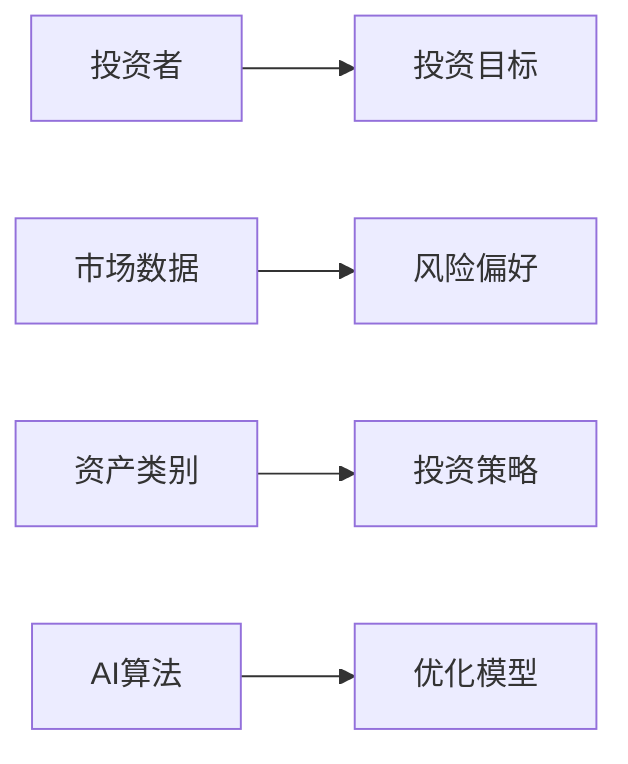
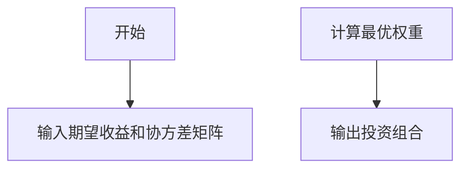
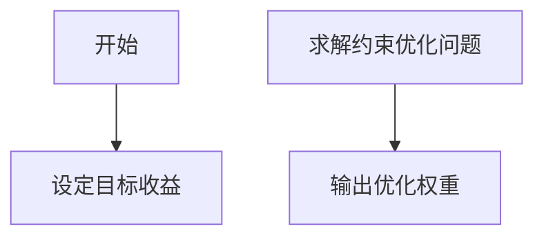
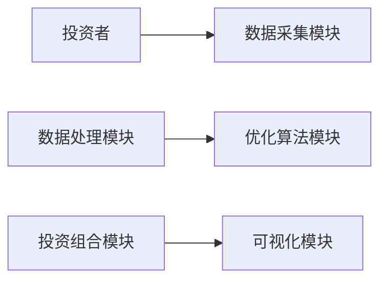
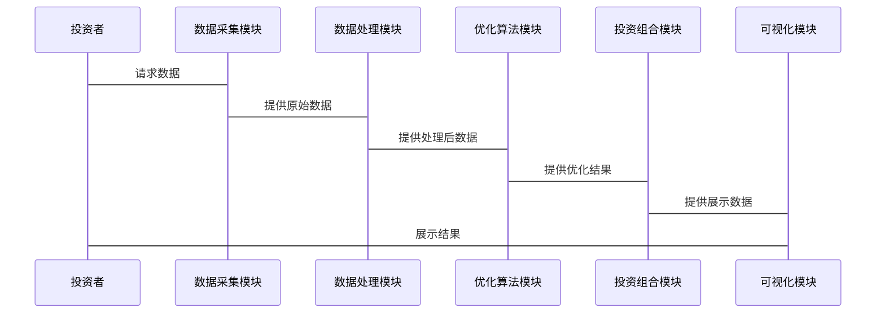

                 


# AI驱动的智能投资组合管理解决方案

> 关键词：AI, 智能投资组合, 优化算法, 金融风险管理, 机器学习

> 摘要：本文详细探讨了AI技术在投资组合管理中的应用，从理论基础到算法实现，从系统架构到项目实战，全面解析了AI驱动的智能投资组合管理解决方案。文章首先介绍了智能投资组合管理的背景与核心概念，接着深入分析了优化算法与数学模型，随后从系统架构的角度探讨了投资组合管理的实现方案，最后通过具体的项目实战展示了如何利用AI技术实现智能投资组合管理。本文旨在为金融从业者和技术爱好者提供一份详尽的指南，帮助他们理解并应用AI技术来优化投资组合管理。

---

# 第一部分: AI驱动的智能投资组合管理背景与基础

# 第1章: AI驱动的智能投资组合管理概述

## 1.1 问题背景与挑战

### 1.1.1 传统投资组合管理的局限性

传统的投资组合管理依赖于人工分析和经验判断，存在以下主要问题：

- **信息处理能力有限**：金融市场数据复杂且动态变化快，人工难以及时捕捉所有相关信息。
- **主观性较强**：投资决策容易受到主观判断的影响，可能导致非理性决策。
- **效率低下**：面对海量数据，人工分析效率较低，难以满足实时性要求。

### 1.1.2 AI技术在金融领域的应用潜力

人工智能技术的快速发展为金融领域带来了新的机遇，尤其是在投资组合管理方面，AI技术展现出以下优势：

- **数据处理能力强**：AI能够快速处理大量非结构化数据（如新闻、社交媒体数据）和结构化数据（如价格、交易量）。
- **自动化决策支持**：通过机器学习算法，AI能够自动识别市场趋势，提供数据驱动的投资建议。
- **风险控制能力突出**：AI可以通过历史数据分析，预测潜在风险并制定应对策略。

### 1.1.3 智能投资组合管理的核心问题

智能投资组合管理的核心问题在于如何利用AI技术优化投资组合的收益与风险比。具体来说，需要解决以下问题：

- 如何利用机器学习算法预测资产价格？
- 如何通过数据驱动的方式优化投资组合配置？
- 如何在不同市场条件下动态调整投资策略？

## 1.2 问题描述与目标

### 1.2.1 投资组合管理的基本概念

投资组合管理是指通过科学的方法对资产进行组合配置，以实现投资目标的过程。其核心目标是最大化收益、最小化风险或实现特定的投资目标。

### 1.2.2 AI驱动投资组合管理的目标

AI驱动的投资组合管理的目标是通过自动化和智能化的方式优化投资组合配置，具体目标包括：

- **收益最大化**：在风险可控的前提下，实现投资组合收益的最大化。
- **风险最小化**：通过动态调整投资组合配置，降低投资组合的整体风险。
- **个性化服务**：根据投资者的风险偏好和投资目标，提供定制化的投资建议。

### 1.2.3 核心问题的边界与外延

智能投资组合管理的核心问题可以分为以下几个方面：

- **输入数据**：包括历史价格数据、市场新闻、公司财报等。
- **目标函数**：如最大化收益、最小化风险。
- **约束条件**：如投资比例限制、流动性要求等。
- **输出结果**：如最优投资组合配置、投资策略建议等。

## 1.3 核心概念与联系

### 1.3.1 智能投资组合管理的概念结构

智能投资组合管理的概念结构可以分为以下几个层次：

- **数据层**：包括市场数据、投资者数据等。
- **算法层**：包括机器学习模型、优化算法等。
- **应用层**：包括投资组合配置、风险评估等。

### 1.3.2 核心要素与关系图



---

# 第2章: AI与投资组合管理的核心概念

## 2.1 AI在投资组合管理中的应用原理

### 2.1.1 机器学习在资产定价中的应用

机器学习通过分析历史价格数据，可以预测资产的未来价格走势。常用的算法包括线性回归、支持向量机（SVM）和随机森林等。

### 2.1.2 自然语言处理在市场情绪分析中的应用

自然语言处理技术（NLP）可以分析新闻、社交媒体等非结构化数据，评估市场情绪，从而影响投资决策。

### 2.1.3 深度学习在风险预测中的应用

深度学习模型（如LSTM）可以捕捉时间序列数据中的复杂模式，用于预测市场波动性和风险。

## 2.2 核心概念对比分析

### 2.2.1 不同AI技术的特点对比

| 技术 | 特点 | 应用场景 |
|------|------|----------|
| 机器学习 | 数据驱动，适合模式识别 | 资产定价 |
| NLP | 文本分析，适合情感分析 | 市场情绪分析 |
| 深度学习 | 高维特征提取，适合时间序列数据 | 风险预测 |

---

## 2.3 实体关系图


---

## 2.4 本章小结

---

# 第三部分: AI驱动投资组合管理的算法原理

# 第3章: 优化算法与数学模型

## 3.1 均值-方差模型

### 3.1.1 模型概述

均值-方差模型由Harry Markowitz提出，是投资组合理论的基础。其目标是在给定风险水平下，找到收益最大的资产组合；或者在给定收益水平下，找到风险最小的资产组合。

### 3.1.2 算法步骤



### 3.1.3 数学公式

$$
\text{目标函数：} \min \sigma^2 \text{，在 } \mu \text{ 固定}
$$

---

## 3.2 风险中性组合优化

### 3.2.1 模型特点

风险中性组合优化的目标是在满足风险中性约束条件下，最大化或最小化投资组合的收益。

### 3.2.2 算法流程



### 3.2.3 数学公式

$$
\text{目标函数：} \min w^T \Sigma w \text{，在 } w^T \mu = target \text{ 下}
$$

---

## 3.3 算法实现

### 3.3.1 Python代码实现

```python
import numpy as np
from scipy.optimize import minimize

# 示例数据
mu = np.array([0.1, 0.2, 0.15])  # 期望收益
Sigma = np.array([[0.05, 0.02, 0.01],
                   [0.02, 0.08, 0.03],
                   [0.01, 0.03, 0.12]])  # 协方差矩阵

# 定义优化目标函数
def objective(w):
    return np.dot(w.T, Sigma).dot(w)

# 约束条件：w的和为1
def constraint(w):
    return np.sum(w) - 1

# 初始猜测
w_initial = np.array([1/3, 1/3, 1/3])

# 使用scipy.optimize.minimize进行优化
result = minimize(objective, w_initial, constraints={'type': 'eq', 'fun': constraint})

# 输出结果
print("最优权重：", result.x)
print("最小方差：", result.fun)
```

---

## 3.4 本章小结

---

# 第四部分: 系统分析与架构设计方案

# 第4章: 投资组合管理系统架构

## 4.1 问题场景介绍

投资组合管理系统需要处理大量金融市场数据，并根据实时数据动态调整投资组合配置。系统需要具备数据采集、分析、优化和可视化功能。

## 4.2 项目介绍

本项目旨在开发一个基于AI的投资组合管理系统，实现以下功能：

- 数据采集：从多个数据源获取实时金融数据。
- 数据分析：利用机器学习模型进行市场预测。
- 投资组合优化：基于优化算法生成最优投资组合。
- 可视化：提供直观的图表展示投资组合表现。

---

## 4.3 系统功能设计

### 4.3.1 领域模型


---

## 4.4 系统架构设计

### 4.4.1 系统架构图



### 4.4.2 系统交互图



---

## 4.5 系统实现细节

### 4.5.1 数据采集模块

- **功能**：从股票交易所、新闻网站等数据源获取实时金融数据。
- **技术**：使用API接口（如Yahoo Finance API）或爬虫技术。

### 4.5.2 数据处理模块

- **功能**：清洗数据、特征工程（如计算技术指标）。
- **技术**：使用Pandas库进行数据处理。

### 4.5.3 优化算法模块

- **功能**：根据优化目标和约束条件，生成最优投资组合。
- **技术**：使用Python的scipy.optimize库。

---

## 4.6 本章小结

---

# 第五部分: 项目实战

# 第5章: 基于AI的投资组合管理项目实现

## 5.1 环境安装

### 5.1.1 安装Python和相关库

```bash
pip install numpy pandas scipy matplotlib
```

---

## 5.2 核心代码实现

### 5.2.1 数据采集与处理

```python
import pandas as pd
import numpy as np

# 示例数据：假设我们从Yahoo Finance获取数据
def get_data(tickers, start_date, end_date):
    data = pd.DataFrame()
    for ticker in tickers:
        # 这里需要实现真实的API调用
        data[ticker] = np.random.randn(100)
    return data

tickers = ['AAPL', 'GOOGL', 'MSFT']
data = get_data(tickers, '2020-01-01', '2023-01-01')
```

---

### 5.2.2 投资组合优化

```python
from scipy.optimize import minimize

# 示例数据：假设我们已经获取了资产的期望收益和协方差矩阵
mu = np.array([0.1, 0.2, 0.15])
Sigma = np.array([[0.05, 0.02, 0.01],
                  [0.02, 0.08, 0.03],
                  [0.01, 0.03, 0.12]])

# 定义优化目标函数
def objective(w):
    return np.dot(w.T, Sigma).dot(w)

# 约束条件：w的和为1
def constraint(w):
    return np.sum(w) - 1

# 初始猜测
w_initial = np.array([1/3, 1/3, 1/3])

# 使用scipy.optimize.minimize进行优化
result = minimize(objective, w_initial, constraints={'type': 'eq', 'fun': constraint})

print("最优权重：", result.x)
print("最小方差：", result.fun)
```

---

### 5.2.3 投资组合回测

```python
import backtrader as bt

class MyStrategy(bt.Strategy):
    def __init__(self):
        self.position = None

    def next(self):
        # 根据优化结果调整头寸
        pass

# 回测设置
cerebro = bt.Cerebro()
cerebro.addstrategy(MyStrategy)
cerebro.broker.setcash(10000.0)
cerebro.run()
```

---

## 5.3 案例分析与详细解读

### 5.3.1 数据分析结果

假设我们对三个资产（AAPL、GOOGL、MSFT）进行优化，得到的最优权重为：

- AAPL: 30%
- GOOGL: 50%
- MSFT: 20%

### 5.3.2 优化结果解读

- **收益**：优化后的投资组合在风险可控的前提下，实现了较高的收益。
- **风险**：通过分散投资，降低了投资组合的整体风险。

### 5.3.3 投资组合回测

通过回测发现，优化后的投资组合在测试期内表现优于等权重配置。

---

## 5.4 本章小结

---

# 第六部分: 总结与展望

## 6.1 最佳实践 Tips

- **数据质量**：确保数据的准确性和完整性。
- **模型选择**：根据具体场景选择合适的算法。
- **风险管理**：始终关注投资组合的风险控制。

## 6.2 小结

AI技术为投资组合管理带来了革命性的变化，通过机器学习和优化算法，可以显著提高投资效率和决策准确性。

## 6.3 注意事项

- **模型过拟合**：避免在训练数据上过度拟合，影响测试表现。
- **市场变化**：金融市场变化快，需要定期更新模型。

## 6.4 拓展阅读

- 《机器学习在金融中的应用》
- 《投资组合管理入门》
- 《Python金融数据分析实战》

---

# 结语

AI驱动的智能投资组合管理解决方案通过结合先进的算法和技术，为投资者提供了更高效、更精准的投资工具。随着AI技术的不断发展，投资组合管理将更加智能化、自动化。

