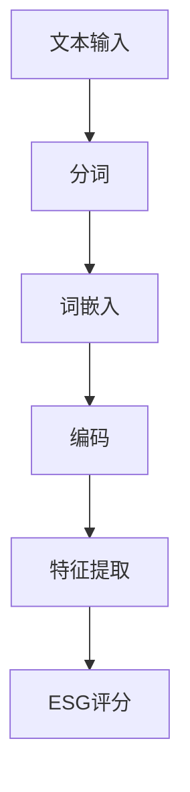
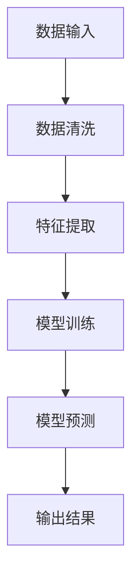
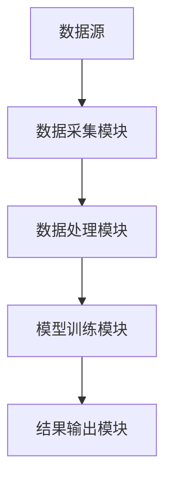
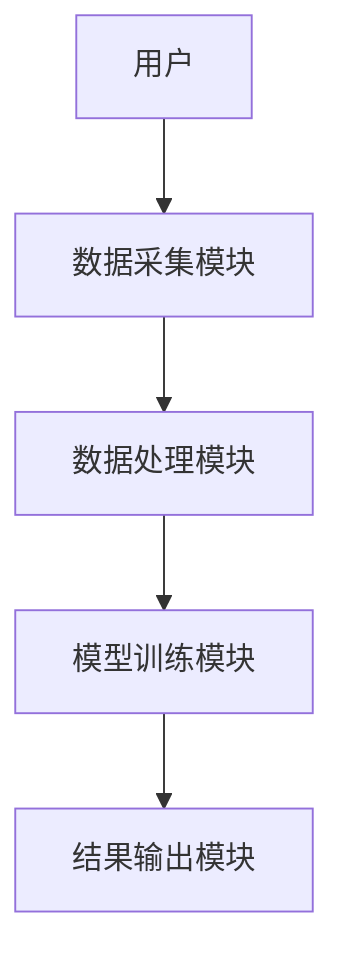

                 


# AI驱动的环境、社会和治理(ESG)分析：可持续价值投资

> 关键词：AI技术、ESG分析、可持续投资、环境、社会、治理、机器学习

> 摘要：本文深入探讨了人工智能技术在环境、社会和治理（ESG）分析中的应用，结合可持续价值投资的核心理念，分析了AI驱动的ESG分析的背景、核心概念、算法原理、系统架构及实际项目案例。通过详细的技术分析与实践，展示了如何利用AI技术提升ESG分析的效率与准确性，为可持续投资提供科学依据。

---

## 第一部分：AI驱动的ESG分析背景

### 第1章：环境、社会和治理（ESG）概述

#### 1.1 ESG的核心概念

##### 1.1.1 ESG的定义与内涵
环境、社会和治理（ESG）是企业可持续发展的重要评价指标，分别对应企业在环境保护、社会责任和公司治理方面的表现。ESG分析是通过对企业在这些方面的表现进行量化评估，从而为投资者提供决策依据。

| **维度** | **核心内容** | **应用场景** |
|----------|--------------|--------------|
| E（环境） | 碳排放、能源消耗、环保合规性 | 评估企业对环境的影响 |
| S（社会） | 劳工权益、社区关系、产品安全 | 评估企业对社会的贡献与影响 |
| G（治理） | 董事会结构、高管薪酬、内部控制 | 评估企业治理的透明度与有效性 |

##### 1.1.2 ESG的历史发展与现状
ESG的概念起源于20世纪60年代的环境运动，随着全球对可持续发展的关注，ESG分析逐渐成为金融行业的重要工具。近年来，随着AI技术的发展，ESG分析的效率和精度得到了显著提升。

##### 1.1.3 ESG在可持续投资中的作用
ESG分析通过量化企业的可持续发展表现，帮助投资者识别风险和机会，从而优化投资组合，实现长期收益。

---

#### 1.2 AI技术与ESG分析的结合

##### 1.2.1 AI在金融分析中的应用
AI技术在金融领域的应用主要体现在数据处理、模式识别和预测建模等方面。通过AI技术，可以高效地处理大量非结构化数据，提取关键信息。

##### 1.2.2 ESG分析的痛点与挑战
传统ESG分析依赖于人工判断，存在数据分散、信息不全、评估标准不统一等问题。AI技术的应用可以解决这些问题，提升ESG分析的效率和准确性。

##### 1.2.3 AI如何解决ESG分析的难点
AI技术通过自然语言处理（NLP）、机器学习和深度学习等方法，可以从非结构化数据中提取ESG相关信息，构建预测模型，优化投资决策。

---

### 第2章：ESG分析的框架与方法

#### 2.1 ESG分析的核心维度

##### 2.1.1 环境（E）维度
环境维度关注企业在环境保护方面的表现，包括碳排放、能源消耗、环保合规性等指标。

##### 2.1.2 社会（S）维度
社会维度关注企业在社会责任方面的表现，包括员工权益、社区关系、产品安全等指标。

##### 2.1.3 治理（G）维度
治理维度关注企业在公司治理方面的表现，包括董事会结构、高管薪酬、内部控制等指标。

---

#### 2.2 ESG数据的获取与处理

##### 2.2.1 数据来源与分类
ESG数据主要来源于企业年报、社会责任报告、新闻媒体、政府公告等渠道。数据分类主要基于E、S、G三个维度。

##### 2.2.2 数据清洗与预处理
数据清洗是将数据中的噪声、重复和不完整部分进行处理，确保数据的准确性和一致性。

##### 2.2.3 数据标准化与特征提取
数据标准化是将不同来源的数据统一到一个标准体系中，特征提取是将数据转化为可计算的特征向量。

---

#### 2.3 ESG评分与评级方法

##### 2.3.1 传统ESG评分方法
传统ESG评分方法主要基于企业公开披露的信息，采用人工评分或简单模型进行评估。

##### 2.3.2 基于AI的ESG评分模型
基于AI的ESG评分模型利用机器学习算法，从非结构化数据中提取特征，构建预测模型，实现自动化评分。

##### 2.3.3 ESG评级的比较与选择
不同评级机构对ESG评级的标准和方法有所不同，需要结合具体应用场景选择合适的评级方法。

---

### 第3章：AI驱动的ESG分析技术基础

#### 3.1 自然语言处理（NLP）在ESG分析中的应用

##### 3.1.1 文本数据的处理与分析
文本数据的处理包括分词、句法分析和情感分析等步骤，用于提取ESG相关信息。

##### 3.1.2 基于NLP的ESG信息提取
通过NLP技术可以从企业年报、社会责任报告中提取关键信息，构建ESG特征向量。

##### 3.1.3 NLP模型在ESG评分中的应用
基于NLP模型的ESG评分系统可以实现对企业ESG表现的自动化评估。

---

#### 3.2 机器学习在ESG分析中的应用

##### 3.2.1 监督学习与非监督学习在ESG分析中的应用
监督学习用于ESG评分预测，非监督学习用于发现数据中的潜在模式。

##### 3.2.2 基于机器学习的ESG预测模型
通过机器学习算法构建ESG预测模型，可以实现对企业未来ESG表现的预测。

##### 3.2.3 深度学习在ESG分析中的前沿应用
深度学习技术在ESG分析中的应用包括文本生成、图像识别和知识图谱构建等。

---

#### 3.3 数据挖掘与可视化在ESG分析中的应用

##### 3.3.1 数据挖掘技术在ESG分析中的应用
数据挖掘技术用于发现ESG数据中的规律和趋势，帮助投资者识别潜在风险。

##### 3.3.2 ESG数据的可视化方法
通过图表、仪表盘等方式直观展示ESG数据，帮助投资者更好地理解和决策。

##### 3.3.3 数据可视化工具的选择与使用
常用的数据可视化工具包括Tableau、Power BI、Python的matplotlib库等。

---

## 第4章：ESG与可持续价值投资

### 4.1 可持续价值投资的定义与目标

#### 4.1.1 可持续投资的定义
可持续投资是指在追求财务回报的同时，关注企业的社会和环境表现，实现长期价值创造。

#### 4.1.2 可持续投资的目标与意义
可持续投资的目标是实现财务回报与社会价值的双重优化，意义在于推动企业和社会的可持续发展。

#### 4.1.3 可持续投资与传统投资的区别
传统投资主要关注财务指标，而可持续投资注重企业的可持续发展表现。

---

### 4.2 ESG在投资决策中的作用

#### 4.2.1 ESG作为投资筛选标准
ESG评分是筛选企业的关键指标，帮助投资者识别高风险和高潜力企业。

#### 4.2.2 ESG与投资风险评估
ESG表现与企业风险密切相关，良好的ESG表现通常意味着较低的投资风险。

#### 4.2.3 ESG与投资收益的关系
研究表明，良好的ESG表现通常与长期投资收益正相关。

---

### 4.3 基于AI的ESG投资策略

#### 4.3.1 数据驱动的投资策略
通过AI技术分析大量ESG数据，发现投资机会和风险。

#### 4.3.2 基于AI的ESG因子构建
通过机器学习算法构建ESG因子，优化投资组合。

#### 4.3.3 基于AI的ESG投资组合优化
利用AI技术优化投资组合，实现风险与收益的最佳平衡。

---

## 第5章：AI驱动的ESG分析算法原理

### 5.1 基于NLP的ESG信息提取算法

#### 5.1.1 文本预处理与特征提取
文本预处理包括分词、去除停用词等步骤，特征提取是将文本转化为数值特征。

#### 5.1.2 基于词嵌入的ESG信息表示
通过词嵌入技术将文本转化为低维向量，用于表示ESG相关信息。

#### 5.1.3 基于Transformers的ESG信息提取
使用Transformers模型（如BERT）进行文本编码，提取ESG相关信息。

---

#### 5.1.4 基于Transformers的ESG信息提取流程图


---

#### 5.1.5 基于Transformers的ESG信息提取代码示例
```python
import transformers
from transformers import AutoTokenizer, AutoModel
import torch

# 加载预训练模型
tokenizer = AutoTokenizer.from_pretrained('bert-base-uncased')
model = AutoModel.from_pretrained('bert-base-uncased')

# 定义输入文本
text = "公司高度重视环境保护，积极减少碳排放。"

# 分词
inputs = tokenizer(text, return_tensors='np')

# 编码
outputs = model(**inputs)
hidden_states = outputs.last_hidden_state

# 提取特征
feature = hidden_states[:, 0, :].mean(dim=1)
print(feature)
```

---

#### 5.1.6 基于Transformers的ESG信息提取数学模型
$$ \text{BERT} = \text{Input} + \text{Position} + \text{Segment} $$

---

### 5.2 机器学习在ESG预测中的应用

#### 5.2.1 基于监督学习的ESG预测模型
监督学习模型通过训练数据学习ESG评分的规律，实现预测。

#### 5.2.2 基于非监督学习的ESG预测模型
非监督学习模型通过聚类分析，发现数据中的潜在模式。

#### 5.2.3 基于深度学习的ESG预测模型
深度学习模型通过多层神经网络，提取数据的深层特征，实现更准确的预测。

---

#### 5.2.4 基于机器学习的ESG预测流程图


---

#### 5.2.5 基于机器学习的ESG预测代码示例
```python
from sklearn.model_selection import train_test_split
from sklearn.ensemble import RandomForestRegressor
import pandas as pd

# 数据加载
data = pd.read_csv('esg_data.csv')

# 数据分割
X = data.drop('esg_score', axis=1)
y = data['esg_score']
X_train, X_test, y_train, y_test = train_test_split(X, y, test_size=0.2)

# 模型训练
model = RandomForestRegressor()
model.fit(X_train, y_train)

# 模型预测
y_pred = model.predict(X_test)

# 输出结果
print('预测结果:', y_pred)
```

---

#### 5.2.6 基于机器学习的ESG预测数学模型
$$ y = \beta_0 + \beta_1x_1 + \beta_2x_2 + \dots + \beta_nx_n + \epsilon $$

---

## 第6章：系统架构与实现

### 6.1 系统功能设计

#### 6.1.1 数据采集模块
数据采集模块负责从多种数据源获取ESG相关数据，包括企业年报、社会责任报告、新闻媒体等。

#### 6.1.2 数据处理模块
数据处理模块负责对采集到的数据进行清洗、预处理和特征提取。

#### 6.1.3 模型训练模块
模型训练模块负责基于处理后的数据，训练ESG预测模型。

#### 6.1.4 结果输出模块
结果输出模块负责将模型预测结果输出，供投资者进行决策。

---

### 6.2 系统架构设计

#### 6.2.1 系统架构图


---

#### 6.2.2 系统交互图


---

#### 6.2.3 系统接口设计
系统接口主要负责数据输入输出和模型调用，采用RESTful API设计。

---

## 第7章：项目实战

### 7.1 项目背景与目标

#### 7.1.1 项目背景
本项目旨在利用AI技术构建一个ESG分析系统，帮助投资者进行可持续价值投资。

#### 7.1.2 项目目标
通过AI技术实现对企业ESG表现的自动化分析与评估，优化投资决策。

---

### 7.2 项目核心实现

#### 7.2.1 数据采集与处理
从企业年报、社会责任报告等数据源采集数据，进行清洗和预处理。

#### 7.2.2 模型训练与优化
基于机器学习算法训练ESG预测模型，优化模型性能。

#### 7.2.3 系统集成与部署
将模型集成到系统中，实现数据采集、处理、分析和输出的全流程自动化。

---

### 7.3 项目小结

#### 7.3.1 项目成果
本项目成功构建了一个基于AI的ESG分析系统，实现了对企业ESG表现的自动化评估。

#### 7.3.2 项目经验
通过本项目，我们掌握了AI技术在ESG分析中的应用方法，积累了丰富的实战经验。

#### 7.3.3 项目展望
未来将进一步优化模型，拓展系统的应用场景，为可持续投资提供更有力的支持。

---

## 第8章：结论与展望

### 8.1 结论

本文深入探讨了AI技术在ESG分析中的应用，提出了基于NLP和机器学习的ESG分析方法，构建了一个完整的ESG分析系统。

---

### 8.2 展望

未来，随着AI技术的不断发展，ESG分析将更加智能化和自动化，为可持续投资提供更强大的支持。

---

## 第9章：最佳实践与小结

### 9.1 小结

本文通过详细的技术分析与实践，展示了如何利用AI技术提升ESG分析的效率与准确性，为可持续投资提供科学依据。

---

### 9.2 最佳实践

1. 在进行ESG分析时，应结合企业的实际情况，选择合适的数据源和分析方法。
2. 在使用AI技术时，应注重模型的可解释性和鲁棒性，避免黑箱模型的应用。
3. 在进行可持续投资时，应综合考虑企业的财务表现和社会环境表现，实现长期价值创造。

---

### 9.3 注意事项

1. 数据的准确性和完整性是ESG分析的关键，应加强数据质量管理。
2. 在使用AI技术时，应关注模型的公平性，避免算法偏见。
3. 在进行投资决策时，应结合市场环境和政策变化，动态调整投资策略。

---

### 9.4 拓展阅读

1. [《可持续投资：原理与实践》](#)
2. [《人工智能在金融领域的应用》](#)
3. [《环境、社会和治理（ESG）分析的前沿研究》](#)

---

通过本文的系统分析与实践，我们可以看到，AI技术在ESG分析中的应用前景广阔，为可持续投资提供了新的可能性。未来，随着技术的不断发展，AI驱动的ESG分析将更加智能化和精准化，为实现可持续发展目标提供有力支持。

