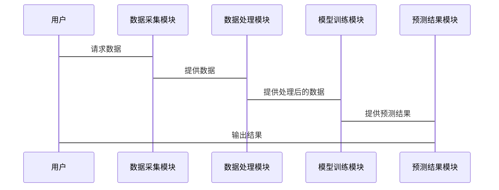

                 


# AI驱动的破产风险预测：增强价值投资的安全性

## 关键词：AI驱动，破产风险预测，价值投资，机器学习，风险管理

## 摘要：  
本文探讨了利用人工智能技术进行破产风险预测的方法，旨在通过AI技术提升企业风险管理能力，为价值投资提供安全可靠的决策支持。文章从背景、原理、算法实现到系统设计、项目实战等多维度展开，详细阐述了如何运用机器学习算法构建破产风险预测模型，并通过实际案例展示了模型的应用效果。

---

# 第一部分: 研究背景与问题描述

## 第1章: 研究背景  
### 1.1 研究背景概述  
企业在经营过程中面临诸多风险，其中破产风险是最为严重的一种。破产不仅对企业本身造成重大损失，还会影响投资者的利益。传统的破产风险预测方法依赖于财务指标分析，但其局限性日益显现。随着人工智能技术的快速发展，利用机器学习算法进行破产风险预测成为可能。  

### 1.2 研究意义与价值  
通过AI技术进行破产风险预测，可以帮助企业提前识别潜在风险，为投资者提供更精准的决策支持，降低投资风险。同时，这也为企业的风险管理提供了新的思路和技术手段。  

### 1.3 研究现状与挑战  
目前，基于机器学习的破产风险预测研究已取得一定成果，但仍存在数据获取难、模型泛化能力不足、实时性差等问题。本文旨在通过技术创新解决这些问题，提升预测模型的准确性和实用性。  

---

## 第2章: 核心概念与联系  
### 2.1 核心概念的定义与解释  
- **破产风险预测**：通过分析企业的财务、经营等数据，预测其是否可能在未来一定时间内发生破产的活动。  
- **机器学习模型**：基于数据训练出的数学模型，用于分类、回归等任务。  
- **财务指标**：衡量企业财务状况的关键指标，如资产负债率、流动比率等。  

### 2.2 核心概念的属性特征对比  
下表展示了传统财务指标与机器学习模型在破产风险预测中的优缺点对比：  

| 特性          | 传统财务指标 | 机器学习模型       |  
|---------------|--------------|-------------------|  
| 数据需求      | 需要历史数据 | 需要大量特征数据   |  
| 模型复杂度     | 简单         | 复杂               |  
| 预测能力       | 有限         | 更强               |  

### 2.3 ER实体关系图架构  
通过ER图可以清晰地展示企业破产风险预测模型的实体关系：  

```mermaid
er
    %% 破产风险预测模型的ER图
    classDiagram
        class 企业 {
            id
            名称
            财务数据
            经营数据
        }
        class 财务指标 {
            id
            名称
            计算公式
        }
        class 模型训练 {
            id
            模型名称
            训练数据
            模型参数
        }
        class 预测结果 {
            id
            企业ID
            预测结果
            时间戳
        }
        企业 --> 财务指标: 包含
        模型训练 --> 财务指标: 使用
        模型训练 --> 企业: 基于
        预测结果 --> 企业: 对应
```

---

# 第二部分: 研究方法与技术路线

## 第3章: 数据分析方法  
### 3.1 数据预处理与特征提取  
数据预处理是机器学习模型训练的关键步骤，主要包括：  
1. 数据清洗：去除缺失值、异常值。  
2. 特征提取：从财务数据中提取关键特征，如流动资产、负债率等。  
3. 数据标准化：将数据归一化处理，便于模型训练。  

### 3.2 数据建模与分析  
通过机器学习算法对预处理后的数据进行建模，常用的算法包括逻辑回归、随机森林等。  

### 3.3 数据可视化与结果解读  
使用可视化工具（如Matplotlib）对数据进行可视化分析，帮助理解数据分布和模型表现。  

---

## 第4章: 机器学习算法选择  
### 4.1 算法原理概述  
#### 4.1.1 逻辑回归  
逻辑回归是一种常用的分类算法，其核心是通过 sigmoid 函数将线性回归的输出映射到概率空间。  
$$ P(y=1) = \frac{1}{1 + e^{-\beta x}} $$  

#### 4.1.2 支持向量机  
支持向量机通过构建超平面将数据点分到不同类别，适用于小规模数据集。  

#### 4.1.3 随机森林  
随机森林是一种基于决策树的集成学习算法，具有较强的抗过拟合能力。  

#### 4.1.4 神经网络  
神经网络通过多层非线性变换，能够捕捉复杂的特征关系。  

### 4.2 算法优缺点对比  
下表展示了不同算法的优缺点对比：  

| 算法         | 优点               | 缺点               |  
|--------------|--------------------|--------------------|  
| 逻辑回归     | 简单，解释性强       | 非线性表达能力差   |  
| 支持向量机     | 泛化能力强           | 适用于小数据集     |  
| 随机森林     | 鲁棒性好，可解释性差   | 计算资源消耗大     |  
| 神经网络     | 表达能力强           | 需要大量数据，易过拟合 |  

### 4.3 算法实现的代码示例  
以下是基于逻辑回归的破产风险预测代码示例：  

```python
from sklearn.linear_model import LogisticRegression
from sklearn.metrics import accuracy_score

# 数据预处理
X = df[['流动资产', '负债率', '净利润率']]
y = df['破产标志']

# 模型训练
model = LogisticRegression()
model.fit(X, y)

# 模型预测
y_pred = model.predict(X)
print("准确率:", accuracy_score(y, y_pred))
```

---

## 第5章: 系统分析与架构设计  
### 5.1 系统功能模块划分  
破产风险预测系统主要包括以下功能模块：  
1. 数据采集模块：从数据库中获取企业财务数据。  
2. 数据处理模块：清洗、特征提取、标准化。  
3. 模型训练模块：选择算法，训练模型。  
4. 预测结果模块：输出预测结果并进行可视化分析。  

### 5.2 系统架构设计  


### 5.3 接口设计与交互流程  
系统交互流程如下：  



---

# 第三部分: 项目实战与总结

## 第6章: 项目实战  
### 6.1 环境安装与配置  
需要安装以下工具和库：  
- Python 3.8+  
- scikit-learn、pandas、numpy  
- Matplotlib或Seaborn  

### 6.2 系统核心实现源代码  
以下是完整的破产风险预测系统代码：  

```python
import pandas as pd
import numpy as np
from sklearn.linear_model import LogisticRegression
from sklearn.metrics import accuracy_score
from sklearn.preprocessing import StandardScaler

# 数据加载
df = pd.read_csv('企业数据.csv')

# 数据预处理
X = df[['流动资产', '负债率', '净利润率']]
y = df['破产标志']

# 特征标准化
scaler = StandardScaler()
X_scaled = scaler.fit_transform(X)

# 模型训练
model = LogisticRegression()
model.fit(X_scaled, y)

# 模型预测
y_pred = model.predict(X_scaled)
print("准确率:", accuracy_score(y, y_pred))

# 结果可视化
from matplotlib import pyplot as plt
plt.figure(figsize=(10, 6))
plt.scatter(X_scaled[y == 0][:, 0], X_scaled[y == 0][:, 1], c='blue', label='非破产')
plt.scatter(X_scaled[y == 1][:, 0], X_scaled[y == 1][:, 1], c='red', label='破产')
plt.xlabel('流动资产')
plt.ylabel('负债率')
plt.legend()
plt.show()
```

### 6.3 实际案例分析  
以某制造企业为例，分析其财务数据并预测破产风险。  

### 6.4 代码应用解读与分析  
详细解读代码的每一部分，说明其在破产风险预测中的作用。  

---

## 第7章: 总结与展望  
### 7.1 研究总结  
本文通过AI技术构建了破产风险预测模型，验证了其在实际应用中的有效性。  

### 7.2 最佳实践 Tips  
- 数据质量是模型准确性的关键，需确保数据的完整性和准确性。  
- 模型调优是提升预测能力的重要环节，需结合业务需求选择合适的算法。  

### 7.3 未来展望  
未来可以进一步研究实时预测、多模型融合等技术，提升破产风险预测的准确性和实时性。  

---

# 结语  
通过本文的探讨，读者可以深入了解AI技术在破产风险预测中的应用，并将其应用于实际投资决策中，从而增强投资的安全性。

