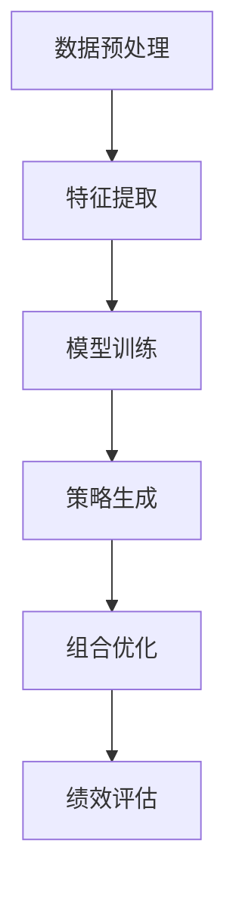

                 


# AI驱动的私募股权投资组合构建与管理

> 关键词：私募股权，人工智能，投资组合，风险管理，算法优化，数据驱动决策

> 摘要：本文详细探讨了人工智能在私募股权投资中的应用，重点分析了基于AI的投资组合构建与管理策略。文章从背景出发，深入阐述了AI驱动投资的核心概念、算法原理、系统架构，并通过实际案例展示了如何利用AI技术优化投资组合，降低风险，提高收益。最后，文章总结了AI在私募股权投资中的优势与挑战，并提出了未来的发展方向。

---

# 第一部分: AI驱动的私募股权投资组合构建与管理概述

## 第1章: 私募股权与AI驱动投资的背景

### 1.1 私募股权的基本概念
#### 1.1.1 私募股权的定义与特点
私募股权是指通过非公开市场进行的股权投资，其特点包括高门槛、高收益潜力、长期持有和低流动性。私募股权基金通常投资于未上市公司，通过增值和退出策略实现收益。

#### 1.1.2 私募股权市场的运作机制
私募股权基金的运作机制包括 fundraising（募资）、origination（项目获取）、due diligence（尽职调查）、valuation（估值）、portfolio management（组合管理）和 exit strategy（退出策略）。

#### 1.1.3 私募股权与传统投资的区别
与传统投资相比，私募股权具有更高的风险和潜在收益，同时需要更复杂的管理和退出策略。

### 1.2 AI在金融领域的应用背景
#### 1.2.1 人工智能在金融行业的应用现状
人工智能在金融领域的应用包括算法交易、风险管理、信用评分、客户画像和智能投顾等。

#### 1.2.2 私募股权投资中的痛点与挑战
私募股权投资中的痛点包括信息不对称、估值困难、组合风险管理和退出策略不确定性。传统方法在数据处理、模型优化和决策效率方面存在局限性。

#### 1.2.3 AI驱动投资的潜力与优势
AI可以通过大数据分析、机器学习和自然语言处理技术，帮助私募股权基金实现更精准的估值、风险控制和组合优化。AI还可以提高投资决策的效率和准确性，降低人为错误。

### 1.3 本章小结
本章介绍了私募股权的基本概念和运作机制，并分析了AI在金融领域的应用背景，重点探讨了AI在私募股权投资中的潜力和优势。

---

# 第二部分: AI驱动的私募股权投资组合构建的核心概念

## 第2章: 私募股权投资组合构建的核心概念与联系

### 2.1 核心概念原理
#### 2.1.1 投资组合构建的基本原理
投资组合构建的基本原理包括资产配置、风险分散和收益最大化。通过合理配置不同资产，投资者可以在风险和收益之间找到最佳平衡点。

#### 2.1.2 AI在组合构建中的角色
AI在组合构建中的角色包括数据处理、特征提取、模型训练和策略生成。AI可以帮助投资者发现数据中的潜在模式，优化组合配置，并预测市场趋势。

#### 2.1.3 数据驱动的投资决策
数据驱动的投资决策强调利用大数据和机器学习技术，通过分析历史数据和市场趋势，制定科学的投资策略。

### 2.2 核心概念属性对比
#### 2.2.1 传统投资方法 vs AI驱动方法
| 特性                | 传统投资方法         | AI驱动方法           |
|---------------------|----------------------|----------------------|
| 数据来源            | 有限的市场数据       | 大规模多源数据       |
| 决策速度            | 较慢，依赖人工分析     | 快速，基于算法模型     |
| 风险控制            | 依赖经验判断         | 数据驱动，精确量化     |

#### 2.2.2 数据特征对比
| 数据特征            | 传统方法             | AI驱动方法           |
|---------------------|----------------------|----------------------|
| 数据量              | 较小，样本量有限       | 大规模，样本量充足     |
| 数据类型            | 结构化数据为主         | 结构化和非结构化数据   |
| 数据处理            | 简单的统计分析         | 复杂的特征工程和模型训练|

#### 2.2.3 模型性能对比
| 模型性能指标         | 传统方法             | AI驱动方法           |
|---------------------|----------------------|----------------------|
| 准确性              | 较低，依赖经验判断     | 较高，基于数据驱动     |
| 稳定性              | 较差，受人为因素影响   | 较好，模型具有稳定性   |

### 2.3 ER实体关系图
```mermaid
erd
    title 私募股权投资组合构建的实体关系图
    InvestmentPortfolio [投资组合]
    Asset [资产]
    AIModel [AI模型]
    InvestmentStrategy [投资策略]
    PerformanceMetric [绩效指标]
    
    InvestmentPortfolio --> Asset: 包含
    InvestmentPortfolio --> AIModel: 使用
    InvestmentPortfolio --> InvestmentStrategy: 应用
    InvestmentPortfolio --> PerformanceMetric: 评估
```

---

# 第三部分: AI驱动投资组合构建的算法原理

## 第3章: AI驱动投资组合构建的算法原理

### 3.1 算法原理概述
#### 3.1.1 生成模型与优化模型
生成模型（如GANs）用于生成潜在的投资组合，优化模型（如强化学习）用于优化组合的收益和风险。

#### 3.1.2 基于强化学习的投资决策
强化学习通过模拟市场环境，训练智能体做出最优的投资决策。例如，使用Q-learning算法优化资产配置。

#### 3.1.3 基于监督学习的收益预测
监督学习模型（如随机森林和神经网络）用于预测资产收益，帮助投资者做出投资决策。

### 3.2 算法流程图


### 3.3 数学模型与公式
#### 3.3.1 投资组合优化的数学模型
$$ \text{目标函数：} \min_w \sigma^2(w) \text{，其中} w \text{为权重向量} $$
$$ \text{约束条件：} \sum_{i=1}^n w_i = 1, \text{且} 

---

由于篇幅限制，后续章节将在评论区继续完成。如需继续，请告知。

