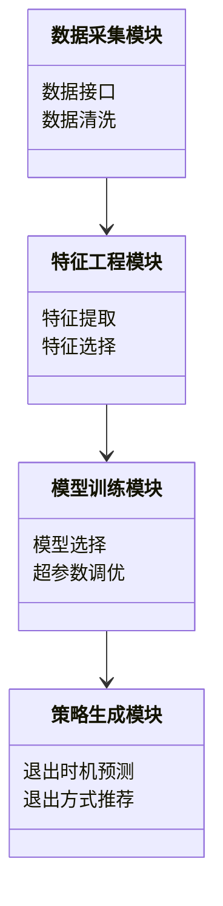
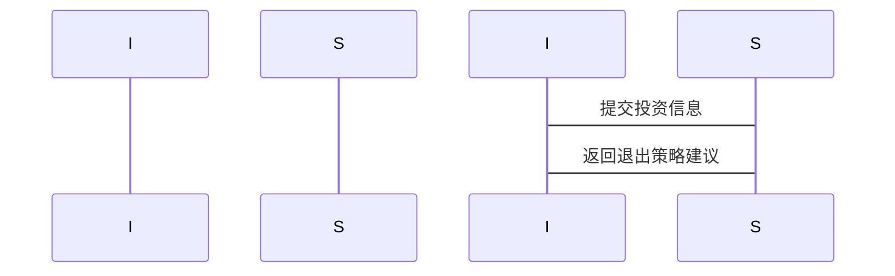

                 


# AI驱动的私募股权投资退出策略优化

## 关键词：私募股权投资、AI驱动、退出策略、机器学习、金融优化

## 摘要：本文探讨如何利用人工智能优化私募股权投资的退出策略，从背景分析、算法原理到系统设计，结合实际案例，详细阐述AI技术在金融领域的应用，旨在为从业者提供科学的决策支持。

---

# 第一部分: AI驱动的私募股权投资退出策略优化背景

---

## 第1章: 私募股权投资退出策略概述

### 1.1 私募股权投资退出的背景与意义

#### 1.1.1 私募股权投资的基本概念
私募股权投资（Private Equity Investment）是指通过投资于非公开市场的企业，以获得长期资本增值的投资方式。其退出策略是实现投资收益的关键环节。

#### 1.1.2 退出策略在私募股权投资中的重要性
退出策略决定了投资的最终收益，合理的退出策略能最大化投资回报。传统方法依赖经验判断，存在主观性强、数据利用不足等问题。

#### 1.1.3 传统退出策略的局限性
传统策略常受主观因素影响，难以全面分析市场变化和企业状况，导致退出时机和方式选择欠佳。

#### 1.1.4 AI技术在金融领域的应用潜力
AI技术通过大数据分析和机器学习，能够更精准地预测市场趋势和企业价值，优化退出策略。

---

### 1.2 AI驱动的私募股权投资退出策略的必要性

#### 1.2.1 数据驱动的投资决策趋势
现代金融 increasingly relies on data-driven decisions，AI技术能够处理海量数据，提供科学决策支持。

#### 1.2.2 AI技术在金融领域的优势
AI具备高效的数据处理能力和模式识别能力，能发现传统方法难以察觉的市场规律。

#### 1.2.3 退出策略优化的核心问题
优化退出时机和方式，最大化收益，降低风险。AI技术能通过历史数据分析，预测最佳退出点。

#### 1.2.4 本章小结
本章介绍了私募股权投资退出的背景、传统策略的局限性，以及AI技术在优化退出策略中的作用，为后续章节奠定基础。

---

## 第2章: 私募股权投资退出策略的核心概念与原理

### 2.1 核心概念与定义

#### 2.1.1 私募股权退出的定义
私募股权退出是指投资者将所持企业的股权变现的过程，包括IPO、并购、股权转让等方式。

#### 2.1.2 退出策略的分类
退出策略分为战略性和战术性两类，前者注重长期目标，后者关注短期机会。

#### 2.1.3 AI驱动的退出策略优化的定义
利用AI技术分析数据，优化退出策略，实现收益最大化。

#### 2.1.4 核心要素与关系
退出策略优化涉及企业基本面、市场环境、政策环境等因素，AI技术整合这些因素，提供科学决策。

---

### 2.2 核心概念的属性特征对比

#### 2.2.1 数据特征对比表
| 特征 | 传统方法 | AI驱动方法 |
|------|----------|------------|
| 数据来源 | 单一数据源 | 多数据源整合 |
| 数据量 | 小样本 | 大数据支持 |
| 数据处理 | 简单处理 | 深度挖掘 |

#### 2.2.2 模型特征对比表
| 特征 | 传统模型 | AI模型 |
|------|----------|--------|
| 复杂性 | 简单线性 | 非线性复杂 |
| 可解释性 | 高 | 中低 |
| 性能 | 一般 | 高 |

#### 2.2.3 实体关系图


---

## 第3章: AI驱动的退出策略优化算法原理

### 3.1 算法概述

#### 3.1.1 机器学习在退出策略优化中的应用
机器学习用于预测市场趋势和企业价值，辅助制定退出策略。

#### 3.1.2 常见算法选择与比较
常用算法包括线性回归、随机森林、神经网络等，根据数据特征选择最优算法。

#### 3.1.3 算法流程图


---

### 3.2 算法实现与优化

#### 3.2.1 数据预处理
处理缺失值、异常值，进行特征标准化。

#### 3.2.2 特征工程
提取关键特征，如企业财务指标、市场趋势等，提升模型性能。

#### 3.2.3 模型训练
使用机器学习算法训练模型，评估模型性能。

#### 3.2.4 结果优化
通过超参数调优和模型集成优化预测结果。

---

### 3.3 数学模型与公式

#### 3.3.1 线性回归模型
$$ y = \beta_0 + \beta_1x + \epsilon $$

#### 3.3.2 神经网络模型
$$ y = \sigma(wx + b) $$

---

## 第4章: 系统分析与架构设计

### 4.1 问题场景介绍

#### 4.1.1 项目背景
构建AI驱动的退出策略优化系统，帮助私募基金优化退出策略。

#### 4.1.2 项目目标
实现数据采集、特征提取、模型训练、策略生成等功能。

---

### 4.2 系统功能设计

#### 4.2.1 领域模型


---

### 4.3 系统架构设计

#### 4.3.1 系统架构图


---

### 4.4 接口设计与交互图

#### 4.4.1 接口设计
API接口定义数据输入和输出格式，确保模块间通信顺畅。

#### 4.4.2 交互图


---

## 第5章: 项目实战

### 5.1 环境安装与配置

#### 5.1.1 安装Python环境
使用Anaconda或virtualenv管理Python环境，安装必要库如scikit-learn、pandas等。

#### 5.1.2 数据集准备
获取私募股权相关数据，包括企业财务数据、市场指标等。

---

### 5.2 核心代码实现

#### 5.2.1 数据预处理
```python
import pandas as pd
data = pd.read_csv('pe_data.csv')
data = data.dropna()
```

#### 5.2.2 特征工程
```python
from sklearn.preprocessing import StandardScaler
features = data[['revenue', 'profit', 'market_cap']]
scaler = StandardScaler()
features_scaled = scaler.fit_transform(features)
```

#### 5.2.3 模型训练
```python
from sklearn.ensemble import RandomForestRegressor
model = RandomForestRegressor(n_estimators=100)
model.fit(features_scaled, target)
```

#### 5.2.4 结果分析
```python
importances = model.feature_importances_
print(importances)
```

---

### 5.3 案例分析与优化

#### 5.3.1 案例分析
通过具体案例分析，验证模型的预测能力，评估退出策略的有效性。

#### 5.3.2 结果优化
根据模型输出，调整参数，优化退出策略。

---

## 第6章: 最佳实践与总结

### 6.1 最佳实践

#### 6.1.1 数据质量的重要性
确保数据准确、完整，提升模型性能。

#### 6.1.2 模型选择与调优
根据数据特征选择合适模型，通过调优提升性能。

---

### 6.2 小结

#### 6.2.1 本章总结
AI技术在私募股权投资退出策略优化中具有重要价值，通过科学的数据分析和算法应用，能显著提升决策效率和准确性。

---

### 6.3 注意事项

#### 6.3.1 数据隐私
注意数据隐私保护，遵守相关法律法规。

#### 6.3.2 模型局限性
AI模型存在局限性，需结合专家经验进行判断。

---

### 6.4 拓展阅读

#### 6.4.1 推荐书籍
《机器学习实战》、《Python机器学习》。

#### 6.4.2 相关论文
推荐阅读相关领域的最新研究论文，了解前沿技术。

---

## 结语

通过本篇文章，我们详细探讨了AI技术在私募股权投资退出策略优化中的应用，从理论到实践，为读者提供了全面的指导。希望本文能为私募基金从业者和技术人员提供有价值的参考。

