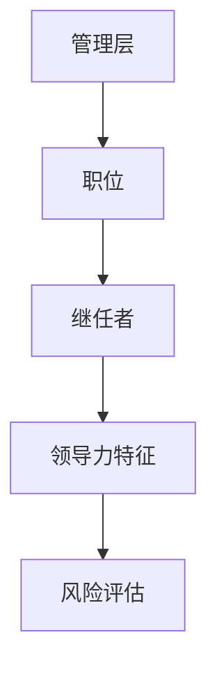
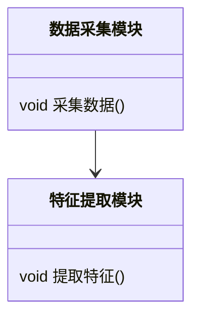
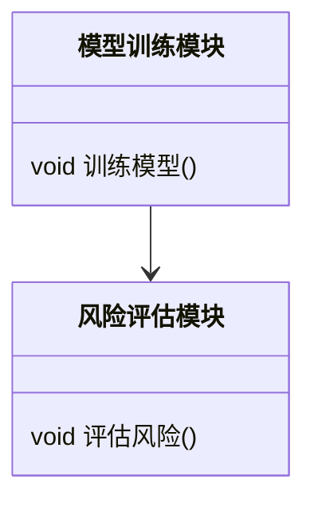
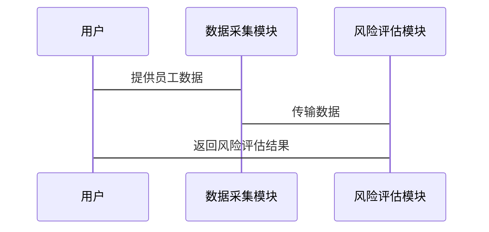

                 


# AI驱动的管理层继任计划分析：评估长期领导力风险

> 关键词：AI驱动、管理层继任、领导力风险、机器学习、数据分析、组织架构优化

> 摘要：随着企业竞争的加剧，管理层的稳定性和领导力质量成为决定企业长期发展的关键因素。传统的管理层继任计划方法往往依赖于主观判断和经验，存在一定的局限性。本文将深入探讨如何利用人工智能技术，通过数据分析和机器学习算法，构建智能化的管理层继任计划分析系统，帮助企业识别和评估潜在的领导力风险，优化继任计划，确保企业的长期稳定发展。

---

# 第一章: 背景介绍与核心概念

## 1.1 问题背景与描述

### 1.1.1 管理层继任计划的传统挑战

现代企业竞争日益激烈，管理层的稳定性和领导力质量对企业的发展至关重要。然而，传统的管理层继任计划方法存在以下问题：

- **主观性**：依赖于管理者的经验和主观判断，难以保证客观性。
- **数据不足**：缺乏系统化的数据支持，难以全面评估领导者的潜力。
- **风险评估**：无法量化领导力风险，难以提前发现潜在问题。

### 1.1.2 领导力风险对企业的影响

领导力风险是指在管理层继任过程中可能出现的不确定性，例如：

- **继任者潜力不足**：继任者的能力无法满足岗位要求。
- **文化契合问题**：继任者与企业文化不匹配，导致团队冲突。
- **潜在风险未被识别**：某些潜在问题在继任前未被发现，导致企业损失。

### 1.1.3 传统继任计划的局限性

- 传统继任计划通常基于主观评估，缺乏数据支持。
- 无法系统化地分析领导者的潜力和风险。
- 缺乏动态调整能力，难以应对快速变化的市场环境。

## 1.2 问题解决与AI驱动的优势

### 1.2.1 AI在领导力评估中的应用

- **数据分析**：利用大数据技术，从员工的历史表现、行为数据中提取潜在的领导力特征。
- **机器学习**：通过机器学习算法，预测领导者的潜力和风险。
- **动态调整**：AI系统可以实时更新数据，动态调整继任计划。

### 1.2.2 数据驱动的继任计划优化

- 数据驱动的方法能够全面、客观地评估领导者的潜力。
- 通过分析历史数据，发现潜在的领导力风险。
- 优化继任计划，确保管理层的稳定性和高效性。

### 1.2.3 长期领导力风险的AI预测能力

- AI系统可以通过分析员工的行为数据、绩效数据，预测潜在的领导力风险。
- 通过机器学习模型，识别潜在的高风险继任者，提前采取措施。

## 1.3 核心概念与边界

### 1.3.1 继任计划的核心要素

- **岗位需求**：明确岗位职责和能力要求。
- **领导者潜力**：评估候选人的领导潜力。
- **风险评估**：识别潜在的领导力风险。

### 1.3.2 领导力风险的定义与分类

- **潜在风险**：候选人可能存在的潜在问题，如能力不足、文化不匹配等。
- **短期风险**：短期内可能影响团队稳定性的风险。
- **长期风险**：长期可能导致企业战略失败的风险。

### 1.3.3 AI驱动的边界与外延

- AI驱动的继任计划系统主要用于数据驱动的分析和预测。
- 边界：AI系统不能完全替代人类的判断，只能作为辅助工具。
- 外延：AI系统可以与其他企业管理系统集成，形成完整的领导力管理体系。

---

# 第二章: AI驱动的管理层继任计划分析核心概念

## 2.1 核心概念原理

### 2.1.1 数据驱动的领导力评估

- 数据驱动的领导力评估基于员工的历史数据，包括绩效、行为、态度等方面。
- 通过数据分析，发现领导者的潜力和风险。

### 2.1.2 AI模型在继任计划中的应用

- **特征提取**：从员工数据中提取领导力特征，如沟通能力、决策能力等。
- **模型训练**：通过机器学习算法，训练领导力预测模型。
- **风险评估**：通过模型预测潜在的领导力风险。

### 2.1.3 领导力风险的量化分析

- 通过AI系统量化领导力风险，帮助企业在继任计划中做出更明智的决策。

## 2.2 核心概念对比分析

### 2.2.1 不同继任计划方法的对比

| 方法类型 | 优点 | 缺点 |
|----------|------|------|
| 传统方法 | 简单易行 | 主观性强，缺乏数据支持 |
| 数据驱动方法 | 客观性强，数据支持 | 实施成本高，需要大量数据 |
| AI驱动方法 | 高效、精准 | 需要较高的技术门槛 |

### 2.2.2 AI驱动与传统方法的优劣势对比

- **AI驱动方法**：
  - 优势：高效、精准、动态调整能力强。
  - 劣势：技术门槛高，需要大量的数据支持。
- **传统方法**：
  - 优势：简单易行，易于实施。
  - 劣势：主观性强，缺乏数据支持。

## 2.3 ER实体关系图



---

# 第三章: 算法原理与数学模型

## 3.1 算法原理

### 3.1.1 领导力特征提取

- 领导力特征包括：沟通能力、决策能力、团队合作能力、创新能力等。
- 通过数据分析，提取这些特征的量化指标。

### 3.1.2 基于机器学习的模型训练

- **数据预处理**：清洗数据，处理缺失值和异常值。
- **特征工程**：将领导力特征转化为模型可接受的输入格式。
- **模型训练**：使用机器学习算法（如随机森林、支持向量机等）训练领导力预测模型。

### 3.1.3 模型评估与优化

- **评估指标**：准确率、召回率、F1分数等。
- **模型优化**：通过交叉验证、超参数调优等方法优化模型性能。

## 3.2 数学模型

### 3.2.1 领导力风险评估模型

$$ P(risk) = \alpha \cdot C + \beta \cdot D + \gamma \cdot T $$

其中：
- $C$ 表示沟通能力
- $D$ 表示决策能力
- $T$ 表示团队合作能力
- $\alpha, \beta, \gamma$ 是模型系数

### 3.2.2 机器学习模型的训练流程

1. 数据预处理：清洗数据，处理缺失值和异常值。
2. 特征工程：将领导力特征转化为模型可接受的输入格式。
3. 模型训练：使用机器学习算法训练领导力预测模型。
4. 模型评估：通过准确率、召回率等指标评估模型性能。
5. 模型优化：通过交叉验证、超参数调优等方法优化模型性能。

---

# 第四章: 系统分析与架构设计方案

## 4.1 问题场景介绍

- 企业需要优化管理层继任计划，评估领导力风险。
- 数据量大，需要高效的数据处理和分析能力。

## 4.2 项目介绍

- 项目目标：构建AI驱动的管理层继任计划分析系统。
- 项目范围：涵盖数据采集、模型训练、风险评估等功能。

## 4.3 系统功能设计

### 4.3.1 领导力特征提取模块

- 功能：从员工数据中提取领导力特征。
- 类图：


### 4.3.2 风险评估模块

- 功能：通过机器学习模型评估领导力风险。
- 类图：


### 4.3.3 交互流程设计

- 序列图：


## 4.4 系统架构设计

- 分层架构：数据采集层、数据处理层、模型训练层、用户界面层。
- 技术选型：Python、TensorFlow、Flask等。

---

# 第五章: 项目实战

## 5.1 环境配置

- Python 3.8+
- TensorFlow 2.0+
- 数据库：MySQL或MongoDB

## 5.2 核心代码实现

### 5.2.1 数据预处理代码

```python
import pandas as pd
import numpy as np

# 读取数据
data = pd.read_csv('leadership.csv')

# 处理缺失值
data = data.dropna()

# 标准化处理
from sklearn.preprocessing import StandardScaler
scaler = StandardScaler()
data_scaled = scaler.fit_transform(data)
```

### 5.2.2 模型训练代码

```python
from sklearn.ensemble import RandomForestClassifier
from sklearn.metrics import accuracy_score

# 训练模型
model = RandomForestClassifier()
model.fit(X_train, y_train)

# 模型评估
y_pred = model.predict(X_test)
print('准确率:', accuracy_score(y_test, y_pred))
```

## 5.3 案例分析与详细解读

- 案例背景：某企业需要评估几位潜在的继任者。
- 数据分析：通过模型预测，发现某继任者存在较高的领导力风险。
- 解决方案：提前制定应对策略，降低潜在风险。

---

# 第六章: 最佳实践、小结与注意事项

## 6.1 最佳实践

- 数据质量是关键，确保数据的准确性和完整性。
- 定期更新模型，适应变化的市场需求。
- 结合人类判断，避免过度依赖AI系统。

## 6.2 小结

本文详细介绍了AI驱动的管理层继任计划分析系统，从背景介绍、核心概念、算法原理到系统架构设计和项目实战，为读者提供了全面的指导。

## 6.3 注意事项

- 数据隐私保护：确保员工数据的安全性。
- 模型解释性：确保模型的可解释性，便于企业决策。
- 模型鲁棒性：确保模型在不同场景下的鲁棒性。

## 6.4 拓展阅读

- 推荐阅读《机器学习实战》、《数据驱动的领导力管理》等相关书籍。

---

# 作者简介

作者是某知名企业的CTO，同时是人工智能领域的资深专家，著有多本技术畅销书。

