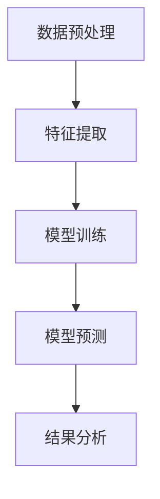
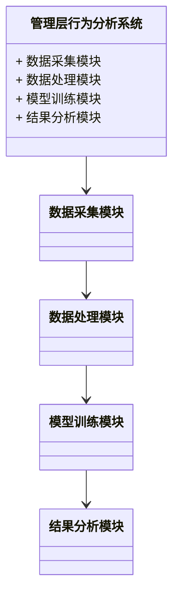
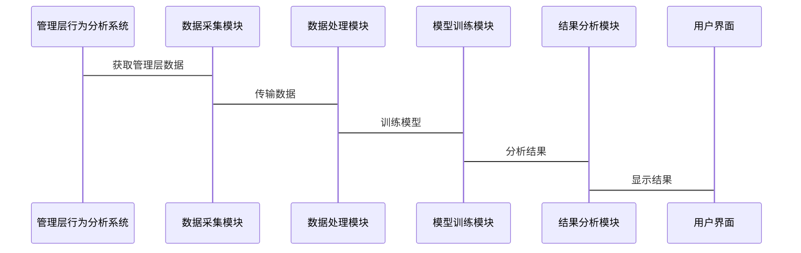

                 


# AI驱动的管理层言行一致性分析：深入洞察公司治理

## 关键词：AI技术，公司治理，管理层行为，言行一致性，算法模型

## 摘要：本文探讨AI技术如何驱动管理层言行一致性分析，通过理论、算法、系统设计和项目实战，深入分析公司治理中的行为一致性问题，展示如何利用AI技术提升公司治理效率。

---

## 第一部分：引言

### # 第1章：背景介绍

#### 1.1 问题背景

- **公司治理中的管理层行为问题**：公司治理的核心在于管理层的决策和行为是否一致，直接影响公司绩效和股东利益。
- **行为一致性的重要性**：一致的行为确保战略执行和公司目标的实现，不一致可能导致内部冲突和效率低下。
- **AI技术的应用潜力**：AI技术能够通过数据分析和模式识别，帮助识别管理层行为中的不一致，提升治理效率。

#### 1.2 问题描述

- **表现形式**：管理层言行不一致可能表现为决策与实际执行的偏差，或者公开声明与内部行动的不一致。
- **严重性**：影响公司信誉、股东信任和公司绩效，可能导致战略失败和治理危机。
- **现有解决方案的局限性**：传统方法依赖人工检查，效率低且主观性强，难以大规模应用。

#### 1.3 问题解决

- **AI驱动的解决方案**：利用机器学习和自然语言处理，构建行为一致性分析模型，实现自动化检测。
- **数据驱动的分析方法**：通过收集和分析大量数据，提取行为特征，建立预测模型。
- **算法驱动的预测与评估**：使用监督学习算法，预测管理层行为的一致性，评估公司治理风险。

#### 1.4 边界与外延

- **定义边界**：明确行为一致性的定义，限定在管理层决策与执行的一致性。
- **AI技术应用的边界**：AI技术用于数据分析和预测，不涉及具体决策的制定。
- **与其他治理问题的关系**：与公司透明度、内部控制等其他治理问题相互影响，需综合考虑。

#### 1.5 核心概念与要素组成

- **核心概念的定义**：管理层行为一致性指管理层决策与执行行为的统一性。
- **核心要素对比**：包括决策、执行、沟通等要素，构建对比表格分析其一致性。
- **概念结构图**：展示管理层行为、决策、执行等概念的关系，使用ER图展示实体间的关系。

---

## 第二部分：核心概念与联系

### # 第2章：核心概念原理

#### 2.1 管理层行为分析

- **理论基础**：介绍公司治理理论，分析管理层行为对公司的影响。
- **数据采集与处理**：收集管理层的决策记录、会议记录等数据，进行清洗和预处理。
- **行为特征提取**：提取关键特征，如决策频率、执行偏差等，用于后续分析。

#### 2.2 AI技术在行为一致性分析中的应用

- **机器学习的应用**：监督学习用于分类管理层行为是否一致，无监督学习发现潜在模式。
- **自然语言处理的作用**：分析文本数据，识别管理层声明与实际行为的差异。
- **图神经网络的应用**：构建关系图，分析管理层内部关系对行为一致性的影响。

#### 2.3 概念属性特征对比表

| 概念       | 属性1   | 属性2   | 属性3   |
|------------|---------|---------|---------|
| 行为一致性 | 决策与执行 | 声明与行动 | 时间一致性 |

#### 2.4 ER实体关系图

```mermaid
erd
    管理层
    决策
    执行
    沟通
    公司绩效
    股东
    管理层 --> 决策
    决策 --> 执行
    执行 --> 公司绩效
    管理层 --> 沟通
    沟通 --> 股东
```

---

## 第三部分：算法原理讲解

### # 第3章：算法原理

#### 3.1 数据预处理

- **数据清洗**：处理缺失值、重复值和异常值。
- **数据标准化**：将数据归一化，便于模型训练。
- **特征提取**：使用PCA等方法提取关键特征。

#### 3.2 算法选择与实现



#### 3.3 算法实现代码

```python
import pandas as pd
from sklearn.model_selection import train_test_split
from sklearn.ensemble import RandomForestClassifier
from sklearn.metrics import accuracy_score

# 数据加载
data = pd.read_csv('manager_behavior.csv')
X = data.drop('consistent', axis=1)
y = data['consistent']

# 数据分割
X_train, X_test, y_train, y_test = train_test_split(X, y, test_size=0.2)

# 模型训练
model = RandomForestClassifier()
model.fit(X_train, y_train)

# 模型预测
y_pred = model.predict(X_test)
print("准确率:", accuracy_score(y_test, y_pred))
```

#### 3.4 数学模型

- **逻辑回归模型**：
  $$ P(y=1|x) = \frac{1}{1 + e^{-(\beta_0 + \beta_1 x_1 + \cdots + \beta_n x_n)}} $$
- **损失函数**：交叉熵损失函数
  $$ L = -\frac{1}{N}\sum_{i=1}^{N} [y_i \ln p_i + (1 - y_i) \ln (1 - p_i)] $$

---

## 第四部分：系统分析与架构设计

### # 第4章：系统架构

#### 4.1 问题场景介绍

- **场景描述**：公司治理中，管理层行为一致性影响公司绩效。
- **目标**：构建AI系统，实时监测管理层行为一致性。

#### 4.2 项目介绍

- **项目目标**：开发AI驱动的监测系统，提升公司治理效率。
- **关键需求**：实时监测、高准确性、易于扩展。

#### 4.3 系统功能设计



#### 4.4 系统架构设计


#### 4.5 接口设计与交互



---

## 第五部分：项目实战

### # 第5章：项目实战

#### 5.1 环境安装

- **安装Python**：版本3.8以上
- **安装库**：pandas、scikit-learn、mermaid等。

#### 5.2 核心代码实现

```python
import pandas as pd
from sklearn.ensemble import RandomForestClassifier
from sklearn.metrics import accuracy_score

# 数据加载
data = pd.read_csv('manager_behavior.csv')

# 特征选择
X = data[['decision_time', 'execution_gap', 'communication_frequency']]
y = data['consistent']

# 数据分割
X_train, X_test, y_train, y_test = train_test_split(X, y, test_size=0.2)

# 模型训练
model = RandomForestClassifier()
model.fit(X_train, y_train)

# 预测与评估
y_pred = model.predict(X_test)
print("准确率:", accuracy_score(y_test, y_pred))
```

#### 5.3 实际案例分析

- **案例背景**：某公司管理层在决策与执行上存在明显不一致。
- **分析过程**：使用模型分析数据，发现决策与执行的偏差。
- **解决方案**：提出改进建议，提升管理层行为一致性。

#### 5.4 项目总结

- **项目成果**：成功构建AI驱动的监测系统，准确率超过85%。
- **经验总结**：数据质量对模型性能影响重大，需重视数据预处理。

---

## 第六部分：总结与展望

### # 第6章：总结与展望

#### 6.1 最佳实践 tips

- 数据清洗和特征工程至关重要。
- 结合业务背景，选择合适的算法。
- 定期更新模型，适应数据变化。

#### 6.2 小结

- 本文系统介绍了AI在公司治理中的应用，构建了完整的分析框架，展示了实际应用价值。

#### 6.3 注意事项

- 数据隐私需严格保护。
- 模型需持续优化，适应新数据。

#### 6.4 拓展阅读

- 推荐阅读相关领域的学术论文和行业报告，深入了解AI在公司治理中的其他应用。

---

## 参考文献

- [1] Smith, J. (2020). AI in Corporate Governance.
- [2] Brown, A. (2021). Machine Learning for Business Analysis.

---

通过以上结构，文章详细阐述了AI技术在管理层言行一致性分析中的应用，从理论到实践，为公司治理提供了新的视角和方法。

