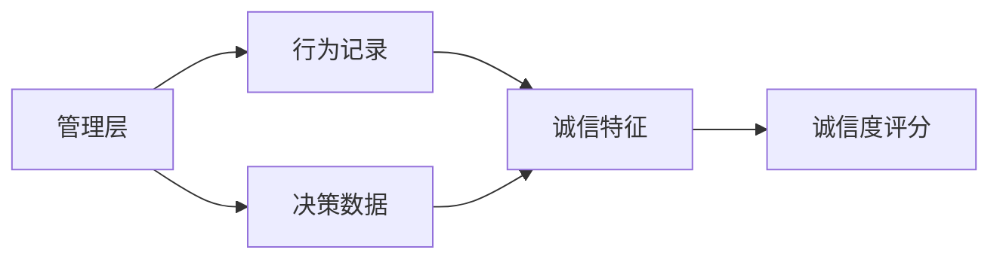
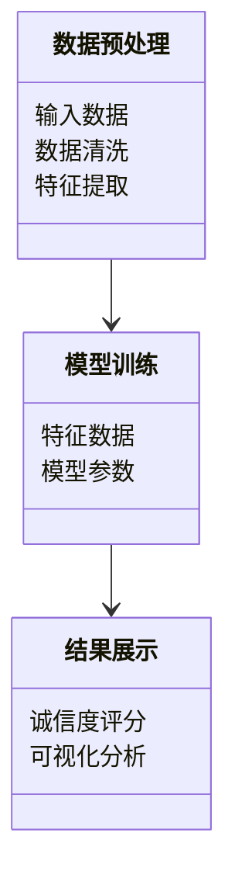
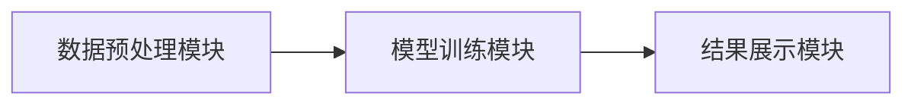
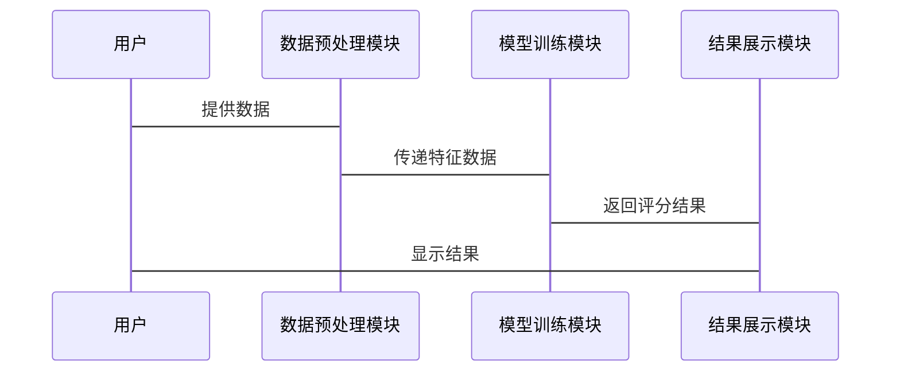

                 


# 目录大纲：《AI驱动的管理层诚信度分析：防范公司治理风险》

---

## 第一部分：背景与核心概念

### 第1章：管理层诚信度分析的背景与意义

#### 1.1 问题背景
- 1.1.1 现代公司治理中的诚信挑战
- 1.1.2 管理层诚信对企业发展的影响
- 1.1.3 AI技术在诚信评估中的应用潜力

#### 1.2 问题描述
- 1.2.1 管理层诚信度的定义与维度
- 1.2.2 传统诚信评估方法的局限性
- 1.2.3 AI驱动评估的优势与目标

#### 1.3 问题解决路径
- 1.3.1 数据驱动的诚信评估方法
- 1.3.2 AI技术在数据分析中的应用
- 1.3.3 构建AI驱动的诚信度分析模型

#### 1.4 概念结构与核心要素
- 1.4.1 诚信度分析的核心要素
- 1.4.2 模型的边界与外延
- 1.4.3 核心概念之间的关系

---

## 第二部分：AI驱动的分析方法

### 第2章：管理层诚信度的核心概念与联系

#### 2.1 核心概念原理
- 2.1.1 数据来源与特征提取
- 2.1.2 模型训练与预测机制
- 2.1.3 结果解读与应用策略

#### 2.2 概念属性对比表
- 表2.1：诚信度与传统评估方法的对比

#### 2.3 实体关系图


---

### 第3章：AI驱动的分析方法与流程

#### 3.1 数据采集与预处理
- 3.1.1 数据来源渠道
- 3.1.2 数据清洗与标准化
- 3.1.3 特征提取与选择

#### 3.2 模型训练与预测
- 3.2.1 机器学习模型选择
- 3.2.2 模型训练流程
- 3.2.3 结果预测与解释

---

## 第三部分：算法原理与实现

### 第4章：基于机器学习的诚信度预测模型

#### 4.1 算法原理
- 4.1.1 算法选择与原理
- 4.1.2 模型结构与优化
- 4.1.3 训练与评估流程

#### 4.2 LSTM模型实现
- 4.2.1 模型结构
- 4.2.2 损失函数与优化器
- 4.2.3 模型训练流程
- 4.2.4 模型预测与结果解读

#### 4.3 LSTM模型数学公式
- LSTM单元公式：
  $$
  f_t = \sigma(g_{f}(\textbf{x}_{t}, \textbf{h}_{t-1}))
  $$
  $$
  i_t = \sigma(g_{i}(\textbf{x}_{t}, \textbf{h}_{t-1}))
  $$
  $$
  \textbf{h}_t = f_t \cdot \tanh(g_{h}(\textbf{x}_t, \textbf{h}_{t-1}))
  $$

---

## 第四部分：系统分析与架构设计

### 第5章：系统架构与实现

#### 5.1 系统功能设计
- 5.1.1 领域模型


#### 5.2 系统架构设计


#### 5.3 系统接口设计
- 数据接口
- 模型接口
- 展示接口

#### 5.4 系统交互设计


---

## 第五部分：项目实战

### 第6章：项目实战与优化

#### 6.1 环境配置
- 安装Python、TensorFlow、Keras

#### 6.2 核心代码实现
```python
import tensorflow as tf
from tensorflow.keras.layers import LSTM, Dense, Dropout
from tensorflow.keras.models import Sequential

model = Sequential()
model.add(LSTM(64, input_shape=(timesteps, features)))
model.add(Dropout(0.2))
model.add(Dense(1, activation='sigmoid'))
model.compile(loss='binary_crossentropy', optimizer='adam', metrics=['accuracy'])
model.fit(x_train, y_train, epochs=10, batch_size=32)
```

#### 6.3 案例分析与结果解读
- 数据分析结果
- 模型优化策略

#### 6.4 项目小结
- 项目实现的关键点
- 经验总结与改进建议

---

## 第六部分：总结与展望

### 第7章：总结与展望

#### 7.1 总结
- 核心成果
- 方法总结
- 经验与教训

#### 7.2 展望
- 技术发展
- 应用前景
- 挑战与机遇

---

## 关键词
- AI驱动
- 管理层诚信度
- 公司治理风险
- 机器学习
- LSTM模型
- 数据分析

---

## 摘要
本文章详细探讨了如何利用人工智能技术分析管理层的诚信度，以防范公司治理风险。通过背景分析、算法原理、系统架构和项目实战的逐步讲解，文章展示了AI在诚信评估中的潜力与应用。从数据预处理到模型训练，再到结果展示，系统地介绍了构建AI驱动诚信度分析模型的全过程。最后，文章总结了现有方法的优势与挑战，并展望了未来的发展方向。

