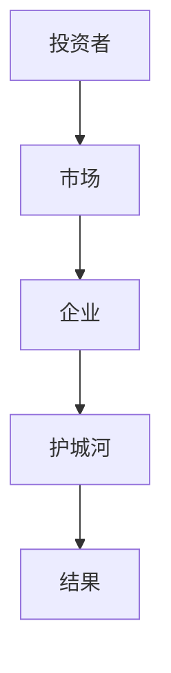
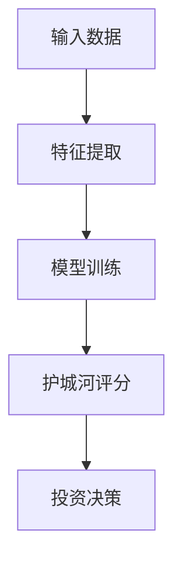
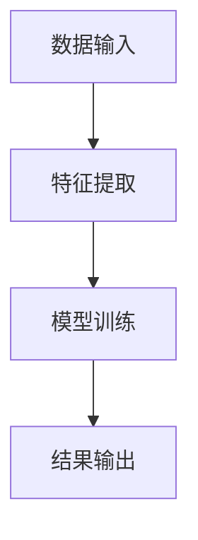
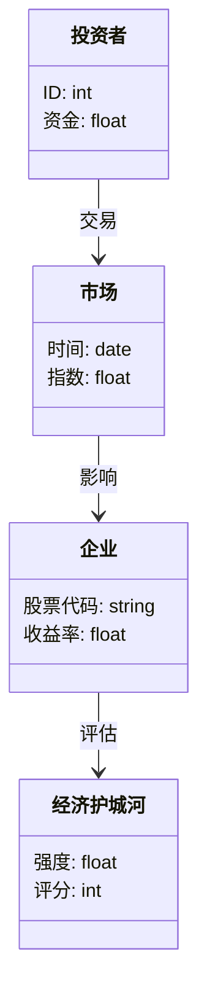
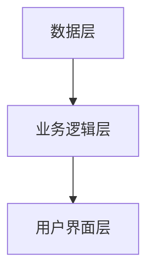
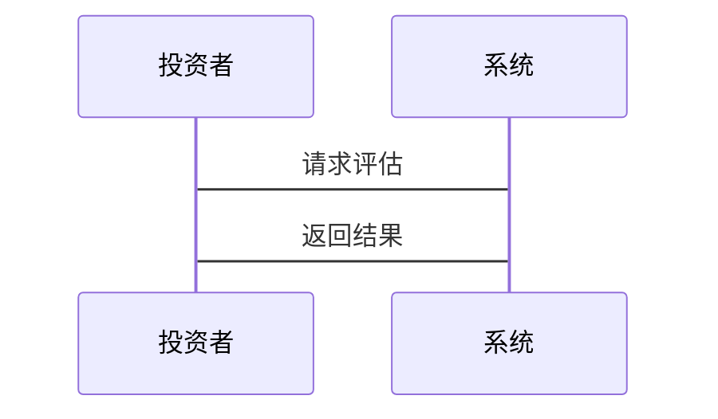
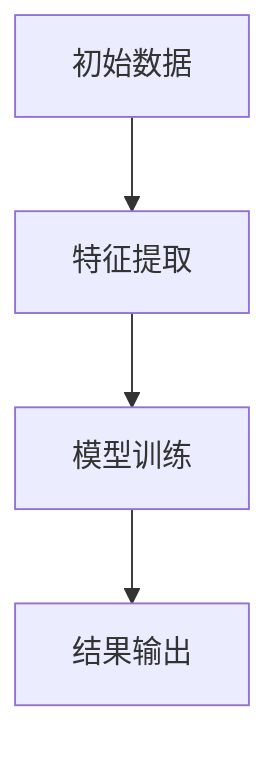

                 


# AI驱动的经济护城河评估：价值投资中的多智能体应用

## 关键词：人工智能，经济护城河，价值投资，多智能体系统，投资分析

## 摘要：  
在当今快速变化的经济环境中，评估企业的经济护城河是价值投资的关键。本文探讨如何利用人工智能（AI）技术，特别是多智能体系统，来构建经济护城河评估模型。通过分析企业竞争壁垒、市场地位、成本优势等关键因素，AI驱动的多智能体系统能够提供更精准的评估，帮助投资者做出更明智的投资决策。文章详细介绍了模型构建、算法原理、系统架构，并通过实际案例展示了AI在价值投资中的应用。

---

# 第1章: 经济护城河与AI驱动投资概述

## 1.1 经济护城河的核心概念  
### 1.1.1 经济护城河的定义与特征  
经济护城河是指企业在竞争市场中建立的长期竞争优势，通常包括专利、品牌忠诚度、成本优势、网络效应等。  

### 1.1.2 经济护城河的分类与评估维度  
- **技术型护城河**：依赖专利和技术壁垒。  
- **品牌型护城河**：依赖强大的品牌影响力。  
- **成本型护城河**：通过规模经济降低成本。  

### 1.1.3 经济护城河与企业竞争优势的关系  
经济护城河是企业抵御竞争的核心能力，决定了企业的长期盈利能力。

## 1.2 AI驱动投资的背景与意义  
### 1.2.1 传统投资分析的局限性  
传统方法依赖主观判断，难以量化和预测市场变化。  

### 1.2.2 AI技术在金融投资中的应用潜力  
AI可以通过大数据分析和机器学习模型，发现隐藏的市场规律。  

### 1.2.3 多智能体系统在经济护城河评估中的优势  
多智能体系统能够模拟市场行为，提供更全面的评估。

## 1.3 多智能体系统与经济护城河评估  
### 1.3.1 多智能体系统的定义与特点  
多智能体系统由多个相互作用的智能体组成，能够模拟复杂的市场环境。  

### 1.3.2 多智能体系统在经济分析中的应用  
通过模拟市场行为，多智能体系统可以帮助评估企业的经济护城河。  

### 1.3.3 经济护城河评估中的多智能体模型构建  
通过多智能体模型，可以量化企业护城河的强度和可持续性。

## 1.4 本章小结  
本章介绍了经济护城河的定义、分类及其在投资中的重要性，并探讨了AI和多智能体系统在护城河评估中的应用潜力。

---

# 第2章: 经济护城河评估模型

## 2.1 经济护城河评估模型的构建  
### 2.1.1 模型构建的基本原则  
评估模型应结合定量和定性分析，确保结果的准确性和可解释性。  

### 2.1.2 数据来源与特征选择  
数据来源包括财务报表、市场数据、行业报告等，特征包括盈利能力、市场份额、研发投入等。  

### 2.1.3 模型的输入与输出定义  
输入：企业基本面数据；输出：经济护城河强度评分。

## 2.2 多智能体系统的数学模型  
### 2.2.1 多智能体系统的基本架构  
通过mermaid图展示多智能体系统的架构：  


### 2.2.2 经济护城河评估的数学表达  
$$ E = \sum_{i=1}^{n} w_i x_i $$
其中，$E$ 表示经济护城河强度，$w_i$ 表示第 $i$ 个特征的权重，$x_i$ 表示第 $i$ 个特征的值。

### 2.2.3 模型的优化与训练  
通过机器学习算法（如随机森林、神经网络）优化模型权重，提升预测精度。

## 2.3 多智能体系统与经济护城河的关系  
### 2.3.1 多智能体系统的协同作用  
通过模拟市场行为，多智能体系统能够揭示企业护城河的动态变化。  

### 2.3.2 经济护城河评估的多智能体模型  
通过mermaid图展示经济护城河评估的流程图：  


### 2.3.3 模型的可解释性与鲁棒性  
通过模型解释工具（如SHAP值）分析特征对护城河评分的影响。

## 2.4 本章小结  
本章详细介绍了经济护城河评估模型的构建方法，并探讨了多智能体系统在模型中的应用。

---

# 第3章: AI驱动的经济护城河分析方法

## 3.1 数据收集与预处理  
### 3.1.1 数据来源与采集方法  
数据来源包括企业财报、行业报告、新闻媒体等，需清洗和标准化处理。  

### 3.1.2 数据特征工程  
通过PCA等方法降维，提取关键特征。

## 3.2 AI算法在经济护城河评估中的应用  
### 3.2.1 机器学习算法的选择  
使用随机森林、支持向量机（SVM）等算法进行分类或回归分析。  

### 3.2.2 算法原理与实现  
通过mermaid图展示算法流程：  


### 3.2.3 算法的数学模型  
随机森林的数学表达式：  
$$ y = \sum_{i=1}^{n} \theta_i x_i $$
其中，$\theta_i$ 表示特征 $i$ 的权重，$x_i$ 表示特征值。

## 3.3 多智能体系统的协同分析  
### 3.3.1 多智能体协同的优势  
通过模拟市场行为，多智能体系统能够提供更全面的分析。  

### 3.3.2 多智能体系统的实现  
通过mermaid图展示多智能体系统的交互图：  


## 3.4 本章小结  
本章介绍了AI驱动的经济护城河分析方法，并展示了如何通过机器学习和多智能体系统实现精准评估。

---

# 第4章: 经济护城河评估的系统架构设计

## 4.1 系统功能设计  
### 4.1.1 领域模型设计  
通过mermaid类图展示领域模型：  


## 4.2 系统架构设计  
### 4.2.1 分层架构  
系统分为数据层、业务逻辑层和用户界面层。  

### 4.2.2 模块化设计  
通过mermaid图展示系统架构：  


## 4.3 系统接口设计  
### 4.3.1 API接口设计  
定义RESTful API接口，实现数据交互。  

### 4.3.2 接口文档  
使用OpenAPI规范描述接口。

## 4.4 系统交互设计  
### 4.4.1 用户与系统的交互  
通过mermaid序列图展示用户与系统的交互：  


## 4.5 本章小结  
本章详细介绍了经济护城河评估系统的架构设计，包括功能模块、系统架构和交互设计。

---

# 第5章: 实战案例分析

## 5.1 案例背景介绍  
以科技公司为例，分析其经济护城河的构成。  

## 5.2 数据准备与分析  
### 5.2.1 数据来源  
包括公司财报、行业报告等。  

### 5.2.2 数据分析  
使用Python代码进行数据分析：  
```python
import pandas as pd
data = pd.read_csv('data.csv')
print(data.head())
```

## 5.3 模型训练与评估  
### 5.3.1 模型训练  
使用随机森林算法训练模型：  
```python
from sklearn.ensemble import RandomForestRegressor
model = RandomForestRegressor()
model.fit(X_train, y_train)
```

### 5.3.2 模型评估  
计算模型准确率和F1分数。  

## 5.4 多智能体系统模拟  
### 5.4.1 模拟过程  
通过mermaid图展示模拟流程：  


## 5.5 投资决策与结果分析  
根据模型评估结果，制定投资策略。

## 5.6 本章小结  
本章通过实际案例展示了AI驱动的经济护城河评估方法的应用。

---

# 第6章: 系统优化与扩展

## 6.1 系统优化策略  
### 6.1.1 算法优化  
通过超参数调优提升模型性能。  

### 6.1.2 数据优化  
增加数据来源，提高模型的泛化能力。  

## 6.2 系统扩展方案  
### 6.2.1 分布式架构  
通过分布式计算提升系统性能。  

### 6.2.2 动态更新机制  
实时更新数据，保持模型的准确性。

## 6.3 最佳实践  
### 6.3.1 数据质量管理  
确保数据的准确性和完整性。  

### 6.3.2 模型解释性  
通过SHAP值等工具分析模型的可解释性。  

## 6.4 本章小结  
本章探讨了系统优化与扩展的策略，为实际应用提供了参考。

---

# 第7章: 总结与展望

## 7.1 总结  
本文详细介绍了AI驱动的经济护城河评估方法，并展示了其在价值投资中的应用潜力。  

## 7.2 未来展望  
随着AI技术的发展，经济护城河评估将更加智能化和精准化。

## 7.3 投资策略建议  
投资者应结合多智能体系统的评估结果，制定科学的投资策略。

## 7.4 本章小结  
本章总结了全文内容，并展望了未来的研究方向。

---

# 参考文献  
（此处列出相关书籍、论文和技术文档）  

---

# 附录  
（此处可附上Python代码、数据表格或其他补充材料）

