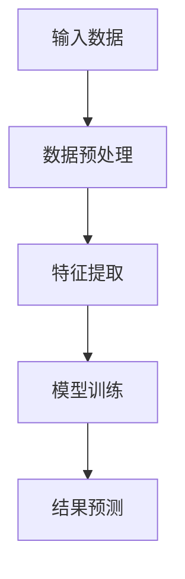
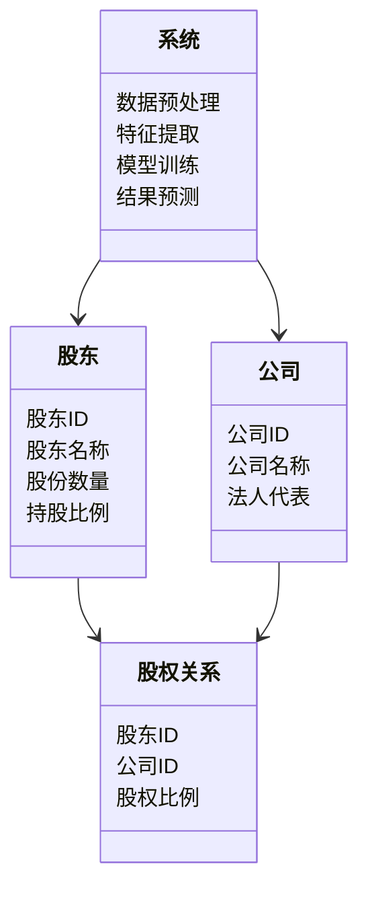
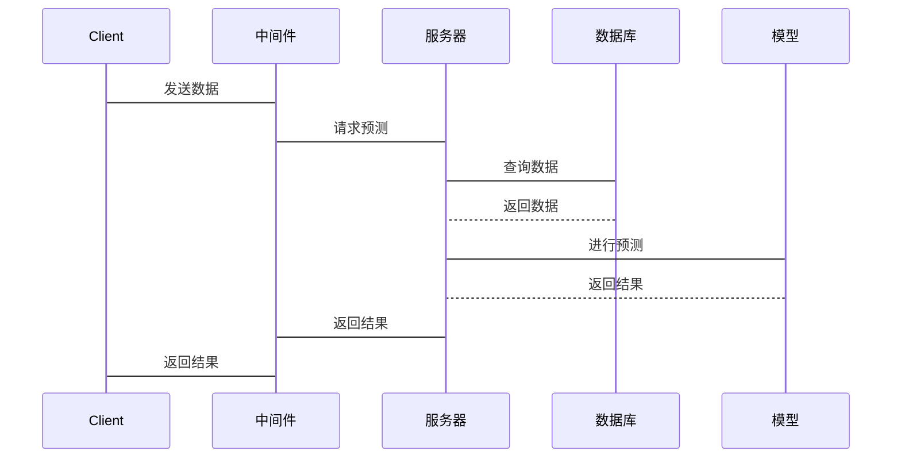

                 


# AI驱动的股东权益分析：深入理解公司治理

## 关键词：
AI, 股东权益, 公司治理, 深度学习, 股权分析, 股东价值

## 摘要：
随着人工智能技术的快速发展，AI在金融领域的应用越来越广泛。本文将探讨如何利用AI技术进行股东权益分析，深入理解公司治理的内在逻辑。通过结合股东权益分析的核心概念、AI算法的数学原理、系统架构设计和实际项目案例，本文将为读者提供一个全面的视角，展示AI如何赋能股东权益分析，提升公司治理效率。

---

# 第1章: 股东权益分析与公司治理概述

## 1.1 股东权益分析的核心概念

### 1.1.1 股东权益的基本构成
股东权益是指股东对公司净资产的所有权，主要包括以下几个方面：
1. **股本**：股东持有的公司股票数量。
2. **资本公积**：公司发行股票时超过面值的部分。
3. **盈余公积**：公司从净利润中提取的公积金。
4. **未分配利润**：公司尚未分配给股东的利润。

### 1.1.2 公司治理的定义与目标
公司治理是指通过合理分配权力和责任，确保公司管理层和股东的利益一致。其目标包括：
- 保护股东权益
- 提高公司运营效率
- 防范风险和欺诈

### 1.1.3 股东权益分析的背景与意义
在现代金融体系中，股东权益分析是评估公司财务健康状况的重要工具。通过分析股东权益，投资者可以更好地理解公司的财务结构，评估公司的偿债能力和盈利能力。

---

## 1.2 AI在股东权益分析中的应用背景

### 1.2.1 传统股东权益分析的局限性
传统的股东权益分析依赖于财务报表和人工计算，存在以下问题：
- 数据量大，分析效率低
- 依赖分析师的经验，主观性强
- 无法实时捕捉市场动态

### 1.2.2 AI技术在金融分析中的优势
AI技术能够处理海量数据，发现复杂模式，具有以下优势：
- **自动化**：AI可以自动抓取和分析数据，提高效率
- **实时性**：AI能够实时更新分析结果，捕捉市场变化
- **准确性**：AI通过深度学习模型，可以更准确地预测财务指标

### 1.2.3 股东权益分析的数字化转型
随着大数据和AI技术的发展，股东权益分析正在从传统的手工分析向数字化、智能化转型。AI技术的应用使得股东权益分析更加精准、高效。

---

## 1.3 本章小结
本章介绍了股东权益分析的核心概念和AI技术在其中的应用背景，强调了AI技术在提升股东权益分析效率和准确性方面的重要作用。

---

# 第2章: 股东权益分析的核心要素

## 2.1 股东权益分析的关键指标

### 2.1.1 净资产收益率（ROE）
净资产收益率（ROE）是衡量公司盈利能力的重要指标，计算公式为：
$$\text{ROE} = \frac{\text{净利润}}{\text{股东权益}}$$

### 2.1.2 每股收益（EPS）
每股收益（EPS）是衡量公司每股股票盈利能力的指标，计算公式为：
$$\text{EPS} = \frac{\text{净利润}}{\text{流通股数}}$$

### 2.1.3 股东权益比率
股东权益比率是衡量公司负债与股东权益的比例，计算公式为：
$$\text{股东权益比率} = \frac{\text{负债总额}}{\text{股东权益}}$$

## 2.2 公司治理结构的ER实体关系图
以下是公司治理结构的ER图，展示了股东、公司和股权关系之间的关联：

```mermaid
er
  entity 股东 {
    key 股东ID
    股东名称
    股份数量
    持股比例
  }
  entity 公司 {
    公司ID
    公司名称
    法人代表
  }
  entity 股权关系 {
    股东ID
    公司ID
    股权比例
  }
```

## 2.3 本章小结
本章详细介绍了股东权益分析的关键指标，并通过ER图展示了公司治理结构的核心要素，为后续的AI分析奠定了基础。

---

# 第3章: AI算法在股东权益分析中的应用

## 3.1 常见AI算法概述

### 3.1.1 线性回归
线性回归是一种简单但强大的预测模型，用于预测连续型变量。其基本假设是因变量与自变量之间存在线性关系。

### 3.1.2 支持向量机（SVM）
支持向量机（SVM）是一种监督学习算法，常用于分类和回归问题。其核心思想是通过构建超平面将数据分成不同类别。

### 3.1.3 神经网络
神经网络是一种模拟人脑结构的深度学习模型，能够处理复杂的非线性关系。其结构包括输入层、隐藏层和输出层。

## 3.2 基于深度学习的股东权益预测模型

### 3.2.1 模型结构
以下是一个简单的深度学习模型结构图：



### 3.2.2 模型训练
模型训练包括以下几个步骤：
1. **数据预处理**：对数据进行清洗、归一化等处理
2. **特征提取**：提取对股东权益分析影响较大的特征
3. **模型训练**：使用训练数据训练深度学习模型
4. **结果预测**：利用训练好的模型进行预测

## 3.3 深度学习模型的数学基础

### 3.3.1 损失函数
损失函数用于衡量模型预测值与实际值之间的差距，常用的损失函数包括均方误差（MSE）：
$$\text{MSE} = \frac{1}{n}\sum_{i=1}^{n}(y_i - \hat{y_i})^2$$

### 3.3.2 优化算法
优化算法用于最小化损失函数，常用的优化算法包括随机梯度下降（SGD）：
$$\text{SGD} = \alpha \cdot \nabla L$$

## 3.4 算法实现与优化

### 3.4.1 神经网络结构设计
神经网络的结构设计包括输入层、隐藏层和输出层的节点数量。通常，隐藏层的节点数可以通过实验确定。

### 3.4.2 模型训练与调优
模型训练需要选择合适的超参数，如学习率、批次大小等。调优可以通过网格搜索或随机搜索实现。

### 3.4.3 模型评估与验证
模型评估通常使用训练集、验证集和测试集的损失值来衡量模型的性能。

## 3.5 本章小结
本章介绍了常见的AI算法，并详细讲解了基于深度学习的股东权益预测模型的构建过程，包括模型结构、训练流程和数学基础。

---

# 第4章: 系统功能设计与实现

## 4.1 系统功能设计

### 4.1.1 领域模型设计
以下是领域模型设计的类图：



### 4.1.2 系统架构设计
以下是系统的架构设计图：


### 4.1.3 系统接口设计
系统接口设计包括以下几个部分：
1. **数据输入接口**：接收股东权益数据
2. **模型调用接口**：调用AI模型进行预测
3. **结果输出接口**：输出预测结果

### 4.1.4 系统交互流程
以下是系统交互流程图：



## 4.2 本章小结
本章详细介绍了系统的功能设计与架构设计，展示了如何通过AI技术实现股东权益分析的自动化。

---

# 第5章: 项目实战

## 5.1 环境安装
项目实战需要以下环境：
- Python 3.6+
- TensorFlow 2.0+
- Pandas
- Matplotlib

## 5.2 核心代码实现

### 5.2.1 数据预处理
以下是数据预处理的代码示例：

```python
import pandas as pd

# 读取数据
data = pd.read_csv('股东权益.csv')

# 数据清洗
data = data.dropna()

# 数据归一化
from sklearn.preprocessing import StandardScaler
scaler = StandardScaler()
data_scaled = scaler.fit_transform(data)
```

### 5.2.2 模型训练
以下是模型训练的代码示例：

```python
import tensorflow as tf
from tensorflow.keras import layers

# 构建模型
model = tf.keras.Sequential([
    layers.Dense(64, activation='relu'),
    layers.Dense(1, activation='linear')
])

# 编译模型
model.compile(optimizer='adam', loss='mean_squared_error')

# 训练模型
model.fit(data_scaled, labels, epochs=100, batch_size=32)
```

### 5.2.3 结果分析
以下是结果分析的代码示例：

```python
# 预测结果
predictions = model.predict(data_scaled)

# 可视化结果
import matplotlib.pyplot as plt

plt.scatter(labels, predictions)
plt.xlabel('真实值')
plt.ylabel('预测值')
plt.show()
```

## 5.3 项目小结
本章通过一个实际案例展示了如何利用AI技术进行股东权益分析，包括数据预处理、模型训练和结果分析。

---

# 第6章: 最佳实践与总结

## 6.1 最佳实践
1. 数据预处理是关键，确保数据的准确性和完整性
2. 选择合适的模型和超参数，避免过拟合
3. 定期更新模型，适应市场变化

## 6.2 小结
本文深入探讨了AI在股东权益分析中的应用，通过理论分析和实践案例展示了AI技术的强大能力。未来，随着AI技术的不断发展，股东权益分析将更加精准和高效。

---

通过以上章节的详细讲解，本文为读者提供了从理论到实践的全面指导，帮助读者理解AI在股东权益分析中的应用和价值。

