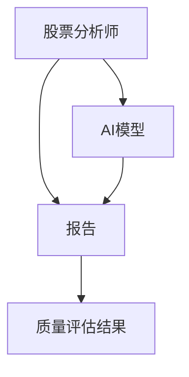
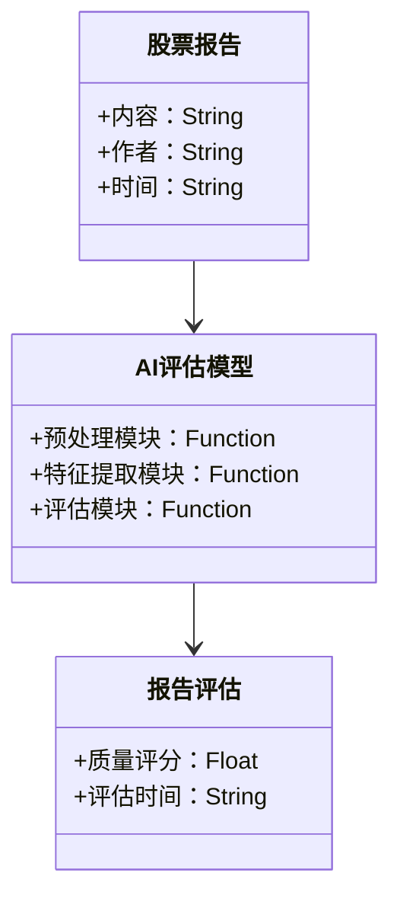
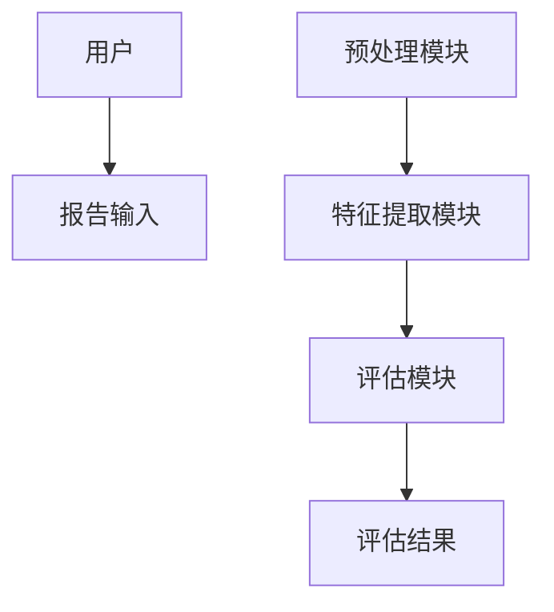

                 


# AI驱动的股票分析师报告质量评估

## 关键词：AI技术、股票分析、报告质量、自然语言处理（NLP）、机器学习、金融数据

## 摘要：
本文探讨如何利用人工智能技术提升股票分析师报告的质量评估。通过分析报告内容、结构和情感倾向，结合自然语言处理和机器学习模型，提出了一种高效、客观的评估方法。该方法克服了传统人工评估的低效和主观性问题，为金融机构提供了智能化的解决方案。

---

# 第一部分: 背景介绍

## 第1章: 股票分析师报告质量评估的背景与问题

### 1.1 问题背景
股票分析师的报告是投资者决策的重要依据，其质量直接影响投资结果。然而，传统评估方法依赖人工阅读和评分，存在效率低、主观性强、成本高等问题。

### 1.2 问题描述
- **评估效率低**：大量报告需要人工逐一阅读，耗时耗力。
- **主观性问题**：不同评估者对同一报告可能给出不同评分。
- **数据多样性**：报告内容涉及多种语言、格式和主题，难以统一处理。
- **行业动态变化快**：市场波动频繁，报告评估需要快速响应。

### 1.3 解决思路
引入AI技术，利用自然语言处理（NLP）和机器学习模型，从报告内容、结构和情感倾向等方面，自动评估报告质量。

### 1.4 边界与外延
- **评估范围**：主要针对报告的内容准确性和逻辑性，不涉及投资策略的最终效果。
- **技术限制**：目前主要基于文本分析，无法完全取代人类的专业判断。
- **数据依赖**：模型效果依赖于高质量的训练数据。

### 1.5 核心概念
- **文本分析**：通过NLP技术提取报告中的关键词、主题和情感倾向。
- **机器学习模型**：训练分类器对报告进行质量评分。
- **数据预处理**：清洗、分词和特征提取。

---

# 第二部分: 核心概念与联系

## 第2章: AI驱动的股票报告质量评估的核心概念

### 2.1 核心概念原理
- **自然语言处理（NLP）**：用于理解和分析报告文本内容。
- **机器学习模型**：用于分类和预测报告质量。
- **文本相似度计算**：评估报告内容的相关性和一致性。

### 2.2 核心概念属性特征对比
| 特征维度 | 传统报告评估 | AI驱动评估 |
|----------|--------------|------------|
| 评估效率 | 低效 | 高效 |
| 评估精度 | 主观性高 | 客观性高 |
| 适应性 | 有限 | 强大 |

### 2.3 实体关系架构


---

# 第三部分: 算法原理讲解

## 第3章: 基于NLP的文本分析算法

### 3.1 文本预处理
- **分词**：将报告文本分割成词语或短语。
- **去除停用词**：移除无意义的词汇，如“的”、“是”等。
- **词嵌入**：将词语转换为向量表示，常用方法包括Word2Vec和BERT。

### 3.2 文本相似度计算
使用余弦相似度计算文本相似性：
$$ \text{similarity} = \frac{\vec{A} \cdot \vec{B}}{|\vec{A}| |\vec{B}|} $$

### 3.3 情感分析
使用双向长短期记忆网络（Bi-LSTM）进行情感分类：
$$ P(y|x) = \text{softmax}(Wx + b) $$

---

# 第四部分: 系统分析与架构设计

## 第4章: 系统架构设计

### 4.1 项目场景介绍
系统旨在为金融机构提供智能化的报告评估工具，支持批量处理和实时分析。

### 4.2 领域模型设计


### 4.3 系统架构设计


---

# 第五部分: 项目实战

## 第5章: 项目实战与代码实现

### 5.1 环境安装
安装必要的库：
```bash
pip install numpy pandas scikit-learn transformers
```

### 5.2 核心功能实现
```python
import numpy as np
from sklearn.feature_extraction.text import TfidfVectorizer
from sklearn.svm import SVC

def preprocess(text):
    return text.lower().split()

def train_model(X, y):
    vectorizer = TfidfVectorizer(preprocessor=preprocess)
    X_vec = vectorizer.fit_transform(X).toarray()
    model = SVC()
    model.fit(X_vec, y)
    return model, vectorizer

# 示例数据
X = ["市场表现良好，建议买入", "数据支持卖出"]
y = [1, 0]

model, vectorizer = train_model(X, y)
```

### 5.3 案例分析
分析某报告的质量：
```python
report = "该股近期表现强劲，建议投资者增持"
processed_report = preprocess(report)
report_vec = vectorizer.transform([report]).toarray()
score = model.predict(report_vec)[0]
print(f"质量评分：{score}")
```

---

# 第六部分: 最佳实践与总结

## 第6章: 最佳实践与总结

### 6.1 最佳实践
- **数据质量**：确保训练数据多样且标注准确。
- **模型调优**：通过交叉验证优化模型参数。
- **持续学习**：定期更新模型以适应市场变化。

### 6.2 项目小结
本文提出了一种基于AI的股票报告质量评估方法，通过NLP和机器学习技术，显著提升了评估效率和准确性。

### 6.3 注意事项
- 模型结果仅供参考，需结合市场实际情况进行判断。
- 保护数据隐私，避免敏感信息泄露。

### 6.4 拓展阅读
建议进一步研究多模态分析和实时评估系统。

---

# 总结

本文系统性地探讨了AI在股票分析师报告质量评估中的应用，从背景分析到算法实现，再到系统设计，为读者提供了全面的技术视角。通过结合NLP和机器学习技术，本文提出了一种高效、客观的评估方法，为金融机构提供了有力的工具支持。

