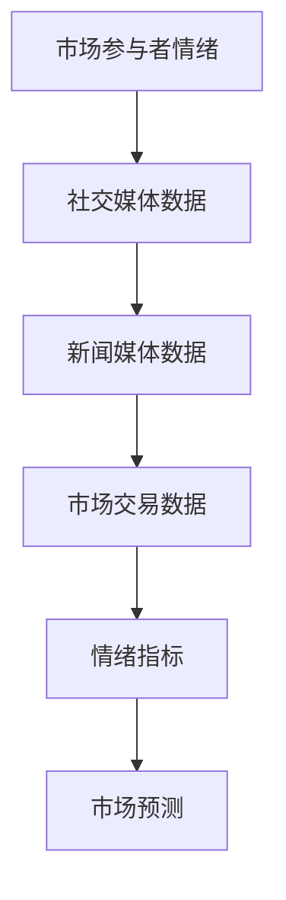
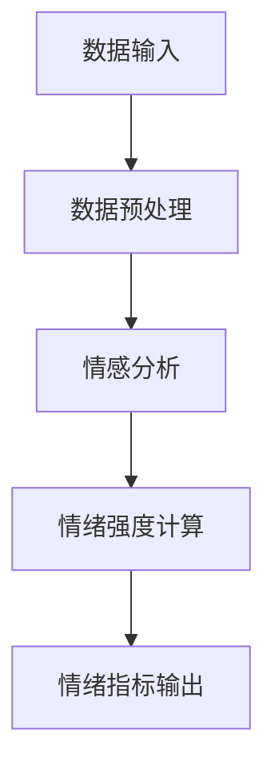
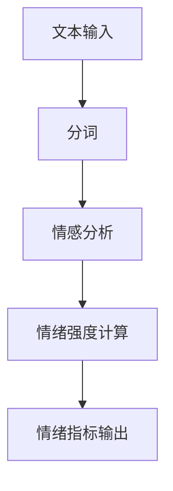
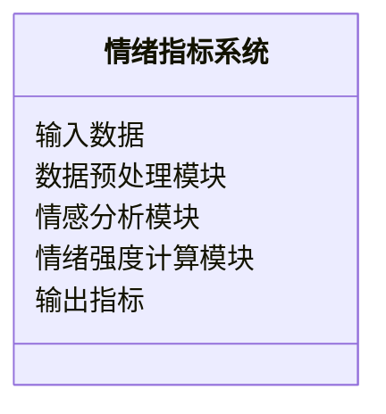
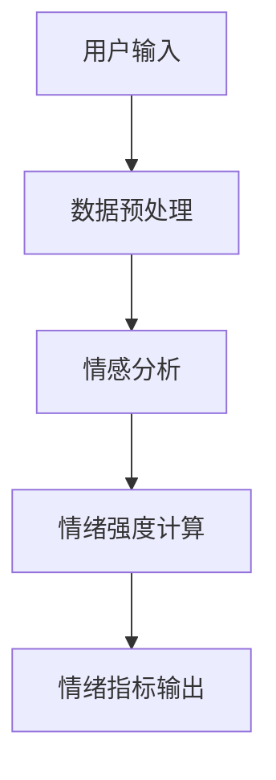
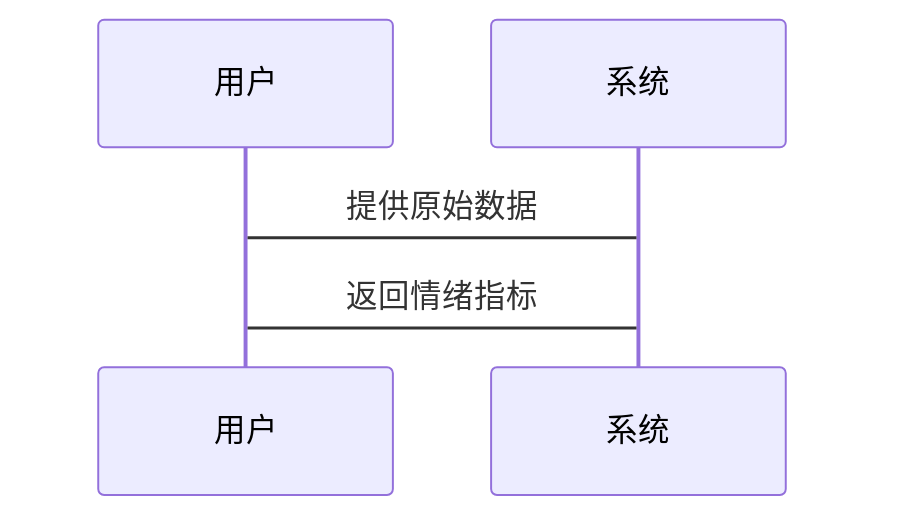

                 


# AI驱动的股票市场情绪指标开发与应用

> 关键词：AI技术、股票市场、情绪指标、自然语言处理、机器学习、量化投资

> 摘要：本文系统地探讨了如何利用人工智能技术开发股票市场情绪指标，并分析其在投资决策中的应用。文章从情绪指标的背景与定义出发，详细介绍了情绪指标的核心概念、算法原理、系统设计、项目实战以及实际应用案例，最后总结了开发与应用AI驱动的股票市场情绪指标的关键点及未来发展趋势。

---

# 第一部分: AI驱动的股票市场情绪指标开发与应用概述

## 第1章: 股票市场情绪指标的背景与定义

### 1.1 股票市场情绪指标的背景

#### 1.1.1 传统股票市场分析的局限性
传统股票市场分析主要依赖技术分析和基本面分析，但这两者都有其局限性。技术分析依赖历史价格数据，难以预测市场情绪变化；基本面分析依赖财务数据，难以捕捉市场参与者的心理变化。因此，引入情绪指标可以弥补这些分析方法的不足。

#### 1.1.2 情绪指标在投资决策中的作用
情绪指标通过量化市场参与者的心理状态，可以帮助投资者更好地理解市场行为，预测价格波动，优化投资策略。例如，当市场情绪过于乐观时，可能预示着市场的潜在回调风险。

#### 1.1.3 AI技术在情绪分析中的应用潜力
AI技术，尤其是自然语言处理和机器学习，为情绪指标的开发提供了新的可能性。通过分析社交媒体、新闻媒体等非结构化数据，可以更准确地捕捉市场情绪。

---

### 1.2 情绪指标的定义与分类

#### 1.2.1 情绪指标的定义
情绪指标是衡量市场参与者情绪状态的量化工具，通常基于文本数据（如社交媒体帖子、新闻文章）和市场数据（如股价、成交量）进行计算。

#### 1.2.2 情绪指标的主要分类
情绪指标可以分为以下几类：
1. **文本情绪指标**：基于新闻和社交媒体的文本数据，通过情感分析技术计算市场情绪。
2. **市场行为情绪指标**：基于成交量、价格波动等市场行为数据，分析市场情绪。
3. **混合情绪指标**：结合文本和市场行为数据，综合反映市场情绪。

#### 1.2.3 情绪指标与市场行为的关系
情绪指标与市场行为密切相关。例如，当市场情绪过于乐观时，股价可能被高估，反之则可能被低估。

---

### 1.3 情绪指标的核心要素

#### 1.3.1 数据来源的多样性
情绪指标的数据来源包括社交媒体（如Twitter、Reddit）、新闻媒体、市场交易数据等。

#### 1.3.2 情绪强度的量化方法
情绪强度通常通过情感分析技术量化为正向、负向或中性情绪。

#### 1.3.3 情绪指标的实时性要求
为了捕捉市场的实时变化，情绪指标需要具备较高的实时性。

---

## 第2章: 情绪指标开发的核心概念与联系

### 2.1 情绪指标的核心概念

#### 2.1.1 情绪数据的定义与属性
情绪数据是反映市场参与者情绪状态的原始数据，包括文本数据、市场行为数据等。

#### 2.1.2 情绪指标的构建逻辑
情绪指标的构建通常包括数据预处理、情感分析、情绪强度计算等步骤。

#### 2.1.3 情绪指标与市场预测的关系
情绪指标可以作为市场预测的辅助工具，帮助投资者更好地理解市场波动。

---

### 2.2 情绪指标的实体关系图



---

### 2.3 情绪指标的流程图



---

## 第3章: 情绪指标开发的算法原理

### 3.1 文本挖掘与自然语言处理

#### 3.1.1 常用文本挖掘技术
文本挖掘技术包括分词、关键词提取、主题建模等。

#### 3.1.2 自然语言处理模型（如BERT）
BERT是一种广泛使用的预训练语言模型，可以用于情感分析任务。

#### 3.1.3 情感分析算法实现
情感分析算法通常包括文本表示、特征提取和分类器训练三个步骤。

---

### 3.2 情绪量化方法

#### 3.2.1 基于词典的情感分析
基于词典的情感分析通过匹配文本中的关键词来判断情感倾向。

#### 3.2.2 基于机器学习的情感分类
机器学习情感分类通过训练数据学习情感特征，构建分类模型。

#### 3.2.3 情绪强度的回归模型
回归模型可以预测情感强度，通常使用线性回归或支持向量回归等方法。

---

### 3.3 算法流程图



---

# 第二部分: 系统设计与实现

## 第4章: 系统设计与架构

### 4.1 问题场景介绍
本文设计了一个基于AI的情绪指标系统，用于实时监测市场情绪并生成情绪指标。

---

### 4.2 系统功能设计

#### 4.2.1 领域模型


#### 4.2.2 系统架构设计


---

### 4.3 系统接口设计

#### 4.3.1 接口描述
- 数据预处理接口：接收原始数据，返回预处理后的数据。
- 情感分析接口：接收文本数据，返回情感标签。
- 情绪强度计算接口：接收情感标签，返回情绪强度。

---

### 4.4 系统交互设计

#### 4.4.1 交互流程


---

## 第5章: 项目实战

### 5.1 环境安装
需要安装Python、自然语言处理库（如NLTK、spaCy）、深度学习框架（如TensorFlow、PyTorch）等。

---

### 5.2 核心实现源代码

#### 5.2.1 情感分析代码示例
```python
import nltk
nltk.download('vader_lexicon')
from nltk.sentiment import SentimentIntensityAnalyzer

sia = SentimentIntensityAnalyzer()
text = "I love this stock!"
sentiment = sia.polarity_scores(text)
print(sentiment)
```

#### 5.2.2 情绪强度回归模型
```python
import pandas as pd
from sklearn.model_selection import train_test_split
from sklearn.linear_model import LinearRegression

# 假设我们有训练数据df，包含特征和目标变量'mood_intensity'
X = df.drop('mood_intensity', axis=1)
y = df['mood_intensity']

X_train, X_test, y_train, y_test = train_test_split(X, y, test_size=0.2)
model = LinearRegression()
model.fit(X_train, y_train)
```

---

## 第6章: 案例分析与结果解读

### 6.1 案例分析
通过分析实际市场数据，展示情绪指标在预测市场波动中的应用效果。

---

### 6.2 结果解读
通过对案例分析结果的解读，验证情绪指标的有效性，并提出改进建议。

---

## 第7章: 总结与展望

### 7.1 总结
本文详细介绍了AI驱动的股票市场情绪指标的开发与应用，展示了其在投资决策中的潜力。

### 7.2 展望
未来的研究可以进一步优化情绪量化方法，探索更多数据源，提升情绪指标的预测精度。

---

## 第8章: 小结与注意事项

### 8.1 小结
本文从理论到实践，全面探讨了AI驱动的股票市场情绪指标的开发与应用。

### 8.2 注意事项
- 数据质量对情绪指标的准确性有重要影响。
- 情绪指标应结合其他分析方法使用，避免单一依赖。

---

通过本文的系统介绍，读者可以全面掌握AI驱动的股票市场情绪指标的开发与应用方法，并在实际投资中灵活运用这些技术。

