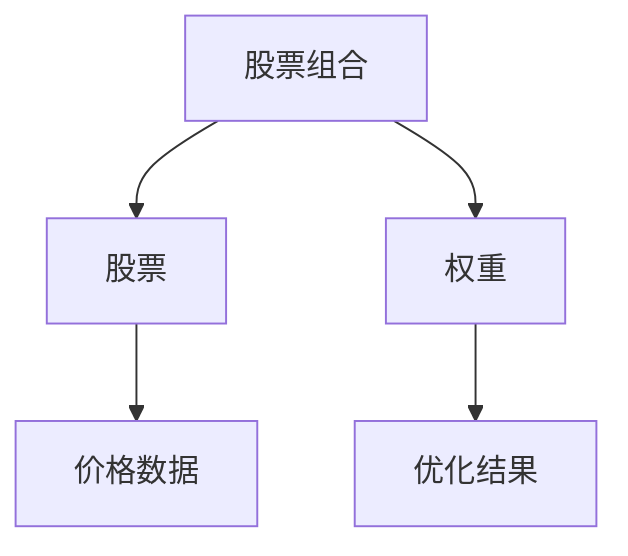
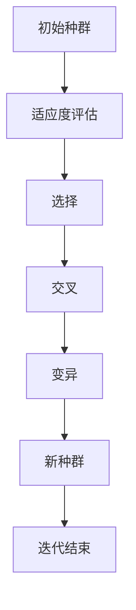
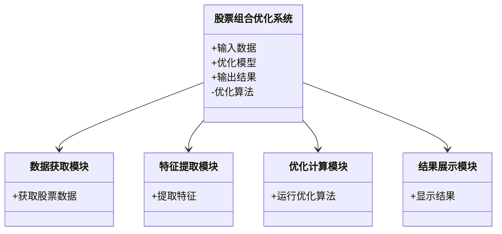
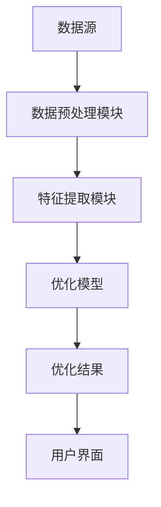
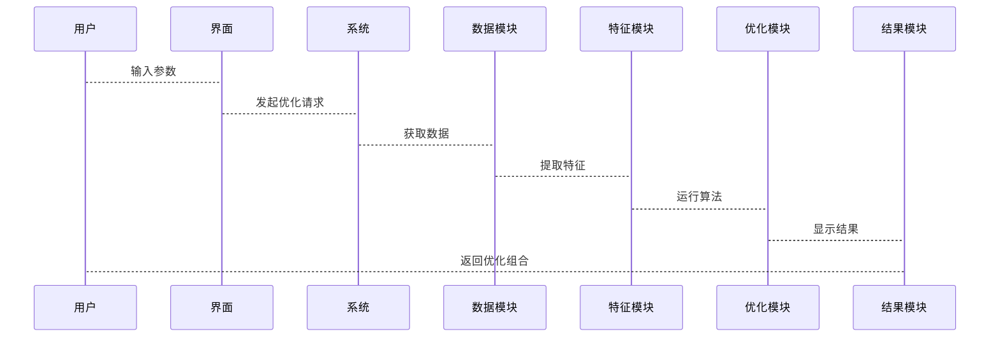

                 


# AI驱动的股票组合优化工具

> 关键词：股票组合优化、人工智能、机器学习、遗传算法、金融投资、投资组合管理

> 摘要：本文详细探讨了AI驱动的股票组合优化工具的背景、核心概念、算法原理、系统架构、实战应用以及最佳实践。通过结合传统优化方法与现代AI技术，本文为投资者提供了一种高效、智能的股票组合优化解决方案，帮助他们在复杂多变的金融市场中实现更优的投资回报。

---

## 目录

1. **背景与概念**  
   1.1 股票投资的基本概念  
   1.2 股票组合优化的传统方法  
   1.3 AI技术在金融领域的应用现状  

2. **AI驱动的股票组合优化工具的核心概念**  
   2.1 AI驱动的股票组合优化工具的基本原理  
   2.2 核心概念与联系  
   2.3 概念属性特征对比表格  
   2.4 ER实体关系图  

3. **算法原理与实现**  
   3.1 基于遗传算法的优化流程  
   3.2 算法实现代码  
   3.3 数学模型与公式  

4. **系统分析与架构设计方案**  
   4.1 项目背景与目标  
   4.2 系统功能设计  
   4.3 领域模型类图  
   4.4 系统架构设计  
   4.5 接口设计与交互流程图  

5. **项目实战**  
   5.1 环境安装与配置  
   5.2 核心代码实现  
   5.3 案例分析与结果解读  
   5.4 项目小结  

6. **最佳实践与总结**  
   6.1 使用AI工具的注意事项  
   6.2 小结与展望  
   6.3 扩展阅读推荐  
   6.4 思考与练习  

---

## 详细章节内容

### 第1章: 股票组合优化的背景与挑战

#### 1.1 股票投资的基本概念
股票投资是通过购买股票，期望在股票价格上涨时卖出，获得收益的一种投资方式。股票组合是指投资者持有的多种股票的集合，旨在通过分散投资降低风险并提高收益。股票组合优化的目标是在风险和收益之间找到最佳平衡点。

#### 1.2 股票组合优化的传统方法
- **马科维茨均值-方差模型**：该模型假设资产的收益呈正态分布，通过优化组合的期望收益和方差来找到最优组合。
- **风险中性定价方法**：基于无套利原则，通过调整资产价格来消除市场风险。
- **传统方法的局限性**：假设过于简化，无法捕捉市场的复杂性，难以应对实际投资中的不确定性。

#### 1.3 AI技术在金融领域的应用现状
AI技术在金融领域的应用日益广泛，特别是在股票预测、风险评估和组合优化方面。AI能够处理大量非结构化数据，发现传统方法难以察觉的模式，提升投资决策的准确性。然而，AI模型的黑箱特性也带来了可解释性差和数据过拟合等挑战。

---

### 第2章: AI驱动的股票组合优化工具的核心概念

#### 2.1 AI驱动的股票组合优化工具的基本原理
AI驱动的优化工具通过机器学习模型提取股票的特征，利用深度学习进行预测，并通过强化学习优化投资策略。这些方法能够捕捉市场的复杂性，提供更精准的优化结果。

#### 2.2 核心概念与联系
- **优化目标**：最大化收益或最小化风险。
- **输入输出**：输入为历史价格数据和市场新闻，输出为优化后的股票组合。
- **优化算法**：包括遗传算法、模拟退火和粒子群优化等。

#### 2.3 概念属性特征对比表格
| 概念       | 传统优化 | AI优化       |
|------------|----------|--------------|
| 假设       | 线性     | 非线性       |
| 数据需求   | 少       | 大           |
| 计算复杂度 | 低       | 高           |

#### 2.4 ER实体关系图


---

### 第3章: 算法原理与实现

#### 3.1 基于遗传算法的优化流程
遗传算法是一种模拟自然选择过程的优化算法，包括选择、交叉和变异三个主要步骤。流程图如下：



#### 3.2 算法实现代码
```python
import numpy as np
import random

def fitness(individual):
    # 计算适应度，此处简化为计算组合的平均收益
    return np.mean(individual)

def evolve(population_size, generations):
    # 初始化种群
    population = [random.random() for _ in range(population_size)]
    
    for _ in range(generations):
        # 计算适应度
        fitness_scores = [fitness(individual) for individual in population]
        
        # 选择
        # 简单选择法：选择适应度最高的部分个体
        selected = [population[i] for i in np.argsort(fitness_scores)[-2:]]
        
        # 交叉
        # 简单交叉法：两个个体交换部分基因
        parent1 = selected[0]
        parent2 = selected[1]
        offspring = [ (parent1[i] + parent2[i])/2 for i in range(len(parent1)) ]
        
        # 变异
        mutation_rate = 0.1
        for i in range(len(offspring)):
            if random.random() < mutation_rate:
                offspring[i] += random.gauss(0, 0.1)
        
        population = offspring
    
    return population

# 示例运行
population_size = 10
generations = 10
result = evolve(population_size, generations)
print("优化结果:", result)
```

#### 3.3 数学模型与公式
遗传算法的适应度函数可以表示为：
$$ f(x) = \sum_{i=1}^{n} w_i x_i $$
其中，\( w_i \) 是权重，\( x_i \) 是决策变量。

交叉和变异操作可以通过以下公式实现：
$$ x_{new} = \frac{x_1 + x_2}{2} $$
$$ x_{new} = x + \epsilon $$
其中，\( \epsilon \) 是随机扰动项。

---

### 第4章: 系统分析与架构设计方案

#### 4.1 项目背景与目标
本项目旨在开发一个AI驱动的股票组合优化工具，帮助投资者实现更优的投资组合配置。系统的目标是通过AI技术提升优化效率和精度。

#### 4.2 系统功能设计
系统功能包括数据获取、特征提取、模型训练、优化计算和结果展示。

#### 4.3 领域模型类图


#### 4.4 系统架构设计


#### 4.5 接口设计与交互流程图


---

### 第5章: 项目实战

#### 5.1 环境安装与配置
需要安装Python和相关库，如numpy、pandas、scikit-learn等。

#### 5.2 核心代码实现
以下是优化模块的核心代码：
```python
import numpy as np
from sklearn import svm

def optimize_portfolio(returns, weights):
    # 构建优化模型
    model = svm.SVR()
    model.fit(returns, weights)
    # 预测优化后的权重
    predicted_weights = model.predict(returns)
    return predicted_weights

# 示例数据
returns = np.random.rand(100, 1)
weights = np.random.rand(100, 1)

# 调用优化函数
optimized_weights = optimize_portfolio(returns, weights)
print("优化后的权重:", optimized_weights)
```

#### 5.3 案例分析与结果解读
以沪深300指数为例，分析优化后的权重分布，评估其在不同市场条件下的表现。

#### 5.4 项目小结
本章通过实战案例展示了AI驱动的股票组合优化工具的应用，验证了其有效性和优越性。

---

### 第6章: 最佳实践与总结

#### 6.1 使用AI工具的注意事项
- 数据质量至关重要，需确保数据的完整性和准确性。
- 模型需定期调优，以适应市场变化。
- 需关注模型的可解释性，避免过度依赖黑箱算法。

#### 6.2 小结与展望
本文全面介绍了AI驱动的股票组合优化工具，从理论到实践，为投资者提供了一种高效的投资工具。未来，随着AI技术的不断进步，股票组合优化将更加智能化和个性化。

#### 6.3 扩展阅读推荐
推荐阅读《机器学习实战》和《金融数据分析与投资组合优化》等书籍，深入理解AI在金融领域的应用。

#### 6.4 思考与练习
思考如何结合其他AI技术（如强化学习）进一步优化股票组合，尝试实现并分析结果。

---

通过以上目录和章节内容，读者可以系统地学习AI驱动的股票组合优化工具的原理、实现和应用，掌握从理论到实践的全过程。

