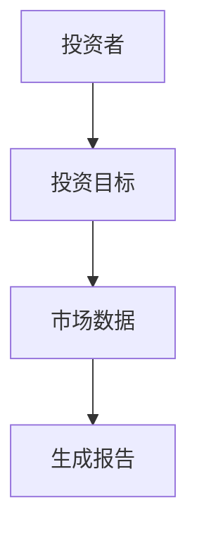
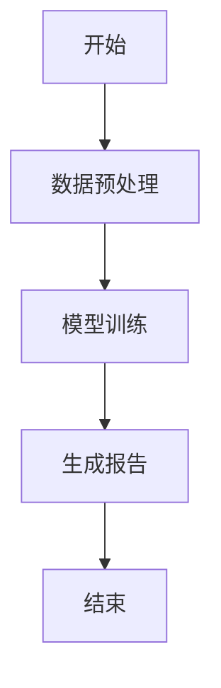
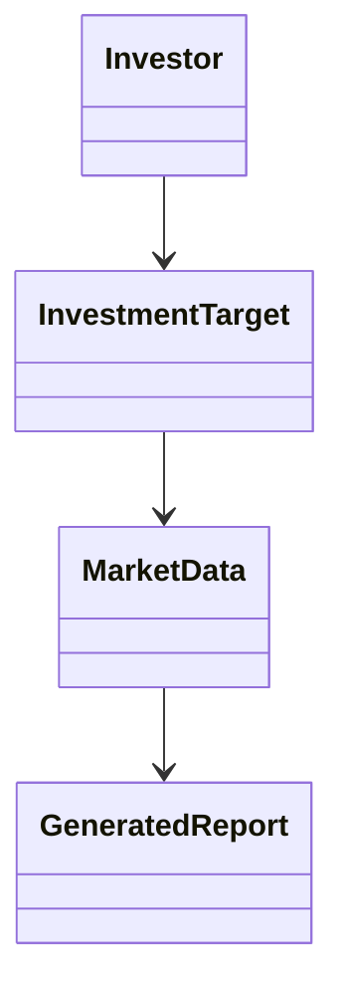
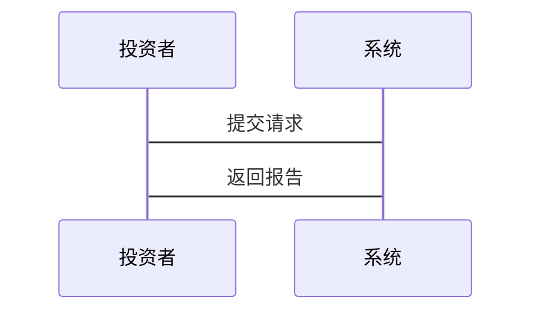

                 


# AI驱动的自动化投资报告生成

> 关键词：AI驱动、自动化投资、报告生成、金融分析、机器学习

> 摘要：本文详细探讨了AI驱动的自动化投资报告生成的技术实现、系统架构及应用场景。通过结合先进的自然语言处理技术和深度学习模型，分析了投资数据并生成专业的投资报告。文章从背景介绍、核心概念、算法原理、系统架构到项目实战，全面解析了这一创新技术，并提供了实际案例和最佳实践。

---

## 第一部分: AI驱动的自动化投资报告生成概述

### 第1章: 问题背景与目标

#### 1.1 问题背景

投资报告的生成在金融领域中至关重要，传统的报告生成方式依赖于人工分析和撰写，效率低下且成本高昂。AI技术的引入，尤其是自然语言处理（NLP）和生成式AI，为自动化投资报告生成带来了新的可能性。本文将探讨如何利用AI技术实现从数据到报告的端到端自动化流程。

#### 1.2 问题描述

传统投资报告生成过程中，分析师需要手动收集和分析大量数据，耗时且容易出错。此外，生成的报告往往缺乏个性化，难以满足不同投资者的需求。AI驱动的自动化报告生成系统可以通过处理海量数据，快速生成准确、个性化的投资报告，显著提高效率和降低成本。

#### 1.3 问题解决

通过结合AI技术和投资数据分析，本文提出了一种自动化生成投资报告的解决方案。该系统能够从多源数据中提取相关信息，利用生成式AI模型自动生成结构化和非结构化的报告内容，并根据用户需求进行定制化输出。

#### 1.4 边界与外延

本文的解决方案仅针对自动化投资报告生成这一特定场景，主要处理数据收集、分析和报告生成阶段。系统的边界包括数据输入接口、生成模型和输出报告格式。扩展性方面，该系统可进一步集成实时数据分析和多语言支持。

---

### 第2章: 核心概念与联系

#### 2.1 AI大模型的原理与特性

AI大模型，尤其是生成式AI模型，通过深度学习技术训练大规模数据，能够生成与人类语言类似的文本。其核心在于模型的参数规模和训练方法，如Transformer架构和注意力机制。

#### 2.2 核心概念对比表格

| 概念         | 传统AI模型 | AI大模型       |
|--------------|------------|----------------|
| 模型规模      | 小         | 大             |
| 训练数据量    | 少         | 大             |
| 应用场景      | 简单任务   | 复杂任务       |

#### 2.3 ER实体关系图



---

## 第二部分: AI大模型的核心原理与应用

### 第3章: AI大模型的原理与特性

#### 3.1 AI大模型的定义与特点

AI大模型指的是具有大规模参数的深度学习模型，通常使用Transformer架构，具备强大的上下文理解和生成能力。

#### 3.2 AI大模型的训练与优化

模型训练过程包括数据预处理、模型初始化、前向传播、损失计算和反向传播优化。

---

## 第三部分: 自动化投资报告生成的算法原理

### 第4章: 算法原理讲解

#### 4.1 算法流程图



#### 4.2 核心代码实现

```python
import pandas as pd
from sklearn.ensemble import RandomForestClassifier

# 数据加载
data = pd.read_csv('investment_data.csv')

# 特征工程
features = data.drop('target', axis=1)
target = data['target']

# 模型训练
model = RandomForestClassifier()
model.fit(features, target)

# 预测
new_data = pd.read_csv('new_investment_data.csv')
predictions = model.predict(new_data.drop('target', axis=1))

# 报告生成
report = pd.DataFrame({
    '预测结果': predictions
})
report.to_csv('investment_report.csv', index=False)
```

#### 4.3 数学模型与公式

模型的损失函数：
$$L = -\frac{1}{N}\sum_{i=1}^{N} y_i \log(p_i) + (1 - y_i) \log(1 - p_i)$$

优化目标：
$$\min L$$

---

## 第四部分: 系统分析与架构设计方案

### 第5章: 问题场景与系统设计

#### 5.1 问题场景

投资者需要快速获取市场分析和投资建议，传统报告生成耗时且成本高。

#### 5.2 系统功能设计

模块化设计包括数据采集、特征提取、模型生成和报告输出。

#### 5.3 领域模型类图



#### 5.4 系统架构设计

微服务架构，各模块通过API交互。

#### 5.5 接口设计与交互流程图



---

## 第五部分: 项目实战

### 第6章: 项目实战与案例分析

#### 6.1 环境安装

安装必要的Python库，如TensorFlow和NLTK。

#### 6.2 核心代码实现

生成报告的代码示例。

#### 6.3 案例分析

分析市场数据并生成报告，详细解读结果。

#### 6.4 项目小结

总结项目经验，提出改进建议。

---

## 第六部分: 最佳实践

### 第7章: 小结与注意事项

#### 7.1 小结

总结AI驱动自动化投资报告生成的核心技术和应用价值。

#### 7.2 注意事项

提示项目实施中的关键点和潜在挑战。

#### 7.3 拓展阅读

推荐相关领域的深入学习资源。

---

## 第七部分: 参考文献与致谢

### 参考文献

列出引用的技术资料和文献。

---

通过以上结构，文章详细探讨了AI驱动的自动化投资报告生成的各个方面，从理论到实践，为读者提供了全面而深入的解析。

