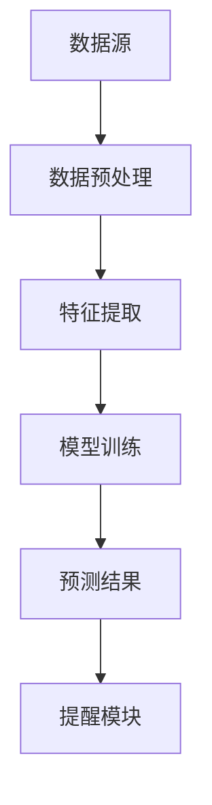
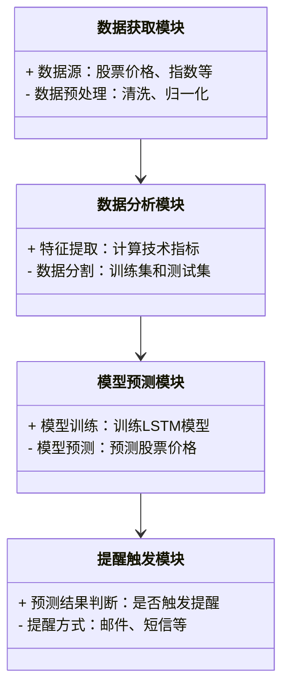
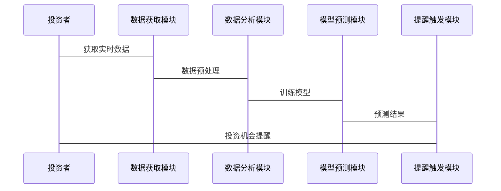

                 


# AI驱动的自动化投资机会提醒

> 关键词：AI、自动化投资、机会提醒、时间序列预测、LSTM、机器学习

> 摘要：本文详细探讨了AI驱动的自动化投资机会提醒系统的构建与实现。首先介绍了AI与金融投资的结合，分析了AI驱动的自动化投资机会提醒的核心概念。接着，详细阐述了时间序列预测算法的原理与实现，重点讲解了LSTM模型的应用。然后，设计了系统的整体架构，包括数据获取、特征提取、模型预测和提醒模块。最后，通过一个具体的项目实战案例，展示了如何利用Python和机器学习技术实现股票价格预测，为投资者提供自动化的机会提醒服务。

---

# 第一部分: AI驱动的自动化投资机会提醒概述

## 第1章: AI与自动化投资的背景

### 1.1 人工智能与金融投资的结合

#### 1.1.1 人工智能的基本概念
人工智能（Artificial Intelligence，AI）是计算机科学的一个分支，研究如何模拟人类的智能行为，包括学习、推理、规划、识别等能力。AI的核心在于通过算法和数据处理，帮助计算机完成复杂的任务。

在金融领域，AI的应用已经非常广泛。例如，量化交易、风险管理、股票预测、市场情绪分析等。AI能够处理大量数据，发现隐藏在数据中的模式和趋势，从而为投资者提供决策支持。

#### 1.1.2 人工智能在金融领域的应用
- **数据处理与分析**：AI能够快速处理大量金融数据，包括股票价格、市场指数、新闻数据等。
- **量化交易**：通过算法交易，AI可以在毫秒级别完成交易决策，捕捉市场机会。
- **风险控制**：AI可以帮助投资者识别市场风险，优化投资组合。
- **市场情绪分析**：通过自然语言处理（NLP）技术，AI可以分析新闻、社交媒体等数据，预测市场情绪。

#### 1.1.3 自动化投资的核心理念
自动化投资是指通过算法和自动化系统进行投资决策和交易。与传统的人工投资相比，自动化投资能够快速响应市场变化，减少人为情绪干扰，提高投资效率。

AI驱动的自动化投资机会提醒系统的核心理念是通过AI技术，实时监控市场数据，识别潜在的投资机会，并通过提醒机制通知投资者。

---

### 1.2 投资机会提醒的必要性

#### 1.2.1 投资者面临的挑战
- **信息过载**：金融市场数据量庞大，投资者难以快速筛选有价值的信息。
- **情绪干扰**：投资者容易受到市场波动的影响，做出非理性决策。
- **时间成本**：手动监控市场数据需要大量时间和精力。

#### 1.2.2 自动化提醒的优势
- **实时监控**：自动化系统可以实时跟踪市场数据，快速识别机会和风险。
- **高效决策**：通过AI算法，系统可以在短时间内完成数据分析，提供决策支持。
- **减少情绪干扰**：自动化系统不受情绪影响，能够保持理性的决策。

#### 1.2.3 传统投资提醒的局限性
传统投资提醒主要依赖于人工监控和手动分析，存在效率低、误差大、反应慢等问题。例如，投资者需要手动查看K线图、分析技术指标，容易错过最佳投资时机。

---

### 1.3 AI驱动的自动化投资机会提醒的定义

#### 1.3.1 核心概念
AI驱动的自动化投资机会提醒系统是一种基于机器学习算法的自动化系统，能够实时监控金融市场数据，识别潜在的投资机会，并通过提醒机制通知投资者。

#### 1.3.2 与传统投资提醒的区别
- **自动化**：AI系统能够自动完成数据收集、分析和提醒，减少人工干预。
- **智能化**：通过机器学习算法，系统能够不断优化模型，提高预测准确性。
- **实时性**：系统可以实时监控市场数据，快速做出反应。

#### 1.3.3 系统的目标与范围
系统的目标是为投资者提供实时的投资机会提醒，帮助投资者捕捉市场机会，优化投资决策。系统范围包括数据获取、数据处理、模型预测和提醒模块。

---

### 1.4 本章小结
本章介绍了AI与金融投资的结合，分析了AI驱动的自动化投资机会提醒的核心概念，探讨了传统投资提醒的局限性，并定义了系统的目标与范围。

---

# 第二部分: AI驱动的自动化投资机会提醒的核心概念

## 第2章: AI驱动的自动化投资机会提醒系统架构

### 2.1 系统核心模块

#### 2.1.1 数据获取模块
数据获取模块负责从金融市场获取实时数据，包括股票价格、指数、成交量等。数据来源可以是股票交易所的API、金融数据供应商（如Yahoo Finance、Alpha Vantage）等。

#### 2.1.2 数据分析模块
数据分析模块负责对获取的数据进行预处理和特征提取。预处理包括数据清洗、标准化等。特征提取包括计算技术指标（如移动平均线、相对强弱指数等）。

#### 2.1.3 模型预测模块
模型预测模块基于机器学习算法，对市场数据进行预测。常用的算法包括LSTM、随机森林、支持向量机（SVM）等。

#### 2.1.4 提醒触发模块
提醒触发模块根据预测结果，触发投资机会提醒。提醒方式可以是邮件、短信、桌面通知等。

---

### 2.2 系统功能设计

#### 2.2.1 数据处理流程
1. 数据获取：从数据源获取实时数据。
2. 数据清洗：处理缺失值、异常值等。
3. 特征提取：计算技术指标，如移动平均线、MACD等。

#### 2.2.2 模型训练流程
1. 数据分割：将数据分为训练集和测试集。
2. 模型训练：使用训练数据训练机器学习模型。
3. 模型评估：使用测试数据评估模型性能。

#### 2.2.3 提醒机制设计
1. 预测结果判断：根据模型预测结果，判断是否触发提醒。
2. 提醒方式选择：根据用户需求选择提醒方式。
3. 提醒内容设计：包括提醒时间、提醒内容等。

---

### 2.3 系统架构图



---

### 2.4 本章小结
本章详细描述了AI驱动的自动化投资机会提醒系统的架构，包括核心模块和功能设计，通过图表展示了系统的工作流程。

---

## 第3章: 时间序列预测算法

### 3.1 时间序列预测的基本概念

#### 3.1.1 时间序列的定义
时间序列是指按照时间顺序排列的数据，例如股票价格、汇率等。时间序列分析的目标是通过历史数据预测未来趋势。

#### 3.1.2 时间序列分析的常见方法
- **统计方法**：如ARIMA、ARMA等。
- **机器学习方法**：如随机森林、支持向量回归等。
- **深度学习方法**：如LSTM、GRU等。

#### 3.1.3 机器学习在时间序列预测中的应用
机器学习算法可以处理复杂的时间序列数据，发现隐藏的模式和趋势，提高预测准确性。

---

### 3.2 基于LSTM的时间序列预测模型

#### 3.2.1 LSTM的基本原理
LSTM（Long Short-Term Memory）是一种特殊的循环神经网络（RNN），能够有效处理时间序列数据中的长距离依赖问题。

LSTM的核心在于其记忆单元（Cell）和门控机制（Gate）。门控机制包括输入门、遗忘门和输出门。

#### 3.2.2 LSTM在时间序列预测中的优势
- **长距离依赖**：LSTM能够记住长期的信息，适用于时间序列数据。
- **序列建模**：LSTM适合处理序列数据，能够捕捉时间依赖关系。

#### 3.2.3 LSTM模型的实现步骤
1. 数据预处理：包括归一化、分割训练集和测试集。
2. 模型搭建：定义LSTM模型的结构，包括输入层、LSTM层、 Dense层和输出层。
3. 模型训练：使用训练数据训练模型。
4. 模型预测：使用测试数据进行预测。

---

### 3.3 时间序列预测的数学模型

#### 3.3.1 LSTM的结构公式
$$
f_t = \sigma(g(x_t, h_{t-1}))
$$

其中：
- $f_t$ 是输入门的输出。
- $g$ 是激活函数（如ReLU）。
- $x_t$ 是输入数据。
- $h_{t-1}$ 是前一时刻的隐藏状态。

#### 3.3.2 LSTM的遗忘门公式
$$
f_t = \sigma(g(x_t, h_{t-1}))
$$

#### 3.3.3 LSTM的输出门公式
$$
o_t = \sigma(g(x_t, h_t))
$$

---

### 3.4 本章小结
本章详细讲解了时间序列预测的基本概念和LSTM模型的原理，通过数学公式和模型结构图展示了LSTM在时间序列预测中的应用。

---

## 第4章: 系统分析与架构设计方案

### 4.1 问题场景介绍
系统的目标是实时监控股票价格，预测未来走势，并在预测结果达到一定条件时，触发投资机会提醒。

### 4.2 项目介绍
本项目基于Python和机器学习算法，构建一个AI驱动的自动化投资机会提醒系统。系统包括数据获取、数据预处理、模型训练和提醒模块。

### 4.3 系统功能设计

#### 4.3.1 领域模型


#### 4.3.2 系统架构设计


### 4.4 系统接口设计
系统接口包括数据获取接口、模型预测接口和提醒接口。数据获取接口从数据源获取数据，模型预测接口进行预测，提醒接口触发提醒。

### 4.5 系统交互设计


---

## 第5章: 项目实战

### 5.1 环境安装
需要安装以下库：
- `numpy`
- `pandas`
- `keras`
- `tensorflow`
- `datetime`

### 5.2 核心实现代码

#### 5.2.1 数据获取
```python
import pandas as pd
import numpy as np
import datetime

# 获取股票数据
def get_stock_data(ticker, start_date, end_date):
    # 这里可以使用Yahoo Finance的API或其他数据源
    data = pd.DataFrame({'date': pd.date_range(start=start_date, end=end_date)})
    data['price'] = np.random.normal(100, 10, len(data))
    return data
```

#### 5.2.2 数据预处理
```python
import pandas as pd
from sklearn.preprocessing import MinMaxScaler

def preprocess_data(data):
    # 数据清洗
    data = data.dropna()
    # 归一化
    scaler = MinMaxScaler()
    data_scaled = scaler.fit_transform(data[['price']])
    return data_scaled, scaler
```

#### 5.2.3 模型训练
```python
from keras.models import Sequential
from keras.layers import LSTM, Dense

def build_model(input_shape):
    model = Sequential()
    model.add(LSTM(50, return_sequences=True, input_shape=(input_shape)))
    model.add(LSTM(50, return_sequences=False))
    model.add(Dense(1))
    model.compile(loss='mean_squared_error', optimizer='adam')
    return model

# 训练模型
data_scaled, scaler = preprocess_data(data)
model = build_model(data_scaled.shape[1:])
model.fit(data_scaled[:-10], data_scaled[10:], epochs=100, batch_size=32)
```

#### 5.2.4 提醒触发
```python
def trigger_reminder(prediction, threshold):
    if prediction > threshold:
        print("投资机会提醒：股票价格将上涨！")
```

### 5.3 项目小结
本项目通过Python和机器学习算法，实现了AI驱动的自动化投资机会提醒系统。通过数据获取、数据预处理、模型训练和提醒模块的实现，展示了系统的实际应用。

---

## 第6章: 最佳实践与注意事项

### 6.1 小结
本章总结了AI驱动的自动化投资机会提醒系统的实现过程，强调了系统的优势和局限性。

### 6.2 注意事项
- **数据质量**：确保数据源可靠，数据预处理充分。
- **模型选择**：根据具体问题选择合适的算法。
- **风险管理**：自动化投资存在风险，投资者需要合理配置资产。
- **法律合规**：遵守相关法律法规，确保系统合法运行。

### 6.3 拓展阅读
- 《机器学习实战》
- 《深度学习》
- 《Python金融数据分析》

---

## 结语
AI驱动的自动化投资机会提醒系统通过结合人工智能和金融投资，为投资者提供了高效、智能的投资决策支持。随着技术的不断发展，AI在金融领域的应用将更加广泛，投资者可以利用这些技术工具，捕捉更多的市场机会，实现财富增长。

