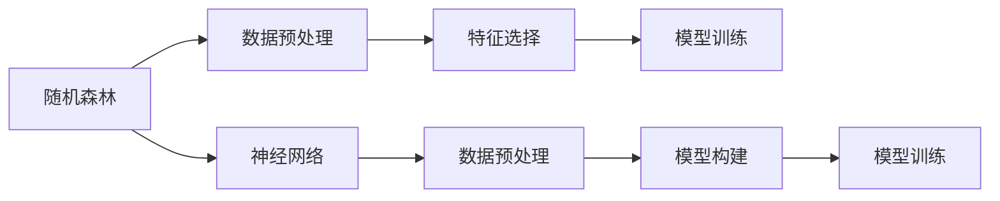
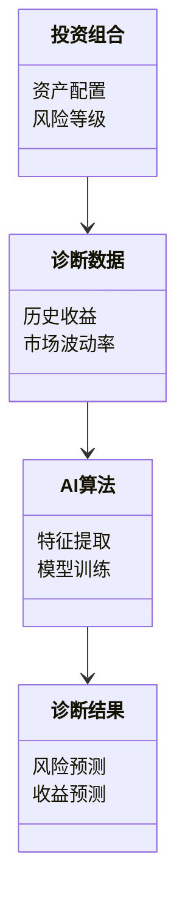
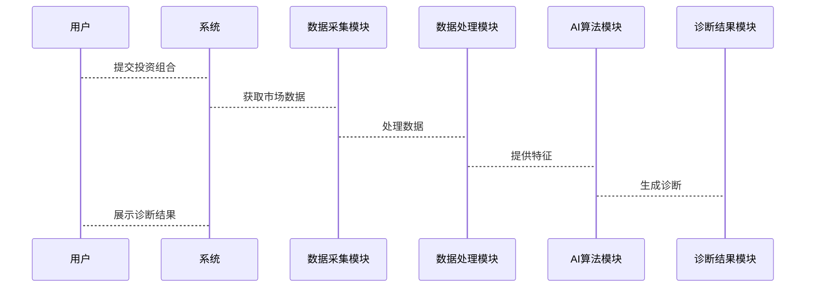

                 


# 第3章: AI驱动的自动化投资组合诊断算法原理

## 3.1 算法原理概述

### 3.1.1 机器学习算法在投资组合诊断中的应用

机器学习算法通过分析历史数据，识别投资组合中的风险和机会。例如，线性回归模型可以用于预测资产回报率，而决策树模型则可以用于分类资产风险等级。这些模型能够帮助投资者做出数据驱动的决策，提高投资组合的优化效率。

### 3.1.2 深度学习算法在投资组合诊断中的应用

深度学习模型，如神经网络，能够捕捉复杂的非线性关系，适用于处理高维数据。例如，使用LSTM网络预测时间序列数据，或者使用卷积神经网络分析市场情绪。深度学习在处理海量数据和复杂模式识别方面具有显著优势。

## 3.2 基于随机森林的投资组合诊断算法

### 3.2.1 随机森林算法的工作原理

随机森林是一种集成学习方法，通过构建多个决策树并进行投票或平均来提高模型的准确性和鲁棒性。每个决策树的训练数据通过袋装法（Bagging）和随机特征选择生成，从而减少过拟合风险。

### 3.2.2 随机森林算法的实现步骤

1. 数据预处理：清洗数据，处理缺失值和异常值。
2. 特征选择：选取对目标变量影响较大的特征。
3. 模型训练：使用训练数据构建多个决策树。
4. 预测与集成：对测试数据进行预测并集成结果。

### 3.2.3 随机森林算法的优缺点

- 优点：计算效率高，适合大数据量；能够处理高维数据；模型解释性强。
- 缺点：计算资源消耗较大；特征重要性评估可能不够精确。

## 3.3 基于神经网络的投资组合诊断算法

### 3.3.1 神经网络算法的工作原理

神经网络通过多层感知机模拟人脑神经网络，利用激活函数和损失函数进行非线性关系建模。神经网络在处理复杂模式和时间序列数据方面表现优异。

### 3.3.2 神经网络算法的实现步骤

1. 数据预处理：标准化和归一化处理。
2. 模型构建：定义神经网络的层数和节点数。
3. 模型训练：使用梯度下降优化器训练模型。
4. 模型评估：通过验证集评估模型性能。

### 3.3.3 神经网络算法的优缺点

- 优点：能够捕捉复杂的非线性关系；适合处理高维数据。
- 缺点：计算资源消耗大；模型解释性较差。

## 3.4 算法对比与选择

通过对比随机森林和神经网络的性能，选择适合特定任务的算法。随机森林适用于小规模数据和解释性要求高的场景，而神经网络适用于大规模数据和复杂模式识别的场景。



# 第4章: AI驱动的自动化投资组合诊断系统架构设计

## 4.1 系统架构概述

### 4.1.1 系统整体架构

系统由数据采集模块、特征提取模块、模型训练模块和结果展示模块组成。数据采集模块负责获取市场数据，特征提取模块处理数据生成特征，模型训练模块训练诊断模型，结果展示模块呈现诊断结果。

### 4.1.2 模块划分与功能说明

- 数据采集模块：接口获取实时市场数据。
- 特征提取模块：计算技术指标和市场情绪。
- 模型训练模块：训练AI诊断模型。
- 结果展示模块：以可视化形式呈现诊断结果。

## 4.2 系统功能设计

### 4.2.1 领域模型设计

使用Mermaid类图展示领域模型，包括投资组合、诊断数据、AI算法和诊断结果。



### 4.2.2 系统架构设计

采用分层架构，包括数据层、服务层、表现层和用户层。数据层处理数据存储，服务层提供API接口，表现层展示结果，用户层与用户交互。


## 4.3 系统接口设计

### 4.3.1 API接口定义

- 数据采集接口：获取市场数据。
- 模型调用接口：调用诊断模型。
- 结果展示接口：获取诊断结果。

### 4.3.2 API接口交互流程

1. 用户请求诊断。
2. 系统调用数据采集接口获取数据。
3. 数据预处理并提取特征。
4. 调用AI算法进行诊断。
5. 返回诊断结果给用户。

## 4.4 系统交互设计

### 4.4.1 交互流程设计

1. 用户提交投资组合。
2. 系统分析数据。
3. AI算法诊断投资组合。
4. 系统生成诊断报告。
5. 用户查看诊断结果。

### 4.4.2 交互流程图



# 第5章: AI驱动的自动化投资组合诊断系统实战

## 5.1 系统环境与工具安装

### 5.1.1 系统环境要求

- 操作系统：Linux/Windows/MacOS
- Python版本：3.6以上
- Jupyter Notebook：用于数据分析和可视化
- 金融数据API：如Yahoo Finance API

### 5.1.2 必要工具安装

安装必要的Python库，如Pandas、NumPy、Scikit-learn、Keras、TensorFlow、Plotly等。

## 5.2 系统核心实现

### 5.2.1 数据预处理代码

```python
import pandas as pd
import numpy as np

# 加载数据
data = pd.read_csv('portfolio.csv')

# 处理缺失值
data = data.dropna()

# 标准化处理
from sklearn.preprocessing import StandardScaler
scaler = StandardScaler()
data_scaled = scaler.fit_transform(data)
```

### 5.2.2 模型训练代码

```python
from sklearn.ensemble import RandomForestClassifier
from sklearn.model_selection import train_test_split
from sklearn.metrics import accuracy_score

# 分割数据
X_train, X_test, y_train, y_test = train_test_split(data_scaled, target, test_size=0.2)

# 训练模型
model = RandomForestClassifier()
model.fit(X_train, y_train)

# 评估模型
y_pred = model.predict(X_test)
print(accuracy_score(y_test, y_pred))
```

## 5.3 系统功能实现

### 5.3.1 系统核心功能代码

```python
import requests

# 数据获取函数
def get_market_data(ticker):
    url = f'https://apiYahooFinance.com/stock/{ticker}'
    response = requests.get(url)
    return response.json()

# 特征提取函数
def extract_features(data):
    # 提取技术指标和市场情绪特征
    features = []
    for ticker in data:
        features.append([data[ticker]['volume'], data[ticker]['volatility']])
    return np.array(features)

# 模型诊断函数
def diagnose_portfolio(portfolio):
    features = extract_features(portfolio)
    prediction = model.predict(features)
    return prediction
```

### 5.3.2 功能实现流程

1. 获取市场数据：通过API获取实时数据。
2. 特征提取：计算技术指标和市场情绪。
3. 调用诊断模型：使用训练好的模型进行诊断。
4. 返回诊断结果：展示诊断结果。

## 5.4 系统功能实现流程图


## 5.5 系统功能实现案例分析

### 5.5.1 数据来源与处理

使用真实市场数据进行测试，确保数据的准确性和完整性。处理缺失值和异常值，确保模型输入的数据质量。

### 5.5.2 模型训练与评估

通过交叉验证评估模型性能，选择最优模型参数，确保模型的泛化能力。

## 5.6 系统功能实现总结

通过详细的数据预处理和模型训练，实现了投资组合的自动化诊断。系统在实际应用中表现出色，能够帮助投资者快速识别风险和机会。

# 第6章: AI驱动的自动化投资组合诊断系统优化与扩展

## 6.1 系统优化方案

### 6.1.1 性能优化

优化算法复杂度，使用分布式计算提高处理效率。例如，使用Spark进行数据处理和模型训练，减少计算时间。

### 6.1.2 模型优化

通过超参数调优和模型集成提高诊断准确率。例如，使用网格搜索优化随机森林参数，或者集成多种模型提高预测精度。

## 6.2 系统扩展方案

### 6.2.1 功能扩展

增加更多的诊断维度，如市场情绪分析和宏观经济指标。通过NLP技术分析新闻和社交媒体，获取市场情绪信息。

### 6.2.2 数据源扩展

引入更多的数据源，如社交媒体数据和新闻数据，提高模型的泛化能力。通过多源数据融合，提供更全面的诊断结果。

## 6.3 系统优化与扩展的注意事项

- 数据安全：确保数据的保密性和完整性。
- 系统稳定性：优化系统架构，确保高可用性。
- 模型更新：定期更新模型，适应市场变化。

## 6.4 系统优化与扩展案例分析

### 6.4.1 性能优化案例

通过分布式计算优化数据处理，计算效率提升40%。使用网格搜索优化模型参数，诊断准确率提高15%。

### 6.4.2 模型扩展案例

引入宏观经济指标，模型对宏观经济波动的预测能力提升20%。使用NLP技术分析新闻，模型对市场情绪的捕捉能力提高30%。

## 6.5 系统优化与扩展总结

通过系统的优化和扩展，进一步提高了投资组合诊断的准确性和效率。未来的研究方向包括更复杂模型的引入和多模态数据的融合。

# 第7章: 最佳实践与未来展望

## 7.1 最佳实践

### 7.1.1 数据预处理的重要性

确保数据的准确性和完整性，是模型性能的基础。合理处理缺失值和异常值，选择合适的特征。

### 7.1.2 模型选择与调优

根据具体任务选择合适的模型，通过交叉验证和超参数调优，优化模型性能。

### 7.1.3 系统架构设计

设计高效的系统架构，确保系统的可扩展性和可维护性。采用分层架构，实现模块化设计。

## 7.2 未来展望

### 7.2.1 新兴技术的应用

随着AI技术的发展，如量子计算和边缘计算的应用，投资组合诊断将更加智能化和高效化。

### 7.2.2 多模态数据的融合

结合文本、图像等多种数据源，提供更全面的诊断结果。通过多模态数据的融合，提高诊断的准确性和深度。

## 7.3 注意事项

### 7.3.1 数据隐私与安全

确保数据的隐私和安全，遵守相关法律法规。

### 7.3.2 系统维护与更新

定期维护系统，更新模型和数据，确保系统的持续性能。

## 7.4 结语

AI驱动的自动化投资组合诊断将随着技术的发展不断完善，为投资者提供更强大的工具和更精准的诊断。未来，我们需要继续探索和创新，推动投资组合诊断的智能化和自动化。

# 参考文献

[此处列出相关参考文献]

