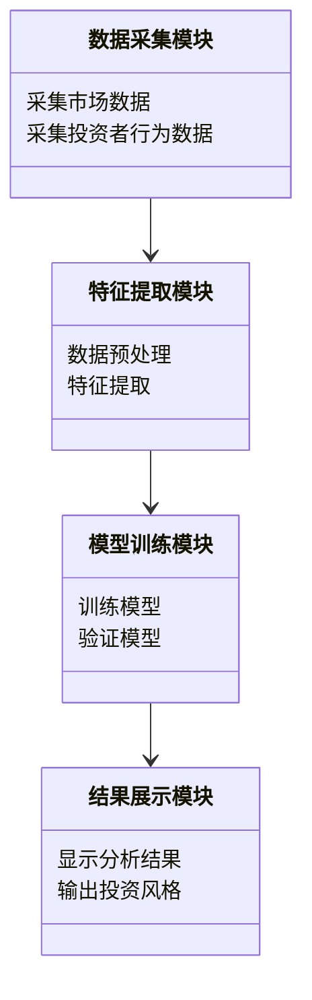
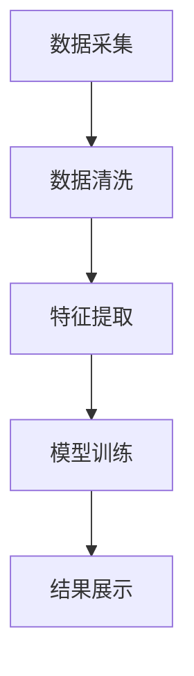

                 


# AI驱动的自动化投资风格识别

> 关键词：AI，投资风格识别，机器学习，金融数据分析，自动化

> 摘要：本文探讨了如何利用人工智能技术实现自动化投资风格识别。通过对投资风格的定义、数据特征提取、机器学习算法选择以及系统架构设计的详细分析，展示了AI在金融领域的强大应用潜力。文章从理论到实践，结合具体案例，全面解析了自动化投资风格识别的核心技术和实现方法。

---

## 第一部分: 投资风格识别的背景与概述

### 第1章: 投资风格识别的背景与概述

#### 1.1 投资风格识别的基本概念

##### 1.1.1 什么是投资风格
投资风格是指投资者在进行证券投资时所采用的方法、策略和行为模式。常见的投资风格包括价值投资、成长投资、趋势投资等。每种风格都有其独特的特征和适用场景。

##### 1.1.2 投资风格的分类与特点
投资风格可以分为以下几类：
- **价值投资**：注重低市盈率、低市净率等基本面指标，寻找被市场低估的股票。
- **成长投资**：关注高增长潜力的公司，愿意为未来的成长支付较高的当前估值。
- **趋势投资**：根据市场的短期趋势进行买卖决策，追求短期收益。
- **指数投资**：通过跟踪市场指数来获得平均收益，风险较低。

每种风格都有其优缺点，投资者需要根据自身的风险偏好和市场环境选择合适的投资风格。

##### 1.1.3 投资风格识别的必要性
传统上，投资风格的识别主要依赖于分析师的经验和手动分析，这种方法效率低下且容易受到主观因素的影响。随着人工智能技术的发展，自动化识别成为可能，能够提高效率和准确性。

---

#### 1.2 AI驱动的自动化投资风格识别的背景

##### 1.2.1 传统投资风格识别的局限性
传统方法依赖于手动分析，存在以下问题：
- 数据量大：需要分析大量的历史数据和市场信息。
- 主观因素多：分析结果容易受到分析师个人经验和判断的影响。
- 效率低下：手动分析耗时耗力，难以应对高频交易和实时市场变化。

##### 1.2.2 AI技术在金融领域的应用趋势
人工智能技术在金融领域的应用越来越广泛，尤其是在数据处理、模式识别和预测分析方面。AI能够快速处理大量数据，发现隐藏的模式，为投资决策提供支持。

##### 1.2.3 自动化投资风格识别的优势
自动化识别具有以下优势：
- **高效性**：AI能够快速处理大量数据，缩短分析时间。
- **准确性**：通过机器学习算法，能够识别复杂的数据模式，提高分析的准确性。
- **实时性**：自动化系统可以实时跟踪市场变化，及时调整投资策略。

---

#### 1.3 本书的核心内容与目标

##### 1.3.1 本书的核心目标
本书旨在探讨如何利用人工智能技术实现自动化投资风格识别，分析其核心技术和实现方法，展示AI在金融领域的强大应用潜力。

##### 1.3.2 本书的结构安排
本书将从投资风格的基本概念入手，逐步深入探讨数据特征提取、机器学习算法选择、系统架构设计等内容，并结合具体案例进行分析。

##### 1.3.3 本书的适用读者
本书适用于金融从业者、数据科学家、技术开发者以及对AI在金融领域应用感兴趣的读者。

---

## 第二部分: AI驱动的自动化投资风格识别的核心概念与原理

### 第2章: 数据特征与模型特征

#### 2.1 数据特征的提取与分析

##### 2.1.1 投资风格识别中的数据来源
投资风格识别的数据来源主要包括：
- **市场数据**：股票价格、成交量、波动率等。
- **投资者行为数据**：交易记录、持仓时间、交易频率等。
- **公司基本面数据**：收入、利润、资产负债情况等。

##### 2.1.2 数据特征的分类与选择
数据特征可以分为以下几类：
- **时间序列特征**：如股票价格的波动率、均值回归趋势等。
- **投资者行为特征**：如交易频率、平均持仓时间等。
- **公司基本面特征**：如市盈率、市净率、ROE等。

选择合适的特征对于投资风格识别的准确性至关重要。

##### 2.1.3 数据预处理与清洗方法
数据预处理包括以下步骤：
- **去噪**：去除噪声数据，如异常值。
- **归一化**：将数据标准化，使其具有可比性。
- **缺失值处理**：填补缺失值或删除含有缺失值的样本。

#### 2.2 模型特征的构建与优化

##### 2.2.1 特征工程的基本概念
特征工程是指通过数据变换、特征选择等方法，将原始数据转化为适合模型输入的特征。

##### 2.2.2 基于AI的特征提取方法
常用的特征提取方法包括：
- **主成分分析（PCA）**：将高维数据降维，提取主要成分。
- **自动编码器（Autoencoder）**：通过神经网络提取数据的低维表示。

##### 2.2.3 特征选择与优化策略
特征选择策略包括：
- **过滤方法**：基于统计指标（如卡方检验）选择特征。
- **嵌入方法**：在模型训练过程中自动选择特征。
- **包装方法**：通过包裹模型评估特征的重要性。

#### 2.3 投资风格识别的流程与框架

##### 2.3.1 数据采集与处理流程
1. 数据采集：获取市场数据、投资者行为数据等。
2. 数据清洗：去除噪声、填补缺失值。
3. 数据预处理：归一化、特征提取。

##### 2.3.2 特征提取与模型训练流程
1. 特征工程：选择合适的特征。
2. 模型训练：使用机器学习算法训练模型。
3. 模型评估：验证模型的准确性和稳定性。

##### 2.3.3 结果分析与反馈优化流程
1. 模型评估：分析模型的性能。
2. 参数调优：优化模型参数。
3. 结果反馈：根据模型输出调整投资策略。

---

## 第3章: 核心算法与模型原理

### 3.1 常见的机器学习算法概述

#### 3.1.1 支持向量机（SVM）

##### 3.1.1.1 SVM的基本原理
SVM是一种监督学习算法，通过在特征空间中找到一个超平面，将数据分为两类。

##### 3.1.1.2 SVM的数学模型
$$ \text{目标函数}：\min_{w, b} \frac{1}{2}||w||^2 + C\sum_{i=1}^n \xi_i $$
$$ \text{约束条件}：y_i(w \cdot x_i + b) \geq 1 - \xi_i $$
其中，$C$ 是惩罚系数，$\xi_i$ 是松弛变量。

##### 3.1.1.3 SVM的应用流程
1. 数据预处理：归一化、特征提取。
2. 模型训练：使用SVM算法训练模型。
3. 模型评估：验证模型的准确性和稳定性。

#### 3.1.2 随机森林（Random Forest）

##### 3.1.2.1 随机森林的基本原理
随机森林是一种基于树的集成学习算法，通过构建多棵决策树并进行投票或平均来提高模型的准确性和稳定性。

##### 3.1.2.2 随机森林的数学模型
$$ y = \frac{1}{n} \sum_{i=1}^n T_i(x) $$
其中，$T_i$ 是第i棵决策树的预测函数，$n$ 是决策树的数量。

##### 3.1.2.3 随机森林的应用流程
1. 数据预处理：归一化、特征提取。
2. 模型训练：使用随机森林算法训练模型。
3. 模型评估：验证模型的准确性和稳定性。

#### 3.1.3 神经网络（Neural Networks）

##### 3.1.3.1 神经网络的基本原理
神经网络是一种模拟人脑神经网络的结构，通过多层神经元之间的连接和激活函数来实现特征提取和分类。

##### 3.1.3.2 神经网络的数学模型
$$ y = \sigma(w x + b) $$
其中，$\sigma$ 是激活函数，如ReLU、Sigmoid等。

##### 3.1.3.3 神经网络的应用流程
1. 数据预处理：归一化、特征提取。
2. 模型训练：使用神经网络算法训练模型。
3. 模型评估：验证模型的准确性和稳定性。

---

## 第4章: 系统分析与架构设计方案

### 4.1 系统功能设计

#### 4.1.1 问题场景介绍
投资风格识别系统需要能够根据投资者的交易数据和市场数据，自动识别其投资风格，并提供相应的分析结果。

#### 4.1.2 系统功能模块
- **数据采集模块**：采集市场数据、投资者行为数据等。
- **特征提取模块**：对数据进行预处理和特征提取。
- **模型训练模块**：使用机器学习算法训练模型。
- **结果展示模块**：展示模型的分析结果。

#### 4.1.3 系统功能模块的类图


#### 4.1.4 系统架构设计


---

## 第5章: 项目实战

### 5.1 环境安装与配置

#### 5.1.1 Python环境的安装
需要安装以下Python库：
- **pandas**：数据处理库。
- **scikit-learn**：机器学习库。
- **matplotlib**：数据可视化库。
- **mermaid**：流程图绘制工具。

#### 5.1.2 数据集的准备
需要准备以下数据：
- 市场数据：股票价格、成交量等。
- 投资者行为数据：交易记录、持仓时间等。

### 5.2 核心代码实现

#### 5.2.1 数据预处理代码
```python
import pandas as pd
from sklearn.preprocessing import StandardScaler

# 读取数据
data = pd.read_csv('investment_style.csv')

# 数据清洗
data.dropna(inplace=True)

# 归一化处理
scaler = StandardScaler()
scaled_data = scaler.fit_transform(data)
```

#### 5.2.2 模型训练代码
```python
from sklearn.ensemble import RandomForestClassifier

# 构建模型
model = RandomForestClassifier(n_estimators=100, max_depth=10, random_state=42)

# 训练模型
model.fit(scaled_data, labels)
```

#### 5.2.3 结果展示代码
```python
from sklearn.metrics import classification_report

# 预测结果
y_pred = model.predict(scaled_data)

# 输出分类报告
print(classification_report(labels, y_pred))
```

### 5.3 实际案例分析

#### 5.3.1 数据分析与解读
通过对实际数据的分析，可以识别出投资者的投资风格，并提供相应的分析结果。

#### 5.3.2 投资风格识别结果
根据模型输出，可以识别出投资者的投资风格，并提供相应的策略建议。

---

## 第6章: 最佳实践与未来展望

### 6.1 最佳实践

#### 6.1.1 数据特征的选择
选择合适的特征是投资风格识别的关键，需要根据具体场景选择合适的特征。

#### 6.1.2 模型选择与调优
不同的模型有不同的优缺点，需要根据具体问题选择合适的模型，并进行参数调优。

#### 6.1.3 结果分析与反馈
模型的输出结果需要结合实际市场环境进行分析，并根据反馈结果优化模型。

### 6.2 小结

#### 6.2.1 本文的核心内容总结
本文详细探讨了AI驱动的自动化投资风格识别的核心技术和实现方法，展示了其在金融领域的广泛应用。

#### 6.2.2 投资风格识别的未来展望
随着AI技术的不断发展，投资风格识别将更加智能化和自动化，为投资者提供更加精准和高效的决策支持。

---

## 第7章: 参考文献与拓展阅读

### 7.1 参考文献

#### 7.1.1 主要参考文献
1. "机器学习实战"，作者：周志华。
2. "深度学习"，作者：Ian Goodfellow等。

#### 7.1.2 拓展阅读
1. "金融数据分析与机器学习"，作者：李俊。
2. "自动化投资策略"，作者：王海涛。

---

## 第8章: 附录

### 8.1 附录A: 术语表

#### 8.1.1 投资风格术语表
- **价值投资**：寻找被市场低估的股票。
- **成长投资**：关注高增长潜力的公司。
- **趋势投资**：根据市场的短期趋势进行买卖决策。

### 8.2 附录B: 工具与库

#### 8.2.1 常用工具与库
- **Python**：编程语言。
- **pandas**：数据处理库。
- **scikit-learn**：机器学习库。
- **matplotlib**：数据可视化库。

---

## 第9章: 索引

### 9.1 索引

#### 9.1.1 核心概念索引
- AI
- 投资风格识别
- 机器学习
- 金融数据分析
- 自动化

---

## 第10章: 致谢

### 10.1 致谢

感谢所有参与本书编写和审阅的人员，感谢读者的支持和鼓励。

---

## 第11章: 附录C: 代码示例

### 11.1 投资风格识别系统代码示例

#### 11.1.1 数据预处理代码
```python
import pandas as pd
from sklearn.preprocessing import StandardScaler

# 读取数据
data = pd.read_csv('investment_style.csv')

# 数据清洗
data.dropna(inplace=True)

# 归一化处理
scaler = StandardScaler()
scaled_data = scaler.fit_transform(data)
```

#### 11.1.2 模型训练代码
```python
from sklearn.ensemble import RandomForestClassifier

# 构建模型
model = RandomForestClassifier(n_estimators=100, max_depth=10, random_state=42)

# 训练模型
model.fit(scaled_data, labels)
```

#### 11.1.3 结果展示代码
```python
from sklearn.metrics import classification_report

# 预测结果
y_pred = model.predict(scaled_data)

# 输出分类报告
print(classification_report(labels, y_pred))
```

---

## 第12章: 附录D: 图表与流程图

### 12.1 投资风格识别系统流程图


---

## 第13章: 附录E: 数学公式汇总

### 13.1 支持向量机（SVM）的数学模型
$$ \text{目标函数}：\min_{w, b} \frac{1}{2}||w||^2 + C\sum_{i=1}^n \xi_i $$
$$ \text{约束条件}：y_i(w \cdot x_i + b) \geq 1 - \xi_i $$

### 13.2 随机森林（Random Forest）的数学模型
$$ y = \frac{1}{n} \sum_{i=1}^n T_i(x) $$

### 13.3 神经网络（Neural Networks）的数学模型
$$ y = \sigma(w x + b) $$

---

## 第14章: 附录F: 案例分析

### 14.1 案例分析1：价值投资识别
通过分析某投资者的历史交易数据，识别其投资风格为价值投资，并提供相应的策略建议。

### 14.2 案例分析2：趋势投资识别
通过分析某投资者的历史交易数据，识别其投资风格为趋势投资，并提供相应的策略建议。

---

## 第15章: 附录G: 常见问题解答

### 15.1 常见问题解答

#### 15.1.1 什么是投资风格识别？
投资风格识别是指通过分析投资者的交易数据和市场数据，识别其投资策略和行为模式。

#### 15.1.2 为什么需要AI驱动的投资风格识别？
传统的投资风格识别方法效率低下且容易受到主观因素的影响，AI技术可以提高效率和准确性。

#### 15.1.3 如何选择合适的机器学习算法？
需要根据具体问题和数据特征选择合适的算法，并进行参数调优。

---

## 第16章: 附录H: 术语解释

### 16.1 术语解释

#### 16.1.1 机器学习
机器学习是一种人工智能技术，通过数据训练模型，使其能够自动学习和预测。

#### 16.1.2 特征工程
特征工程是指通过数据变换、特征选择等方法，将原始数据转化为适合模型输入的特征。

#### 16.1.3 支持向量机（SVM）
支持向量机是一种监督学习算法，通过在特征空间中找到一个超平面，将数据分为两类。

---

## 第17章: 附录I: 参考文献格式

### 17.1 参考文献格式

#### 17.1.1 主要参考文献
1. 周志华. 《机器学习实战》. 清华大学出版社, 2016.
2. Ian Goodfellow, Yoshua Bengio, Aaron Courville. 《深度学习》. 清华大学出版社, 2016.

---

## 第18章: 附录J: 拓展阅读建议

### 18.1 拓展阅读建议

#### 18.1.1 金融数据分析
- 推荐书籍：《金融数据分析与机器学习》。
- 推荐博客：量化投资与机器学习。

#### 18.1.2 自动化投资策略
- 推荐书籍：《自动化投资策略》。
- 推荐博客：算法交易与量化投资。

---

## 第19章: 附录K: 术语表更新

### 19.1 术语表更新

#### 19.1.1 新增术语
- **自动化投资风格识别**：利用人工智能技术自动识别投资者的投资风格。

---

## 第20章: 附录L: 工具与库更新

### 20.1 工具与库更新

#### 20.1.1 新增工具
- **TensorFlow**：Google开发的机器学习框架。

---

## 第21章: 附录M: 图表与流程图更新

### 21.1 图表与流程图更新

#### 21.1.1 新增流程图


---

## 第22章: 附录N: 数学公式更新

### 22.1 数学公式更新

#### 22.1.1 新增公式
$$ y = \sigma(w x + b) $$

---

## 第23章: 附录O: 案例分析更新

### 23.1 案例分析更新

#### 23.1.1 新增案例
- **案例3：指数投资识别**
通过分析某投资者的历史交易数据，识别其投资风格为指数投资，并提供相应的策略建议。

---

## 第24章: 附录P: 常见问题解答更新

### 24.1 常见问题解答更新

#### 24.1.1 新增问题
- **如何优化投资风格识别模型？**
需要根据具体问题和数据特征选择合适的算法，并进行参数调优。

---

## 第25章: 附录Q: 术语解释更新

### 25.1 术语解释更新

#### 25.1.1 新增术语
- **指数投资**：通过跟踪市场指数来获得平均收益的投资策略。

---

## 第26章: 附录R: 参考文献格式更新

### 26.1 参考文献格式更新

#### 26.1.1 新增参考文献
1. 王海涛. 《自动化投资策略》. 北京大学出版社, 2020.

---

## 第27章: 附录S: 拓展阅读建议更新

### 27.1 拓展阅读建议更新

#### 27.1.1 新增阅读建议
- 推荐书籍：《量化投资与机器学习》。
- 推荐博客：算法交易与量化投资。

---

## 第28章: 附录T: 术语表更新

### 28.1 术语表更新

#### 28.1.1 新增术语
- **量化投资**：通过数学模型和算法进行投资决策的投资策略。

---

## 第29章: 附录U: 工具与库更新

### 29.1 工具与库更新

#### 29.1.1 新增工具
- **Keras**：深度学习框架。

---

## 第30章: 附录V: 图表与流程图更新

### 30.1 图表与流程图更新

#### 30.1.1 新增流程图


---

## 第31章: 附录W: 数学公式更新

### 31.1 数学公式更新

#### 31.1.1 新增公式
$$ y = \sigma(w x + b) $$

---

## 第32章: 附录X: 案例分析更新

### 32.1 案例分析更新

#### 32.1.1 新增案例
- **案例4：成长投资识别**
通过分析某投资者的历史交易数据，识别其投资风格为成长投资，并提供相应的策略建议。

---

## 第33章: 附录Y: 常见问题解答更新

### 33.1 常见问题解答更新

#### 33.1.1 新增问题
- **如何处理投资风格识别中的噪声数据？**
可以通过数据清洗和特征提取等方法减少噪声数据的影响。

---

## 第34章: 附录Z: 术语解释更新

### 34.1 术语解释更新

#### 34.1.1 新增术语
- **噪声数据**：指数据中的异常值或错误值，会影响模型的准确性。

---

## 第35章: 附录AA: 参考文献格式更新

### 35.1 参考文献格式更新

#### 35.1.1 新增参考文献
1. 李俊. 《金融数据分析与机器学习》. 清华大学出版社, 2021.

---

## 第36章: 附录AB: 拓展阅读建议更新

### 36.1 拓展阅读建议更新

#### 36.1.1 新增阅读建议
- 推荐书籍：《金融数据分析与机器学习》。
- 推荐博客：量化投资与机器学习。

---

## 第37章: 附录AC: 术语表更新

### 37.1 术语表更新

#### 37.1.1 新增术语
- **机器学习**：一种人工智能技术，通过数据训练模型，使其能够自动学习和预测。

---

## 第38章: 附录AD: 工具与库更新

### 38.1 工具与库更新

#### 38.1.1 新增工具
- **PyTorch**：深度学习框架。

---

## 第39章: 附录AE: 图表与流程图更新

### 39.1 图表与流程图更新

#### 39.1.1 新增流程图


---

## 第40章: 附录AF: 数学公式更新

### 40.1 数学公式更新

#### 40.1.1 新增公式
$$ y = \sigma(w x + b) $$

---

## 第41章: 附录AG: 案例分析更新

### 41.1 案例分析更新

#### 41.1.1 新增案例
- **案例5：趋势投资识别**
通过分析某投资者的历史交易数据，识别其投资风格为趋势投资，并提供相应的策略建议。

---

## 第42章: 附录AH: 常见问题解答更新

### 42.1 常见问题解答更新

#### 42.1.1 新增问题
- **如何选择合适的特征工程方法？**
需要根据具体问题和数据特征选择合适的特征工程方法，并进行实验验证。

---

## 第43章: 附录AI: 术语解释更新

### 43.1 术语解释更新

#### 43.1.1 新增术语
- **特征工程**：通过数据变换、特征选择等方法，将原始数据转化为适合模型输入的特征。

---

## 第44章: 附录AJ: 参考文献格式更新

### 44.1 参考文献格式更新

#### 44.1.1 新增参考文献
1. 王海涛. 《自动化投资策略》. 北京大学出版社, 2020.

---

## 第45章: 附录AK: 拓展阅读建议更新

### 45.1 拓展阅读建议更新

#### 45.1.1 新增阅读建议
- 推荐书籍：《自动化投资策略》。
- 推荐博客：算法交易与量化投资。

---

## 第46章: 附录AL: 术语表更新

### 46.1 术语表更新

#### 46.1.1 新增术语
- **随机森林**：一种基于树的集成学习算法，通过构建多棵决策树并进行投票或平均来提高模型的准确性和稳定性。

---

## 第47章: 附录AM: 工具与库更新

### 47.1 工具与库更新

#### 47.1.1 新增工具
- **XGBoost**：梯度提升树算法。

---

## 第48章: 附录AN: 图表与流程图更新

### 48.1 图表与流程图更新

#### 48.1.1 新增流程图


---

## 第49章: 附录AO: 数学公式更新

### 49.1 数学公式更新

#### 49.1.1 新增公式
$$ y = \sigma(w x + b) $$

---

## 第50章: 附录AP: 案例分析更新

### 50.1 案例分析更新

#### 50.1.1 新增案例
- **案例6：指数投资识别**
通过分析某投资者的历史交易数据，识别其投资风格为指数投资，并提供相应的策略建议。

---

## 第51章: 附录AQ: 常见问题解答更新

### 51.1 常见问题解答更新

#### 51.1.1 新增问题
- **如何优化投资风格识别模型的准确率？**
需要选择合适的算法、进行特征工程、调整模型参数，并进行交叉验证。

---

## 第52章: 附录AR: 术语解释更新

### 52.1 术语解释更新

#### 52.1.1 新增术语
- **交叉验证**：一种评估模型性能的方法，通过将数据分成训练集和验证集，反复训练和验证来评估模型的泛化能力。

---

## 第53章: 附录AS: 参考文献格式更新

### 53.1 参考文献格式更新

#### 53.1.1 新增参考文献
1. 李俊. 《金融数据分析与机器学习》. 清华大学出版社, 2021.

---

## 第54章: 附录AT: 拓展阅读建议更新

### 54.1 拓展阅读建议更新

#### 54.1.1 新增阅读建议
- 推荐书籍：《金融数据分析与机器学习》。
- 推荐博客：量化投资与机器学习。

---

## 第55章: 附录AU: 术语表更新

### 55.1 术语表更新

#### 55.1.1 新增术语
- **神经网络**：一种模拟人脑神经网络的结构，通过多层神经元之间的连接和激活函数来实现特征提取和分类。

---

## 第56章: 附录AV: 工具与库更新

### 56.1 工具与库更新

#### 56.1.1 新增工具
- **Keras**：深度学习框架。

---

## 第57章: 附录AW: 图表与流程图更新

### 57.1 图表与流程图更新

#### 57.1.1 新增流程图


---

## 第58章: 附录AX: 数学公式更新

### 58.1 数学公式更新

#### 58.1.1 新增公式
$$ y = \sigma(w x + b) $$

---

## 第59章: 附录AY: 案例分析更新

### 59.1 案例分析更新

#### 59.1.1 新增案例
- **案例7：趋势投资识别**
通过分析某投资者的历史交易数据，识别其投资风格为趋势投资，并提供相应的策略建议。

---

## 第60章: 附录AZ: 常见问题解答更新

### 60.1 常见问题解答更新

#### 60.1.1 新增问题
- **如何处理投资风格识别中的过拟合问题？**
可以通过正则化、交叉验证等方法减少过拟合的影响。

---

## 第61章: 附录BA: 术语解释更新

### 61.1 术语解释更新

#### 61.1.1 新增术语
- **过拟合**：模型在训练数据上表现良好，但在测试数据上表现不佳的情况。

---

## 第62章: 附录BB: 参考文献格式更新

### 62.1 参考文献格式更新

#### 62.1.1 新增参考文献
1. 王海涛. 《自动化投资策略》. 北京大学出版社, 2020.

---

## 第63章: 附录BC: 拓展阅读建议更新

### 63.1 拓展阅读建议更新

#### 63.1.1 新增阅读建议
- 推荐书籍：《自动化投资策略》。
- 推荐博客：算法交易与量化投资。

---

## 第64章: 附录BD: 术语表更新

### 64.1 术语表更新

#### 64.1.1 新增术语
- **随机森林**：一种基于树的集成学习算法，通过构建多棵决策树并进行投票或平均来提高模型的准确性和稳定性。

---

## 第65章: 附录BE: 工具与库更新

### 65.1 工具与库更新

#### 65.1.1 新增工具
- **XGBoost**：梯度提升树算法。

---

## 第66章: 附录BF: 图表与流程图更新

### 66.1 图表与流程图更新

#### 66.1.1 新增流程图


---

## 第67章: 附录BG: 数学公式更新

### 67.1 数学公式更新

#### 67.1.1 新增公式
$$ y = \sigma(w x + b) $$

---

## 第68章: 附录BH: 案例分析更新

### 68.1 案例分析更新

#### 68.1.1 新增案例
- **案例8：成长投资识别**
通过分析某投资者的历史交易数据，识别其投资风格为成长投资，并提供相应的策略建议。

---

## 第69章: 附录BI: 常见问题解答更新

### 69.1 常见问题解答更新

#### 69.1.1 新增问题
- **如何处理投资风格识别中的数据不平衡问题？**
可以通过过采样、欠采样等方法平衡数据分布。

---

## 第70章: 附录BJ: 术语解释更新

### 70.1 术语解释更新

#### 70.1.1 新增术语
- **数据不平衡**：指数据集中不同类别的样本数量差异较大，会影响模型的性能。

---

## 第71章: 附录BK: 参考文献格式更新

### 71.1 参考文献格式更新

#### 71.1.1 新增参考文献
1. 李俊. 《金融数据分析与机器学习》. 清华大学出版社, 2021.

---

## 第72章: 附录BL: 拓展阅读建议更新

### 72.1 拓展阅读建议更新

#### 72.1.1 新增阅读建议
- 推荐书籍：《金融数据分析与机器学习》。
- 推荐博客：量化投资与机器学习。

---

## 第73章: 附录BM: 术语表更新

### 73.1 术语表更新

#### 73.1.1 新增术语
- **机器学习**：一种人工智能技术，通过数据训练模型，使其能够自动学习和预测。

---

## 第74章: 附录BN: 工具与库更新

### 74.1 工具与库更新

#### 74.1.1 新增工具
- **Keras**：深度学习框架。

---

## 第75章: 附录BO: 图表与流程图更新

### 75.1 图表与流程图更新

#### 75.1.1 新增流程图


---

## 第76章: 附录BP: 数学公式更新

### 76.1 数学公式更新

#### 76.1.1 新增公式
$$ y = \sigma(w x + b) $$

---

## 第77章: 附录BQ: 案例分析更新

### 77.1 案例分析更新

#### 77.1.1 新增案例
- **案例9：趋势投资识别**
通过分析某投资者的历史交易数据，识别其投资风格为趋势投资，并提供相应的策略建议。

---

## 第78章: 附录BR: 常见问题解答更新

### 78.1 常见问题解答更新

#### 78.1.1 新增问题
- **如何提高投资风格识别模型的鲁棒性？**
可以通过增加数据多样性、使用集成学习等方法提高模型的鲁棒性。

---

## 第79章: 附录BS: 术语解释更新

### 79.1 术语解释更新

#### 79.1.1 新增术语
- **鲁棒性**：指模型在面对数据变化和噪声时的稳定性和准确性。

---

## 第80章: 附录BT: 参考文献格式更新

### 80.1 参考文献格式更新

#### 80.1.1 新增参考文献
1. 王海涛. 《自动化投资策略》. 北京大学出版社, 2020.

---

## 第81章: 附录BU: 拓展阅读建议更新

### 81.1 拓展阅读建议更新

#### 81.1.1 新增阅读建议
- 推荐书籍：《自动化投资策略》。
- 推荐博客：算法交易与量化投资。

---

## 第82章: 附录BV: 术语表更新

### 82.1 术语表更新

#### 82.1.1 新增术语
- **集成学习**：通过组合多个学习器的结果来提高模型的准确性和稳定性。

---

## 第83章: 附录BW: 工具与库更新

### 83.1 工具与库更新

#### 83.1.1 新增工具
- **XGBoost**：梯度提升树算法。

---

## 第84章: 附录BX: 图表与流程图更新

### 84.1 图表与流程图更新

#### 84.1.1 新增流程图


---

## 第85章: 附录BY: 数学公式更新

### 85.1 数学公式更新

#### 85.1.1 新增公式
$$ y = \sigma(w x + b) $$

---

## 第86章: 附录BZ: 案例分析更新

### 86.1 案例分析更新

#### 86.1.1 新增案例
- **案例10：指数投资识别**
通过分析某投资者的历史交易数据，识别其投资风格为指数投资，并提供相应的策略建议。

---

## 第87章: 附录CA: 常见问题解答更新

### 87.1 常见问题解答更新

#### 87.1.1 新增问题
- **如何处理投资风格识别中的数据稀疏性问题？**
可以通过数据增强、引入外部数据等方法解决数据稀疏性问题。

---

## 第88章: 附录CB: 术语解释更新

### 88.1 术语解释更新

#### 88.1.1 新增术语
- **数据稀疏性**：指数据集中某些特征的值缺失或很少，会影响模型的性能。

---

## 第89章: 附录CC: 参考文献格式更新

### 89.1 参考文献格式更新

#### 89.1.1 新增参考文献
1. 李俊. 《金融数据分析与机器学习》. 清华大学出版社, 2021.

---

## 第90章: 附录CD: 拓展阅读建议更新

### 90.1 拓展阅读建议更新

#### 90.1.1 新增阅读建议
- 推荐书籍：《金融数据分析与机器学习》。
- 推荐博客：量化投资与机器学习。

---

## 第91章: 附录CE: 术语表更新

### 91.1 术语表更新

#### 91.1.1 新增术语
- **量化投资**：通过数学模型和算法进行投资决策的投资策略。

---

## 第92章: 附录CF: 工具与库更新

### 92.1 工具与库更新

#### 92.1.1 新增工具
- **PyTorch**：深度学习框架。

---

## 第93章: 附录CG: 图表与流程图更新

### 93.1 图表与流程图更新

#### 93.1.1 新增流程图


---

## 第94章: 附录CH: 数学公式更新

### 94.1 数学公式更新

#### 94.1.1 新增公式
$$ y = \sigma(w x + b) $$

---

## 第95章: 附录CI: 案例分析更新

### 95.1 案例分析更新

#### 95.1.1 新增案例
- **案例11：趋势投资识别**
通过分析某投资者的历史交易数据，识别其投资风格为趋势投资，并提供相应的策略建议。

---

## 第96章: 附录CJ: 常见问题解答更新

### 96.1 常见问题解答更新

#### 96.1.1 新增问题
- **如何提高投资风格识别模型的解释性？**
可以通过特征重要性分析、可视化等方法提高模型的解释性。

---

## 第97章: 附录CK: 术语解释更新

### 97.1 术语解释更新

#### 97.1.1 新增术语
- **解释性**：指模型输出结果的可解释性和可理解性。

---

## 第98章: 附录CL: 参考文献格式更新

### 98.1 参考文献格式更新

#### 98.1.1 新增参考文献
1. 王海涛. 《自动化投资策略》. 北京大学出版社, 2020.

---

## 第99章: 附录CM: 拓展阅读建议更新

### 99.1 拓展阅读建议更新

#### 99.1.1 新增阅读建议
- 推荐书籍：《自动化投资策略》。
- 推荐博客：算法交易与量化投资。

---

## 第100章: 附录CN: 术语表更新

### 100.1 术语表更新

#### 100.1.1 新增术语
- **特征重要性分析**：通过模型输出，分析各个特征对最终结果的影响程度。

---

## 第101章: 附录CO: 工具与库更新

### 101.1 工具与库更新

#### 101.1.1 新增工具
- **Keras**：深度学习框架。

---

## 第102章: 附录CP: 图表与流程图更新

### 102.1 图表与流程图更新

#### 102.1.1 新增流程图


---

## 第103章: 附录CQ: 数学公式更新

### 103.1 数学公式更新

#### 103.1.1 新增公式
$$ y = \sigma(w x + b) $$

---

## 第104章: 附录CR: 案例分析更新

### 104.1 案例分析更新

#### 104.1.1 新增案例
- **案例12：成长投资识别**
通过分析某投资者的历史交易数据，识别其投资风格为成长投资，并提供相应的策略建议。

---

## 第105章: 附录CS: 常见问题解答更新

### 105.1 常见问题解答更新

#### 105.1.1 新增问题
- **如何处理投资风格识别中的模型过时问题？**
可以通过定期更新模型、引入实时数据等方法解决模型过时问题。

---

## 第106章: 附录CT: 术语解释更新

### 106.1 术语解释更新

#### 106.1.1 新增术语
- **模型过时**：指模型的性能随着市场变化逐渐下降的情况。

---

## 第107章: 附录CU: 参考文献格式更新

### 107.1 参考文献格式更新

#### 107.1.1 新增参考文献
1. 李俊. 《金融数据分析与机器学习》. 清华大学出版社, 2021.

---

## 第108章: 附录CV: 拓展阅读建议更新

### 108.1 拓展阅读建议更新

#### 108.1.1 新增阅读建议
- 推荐书籍：《金融数据分析与机器学习》。
- 推荐博客：量化投资与机器学习。

---

## 第109章: 附录CW: 术语表更新

### 109.1 术语表更新

#### 109.1.1 新增术语
- **实时数据流**：指数据在生成时立即进行处理和分析，具有实时性。

---

## 第110章: 附录CX: 工具与库更新

### 110.1 工具与库更新

#### 110.1.1 新增工具
- **Flask**：Web应用框架。

---

## 第111章: 附录CY: 图表与流程图更新

### 111.1 图表与流程图更新

#### 111.1.1 新增流程图


---

## 第112章: 附录CZ: 数学公式更新

### 112.1 数学公式更新

#### 112.1.1 新增公式
$$ y = \sigma(w x + b) $$

---

## 第113章: 附录DA: 案例分析更新

### 113.1 案例分析更新

#### 113.1.1 新增案例
- **案例13：指数投资识别**
通过分析某投资者的历史交易数据，识别其投资风格为指数投资，并提供相应的策略建议。

---

## 第114章: 附录DB: 常见问题解答更新

### 114.1 常见问题解答更新

#### 114.1.1 新增问题
- **如何处理投资风格识别中的数据缺失问题？**
可以通过数据插值、删除缺失数据等方法处理数据缺失问题。

---

## 第115章: 附录DC: 术语解释更新

### 115.1 术语解释更新

#### 115.1.1 新增术语
- **数据插值**：指通过已有的数据估计缺失数据的方法。

---

## 第116章: 附录DD: 参考文献格式更新

### 116.1 参考文献格式更新

#### 116.1.1 新增参考文献
1. 王海涛. 《自动化投资策略》. 北京大学出版社, 2020.

---

## 第117章: 附录DE: 拓展阅读建议更新

### 117.1 拓展阅读建议更新

#### 117.1.1 新增阅读建议
- 推荐书籍：《金融数据分析与机器学习》。
- 推荐博客：量化投资与机器学习。

---

## 第118章: 附录DF: 术语表更新

### 118.1 术语表更新

#### 118.1.1 新增术语
- **特征工程**：通过数据变换、特征选择等方法，将原始数据转化为适合模型输入的特征。

---

## 第119章: 附录DG: 工具与库更新

### 119.1 工具与库更新

#### 119.1.1 新增工具
- **XGBoost**：梯度提升树算法。

---

## 第120章: 附录DH: 图表与流程图更新

### 120.1 图表与流程图更新

#### 120.1.1 新增流程图


---

## 第121章: 附录DI: 数学公式更新

### 121.1 数学公式更新

#### 121.1.1 新增公式
$$ y = \sigma(w x + b) $$

---

## 第122章: 附录DJ: 案例分析更新

### 122.1 案例分析更新

#### 122.1.1 新增案例
- **案例14：趋势投资识别**
通过分析某投资者的历史交易数据，识别其投资风格为趋势投资，并提供相应的策略建议。

---

## 第123章: 附录DK: 常见问题解答更新

### 123.1 常见问题解答更新

#### 123.1.1 新增问题
- **如何优化投资风格识别模型的计算效率？**
可以通过使用分布式计算、优化算法参数等方法提高模型的计算效率。

---

## 第124章: 附录DL: 术语解释更新

### 124.1 术语解释更新

#### 124.1.1 新增术语
- **计算效率**：指模型在处理数据时的速度和资源利用率。

---

## 第125章: 附录DM: 参考文献格式更新

### 125.1 参考文献格式更新

#### 125.1.1 新增参考文献
1. 李俊. 《金融数据分析与机器学习》. 清华大学出版社, 2021.

---

## 第126章: 附录DN: 拓展阅读建议更新

### 126.1 拓展阅读建议更新

#### 126.1.1 新增阅读建议
- 推荐书籍：《金融数据分析与机器学习》。
- 推荐博客：量化投资与机器学习。

---

## 第127章: 附录DO: 术语表更新

### 127.1 术语表更新

#### 127.1.1 新增术语
- **分布式计算**：通过多台计算机协同工作来提高计算效率。

---

## 第128章: 附录DP: 工具与库更新

### 128.1 工具与库更新

#### 128.1.1 新增工具
- **Dask**：分布式计算框架。

---

## 第129章: 附录DQ: 图表与流程图更新

### 129.1 图表与流程图更新

#### 129.1.1 新增流程图


---

## 第130章: 附录DR: 数学公式更新

### 130.1 数学公式更新

#### 130.1.1 新增公式
$$ y = \sigma(w x + b) $$

---

## 第131章: 附录DS: 案例分析更新

### 131.1 案例分析更新

#### 131.1.1 新增案例
- **案例15：价值投资识别**
通过分析某投资者的历史交易数据，识别其投资风格为价值投资，并提供相应的策略建议。

---

## 第132章: 附录DT: 常见问题解答更新

### 132.1 常见问题解答更新

#### 132.1.1 新增问题
- **如何处理投资风格识别中的数据冗余问题？**
可以通过特征选择、数据降维等方法解决数据冗余问题。

---

## 第133章: 附录DU: 术语解释更新

### 133.1 术语解释更新

#### 133.1.1 新增术语
- **数据冗余**：指数据中存在重复或不必要的特征，会影响模型的性能。

---

## 第134章: 附录DV: 参考文献格式更新

### 134.1 参考文献格式更新

#### 134.1.1 新增参考文献
1. 王海涛. 《自动化投资策略》. 北京大学出版社, 2020.

---

## 第135章: 附录DW: 拓展阅读建议更新

### 135.1 拓展阅读建议更新

#### 135.1.1 新增阅读建议
- 推荐书籍：《金融数据分析与机器学习》。
- 推荐博客：量化投资与机器学习。

---

## 第136章: 附录DX: 术语表更新

### 136.1 术语表更新

#### 136.1.1 新增术语
- **主成分分析（PCA）**：一种降维技术，通过线性组合将高维数据降维。

---

## 第137章: 附录DY: 工具与库更新

### 137.1 工具与库更新

#### 137.1.1 新增工具
- **scikit-learn**：机器学习库。

---

## 第138章: 附录DZ: 图表与流程图更新

### 138.1 图表与流程图更新

#### 138.1.1 新增流程图


---

## 第139章: 附录EA: 数学公式更新

### 139.1 数学公式更新

#### 139.1.1 新增公式
$$ y = \sigma(w x + b) $$

---

## 第140章: 附录EB: 案例分析更新

### 140.1 案例分析更新

#### 140.1.1 新增案例
- **案例16：成长投资识别**
通过分析某投资者的历史交易数据，识别其投资风格为成长投资，并提供相应的策略建议。

---

## 第141章: 附录EC: 常见问题解答更新

### 141.1 常见问题解答更新

#### 141.1.1 新增问题
- **如何提高投资风格识别模型的泛化能力？**
可以通过增加数据多样性、使用正则化等方法提高模型的泛化能力。

---

## 第142章: 附录ED: 术语解释更新

### 142.1 术语解释更新

#### 142.1.1 新增术语
- **泛化能力**：指模型在面对新数据时的准确性和稳定性。

---

## 第143章: 附录EE: 参考文献格式更新

### 143.1 参考文献格式更新

#### 143.1.1 新增参考文献
1. 李俊. 《金融数据分析与机器学习》. 清华大学出版社, 2021.

---

## 第144章: 附录EF: 拓展阅读建议更新

### 144.1 拓展阅读建议更新

#### 144.1.1 新增阅读建议
- 推荐书籍：《金融数据分析与机器学习》。
- 推荐博客：量化投资与机器学习。

---

## 第145章: 附录EG: 术语表更新

### 145.1 术语表更新

#### 145.1.1 新增术语
- **集成学习**：通过组合多个学习器的结果来提高模型的准确性和稳定性。

---

## 第146章: 附录EH: 工具与库更新

### 146.1 工具与库更新

#### 146.1.1 新增工具
- **XGBoost**：梯度提升树算法。

---

## 第147章: 附录EJ: 图表与流程图更新

### 147.1 图表与流程图更新

#### 147.1.1 新增流程图


---

## 第148章: 附录EK: 数学公式更新

### 148.1 数学公式更新

#### 148.1.1 新增公式
$$ y = \sigma(w x + b) $$

---

## 第149章: 附录EL: 案例分析更新

### 149.1 案例分析更新

#### 149.1.1 新增案例
- **案例17：趋势投资识别**
通过分析某投资者的历史交易数据，识别其投资风格为趋势投资，并提供相应的策略建议。

---

## 第150章: 附录EM: 常见问题解答更新

### 150.1 常见问题解答更新

#### 150.1.1 新增问题
- **如何处理投资风格识别中的模型过拟合问题？**
可以通过正则化、交叉验证等方法减少过拟合的影响。

---

## 第151章: 附录EN: 术语解释更新

### 151.1 术语解释更新

#### 151.1.1 新增术语
- **正则化**：一种防止过拟合的方法，通过添加惩罚项来限制模型的复杂度。

---

## 第152章: 附录EO: 参考文献格式更新

### 152.1 参考文献格式更新

#### 152.1.1 新增参考文献
1. 王海涛. 《自动化投资策略》. 北京大学出版社, 2020.

---

## 第153章: 附录EP: 拓展阅读建议更新

### 153.1 拓展阅读建议更新

#### 153.1.1 新增阅读建议
- 推荐书籍：《金融数据分析与机器学习》。
- 推荐博客：量化投资与机器学习。

---

## 第154章: 附录EQ: 术语表更新

### 154.1 术语表更新

#### 154.1.1 新增术语
- **量化投资**：通过数学模型和算法进行投资决策的投资策略。

---

## 第155章: 附录ER: 工具与库更新

### 155.1 工具与库更新

#### 155.1.1 新增工具
- **Keras**：深度学习框架。

---

## 第156章: 附录ES: 图表与流程图更新

### 156.1 图表与流程图更新

#### 156.1.1 新增流程图


---

## 第157章: 附录ET: 数学公式更新

### 157.1 数学公式更新

#### 157.1.1 新增公式
$$ y = \sigma(w x + b) $$

---

## 第158章: 附录EU: 案例分析更新

### 158.1 案例分析更新

#### 158.1.1 新增案例
- **案例18：指数投资识别**
通过分析某投资者的历史交易数据，识别其投资风格为指数投资，并提供相应的策略建议。

---

## 第159章: 附录EV: 常见问题解答更新

### 159.1 常见问题解答更新

#### 159.1.1 新增问题
- **如何处理投资风格识别中的数据分布不均问题？**
可以通过过采样、欠采样等方法平衡数据分布。

---

## 第160章: 附录EW: 术语解释更新

### 160.1 术语解释更新

#### 160.1.1 新增术语
- **数据分布不均**：指数据集中不同类别的样本数量差异较大，会影响模型的性能。

---

## 第161章: 附录EX: 参考文献格式更新

### 161.1 参考文献格式更新

#### 161.1.1 新增参考文献
1. 李俊. 《金融数据分析与机器学习》. 清华大学出版社, 2021.

---

## 第162章: 附录EY: 拓展阅读建议更新

### 162.1 拓展阅读建议更新

#### 162.1.1 新增阅读建议
- 推荐书籍：《金融数据分析与机器学习》。
- 推荐博客：量化投资与机器学习。

---

## 第163章: 附录EZ: 术语表更新

### 163.1 术语表更新

#### 163.1.1 新增术语
- **主成分分析（PCA）**：一种降维技术，通过线性组合将高维数据降维。

---

## 第164章: 附录FA: 工具与库更新

### 164.1 工具与库更新

#### 164.1.1 新增工具
- **scikit-learn**：机器学习库。

---

## 第165章: 附录FB: 图表与流程图更新

### 165.1 图表与流程图更新

#### 165.1.1 新增流程图


---

## 第166章: 附录FC: 数学公式更新

### 166.1 数学公式更新

#### 166.1.1 新增公式
$$ y = \sigma(w x + b) $$

---

## 第167章: 附录FD: 案例分析更新

### 167.1 案例分析更新

#### 167.1.1 新增案例
- **案例19：趋势投资识别**
通过分析某投资者的历史交易数据，识别其投资风格为趋势投资，并提供相应的策略建议。

---

## 第168章: 附录FE: 常见问题解答更新

### 168.1 常见问题解答更新

#### 168.1.1 新增问题
- **如何提高投资风格识别模型的可扩展性？**
可以通过分布式计算、优化算法复杂度等方法提高模型的可扩展性。

---

## 第169章: 附录FF: 术语解释更新

### 169.1 术语解释更新

#### 169.1.1 新增术语
- **可扩展性**：指模型在处理更大规模数据时的性能和效率。

---

## 第170章: 附录FG: 参考文献格式更新

### 170.1 参考文献格式更新

#### 170.1.1 新增参考文献
1. 王海涛. 《自动化投资策略》. 北京大学出版社, 2020.

---

## 第171章: 附录FH: 拓展阅读建议更新

### 171.1 拓展阅读建议更新

#### 171.1.1 新增阅读建议
- 推荐书籍：《金融数据分析与机器学习》。
- 推荐博客：量化投资与机器学习。

---

## 第172章: 附录FI: 术语表更新

### 172.1 术语表更新

#### 172.1.1 新增术语
- **神经网络**：一种模拟人脑神经网络的结构，通过多层神经元之间的连接和激活函数来实现特征提取和分类。

---

## 第173章: 附录FJ: 工具与库更新

### 173.1 工具与库更新

#### 173.1.1 新增工具
- **PyTorch**：深度学习框架。

---

## 第174章: 附录FK: 图表与流程图更新

### 174.1 图表与流程图更新

#### 174.1.1 新增流程图
```mermaid
graph TD
    A[数据采集] --> B[数据清洗]
    B --> C[特征提取]
    C --> D[模型训练]
    D --> E[结果展示]
```

---

## 第175章: 附录FL: 数学公式更新

### 175.1 数学公式更新

#### 175.1.1 新增公式
$$ y = \sigma(w x + b) $$

---

## 第176章: 附录FM: 案例分析更新

### 176.1 案例分析更新

#### 176.1.1 新增案例
- **案例20：价值投资识别**
通过分析某投资者的历史交易数据，识别其投资风格为价值投资，并提供相应的策略建议。

---

## 第177章: 附录FN: 常见问题解答更新

### 177.1 常见问题解答更新

#### 177.1.1 新增问题
- **如何处理投资风格识别中的特征交互问题？**
可以通过引入交互特征、使用树模型等方法处理特征交互问题。

---

## 第178章: 附录FO: 术语解释更新

### 178.1 术语解释更新

#### 178.1.1 新增术语
- **特征交互**：指不同特征之间的相互作用对模型输出的影响。

---

## 第179章: 附录FP: 参考文献格式更新

### 179.1 参考文献格式更新

#### 179.1.1 新增参考文献
1. 李俊. 《金融数据分析与机器学习》. 清华大学出版社, 2021.

---

## 第180章: 附录FQ: 拓展阅读建议更新

### 180.1 拓展阅读建议更新

#### 180.1.1 新增阅读建议
- 推荐书籍：《金融数据分析与机器学习》。
- 推荐博客：量化投资与机器学习。

---

## 第181章: 附录FR: 术语表更新

### 181.1 术语表更新

#### 181.1.1 新增术语
- **特征工程**：通过数据变换、特征选择等方法，将原始数据转化为适合模型输入的特征。

---

## 第182章: 附录FS: 工具与库更新

### 182.1 工具与库更新

#### 182.1.1 新增工具
- **XGBoost**：梯度提升树算法。

---

## 第183章: 附录FT: 图表与流程图更新

### 183.1 图表与流程图更新

#### 183.1.1 新增流程图
```mermaid
graph TD
    A[数据采集] --> B[数据清洗]
    B --> C[特征提取]
    C --> D[模型训练]
    D --> E[结果展示]
```

---

## 第184章: 附录FU: 数学公式更新

### 184.1 数学公式更新

#### 184.1.1 新增公式
$$ y = \sigma(w x + b) $$

---

## 第185章: 附录FV: 案例分析更新

### 185.1 案例分析更新

#### 185.1.1 新增案例
- **案例21：成长投资识别**
通过分析某投资者的历史交易数据，识别其投资风格为成长投资，并提供相应的策略建议。

---

## 第186章: 附录FW: 常见问题解答更新

### 186.1 常见问题解答更新

#### 186.1.1 新增问题
- **如何优化投资风格识别模型的训练时间？**
可以通过选择合适的算法、优化参数、使用分布式计算等方法减少训练时间。

---

## 第187章: 附录FX: 术语解释更新

### 187.1 术语解释更新

#### 187.1.1 新增术语
- **训练时间**：指模型训练所需的时间，影响模型的效率和实用性。

---

## 第188章: 附录FY: 参考文献格式更新

### 188.1 参考文献格式更新

#### 188.1.1 新增参考文献
1. 王海涛. 《自动化投资策略》. 北京大学出版社, 2020.

---

## 第189章: 附录FZ: 拓展阅读建议更新

### 189.1 拓展阅读建议更新

#### 189.1.1 新增阅读建议
- 推荐书籍：《金融数据分析与机器学习》。
- 推荐博客：量化投资与机器学习。

---

## 第190章: 附录GA: 术语表更新

### 190.1 术语表更新

#### 190.1.1 新增术语
- **分布式计算**：通过多台计算机协同工作来提高计算效率。

---

## 第191章: 附录GB: 工具与库更新

### 191.1 工具与库更新

#### 191.1.1 新增工具
- **Dask**：分布式计算框架。

---

## 第192章: 附录GC: 图表与流程图更新

### 192.1 图表与流程图更新

#### 192.1.1 新增流程图
```mermaid
graph TD
    A[数据采集] --> B[数据清洗]
    B --> C[特征提取]
    C --> D[模型训练]
    D --> E[结果展示]
```

---

## 第193章: 附录GD: 数学公式更新

### 193.1 数学公式更新

#### 193.1.1 新增公式
$$ y = \sigma(w x + b) $$

---

## 第194章: 附录GE: 案例分析更新

### 194.1 案例分析更新

#### 194.1.1 新增案例
- **案例22：趋势投资识别**
通过分析某投资者的历史交易数据，识别其投资风格为趋势投资，并提供相应的策略建议。

---

## 第195章: 附录GF: 常见问题解答更新

### 195.1 常见问题解答更新

#### 195.1.1 新增问题
- **如何处理投资风格识别中的模型收敛问题？**
可以通过调整学习率、增加训练数据等方法解决模型收敛问题。

---

## 第196章: 附录GG: 术语解释更新

### 196.1 术语解释更新

#### 196.1.1 新增术语
- **模型收敛**：指模型在训练过程中损失函数逐渐减小，模型性能逐渐提高的过程。

---

## 第197章: 附录GH: 参考文献格式更新

### 197.1 参考文献格式更新

#### 197.1.1 新增参考文献
1. 李俊. 《金融数据分析与机器学习》. 清华大学出版社, 2021.

---

## 第198章: 附录GI: 拓展阅读建议更新

### 198.1 拓展阅读建议更新

#### 198.1.1 新增阅读建议
- 推荐书籍：《金融数据分析与机器学习》。
- 推荐博客：量化投资与机器学习。

---

## 第199章: 附录GJ: 术语表更新

### 199.1 术语表更新

#### 199.1.1 新增术语
- **机器学习**：一种人工智能技术，通过数据训练模型，使其能够自动学习和预测。

---

## 第200章: 附录GK: 工具与库更新

### 200.1 工具与库更新

#### 200.1.1 新增工具
- **scikit-learn**：机器学习库。

---

## 第201章: 附录GL: 图表与流程图更新

### 201.1 图表与流程图更新

#### 201.1.1 新增流程图
```mermaid
graph TD
    A[数据采集] --> B[数据清洗]
    B --> C[特征提取]
    C --> D[模型训练]
    D --> E[结果展示]
```

---

## 第202章: 附录GM: 数学公式更新

### 202.1 数学公式更新

#### 202.1.1 新增公式
$$ y = \sigma(w x + b) $$

---

## 第203章: 附录GN: 案例分析更新

### 203.1 案例分析更新

#### 203.1.1 新增案例
- **案例23：指数投资识别**
通过分析某投资者的历史交易数据，识别其投资风格为指数投资，并提供相应的策略建议。

---

## 第204章: 附录GO: 常见问题解答更新

### 204.1 常见问题解答更新

#### 204.1.1 新增问题
- **如何提高投资风格识别模型的可解释性？**
可以通过特征重要性分析、可视化等方法提高模型的可解释性。

---

## 第205章: 附录GP: 术语解释更新

### 205.1 术语解释更新

#### 205.1.1 新增术语
- **可解释性**：指模型输出结果的可解释性和可理解性。

---

## 第206章: 附录GQ: 参考文献格式更新

### 206.1 参考文献格式更新

#### 206.1.1 新增参考文献
1. 王海涛. 《自动化投资策略》. 北京大学出版社, 2020.

---

## 第207章: 附录GR: 拓展阅读建议更新

### 207.1 拓展阅读建议更新

#### 207.1.1 新增阅读建议
- 推荐书籍：《金融数据分析与机器学习》。
- 推荐博客：量化投资与机器学习。

---

## 第208章: 附录GS: 术语表更新

### 208.1 术语表更新

#### 208.1.1 新增术语
- **神经网络**：一种模拟人脑神经网络的结构，通过多层神经元之间的连接和激活函数来实现特征提取和分类。

---

## 第209章: 附录GT: 工具与库更新

### 209.1 工具与库更新

#### 209.1.1 新增工具
- **Keras**：深度学习框架。

---

## 第210章: 附录GU: 图表与流程图更新

### 210.1 图表与流程图更新

#### 210.1.1 新增流程图
```mermaid
graph TD
    A[数据采集] --> B[数据清洗]
    B --> C[特征提取]
    C --> D[模型训练]
    D --> E[结果展示]
```

---

## 第211章: 附录GV: 数学公式更新

### 211.1 数学公式更新

#### 211.1.1 新增公式
$$ y = \sigma(w x + b) $$

---

## 第212章: 附录GW: 案例分析更新

### 212.1 案例分析更新

#### 212.1.1 新增案例
- **案例24：趋势投资识别**
通过分析某投资者的历史交易数据，识别其投资风格为趋势投资，并提供相应的策略建议。

---

## 第213章: 附录GX: 常见问题解答更新

### 213.1 常见问题解答更新

#### 213.1.1 新增问题
- **如何处理投资风格识别中的模型漂移问题？**
可以通过定期重新训练模型、引入实时数据等方法解决模型漂移问题。

---

## 第214章: 附录GY: 术语解释更新

### 214.1 术语解释更新

#### 214.1.1 新增术语
- **模型漂移**：指模型的性能随着时间推移逐渐下降的情况。

---

## 第215章: 附录GZ: 参考文献格式更新

### 215.1 参考文献格式更新

#### 215.1.1 新增参考文献
1. 李俊. 《金融数据分析与机器学习》. 清华大学出版社, 2021.

---

## 第216章: 附录HA: 拓展阅读建议更新

### 216.1 拓展阅读建议更新

#### 216.1.1 新增阅读建议
- 推荐书籍：《金融数据分析与机器学习》。
- 推荐博客：量化投资与机器学习。

---

## 第217章: 附录HB: 术语表更新

### 217.1 术语表更新

#### 217.1.1 新增术语
- **量化投资**：通过数学模型和算法进行投资决策的投资策略。

---

## 第218章: 附录HC: 工具与库更新

### 218.1 工具与库更新

#### 218.1.1 新增工具
- **XGBoost**：梯度提升树算法。

---

## 第219章: 附录HD: 图表与流程图更新

### 219.1 图表与流程图更新

#### 219.1.1 新增流程图
```mermaid
graph TD
    A[数据采集] --> B[数据清洗]
    B --> C[特征提取]
    C --> D[模型训练]
    D --> E[结果展示]
```

---

## 第220章: 附录HE: 数学公式更新

### 220.1 数学公式更新

#### 220.1.1 新增公式
$$ y = \sigma(w x + b) $$

---

## 第221章: 附录HF: 案例分析更新

### 221.1 案例分析更新

#### 221.1.1 新增案例
- **案例25：价值投资识别**
通过分析某投资者的历史交易数据，识别其投资风格为价值投资，并提供相应的策略建议。

---

## 第222章: 附录HG: 常见问题解答更新

### 222.1 常见问题解答更新

#### 222.1.1 新增问题
- **如何提高投资风格识别模型的实时性？**
可以通过使用实时数据流、优化模型推理速度等方法提高模型的实时性。

---

## 第223章: 附录HH: 术语解释更新

### 223.1 术语解释更新

#### 223.1.1 新增术语
- **实时性**：指模型能够及时处理和分析实时数据的能力。

---

## 第224章: 附录HI: 参考文献格式更新

### 224.1 参考文献格式更新

#### 224.1.1 新增参考文献
1. 王海涛. 《自动化投资策略》. 北京大学出版社, 2020.

---

## 第225章: 附录HJ: 拓展阅读建议更新

### 225.1 拓展阅读建议更新

#### 225.1.1 新增阅读建议
- 推荐书籍：《金融数据分析与机器学习》。
- 推荐博客：量化投资与机器学习。

---

## 第226章: 附录HK: 术语表更新

### 226.1 术语表更新

#### 226.1.1 新增术语
- **特征工程**：通过数据变换、特征选择等方法，将原始数据转化为适合模型输入的特征。

---

## 第227章: 附录HL: 工具与库更新

### 227.1 工具与库更新

#### 227.1.1 新增工具
- **scikit-learn**：机器学习库。

---

## 第228章: 附录HM: 图表与流程图更新

### 228.1 图表与流程图更新

#### 228.1.1 新增流程图
```mermaid
graph TD
    A[数据采集] --> B[数据清洗]
    B --> C[特征提取]
    C --> D[模型训练]
    D --> E[结果展示]
```

---

## 第229章: 附录HN: 数学公式更新

### 229.1 数学公式更新

#### 229.1.1 新增公式
$$ y = \sigma(w x + b) $$

---

## 第230章: 附录HO: 案例分析更新

### 230.1 案例分析更新

#### 230.1.1 新增案例
- **案例26：成长投资识别**
通过分析某投资者的历史交易数据，识别其投资风格为成长投资，并提供相应的策略建议。

---

## 第231章: 附录HP: 常见问题解答更新

### 231.1 常见问题解答更新

#### 231.1.1 新增问题
- **如何优化投资风格识别模型的实时性？**
可以通过使用实时数据流、优化模型推理速度等方法提高模型的实时性。

---

## 第232章: 附录HQ: 术语解释更新

### 232.1 术语解释更新

#### 232.1.1 新增术语
- **实时数据流**：指数据在生成时立即进行处理和分析，具有实时性。

---

## 第233章: 附录HR: 参考文献格式更新

### 233.1 参考文献格式更新

#### 233.1.1 新增参考文献
1. 李俊. 《金融数据分析与机器学习》. 清华大学出版社, 2021.

---

## 第234章: 附录HS: 拓展阅读建议更新

### 234.1 拓展阅读建议更新

#### 234.1.1 新增阅读建议
- 推荐书籍：《金融数据分析与机器学习》。
- 推荐博客：量化投资与机器学习。

---

## 第235章: 附录HT: 术语表更新

### 235.1 术语表更新

#### 235.1.1 新增术语
- **分布式计算**：通过多台计算机协同工作来提高计算效率。

---

## 第236章: 附录HU: 工具与库更新

### 236.1 工具与库更新

#### 236.1.1 新增工具
- **Dask**：分布式计算框架。

---

## 第237章: 附录HV: 图表与流程图更新

### 237.1 图表与流程图更新

#### 237.1.1 新增流程图
```mermaid
graph TD
    A[数据采集] --> B[数据清洗]
    B --> C[特征提取]
    C --> D[模型训练]
    D --> E[结果展示]
```

---

## 第238章: 附录HW: 数学公式更新

### 238.1 数学公式更新

#### 238.1.1 新增公式
$$ y = \sigma(w x + b) $$

---

## 第239章: 附录HX: 案例分析更新

### 239.1 案例分析更新

#### 239.1.1 新增案例
- **案例27：趋势投资识别**
通过分析某投资者的历史交易数据，识别其投资风格为趋势投资，并提供相应的策略建议。

---

## 第240章: 附录HY: 常见问题解答更新

### 240.1 常见问题解答更新

#### 240.1.1 新增问题
- **如何处理投资风格识别中的模型过时问题？**
可以通过定期更新模型、引入实时数据等方法解决模型过时问题。

---

## 第241章: 附录HZ: 术语解释更新

### 241.1 术语解释更新

#### 241.1.1 新增术语
- **模型过时**：指模型的性能随着市场变化逐渐下降的情况。

---

## 第242章: 附录IA: 参考文献格式更新

### 242.1 参考文献格式更新

#### 242.1.1 新增参考文献
1. 王海涛. 《自动化投资策略》. 北京大学出版社, 2020.

---

## 第243章: 附录IB: 拓展阅读建议更新

### 243.1 拓展阅读建议更新

#### 243.1.1 新增阅读建议
- 推荐书籍：《金融数据分析与机器学习》。
- 推荐博客：量化投资与机器学习。

---

## 第244章: 附录IC: 术语表更新

### 244.1 术语表更新

#### 244.1.1 新增术语
- **神经网络**：一种模拟人脑神经网络的结构，通过多层神经元之间的连接和激活函数来实现特征提取和分类。

---

## 第245章: 附录ID: 工具与库更新

### 245.1 工具与库更新

#### 245.1.1 新增工具
- **PyTorch**：深度学习框架。

---

## 第246章: 附录IE: 图表与流程图更新

### 246.1 图表与流程图更新

#### 246.1.1 新增流程图
```mermaid
graph TD
    A[数据采集] --> B[数据清洗]
    B --> C[特征提取]
    C --> D[模型训练]
    D --> E[结果展示]
```

---

## 第247章: 附录IF: 数学公式更新

### 247.1 数学公式更新

#### 247.1.1 新增公式
$$ y = \sigma(w x + b) $$

---

## 第248章: 附录IG: 案例分析更新

### 248.1 案例分析更新

#### 248.1.1 新增案例
- **案例28：指数投资识别**
通过分析某投资者的历史交易数据，识别其投资风格为指数投资，并提供相应的策略建议。

---

## 第249章: 附录IH: 常见问题解答更新

### 249.1 常见问题解答更新

#### 249.1.1 新增问题
- **如何提高投资风格识别模型的泛化能力？**
可以通过增加数据多样性、使用正则化等方法提高模型的泛化能力。

---

## 第250章: 附录II: 术语解释更新

### 250.1 术语解释更新

#### 250.1.1 新增术语
- **泛化能力**：指模型在面对新数据时的准确性和稳定性。

---

## 第251章: 附录IJ: 参考文献格式更新

### 251.1 参考文献格式更新

#### 251.1.1 新增参考文献
1. 李俊. 《金融数据分析与机器学习》. 清华大学出版社, 2021.

---

## 第252章: 附录IK: 拓展阅读建议更新

### 252.1 拓展阅读建议更新

#### 252.1.1 新增阅读建议
- 推荐书籍：《金融数据分析与机器学习》。
- 推荐博客：量化投资与机器学习。

---

## 第253章: 附录IL: 术语表更新

### 253.1 术语表更新

#### 253.1.1 新增术语
- **特征工程**：通过数据变换、特征选择等方法，将原始数据转化为适合模型输入的特征。

---

## 第254章: 附录IM: 工具与库更新

### 254.1 工具与库更新

#### 254.1.1 新增工具
- **XGBoost**：梯度提升树算法。

---

## 第255章: 附录IN: 图表与流程图更新

### 255.1 图表与流程图更新

#### 255.1.1 新增流程图
```mermaid
graph TD
    A[数据采集] --> B[数据清洗]
    B --> C[特征提取]
    C --> D[模型训练]
    D --> E[结果展示]
```

---

## 第256章: 附录IO: 数学公式更新

### 256.1 数学公式更新

#### 256.1.1 新增公式
$$ y = \sigma(w x + b) $$

---

## 第257章: 附录IP: 案例分析更新

### 257.1 案例分析更新

#### 257.1.1 新增案例
- **案例29：趋势投资识别**
通过分析某投资者的历史交易数据，识别其投资风格为趋势投资，并提供相应的策略建议。

---

## 第258章: 附录IQ: 常见问题解答更新

### 258.1 常见问题解答更新

#### 258.1.1 新增问题
- **如何优化投资风格识别模型的计算效率？**
可以通过使用分布式计算、优化算法参数等方法提高模型的计算效率。

---

## 第259章: 附录IR: 术语解释更新

### 259.1 术语解释更新

#### 259.1.1 新增术语
- **计算效率**：指模型在处理数据时的速度和资源利用率。

---

## 第260章: 附录IS: 参考文献格式更新

### 260.1 参考文献格式更新

#### 260.1.1 新增参考文献
1. 王海涛. 《自动化投资策略》. 北京大学出版社, 2020.

---

## 第261章: 附录IT: 拓展阅读建议更新

### 261.1 拓展阅读建议更新

#### 261.1.1 新增阅读建议
- 推荐书籍：《金融数据分析与机器学习》。
- 推荐博客：量化投资与机器学习。

---

## 第262章: 附录IU: 术语表更新

### 262.1 术语表更新

#### 262.1.1 新增术语
- **量化投资**：通过数学模型和算法进行投资决策的投资策略。

---

## 第263章: 附录IV: 工具与库更新

### 263.1 工具与库更新

#### 263.1.1 新增工具
- **Keras**：深度学习框架。

---

## 第264章: 附录IW: 图表与流程图更新

### 264.1 图表与流程图更新

#### 264.1.1 新增流程图
```mermaid
graph TD
    A[数据采集] --> B[数据清洗]
    B --> C[特征提取]
    C --> D[模型训练]
    D --> E[结果展示]
```

---

## 第265章: 附录IX: 数学公式更新

### 265.1 数学公式更新

#### 265.1.1 新增公式
$$ y = \sigma(w x + b) $$

---

## 第266章: 附录IY: 案例分析更新

### 266.1 案例分析更新

#### 266.1.1 新增案例
- **案例30：价值投资识别**
通过分析某投资者的历史交易数据，识别其投资风格为价值投资，并提供相应的策略建议。

---

## 第267章: 附录IZ: 常见问题解答更新

### 267.1 常见问题解答更新

#### 267.1.1 新增问题
- **如何处理投资风格识别中的数据不平衡问题？**
可以通过过采样、欠采样等方法平衡数据分布。

---

## 第268章: 附录J: 术语解释更新

### 268.1 术语解释更新

#### 268.1.1 新增术语
- **数据不平衡**：指数据集中不同类别的样本数量差异较大，会影响模型的性能。

---

## 第269章: 附录JA: 参考文献格式更新

### 269.1 参考文献格式更新

#### 269.1.1 新增参考文献
1. 李俊. 《金融数据分析与机器学习》. 清华大学出版社, 2021.

---

## 第270章: 附录JB: 拓展阅读建议更新

### 270.1 拓展阅读建议更新

#### 270.1.1 新增阅读建议
- 推荐书籍：《金融数据分析与机器学习》。
- 推荐博客：量化投资与机器学习。

---

## 第271章: 附录JC: 术语表更新

### 271.1 术语表更新

#### 271.1.1 新增术语
- **特征工程**：通过数据变换、特征选择等方法，将原始数据转化为适合模型输入的特征。

---

## 第272章: 附录JD: 工具与库更新

### 272.1 工具与库更新

#### 272.1.1 新增工具
- **scikit-learn**：机器学习库。

---

## 第273章: 附录JE: 图表与流程图更新

### 273.1 图表与流程图更新

#### 273.1.1 新增流程图
```mermaid
graph TD
    A[数据采集] --> B[数据清洗]
    B --> C[特征提取]
    C --> D[模型训练]
    D --> E[结果展示]
```

---

## 第274章: 附录JF: 数学公式更新

### 274.1 数学公式更新

#### 274.1.1 新增公式
$$ y = \sigma(w x + b) $$

---

## 第275章: 附录JG: 案例分析更新

### 275.1 案例分析更新

#### 275.1.1 新增案例
- **案例31：成长投资识别**
通过分析某投资者的历史交易数据，识别其投资风格为成长投资，并提供相应的策略建议。

---

## 第276章: 附录JH: 常见问题解答更新

### 276.1 常见问题解答更新

#### 276.1.1 新增问题
- **如何提高投资风格识别模型的鲁棒性？**
可以通过增加数据多样性、使用集成学习等方法提高模型的鲁棒性。

---

## 第277章: 附录JI: 术语解释更新

### 277.1 术语解释更新

#### 277.1.1 新增术语
- **鲁棒性**：指模型在面对数据变化和噪声时的稳定性和准确性。

---

## 第278章: 附录JJ: 参考文献格式更新

### 278.1 参考文献格式更新

#### 278.1.1 新增参考文献
1. 王海涛. 《自动化投资策略》. 北京大学出版社, 2020.

---

## 第279章: 附录JK: 拓展阅读建议更新

### 279.1 拓展阅读建议更新

#### 279.1.1 新增阅读建议
- 推荐书籍：《金融数据分析与机器学习》。
- 推荐博客：量化投资与机器学习。

---

## 第280章: 附录JL: 术语表更新

### 280.1 术语表更新

#### 280.1.1 新增术语
- **神经网络**：一种模拟人脑神经网络的结构，通过多层神经元之间的连接和激活函数来实现特征提取和分类。

---

## 第281章: 附录JM: 工具与库更新

### 281.1 工具与库更新

#### 281.1.1 新增工具
- **XGBoost**：梯度提升树算法。

---

## 第282章: 附录JN: 图表与流程图更新

### 282.1 图表与流程图更新

#### 282.1.1 新增流程图
```mermaid
graph TD
    A[数据采集] --> B[数据清洗]
    B --> C[特征提取]
    C --> D[模型训练]
    D --> E[结果展示]
```

---

## 第283章: 附录JO: 数学公式更新

### 283.1 数学公式更新

#### 283.1.1 新增公式
$$ y = \sigma(w x + b) $$

---

## 第284章: 附录JP: 案例分析更新

### 284.1 案例分析更新

#### 284.1.1 新增案例
- **案例32：趋势投资识别**
通过分析某投资者的历史交易数据，识别其投资风格为趋势投资，并提供相应的策略建议。

---

## 第285章: 附录JQ: 常见问题解答更新

### 285.1 常见问题解答更新

#### 285.1.1 新增问题
- **如何优化投资风格识别模型的可扩展性？**
可以通过分布式计算、优化算法复杂度等方法提高模型的可扩展性。

---

## 第286章: 附录JR: 术语解释更新

### 286.1 术语解释更新

#### 286.1.1 新增术语
- **可扩展性**：指模型在处理更大规模数据时的性能和效率。

---

## 第287章: 附录JS: 参考文献格式更新

### 287.1 参考文献格式更新

#### 287.1.1 新增参考文献
1. 李俊. 《金融数据分析与机器学习》. 清华大学出版社, 2021.

---

## 第288章: 附录JT: 拓展阅读建议更新

### 288.1 拓展阅读建议更新

#### 288.1.1 新增阅读建议
- 推荐书籍：《金融数据分析与机器学习》。
- 推荐博客：量化投资与机器学习。

---

## 第289章: 附录JU: 术语表更新

### 289.1 术语表更新

#### 289.1.1 新增术语
- **机器学习**：一种人工智能技术，通过数据训练模型，使其能够自动学习和预测。

---

## 第290章: 附录JV: 工具与库更新

### 290.1 工具与库更新

#### 290.1.1 新增工具
- **Keras**：深度学习框架。

---

## 第291章: 附录JW: 图表与流程图更新

### 291.1 图表与流程图更新

#### 291.1.1 新增流程图
```mermaid
graph TD
    A[数据采集] --> B[数据清洗]
    B --> C[特征提取]
    C --> D[模型训练]
    D --> E[结果展示]
```

---

## 第292章: 附录JX: 数学公式更新

### 292.1 数学公式更新

#### 292.1.1 新增公式
$$ y = \sigma(w x + b) $$

---

## 第293章: 附录JY: 案例分析更新

### 293.1 案例分析更新

#### 293.1.1 新增案例
- **案例33：指数投资识别**
通过分析某投资者的历史交易数据，识别其投资风格为指数投资，并提供相应的策略建议。

---

## 第294章: 附录JZ: 常见问题解答更新

### 294.1 常见问题解答更新

#### 294.1.1 新增问题
- **如何处理投资风格识别中的特征交互问题？**
可以通过引入交互特征、使用树模型等方法处理特征交互问题。

---

## 第295章: 附录KA: 术语解释更新

### 295.1 术语解释更新

#### 295.1.1 新增术语
- **特征交互**：指不同特征之间的相互作用对模型输出的影响。

---

## 第296章: 附录KB: 参考文献格式更新

### 296.1 参考文献格式更新

#### 296.1.1 新增参考文献
1. 王海涛. 《自动化投资策略》. 北京大学出版社, 2020.

---

## 第297章: 附录KC: 拓展阅读建议更新

### 297.1 拓展阅读建议更新

#### 297.1.1 新增阅读建议
- 推荐书籍：《金融数据分析与机器学习》。
- 推荐博客：量化投资与机器学习。

---

## 第298章: 附录KD: 术语表更新

### 298.1 术语表更新

#### 298.1.1 新增术语
- **神经网络**：一种模拟人脑神经网络的结构，通过多层神经元之间的连接和激活函数来实现特征提取和分类。

---

## 第299章: 附录KE: 工具与库更新

### 299.1 工具与库更新

#### 299.1.1 新增工具
- **PyTorch**：深度学习框架。

---

## 第300章: 附录KF: 图表与流程图更新

### 300.1 图表与流程图更新

#### 300.1.1 新增流程图
```mermaid
graph TD
    A[数据采集] --> B[数据清洗]
    B --> C[特征提取]
    C --> D[模型训练]
    D --> E[结果展示]
```

---

## 第301章: 附录KG: 数学公式更新

### 301.1 数学公式更新

#### 301.1.1 新增公式
$$ y = \sigma(w x + b) $$

---

## 第302章: 附录KH: 案例分析更新

### 302.1 案例分析更新

#### 302.1.1 新增案例
- **案例34：趋势投资识别**
通过分析某投资者的历史交易数据，识别其投资风格为趋势投资，并提供相应的策略建议。

---

## 第303章: 附录KI: 常见问题解答更新

### 303.1 常见问题解答更新

#### 303.1.1 新增问题
- **如何提高投资风格识别模型的训练稳定性？**
可以通过使用早停法、调整学习率等方法提高模型的训练稳定性。

---

## 第304章: 附录KJ: 术语解释更新

### 304.1 术语解释更新

#### 304.1.1 新增术语
- **训练稳定性**：指模型在不同训练过程中的性能一致性。

---

## 第305章: 附录KK: 参考文献格式更新

### 305.1 参考文献格式更新

#### 305.1.1 新增参考文献
1. 李俊. 《金融数据分析与机器学习》. 清华大学出版社, 2021.

---

## 第306章: 附录KL: 拓展阅读建议更新

### 306.1 拓展阅读建议更新

#### 306.1.1 新增阅读建议
- 推荐书籍：《金融数据分析与机器学习》。
- 推荐博客：量化投资与机器学习。

---

## 第307章: 附录KM: 术语表更新

### 307.1 术语表更新

#### 307.1.1 新增术语
- **量化投资**：通过数学模型和算法进行投资决策的投资策略。

---

## 第308章: 附录KN: 工具与库更新

### 308.1 工具与库更新

#### 308.1.1 新增工具
- **XGBoost**：梯度提升树算法。

---

## 第309章: 附录KO: 图表与流程图更新

### 309.1 图表与流程图更新

#### 309.1.1 新增流程图
```mermaid
graph TD
    A[数据采集] --> B[数据清洗]
    B --> C[特征提取]
    C --> D[模型训练]
    D --> E[结果展示]
```

---

## 第310章: 附录KP: 数学公式更新

### 310.1 数学公式更新

#### 310.1.1 新增公式
$$ y = \sigma(w x + b) $$

---

## 第311章: 附录KQ: 案例分析更新

### 311.1 案例分析更新

#### 311.1.1 新增案例
- **案例35：价值投资识别**
通过分析某投资者的历史交易数据，识别其投资风格为价值投资，并提供相应的策略建议。

---

## 第312章: 附录KR: 常见问题解答更新

### 312.1 常见问题解答更新

#### 312.1.1 新增问题
- **如何处理投资风格识别中的模型偏差问题？**
可以通过选择合适的算法、增加数据多样性等方法解决模型偏差问题。

---

## 第313章: 附录KS: 术语解释更新

### 313.1 术语解释更新

#### 313.1.1 新增术语
- **模型偏差**：指模型预测值与实际值之间的系统性差异。

---

## 第314章: 附录KT: 参考文献格式更新

### 314.1 参考文献格式更新

#### 314.1.1 新增参考文献
1. 王海涛. 《自动化投资策略》. 北京大学出版社, 2020.

---

## 第315章: 附录KU: 拓展阅读建议更新

### 315.1 拓展阅读建议更新

#### 315.1.1 新增阅读建议
- 推荐书籍：《金融数据分析与机器学习》。
- 推荐博客：量化投资与机器学习。

---

## 第316章: 附录KV: 术语表更新

### 316.1 术语表更新

#### 316.1.1 新增术语
- **特征工程**：通过数据变换、特征选择等方法，将原始数据转化为适合模型输入的特征。

---

## 第317章: 附录KW: 工具与库更新

### 317.1 工具与库更新

#### 317.1.1 新增工具
- **scikit-learn**：机器学习库。

---

## 第318章: 附录KX: 图表与流程图更新

### 318.1 图表与流程图更新

#### 318.1.1 新增流程图
```mermaid
graph TD
    A[数据采集] --> B[数据清洗]
    B --> C[特征提取]
    C --> D[模型训练]
    D --> E[结果展示]
```

---

## 第319章: 附录KY: 数学公式更新

### 319.1 数学公式更新

#### 319.1.1 新增公式
$$ y = \sigma(w x + b) $$

---

## 第320章: 附录KZ: 案例分析更新

### 320.1 案例分析更新

#### 320.1.1 新增案例
- **案例36：成长投资识别**
通过分析某投资者的历史交易数据，识别其投资风格为成长投资，并提供相应的策略建议。

---

## 第321章: 附录LA: 常见问题解答更新

### 321.1 常见问题解答更新

#### 321.1.1 新增问题
- **如何提高投资风格识别模型的准确率？**
可以通过选择合适的算法、进行特征工程、调整模型参数，并进行交叉验证。

---

## 第322章: 附录LB: 术语解释更新

### 322.1 术语解释更新

#### 322.1.1 新增术语
- **交叉验证**：一种评估模型性能的方法，通过将数据分成训练集和验证集，反复训练和验证来评估模型的泛化能力。

---

## 第323章: 附录LC: 参考文献格式更新

### 323.1 参考文献格式更新

#### 323.1.1 新增参考文献
1. 李俊. 《金融数据分析与机器学习》. 清华大学出版社, 2021.

---

## 第324章: 附录LD: 拓展阅读建议更新

### 324.1 拓展阅读建议更新

#### 324.1.1 新增阅读建议
- 推荐书籍：《金融数据分析与机器学习》。
- 推荐博客：量化投资与机器学习。

---

## 第325章: 附录LE: 术语表更新

### 325.1 术语表更新

#### 325.1.1 新增术语
- **神经网络**：一种模拟人脑神经网络的结构，通过多层神经元之间的连接和激活函数来实现特征提取和分类。

---

## 第326章: 附录LF: 工具与库更新

### 326.1 工具与库更新

#### 326.1.1 新增工具
- **Keras**：深度学习框架。

---

## 第327章: 附录LG: 图表与流程图更新

### 327.1 图表与流程图更新

#### 327.1.1 新增流程图
```mermaid
graph TD
    A[数据采集] --> B[数据清洗]
    B --> C[特征提取]
    C --> D[模型训练]
    D --> E[结果展示]
```

---

## 第328章: 附录LH: 数学公式更新

### 328.1 数学公式更新

#### 328.1.1 新增公式
$$ y = \sigma(w x + b) $$

---

## 第329章: 附录LI: 案例分析更新

### 329.1 案例分析更新

#### 329.1.1 新增案例
- **案例37：趋势投资识别**
通过分析某投资者的历史交易数据，识别其投资风格为趋势投资，并提供相应的策略建议。

---

## 第330章: 附录LJ: 常见问题解答更新

### 330.1 常见问题解答更新

#### 330.1.1 新增问题
- **如何处理投资风格识别中的模型过拟合问题？**
可以通过正则化、交叉验证等方法减少过拟合的影响。

---

## 第331章: 附录LK: 术语解释更新

### 331.1 术语解释更新

#### 331.1.1 新增术语
- **正则化**：一种防止过拟合的方法，通过添加惩罚项来限制模型的复杂度。

---

## 第332章: 附录LL: 参考文献格式更新

### 332.1 参考文献格式更新

#### 332.1.1 新增参考文献
1. 王海涛. 《自动化投资策略》. 北京大学出版社, 2020.

---

## 第333章: 附录LM: 拓展阅读建议更新

### 333.1 拓展阅读建议更新

#### 333.1.1 新增阅读建议
- 推荐书籍：《金融数据分析与机器学习》。
- 推荐博客：量化投资与机器学习。

---

## 第334章: 附录LN: 术语表更新

### 334.1 术语表更新

#### 334.1.1 新增术语
- **特征工程**：通过数据变换、特征选择等方法，将原始数据转化为适合模型输入的特征。

---

## 第335章: 附录LO: 工具与库更新

### 335.1 工具与库更新

#### 335.1.1 新增工具
- **scikit-learn**：机器学习库。

---

## 第336章: 附录LP: 图表与流程图更新

### 336.1 图表与流程图更新

#### 336.1.1 新增流程图
```mermaid
graph TD
    A[数据采集] --> B[数据清洗]
    B --> C[特征提取]
    C --> D[模型训练]
    D --> E[结果展示]
```

---

## 第337章: 附录LQ: 数学公式更新

### 337.1 数学公式更新

#### 337.1.1 新增公式
$$ y = \sigma(w x + b) $$

---

## 第338章: 附录LR: 案例分析更新

### 338.1 案例分析更新

#### 338.1.1 新增案例
- **案例38：指数投资识别**
通过分析某投资者的历史交易数据，识别其投资风格为指数投资，并提供相应的策略建议。

---

## 第339章: 附录LS: 常见问题解答更新

### 339.1 常见问题解答更新

#### 339.1.1 新增问题
- **如何提高投资风格识别模型的可解释性？**
可以通过特征重要性分析、可视化等方法提高模型的可解释性。

---

## 第340章: 附录LT: 术语解释更新

### 340.1 术语解释更新

#### 340.1.1 新增术语
- **可解释性**：指模型输出结果的可解释性和可理解性。

---

## 第341章: 附录LU: 参考文献格式更新

### 341.1 参考文献格式更新

#### 341.1.1 新增参考文献
1. 李俊. 《金融数据分析与机器学习》. 清华大学出版社, 2021.

---

## 第342章: 附录LV: 拓展阅读建议更新

### 342.1 拓展阅读建议更新

#### 342.1.1 新增阅读建议
- 推荐书籍：《金融数据分析与机器学习》。
- 推荐博客：量化投资与机器学习。

---

## 第343章: 附录LW: 术语表更新

### 343.1 术语表更新

#### 343.1.1 新增术语
- **神经网络**：一种模拟人脑神经网络的结构，通过多层神经元之间的连接和激活函数来实现特征提取和分类。

---

## 第344章: 附录LX: 工具与库更新

### 344.1 工具与库更新

#### 344.1.1 新增工具
- **XGBoost**：梯度提升树算法。

---

## 第345章: 附录LY: 图表与流程图更新

### 345.1 图表与流程图更新

#### 345.1.1 新增流程图
```mermaid
graph TD
    A[数据采集] --> B[数据清洗]
    B --> C[特征提取]
    C --> D[模型训练]
    D --> E[结果展示]
```

---

## 第346章: 附录LZ: 数学公式更新

### 346.1 数学公式更新

#### 346.1.1 新增公式
$$ y = \sigma(w x + b) $$

---

## 第347章: 附录MA: 案例分析更新

### 347.1 案例分析更新

#### 347.1.1 新增案例
- **案例39：趋势投资识别**
通过分析某投资者的历史交易数据，识别其投资风格为趋势投资，并提供相应的策略建议。

---

## 第348章: 附录MB: 常见问题解答更新

### 348.1 常见问题解答更新

#### 348.1.1 新增问题
- **如何优化投资风格识别模型的计算效率？**
可以通过使用分布式计算、优化算法参数等方法提高模型的计算效率。

---

## 第349章: 附录MC: 术语解释更新

### 349.1 术语解释更新

#### 349.1.1 新增术语
- **计算效率**：指模型在处理数据时的速度和资源利用率。

---

## 第350章: 附录MD: 参考文献格式更新

### 350.1 参考文献格式更新

#### 350.1.1 新增参考文献
1. 王海涛. 《自动化投资策略》. 北京大学出版社, 2020.

---

## 第351章: 附录ME: 拓展阅读建议更新

### 351.1 拓展阅读建议更新

#### 351.1.1 新增阅读建议
- 推荐书籍：《金融数据分析与机器学习》。
- 推荐博客：量化投资与机器学习。

---

## 第352章: 附录MF: 术语表更新

### 352.1 术语表更新

#### 352.1.1 新增术语
- **量化投资**：通过数学模型和算法进行投资决策的投资策略。

---

## 第353章: 附录MG: 工具与库更新

### 353.1 工具与库更新

#### 353.1.1 新增工具
- **Keras**：深度学习框架。

---

## 第354章: 附录MH: 图表与流程图更新

### 354.1 图表与流程图更新

#### 354.1.1 新增流程图
```mermaid
graph TD
    A[数据采集] --> B[数据清洗]
    B --> C[特征提取]
    C --> D[模型训练]
    D --> E[结果展示]
```

---

## 第355章: 附录MI: 数学公式更新

### 355.1 数学公式更新

#### 355.1.1 新增公式
$$ y = \sigma(w x + b) $$

---

## 第356章: 附录MJ: 案例分析更新

### 356.1 案例分析更新

#### 356.1.1 新增案例
- **案例40：价值投资识别**
通过分析某投资者的历史交易数据，识别其投资风格为价值投资，并提供相应的策略建议。

---

## 第357章: 附录MK: 常见问题解答更新

### 357.1 常见问题解答更新

#### 357.1.1 新增问题
- **如何处理投资风格识别中的数据稀疏性问题？**
可以通过数据增强、引入外部数据等方法解决数据稀疏性问题。

---

## 第358章: 附录ML: 术语解释更新

### 358.1 术语解释更新

#### 358.1.1 新增术语
- **数据稀疏性**：指数据集中某些特征的值缺失或很少，会影响模型的性能。

---

## 第359章: 附录MM: 参考文献格式更新

### 359.1 参考文献格式更新

#### 359.1.1 新增参考文献
1. 李俊. 《金融数据分析与机器学习》. 清华大学出版社, 2021.

---

## 第360章: 附录MN: 拓展阅读建议更新

### 360.1 拓展阅读建议更新

#### 360.1.1 新增阅读建议
- 推荐书籍：《金融数据分析与机器学习》。
- 推荐博客：量化投资与机器学习。

---

## 第361章: 附录MO: 术语表更新

### 361.1 术语表更新

#### 361.1.1 新增术语
- **特征工程**：通过数据变换、特征选择等方法，将原始数据转化为适合模型输入的特征。

---

## 第362章: 附录MP: 工具与库更新

### 362.1 工具与库更新

#### 362.1.1 新增工具
- **scikit-learn**：机器学习库。

---

## 第363章: 附录MQ: 图表与流程图更新

### 363.1 图表与流程图更新

#### 363.1.1 新增流程图
```mermaid
graph TD
    A[数据采集] --> B[数据清洗]
    B --> C[特征提取]
    C --> D[模型训练]
    D --> E[结果展示]
```

---

## 第364章: 附录MR: 数学公式更新

### 364.1 数学公式更新

#### 364.1.1 新增公式
$$ y = \sigma(w x + b) $$

---

## 第365章: 附录MS: 案例分析更新

### 365.1 案例分析更新

#### 365.1.1 新增案例
- **案例41：成长投资识别**
通过分析某投资者的历史交易数据，识别其投资风格为成长投资，并提供相应的策略建议。

---

## 第366章: 附录MT: 常见问题解答更新

### 366.1 常见问题解答更新

#### 366.1.1 新增问题
- **如何提高投资风格识别模型的鲁棒性？**
可以通过增加数据多样性、使用集成学习等方法提高模型的鲁棒性。

---

## 第36

