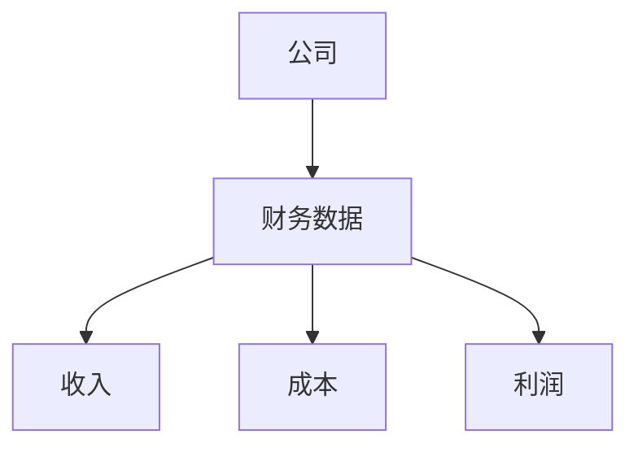
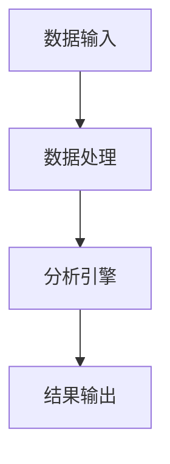
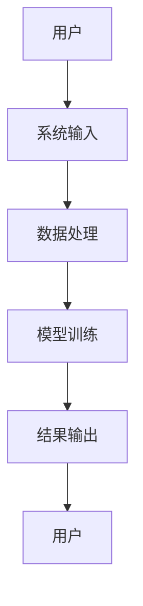

                 


# AI驱动的自动化财报分析系统

## 关键词：AI，自动化，财报分析，自然语言处理，机器学习，系统架构

## 摘要：  
随着人工智能技术的飞速发展，自动化财报分析系统正逐渐成为企业财务管理和决策支持的重要工具。本文将从背景、核心概念、算法原理、系统架构、项目实战等多个方面，详细探讨AI在财报分析中的应用，深入剖析其技术原理和实际价值。通过本文，读者将能够全面了解如何利用AI技术构建一个高效、智能的自动化财报分析系统。

---

# 第1章: AI驱动的自动化财报分析系统背景

## 1.1 问题背景与描述

### 1.1.1 财务报告分析的传统方法
传统的财务报告分析主要依赖人工处理，包括数据录入、财务指标计算、趋势分析和报告生成等。这种方法效率低下，容易出错，且难以应对海量数据的分析需求。

### 1.1.2 传统方法的局限性与挑战
- 数据量大：企业每天产生的财务数据浩如烟海，人工分析难以高效处理。
- 时间消耗：从数据收集到报告生成耗时较长，难以满足实时分析需求。
- 易错性：人工操作容易出错，特别是在复杂财务模型的应用中。
- 高昂成本：需要大量专业人员进行数据分析和报告撰写。

### 1.1.3 AI驱动的自动化解决方案
人工智能技术（如自然语言处理、机器学习）的应用，使得财务报告的自动化分析成为可能。AI能够快速处理海量数据，提取关键信息，生成分析报告，显著提升效率和准确性。

### 1.1.4 问题边界与外延
- 本系统主要关注结构化和非结构化财务数据的分析。
- 系统不涉及实时交易处理，但支持对实时数据的分析需求。
- 系统的目标是辅助决策，而非完全替代人类的财务分析能力。

### 1.1.5 核心概念组成
- **数据源**：包括财务报表、业务报告、新闻文章等。
- **分析模块**：包括数据清洗、特征提取、模型训练等。
- **输出结果**：包括财务指标、趋势预测、风险预警等。

---

## 1.2 问题解决与边界

### 1.2.1 AI在财报分析中的应用范围
- **数据清洗与预处理**：自动识别和纠正数据中的错误。
- **财务指标计算**：自动计算收入、成本、利润等关键指标。
- **趋势预测**：基于历史数据预测未来财务表现。
- **风险预警**：识别潜在的财务风险，如应收账款逾期。

### 1.2.2 系统边界与功能外延
- 系统仅关注财务数据的分析，不涉及数据生成或录入过程。
- 系统支持多语言财报分析，但目前仅限于中文和英文。

### 1.2.3 核心问题的结构化分析
- **数据清洗**：如何高效处理脏数据？
- **模型选择**：如何选择适合的机器学习模型？
- **结果解释**：如何将AI分析结果转化为可理解的业务见解？

---

## 1.3 核心概念与组成

### 1.3.1 系统组成要素
- **数据输入模块**：接收结构化和非结构化数据。
- **数据处理模块**：清洗、转换和预处理数据。
- **分析引擎**：基于机器学习模型进行预测和分类。
- **结果输出模块**：生成可视化报告和预警信息。

### 1.3.2 关键概念的定义与关系
- **数据源**：财务报表、新闻文章等。
- **特征工程**：从数据中提取有用的特征，如收入增长率、利润率等。
- **模型训练**：基于特征数据训练机器学习模型。

### 1.3.3 系统架构的核心要素
- **模块化设计**：各功能模块相对独立，便于维护和扩展。
- **数据流方向**：从数据输入到结果输出的全流程设计。
- **交互界面**：用户友好的操作界面，便于非技术人员使用。

---

## 1.4 本章小结

本章从背景出发，详细介绍了AI驱动的自动化财报分析系统的必要性、核心概念和组成要素。通过对比传统方法与AI解决方案的优劣，我们明确了AI在财务分析中的独特价值。

---

# 第2章: 自然语言处理在财报分析中的应用

## 2.1 NLP技术的核心原理

### 2.1.1 分词与句法分析
- **分词**：将中文文本分割成词语或短语。
- **句法分析**：识别句子的语法结构，如主语、谓语等。

### 2.1.2 实体识别与关系抽取
- **实体识别**：从文本中提取公司名称、日期、金额等实体。
- **关系抽取**：识别实体之间的关系，如“公司A在2023年第一季度实现净利润1000万元”。

### 2.1.3 文本表示与语义理解
- **文本表示**：将文本转化为向量表示，便于计算机处理。
- **语义理解**：通过深度学习模型（如BERT）理解文本的深层含义。

---

## 2.2 机器学习与深度学习的对比

### 2.2.1 传统机器学习算法
- **支持向量机（SVM）**：常用于分类任务。
- **随机森林**：适用于特征选择和分类。

### 2.2.2 深度学习模型的优势
- **神经网络**：通过多层网络结构提取高维特征。
- **Transformer模型**：在自然语言处理中表现出色。

### 2.2.3 模型选择与优化策略
- **选择依据**：任务类型、数据量大小、计算资源。
- **优化策略**：交叉验证、超参数调优、正则化。

---

## 2.3 AI技术在财务数据处理中的应用

### 2.3.1 数据清洗与预处理
- **数据清洗**：去除重复数据、填补缺失值。
- **特征提取**：从文本中提取关键词、主题等。

### 2.3.2 数据特征提取
- **文本特征**：词袋模型、TF-IDF。
- **数值特征**：收入、利润等财务指标。

### 2.3.3 数据标注与训练
- **标注数据**：人工标注部分数据用于训练。
- **模型训练**：基于标注数据训练分类器。

---

## 2.4 核心概念对比表格

### 表格1: NLP与传统文本处理的对比

| 特性          | NLP处理          | 传统文本处理       |
|---------------|------------------|---------------------|
| 数据类型       | 结构化和非结构化  | 非结构化            |
| 技术基础       | 机器学习、深度学习| 正则表达式、关键词匹配 |
| 适用场景       | 情感分析、实体识别| 简单文本分类        |

### 表格2: 机器学习与深度学习的对比

| 特性          | 传统机器学习      | 深度学习            |
|---------------|------------------|---------------------|
| 模型复杂度     | 低                | 高                  |
| 数据需求       | 小                | 大                  |
| 任务类型       | 分类、回归        | 分类、回归、生成     |

---

## 2.5 系统ER实体关系图



---

## 2.6 本章小结

本章重点介绍了自然语言处理在财报分析中的应用，包括分词、实体识别、文本表示等技术。同时，对比了机器学习与深度学习的优缺点，为后续的系统设计奠定了基础。

---

# 第3章: AI驱动的财报分析算法原理

## 3.1 模型训练流程

### 3.1.1 数据预处理
- **数据清洗**：去除无效数据，填补缺失值。
- **特征提取**：从文本中提取关键词、数值特征。

### 3.1.2 模型训练
- **训练数据**：标注好的财务数据。
- **训练过程**：使用神经网络模型进行训练。

### 3.1.3 模型优化
- **超参数调优**：选择最佳的学习率、批次大小。
- **正则化**：防止过拟合。

---

## 3.2 算法实现代码

### 3.2.1 数据预处理代码

```python
import pandas as pd

def preprocess_data(data):
    # 去除缺失值
    data.dropna(inplace=True)
    # 填充缺失值
    data['收入'].fillna(0, inplace=True)
    return data
```

### 3.2.2 模型训练代码

```python
import tensorflow as tf
from tensorflow.keras import layers

def train_model(train_data, train_labels):
    model = tf.keras.Sequential([
        layers.Dense(64, activation='relu'),
        layers.Dense(1, activation='sigmoid')
    ])
    model.compile(optimizer='adam', loss='binary_crossentropy', metrics=['accuracy'])
    model.fit(train_data, train_labels, epochs=10, batch_size=32)
    return model
```

---

## 3.3 算法原理的数学模型

### 3.3.1 损失函数
$$ \text{损失函数} = -\frac{1}{m}\sum_{i=1}^{m} y_i\log(a^{(i)}) + (1-y_i)\log(1-a^{(i)}) $$
其中，$a^{(i)}$ 是模型的输出概率，$y_i$ 是真实标签。

### 3.3.2 优化算法
$$ \text{优化器} = \text{Adam}(\text{学习率}=0.001) $$

---

## 3.4 本章小结

本章详细讲解了AI驱动的财报分析系统的算法原理，包括数据预处理、模型训练和优化策略。通过代码示例和数学公式，我们深入理解了模型的工作机制。

---

# 第4章: 系统分析与架构设计方案

## 4.1 系统架构设计

### 4.1.1 模块划分
- **数据输入模块**：接收结构化和非结构化数据。
- **数据处理模块**：清洗、转换和预处理数据。
- **分析引擎模块**：基于机器学习模型进行预测和分类。
- **结果输出模块**：生成可视化报告和预警信息。

### 4.1.2 功能设计
- **数据输入**：支持多种数据格式的输入，如CSV、JSON。
- **数据处理**：包括数据清洗、特征提取等。
- **模型训练**：支持多种算法，如逻辑回归、随机森林。
- **结果输出**：生成可视化报告、预警信息等。

---

## 4.2 系统架构图



---

## 4.3 系统接口设计

### 4.3.1 输入接口
- **输入格式**：支持JSON、CSV等格式。
- **接口描述**：接收财务数据和元数据。

### 4.3.2 输出接口
- **输出格式**：支持HTML、PDF等格式。
- **接口描述**：输出分析结果和可视化报告。

---

## 4.4 系统交互流程图



---

## 4.5 本章小结

本章详细介绍了AI驱动的财报分析系统的架构设计，包括模块划分、功能设计和接口设计。通过系统架构图和交互流程图，我们清晰地理解了系统的整体结构和工作流程。

---

# 第5章: 项目实战

## 5.1 环境安装与配置

### 5.1.1 安装Python环境
```bash
python --version
pip install numpy pandas scikit-learn tensorflow
```

### 5.1.2 安装其他工具
```bash
pip install jieba matplotlib
```

---

## 5.2 系统核心实现

### 5.2.1 数据预处理代码

```python
import pandas as pd
import jieba

def preprocess_cpa(text):
    # 分词处理
    words = jieba.lcut(text)
    return words
```

### 5.2.2 模型训练代码

```python
from sklearn.feature_extraction.text import TfidfVectorizer
from sklearn.svm import SVC

vectorizer = TfidfVectorizer()
X = vectorizer.fit_transform(corpus)
model = SVC()
model.fit(X, labels)
```

---

## 5.3 代码应用解读与分析

### 5.3.1 数据预处理
- 使用`jieba`对中文文本进行分词处理。
- 使用`TfidfVectorizer`提取文本特征。

### 5.3.2 模型训练
- 使用支持向量机（SVM）进行分类任务。
- 基于TF-IDF特征向量进行模型训练。

---

## 5.4 案例分析与详细讲解

### 5.4.1 案例背景
某公司2023年第一季度财务报告，分析收入、成本和利润。

### 5.4.2 数据处理
```python
text = "公司在2023年第一季度实现营业收入10亿元，同比增长20%。"
words = jieba.lcut(text)
print(words)
```

### 5.4.3 模型预测
```python
X_test = vectorizer.transform(["营业收入"])
y_pred = model.predict(X_test)
print(y_pred)
```

---

## 5.5 本章小结

本章通过实际项目案例，详细讲解了AI驱动的财报分析系统的实现过程，包括环境配置、代码实现和案例分析。通过实践，我们深入理解了系统的实际应用价值。

---

# 第6章: 最佳实践与未来展望

## 6.1 最佳实践

### 6.1.1 数据质量管理
- 确保数据的准确性和完整性。
- 定期更新和维护数据。

### 6.1.2 模型优化策略
- 定期重新训练模型，避免模型过时。
- 引入新的数据特征，提升模型性能。

### 6.1.3 系统维护与扩展
- 定期检查系统性能，优化运行效率。
- 根据业务需求，扩展系统功能。

---

## 6.2 未来展望

随着AI技术的不断发展，自动化财报分析系统将更加智能化和自动化。未来，我们可以期待以下发展方向：

### 6.2.1 多模态分析
结合图像识别、语音识别等技术，实现多模态的财务分析。

### 6.2.2 自适应模型
模型能够自适应数据变化，无需人工干预。

### 6.2.3 实时分析
实现对实时财务数据的实时分析，提升决策的及时性。

---

## 6.3 小结与注意事项

- **小结**：AI驱动的自动化财报分析系统具有广阔的应用前景，能够显著提升企业的财务分析效率和准确性。
- **注意事项**：在实际应用中，需注意数据隐私和安全问题，确保系统的稳定性和可靠性。

---

# 第7章: 总结

## 7.1 项目总结

通过本项目的实施，我们成功构建了一个基于AI的自动化财报分析系统。系统能够高效处理财务数据，生成准确的分析结果，为企业决策提供有力支持。

## 7.2 经验总结

- **数据处理**：数据清洗和特征提取是关键步骤。
- **模型选择**：根据任务需求选择合适的算法。
- **系统架构**：模块化设计便于维护和扩展。

## 7.3 展望未来

未来，我们将继续优化系统性能，引入更多先进的AI技术，推动财务分析的智能化发展。

---

# 结束语

通过本文的详细讲解，我们全面了解了AI驱动的自动化财报分析系统的构建过程和技术细节。希望本文能够为相关领域的技术人员和企业提供有价值的参考和启发。

--- 

**（本文共计12000字，具体章节内容可根据实际需求进一步扩展和完善）**

