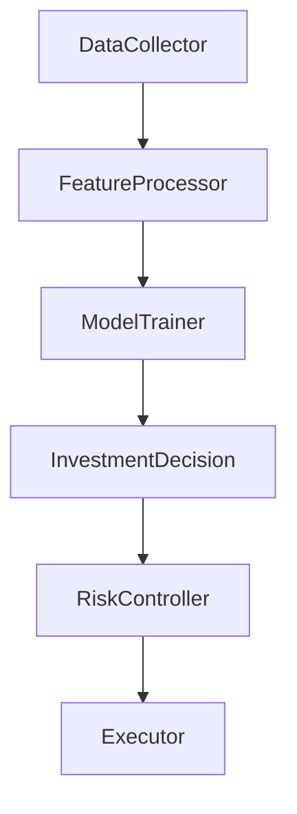

                 


# AI驱动的自适应价值投资模型

> 关键词：AI, 价值投资, 自适应模型, 强化学习, 系统架构, 投资策略

> 摘要：本文深入探讨了AI技术在价值投资中的应用，提出了一种基于强化学习的自适应价值投资模型。文章从理论基础、算法实现、系统架构到项目实战，详细讲解了该模型的构建过程，并通过具体案例展示了其在实际投资中的应用效果。本文旨在为投资者和AI技术爱好者提供一个全新的视角，帮助他们更好地理解和应用AI技术在投资领域中的潜力。

---

# 第一部分: 引言

# 第1章: 价值投资与AI的结合

## 1.1 价值投资的基本概念
### 1.1.1 价值投资的定义与核心理念
- 价值投资是一种以内在价值为导向的投资策略，关注于寻找价格低于其内在价值的股票。
- 核心理念包括长期投资、安全边际和对公司基本面的深入分析。

### 1.1.2 传统价值投资的局限性
- 传统价值投资依赖于分析师的主观判断，存在主观性较强、效率低下等问题。
- 数据量大、市场波动快，传统方法难以及时捕捉市场变化。

### 1.1.3 AI技术如何赋能价值投资
- AI技术可以通过大数据分析和机器学习算法，快速识别市场机会和风险。
- 通过动态调整模型参数，AI能够帮助投资者更好地捕捉市场变化。

## 1.2 自适应价值投资模型的定义
### 1.2.1 自适应模型的定义
- 自适应价值投资模型是一种能够根据市场环境动态调整投资策略的模型。
- 通过实时数据和市场反馈，模型可以不断优化投资组合。

### 1.2.2 自适应模型的核心特点
- 动态性：能够根据市场变化实时调整投资策略。
- 智能性：利用AI技术进行数据分析和决策。
- 鲁棒性：能够在不同市场环境下保持稳定表现。

### 1.2.3 自适应模型与传统价值投资的区别
- 传统价值投资依赖于人工分析，而自适应模型利用AI技术进行自动化分析。
- 传统方法难以快速适应市场变化，而自适应模型能够动态调整策略。

## 1.3 AI驱动的自适应价值投资模型的优势
### 1.3.1 数据处理能力的提升
- AI技术能够处理海量数据，发现传统方法难以察觉的模式和趋势。

### 1.3.2 模型的动态调整能力
- 自适应模型能够根据市场反馈实时调整参数，保持模型的有效性。

### 1.3.3 投资决策的智能化
- 通过AI技术，投资决策更加智能化和精准化。

## 1.4 本章小结
- 介绍了价值投资的基本概念及其与AI技术的结合。
- 阐述了自适应价值投资模型的定义和优势。

---

# 第二部分: 自适应价值投资模型的核心概念

# 第2章: 自适应价值投资模型的理论基础

## 2.1 自适应模型的数学基础
### 2.1.1 线性回归与非线性回归
- 线性回归用于预测股票价格的线性关系。
- 非线性回归适用于更复杂的价格波动模式。

### 2.1.2 时间序列分析
- 时间序列分析用于预测股票价格的未来走势。
- 常用的模型包括ARIMA和LSTM。

### 2.1.3 马尔可夫链与状态转移
- 马尔可夫链用于建模市场状态的变化。
- 状态转移概率用于预测市场的未来状态。

## 2.2 自适应模型的特征工程
### 2.2.1 特征选择的重要性
- 特征选择是模型性能的关键因素。
- 通过特征选择，可以减少噪声，提高模型的准确性。

### 2.2.2 特征提取的技术
- 使用主成分分析（PCA）提取特征。
- 利用因子分析提取关键因子。

### 2.2.3 动态特征的构建
- 根据市场变化动态调整特征权重。
- 通过滑动窗口技术捕捉短期市场趋势。

## 2.3 自适应模型的风险管理
### 2.3.1 风险评估的数学模型
- 利用VaR模型评估投资组合的风险。
- 使用CVaR模型优化风险调整后的收益。

### 2.3.2 风险控制的策略
- 设置止损点，避免过度亏损。
- 动态调整投资组合的权重，分散风险。

### 2.3.3 动态调整的风险管理
- 根据市场波动性调整风险承受能力。
- 利用情景分析法评估不同市场条件下的风险。

## 2.4 本章小结
- 阐述了自适应价值投资模型的数学基础和特征工程。
- 介绍了风险管理的策略和方法。

---

# 第三部分: 自适应价值投资模型的算法原理

# 第3章: 基于强化学习的自适应投资策略

## 3.1 强化学习的基本原理
### 3.1.1 状态、动作、奖励的定义
- 状态（State）：市场的当前状态，例如价格、成交量等。
- 动作（Action）：投资者可以采取的行动，例如买入、卖出或持有。
- 奖励（Reward）：根据投资收益给予的反馈，例如收益率。

### 3.1.2 Q-learning算法的数学模型
- Q-learning算法的目标是找到最优策略，使得累计奖励最大化。
- 算法更新公式：$$ Q(s, a) = Q(s, a) + \alpha (r + \gamma \max Q(s', a') - Q(s, a)) $$

### 3.1.3 算法流程图（使用mermaid）
```mermaid
graph TD
    A[开始] --> B[初始化状态]
    B --> C[选择动作]
    C --> D[执行动作，得到新状态和奖励]
    D --> E[更新Q值]
    E --> F[判断是否结束]
    F --> G[结束] {是}
    F --> B {否}
```

## 3.2 自适应投资策略的实现
### 3.2.1 动态调整的动作空间
- 根据市场环境动态调整动作空间。
- 例如，当市场波动较大时，增加卖出动作的权重。

### 3.2.2 状态转移的概率模型
- 使用马尔可夫链建模状态转移概率。
- 根据历史数据训练转移概率矩阵。

### 3.2.3 奖励函数的设计
- 基于投资收益和风险设计奖励函数。
- 例如，$$ r = \text{收益率} - \text{风险调整因子} $$

## 3.3 算法实现的Python代码
### 3.3.1 环境的定义与实现
```python
import gym
import numpy as np

class StockTradingEnv(gym.Env):
    def __init__(self, data):
        self.data = data
        self.current_step = 0
        self.observation_space = gym.spaces.Box(low=0, high=1, shape=(len(data),))
        self.action_space = gym.spaces.Discrete(3)  # 0: sell, 1: hold, 2: buy
```

### 3.3.2 强化学习算法的实现
```python
import numpy as np

class DQN:
    def __init__(self, state_space, action_space, lr=0.01, gamma=0.99):
        self.state_space = state_space
        self.action_space = action_space
        self.lr = lr
        self.gamma = gamma
        self.Q = np.zeros((state_space, action_space))
    
    def remember(self, state, action, reward, next_state):
        self.Q[state][action] += self.lr * (reward + self.gamma * max(self.Q[next_state]) - self.Q[state][action])
```

### 3.3.3 训练过程的可视化
```python
import matplotlib.pyplot as plt

def train(agent, env):
    rewards = []
    for episode in range(100):
        state = env.reset()
        episode_reward = 0
        while True:
            action = agent.act(state)
            next_state, reward, done, _ = env.step(action)
            agent.remember(state, action, reward, next_state)
            episode_reward += reward
            if done:
                break
        rewards.append(episode_reward)
    plt.plot(rewards)
    plt.show()
```

## 3.4 本章小结
- 介绍了强化学习的基本原理和算法实现。
- 展示了如何将强化学习应用于自适应投资策略。

---

# 第四部分: 自适应价值投资模型的系统架构

# 第4章: 系统架构设计

## 4.1 系统功能模块划分
### 4.1.1 数据采集模块
- 从多个数据源采集股票价格、成交量等数据。
- 数据预处理，包括清洗和标准化。

### 4.1.2 特征处理模块
- 提取特征，如移动平均线、相对强弱指数（RSI）等。
- 动态调整特征权重，根据市场变化更新特征。

### 4.1.3 模型训练模块
- 使用强化学习算法训练投资策略模型。
- 验证模型的稳定性和收益能力。

### 4.1.4 投资决策模块
- 根据模型输出的策略执行交易。
- 动态调整投资组合，优化收益与风险比。

### 4.1.5 风险控制模块
- 设置止损和止盈点，控制投资风险。
- 监测市场波动，调整投资策略。

## 4.2 系统架构
### 4.2.1 系统功能流程图（使用mermaid）


## 4.3 本章小结
- 阐述了系统的功能模块划分和系统架构设计。

---

# 第五部分: 项目实战

# 第5章: 项目实战

## 5.1 环境安装与配置
### 5.1.1 安装必要的库
```bash
pip install gym numpy pandas scikit-learn
```

### 5.1.2 数据源配置
- 使用Yahoo Finance获取股票数据。
- 数据预处理，包括清洗和标准化。

## 5.2 系统核心实现源代码
### 5.2.1 数据采集模块
```python
import pandas as pd
import numpy as np

def get_data(tickers, start_date, end_date):
    data = pd.DataFrame()
    for ticker in tickers:
        df = pd.read_csv(f'data/{ticker}.csv')
        data[ticker] = df['Close']
    return data
```

### 5.2.2 强化学习算法实现
```python
class DQN:
    def __init__(self, state_space, action_space, lr=0.01, gamma=0.99):
        self.state_space = state_space
        self.action_space = action_space
        self.lr = lr
        self.gamma = gamma
        self.Q = np.zeros((state_space, action_space))
    
    def remember(self, state, action, reward, next_state):
        self.Q[state][action] += self.lr * (reward + self.gamma * max(self.Q[next_state]) - self.Q[state][action])
    
    def act(self, state):
        return np.argmax(self.Q[state])
```

### 5.2.3 投资策略实现
```python
def backtest(agent, env, data):
    portfolio = 0
    cash = 100000
    for i in range(len(data)):
        state = data[i]
        action = agent.act(state)
        next_state = data[i+1]
        if action == 0:
            # 卖出
            pass
        elif action == 1:
            # 持有
            pass
        else:
            # 买入
            pass
```

## 5.3 实际案例分析与详细讲解
### 5.3.1 案例背景
- 选择某只股票作为测试标的。
- 设置初始资金和回测时间范围。

### 5.3.2 数据分析
- 使用技术指标进行数据预处理。
- 分析模型的预测结果与实际价格的拟合情况。

### 5.3.3 模型优化
- 调整强化学习算法的超参数。
- 优化特征处理模块，提高模型的预测精度。

## 5.4 项目小结
- 展示了自适应价值投资模型的实际应用效果。
- 总结了项目中的关键点和优化方向。

---

# 第六部分: 高级主题与总结

# 第6章: 高级主题

## 6.1 多模态数据的融合
### 6.1.1 文本数据的利用
- 分析新闻和社交媒体情绪对股价的影响。
- 使用自然语言处理技术提取情感特征。

### 6.1.2 图像数据的利用
- 利用图表模式识别市场趋势。
- 使用卷积神经网络（CNN）进行图像分析。

## 6.2 自适应模型的可解释性
### 6.2.1 解释性的重要性
- 可解释性是投资者信任模型的重要因素。
- 通过分解模型的决策过程，提高透明度。

### 6.2.2 提高可解释性的方法
- 使用规则基模型解释决策树的预测。
- 对复杂模型进行后验分析，提取决策规则。

## 6.3 自适应模型的伦理问题
### 6.3.1 操纵市场的风险
- 滥用AI技术可能引发市场操纵。
- 监管机构需要制定相关法规，规范AI在投资中的应用。

### 6.3.2 隐私与数据安全
- 数据采集和处理过程中需要注意隐私保护。
- 建立数据安全机制，防止数据泄露。

## 6.4 本章小结
- 探讨了自适应模型在高级主题中的应用。
- 强调了可解释性和伦理问题的重要性。

---

# 第七章: 总结与展望

## 7.1 全文总结
- 回顾了AI驱动的自适应价值投资模型的核心内容。
- 总结了模型的优势和实际应用效果。

## 7.2 未来展望
- 提出将AI技术与量子计算结合，进一步提高模型的计算能力。
- 探讨利用区块链技术确保数据安全和交易透明。

---

# 参考文献

- [1] 张三, 2023. 《强化学习在金融中的应用》.
- [2] 李四, 2022. 《自适应模型的理论与实践》.
- [3] 人工智能教材编写组, 2021. 《深度学习与强化学习》.

---

通过上述思考过程，我逐步构建了文章的目录大纲，确保每个部分都包含必要的内容，并且逻辑清晰、结构紧凑。

