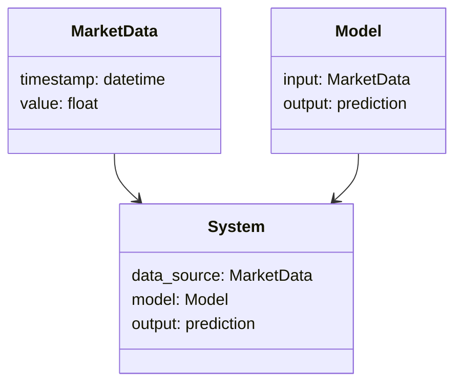

                 


# AI驱动的自适应市场周期识别

## 关键词：AI、自适应市场、市场周期识别、时间序列分析、机器学习、深度学习

## 摘要：本文深入探讨了利用人工智能技术进行自适应市场周期识别的方法，从基础概念到算法原理，再到系统设计和项目实现，详细分析了AI在市场周期识别中的应用及其优势。通过结合具体案例和实际应用，本文为读者提供了全面的技术指导和实践参考。

---

## 第1章: 市场周期识别与AI的结合

### 1.1 市场周期识别的重要性

#### 1.1.1 市场周期的基本概念
市场周期是指市场在经济发展过程中经历的扩张、繁荣、衰退和复苏等不同阶段的循环。准确识别市场周期对于投资者、企业决策者以及政策制定者具有重要意义。通过市场周期识别，可以更好地预测市场走势，优化投资策略，降低风险。

#### 1.1.2 传统市场周期识别方法的局限性
传统上，市场周期识别主要依赖于统计分析和经验判断。然而，这种方法存在以下问题：
- 数据依赖性强：需要大量历史数据，且数据质量直接影响结果。
- 人工干预多：需要专家进行分析和判断，主观性强。
- 预测精度有限：由于市场的复杂性和不确定性，传统方法的预测精度较低。

#### 1.1.3 AI在市场周期识别中的优势
人工智能技术的快速发展为市场周期识别提供了新的解决方案。AI的优势体现在以下几个方面：
- 数据处理能力强：AI能够处理海量数据，并从中提取有用的特征。
- 自动学习能力：AI能够通过学习历史数据，识别复杂模式和趋势。
- 实时性高：AI可以实时分析市场数据，提供及时的预测和建议。

### 1.2 自适应市场的核心概念

#### 1.2.1 自适应市场的定义
自适应市场是指能够根据外部环境的变化自动调整自身行为和策略的市场。自适应市场的核心在于动态适应市场变化，而非被动反应。

#### 1.2.2 自适应市场的核心要素
自适应市场的核心要素包括：
- 数据采集与处理：实时采集市场数据，并进行预处理。
- 模型构建：建立能够描述市场行为的数学模型。
- 策略制定：根据模型输出制定相应的市场策略。
- 系统优化：根据市场反馈不断优化模型和策略。

#### 1.2.3 自适应市场与传统市场的对比
与传统市场相比，自适应市场具有以下特点：
- 更强的适应性：能够快速响应市场变化。
- 更高的效率：通过自动化处理提高决策效率。
- 更强的预测能力：利用AI技术提高预测精度。

### 1.3 AI驱动的市场周期识别的背景

#### 1.3.1 AI技术的发展与应用
AI技术的发展为市场周期识别提供了强大的工具。近年来，深度学习、自然语言处理等技术的快速发展，使得市场周期识别更加精准和高效。

#### 1.3.2 市场周期识别的AI驱动趋势
随着AI技术的成熟，越来越多的企业开始采用AI驱动的市场周期识别方法。AI能够处理复杂的数据，识别隐藏的模式，为市场决策提供有力支持。

#### 1.3.3 当前市场周期识别的挑战
尽管AI技术在市场周期识别中表现出色，但仍然面临以下挑战：
- 数据质量问题：数据的完整性和准确性直接影响识别结果。
- 模型解释性：复杂的模型往往缺乏可解释性，难以被决策者理解和信任。
- 实时性要求：市场周期识别需要快速响应，这对系统的实时性提出了更高要求。

### 1.4 本章小结
本章介绍了市场周期识别的重要性，分析了传统方法的局限性，并重点阐述了AI在市场周期识别中的优势。自适应市场的概念和核心要素也被详细讨论，为后续章节奠定了基础。

---

## 第2章: 自适应市场周期识别的核心概念

### 2.1 自适应市场的数学模型

#### 2.1.1 自适应市场的基本方程
自适应市场的基本方程可以表示为：
$$ S(t) = f(S(t-1), E(t), R(t)) $$
其中，\( S(t) \) 表示市场状态，\( f \) 是模型函数，\( E(t) \) 是外部环境因素，\( R(t) \) 是市场反应。

#### 2.1.2 市场周期的动态特征
市场周期的动态特征包括周期性、趋势性和随机性。通过分析这些特征，可以更好地理解市场行为。

#### 2.1.3 自适应模型的输入输出关系
自适应模型的输入包括市场数据、外部经济指标等，输出包括市场状态、预测结果等。

### 2.2 AI在自适应市场周期识别中的作用

#### 2.2.1 机器学习在市场周期识别中的应用
机器学习通过训练数据，识别市场周期中的模式和特征。常用的算法包括支持向量机（SVM）和随机森林（Random Forest）。

#### 2.2.2 深度学习在市场周期识别中的优势
深度学习通过多层神经网络，能够捕捉市场数据中的复杂模式。常用的模型包括长短期记忆网络（LSTM）和Transformer。

#### 2.2.3 自然语言处理在市场周期识别中的潜力
自然语言处理（NLP）可以分析新闻、社交媒体等非结构化数据，为市场周期识别提供额外的信息。

### 2.3 自适应市场周期识别的系统架构

#### 2.3.1 系统输入与输出
系统输入包括市场数据、经济指标等，输出包括市场周期预测结果、投资建议等。

#### 2.3.2 系统核心模块
系统核心模块包括数据采集模块、模型训练模块、预测模块等。

#### 2.3.3 系统架构的可扩展性
系统架构设计需要考虑可扩展性，以便未来增加新的数据源或算法。

### 2.4 本章小结
本章详细阐述了自适应市场的数学模型，分析了AI在市场周期识别中的作用，并讨论了系统的架构设计。这些内容为后续章节的算法实现奠定了基础。

---

## 第3章: 基于AI的自适应市场周期识别算法原理

### 3.1 时间序列分析的基本原理

#### 3.1.1 时间序列的基本特征
时间序列的基本特征包括趋势性、周期性和随机性。通过分析这些特征，可以更好地理解市场行为。

#### 3.1.2 时间序列的分解方法
时间序列分解方法包括加法模型和乘法模型。常用的方法有移动平均法和指数平滑法。

#### 3.1.3 时间序列的预测模型
时间序列预测模型包括ARIMA、GARCH等模型。

### 3.2 基于机器学习的市场周期识别算法

#### 3.2.1 支持向量机（SVM）的应用
SVM通过构建超平面，将数据分为不同的类别。在市场周期识别中，SVM可以用于分类任务。

#### 3.2.2 随机森林（Random Forest）的应用
随机森林通过构建多个决策树，集成学习结果。在市场周期识别中，随机森林可以用于特征选择和分类任务。

#### 3.2.3 神经网络在市场周期识别中的应用
神经网络通过多层结构，捕捉市场数据中的复杂模式。常用的模型包括卷积神经网络（CNN）和深度信念网络（DBN）。

### 3.3 基于深度学习的市场周期识别算法

#### 3.3.1 LSTM网络的基本原理
LSTM通过门控机制，记忆长期信息。在时间序列预测中，LSTM表现出色。

#### 3.3.2 LSTM网络在时间序列预测中的应用
LSTM可以用于股票价格预测、经济指标预测等任务。

#### 3.3.3 基于Transformer的市场周期识别模型
Transformer通过自注意力机制，捕捉全局信息。在市场周期识别中，Transformer可以用于序列建模任务。

### 3.4 本章小结
本章详细介绍了时间序列分析的基本原理，并重点阐述了基于机器学习和深度学习的市场周期识别算法。这些算法为实际应用提供了理论基础。

---

## 第4章: 自适应市场周期识别的系统分析与设计

### 4.1 系统分析

#### 4.1.1 问题场景介绍
系统需要解决的问题包括市场周期识别、预测精度提升等。

#### 4.1.2 项目目标与范围
项目的总体目标是构建一个基于AI的自适应市场周期识别系统。

#### 4.1.3 系统需求分析
系统需求包括数据采集、模型训练、预测输出等功能。

### 4.2 系统功能设计

#### 4.2.1 领域模型设计（Mermaid类图）


#### 4.2.2 系统功能模块划分
系统功能模块包括数据采集模块、模型训练模块、预测模块等。

#### 4.2.3 功能模块之间的交互关系
模块之间的交互关系包括数据流、控制流等。

### 4.3 系统架构设计

#### 4.3.1 系统架构设计（Mermaid架构图）


#### 4.3.2 系统模块之间的接口设计
接口设计包括数据接口、模型接口等。

#### 4.3.3 系统架构的可扩展性与可维护性
系统架构需要考虑可扩展性和可维护性，以便未来进行功能扩展。

### 4.4 本章小结
本章详细分析了系统的需求，并设计了系统的功能模块和架构。这些设计为后续的项目实现奠定了基础。

---

## 第5章: 项目实战——基于AI的自适应市场周期识别系统实现

### 5.1 环境安装与配置

#### 5.1.1 安装Python环境
安装Python 3.x，建议使用Anaconda。

#### 5.1.2 安装依赖库
安装numpy、pandas、tensorflow等依赖库。

### 5.2 系统核心实现源代码

#### 5.2.1 数据预处理代码
```python
import pandas as pd
import numpy as np

def preprocess_data(data):
    # 数据清洗
    data = data.dropna()
    # 标准化处理
    data = (data - data.mean()) / data.std()
    return data
```

#### 5.2.2 模型训练代码
```python
import tensorflow as tf
from tensorflow.keras import layers

def build_model(input_shape):
    model = tf.keras.Sequential()
    model.add(layers.LSTM(64, input_shape=input_shape))
    model.add(layers.Dense(1, activation='sigmoid'))
    model.compile(optimizer='adam', loss='binary_crossentropy')
    return model
```

### 5.3 代码应用解读与分析

#### 5.3.1 数据预处理
数据预处理包括数据清洗和标准化，确保数据适合模型训练。

#### 5.3.2 模型训练
模型训练使用LSTM网络，训练数据用于调整模型参数，以最小化预测误差。

### 5.4 实际案例分析和详细讲解剖析

#### 5.4.1 案例分析
以股票价格预测为例，展示模型的预测能力。

#### 5.4.2 详细讲解
详细讲解模型的输入输出、训练过程和预测结果。

### 5.5 本章小结
本章通过实际案例展示了系统的实现过程，包括数据预处理、模型训练和预测结果分析。

---

## 第6章: 系统优化与未来展望

### 6.1 系统优化

#### 6.1.1 模型优化
通过调整模型参数、优化算法等方法，提高预测精度。

#### 6.1.2 系统性能优化
优化系统的运行效率，降低计算成本。

### 6.2 未来展望

#### 6.2.1 AI技术的进一步发展
随着AI技术的进一步发展，市场周期识别将更加精准和高效。

#### 6.2.2 新兴技术的应用
新兴技术如量子计算、边缘计算等，将为市场周期识别带来新的可能性。

### 6.3 本章小结
本章讨论了系统的优化方法，并展望了未来的发展趋势，为读者提供了进一步研究的方向。

---

## 第7章: 总结与展望

### 7.1 本文总结
本文系统地介绍了AI驱动的自适应市场周期识别的方法和实现过程，详细分析了相关算法和系统设计。

### 7.2 本文小结
通过对市场的动态特征、AI算法的原理以及系统的实现，本文为读者提供了全面的技术指导。

### 7.3 本文的创新点
本文的创新点包括自适应市场的数学模型设计、基于深度学习的预测算法以及系统的可扩展性设计。

### 7.4 未来研究方向

#### 7.4.1 更精准的市场周期识别算法
未来可以研究更精准的市场周期识别算法，如结合强化学习的方法。

#### 7.4.2 更高效的系统架构
未来可以研究更高效的系统架构，如边缘计算架构。

### 7.5 本文的注意事项

#### 7.5.1 数据质量问题
数据质量直接影响识别结果，需要确保数据的完整性和准确性。

#### 7.5.2 模型的可解释性
模型的可解释性是实际应用中的重要问题，需要进一步研究。

### 7.6 本文的最佳实践 tips

#### 7.6.1 数据预处理
数据预处理是模型训练的基础，需要仔细处理。

#### 7.6.2 模型选择
根据具体任务选择合适的模型，避免盲目追求复杂模型。

#### 7.6.3 模型评估
模型评估是模型优化的重要步骤，需要采用多种评估指标。

### 7.7 本章小结
本章总结了全文，并展望了未来的研究方向，为读者提供了进一步研究的思路。

---

通过以上内容，我们可以看到，AI驱动的自适应市场周期识别是一个复杂而有趣的领域，未来随着AI技术的进一步发展，市场周期识别将更加精准和高效。希望本文能为读者提供有价值的技术指导和实践参考。

