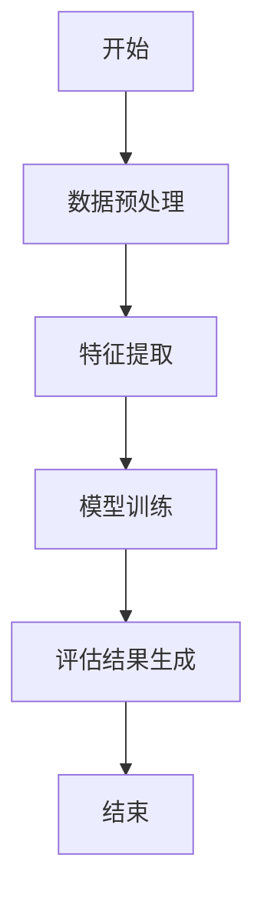
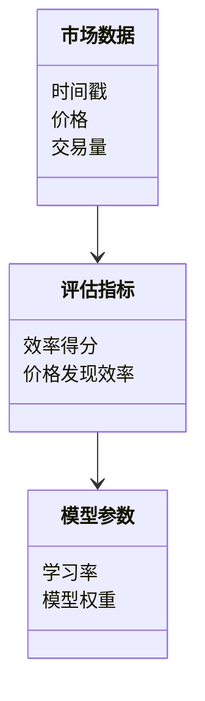
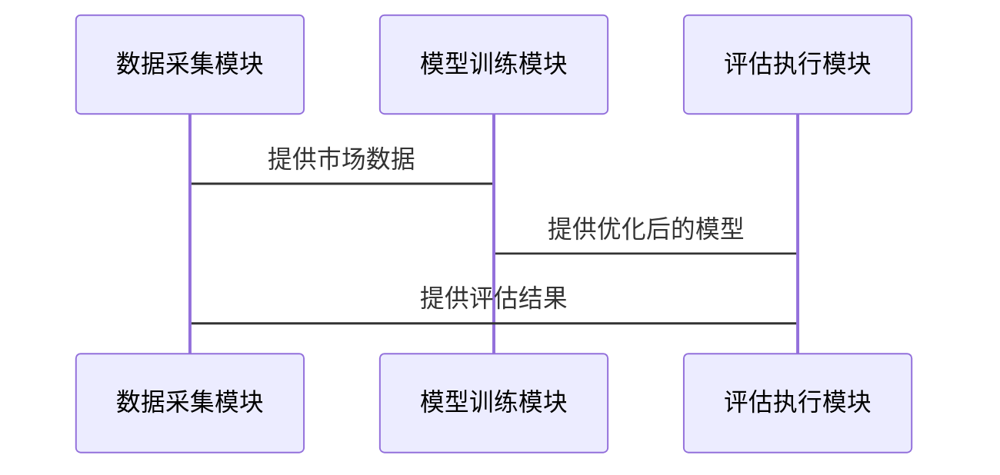

                 


# AI驱动的自适应市场效率评估

> 关键词：AI技术、市场效率评估、自适应评估、算法原理、系统架构设计、数据驱动分析

> 摘要：本文系统地探讨了如何利用人工智能技术实现自适应市场效率评估，从背景介绍、核心概念、算法原理到系统架构设计，再到项目实战，全面解析了AI驱动的自适应市场效率评估的实现方法和应用价值。文章通过详细的理论分析和实际案例，展示了如何利用AI技术提升市场分析的准确性和效率。

---

# 第1章 背景介绍

## 1.1 问题背景

### 1.1.1 传统市场效率评估的局限性
传统市场效率评估方法依赖于固定模型和假设，难以应对市场环境的快速变化。例如，传统模型可能无法有效捕捉市场动态调整的能力，导致评估结果滞后或偏差。

### 1.1.2 AI技术在市场分析中的潜力
AI技术，特别是机器学习和深度学习，能够处理海量数据，发现隐藏的模式，提供实时反馈，从而提升市场效率评估的准确性和及时性。

### 1.1.3 自适应评估的核心价值
自适应评估通过动态调整模型参数和评估指标，能够在市场环境变化时快速响应，提供更精准的评估结果。

## 1.2 问题描述

### 1.2.1 市场效率的多维度评估指标
市场效率可以从价格发现效率、交易成本、流动性等多个维度进行评估。传统方法往往侧重于单一维度，而忽视了整体市场的动态变化。

### 1.2.2 数据驱动的市场分析需求
现代市场分析需要处理结构化和非结构化数据，利用大数据技术提取有价值的信息，从而优化决策过程。

### 1.2.3 自适应评估的定义与目标
自适应评估是一种动态调整评估模型和指标的方法，旨在根据市场环境的变化，实时优化评估结果，提升市场效率。

## 1.3 问题解决

### 1.3.1 AI技术如何提升市场效率评估
通过AI技术，可以实现对市场数据的实时监控、动态建模和智能优化，从而提升市场效率评估的准确性和效率。

### 1.3.2 自适应评估的实现路径
自适应评估的核心在于动态调整模型参数和评估指标，通过反馈机制不断优化评估结果。

### 1.3.3 技术与业务的结合点
AI技术与市场分析的结合点在于数据处理、模型构建和结果应用。通过技术驱动业务，实现市场效率的动态优化。

## 1.4 边界与外延

### 1.4.1 自适应评估的适用范围
自适应评估适用于市场环境变化频繁、数据丰富的场景，如金融交易、电子商务等领域。

### 1.4.2 与其他市场分析方法的对比
与传统方法相比，自适应评估具有更高的灵活性和实时性，但实现复杂度较高，需要大量数据和技术支持。

### 1.4.3 技术实现的边界条件
自适应评估的实现依赖于高质量的数据输入、高效的计算能力以及合理的模型设计。

## 1.5 概念结构与核心要素

### 1.5.1 自适应评估的系统架构
自适应评估系统通常包括数据采集、模型构建、评估执行和结果反馈四个模块。

### 1.5.2 核心要素的分解与关联
核心要素包括市场数据、评估指标、模型参数、反馈机制等，这些要素通过动态交互实现自适应评估。

### 1.5.3 系统的核心功能模块
包括数据预处理、模型训练、评估执行和结果分析四大模块。

## 1.6 本章小结

---

# 第2章 核心概念与联系

## 2.1 核心概念原理

### 2.1.1 AI驱动的市场分析原理
AI驱动的市场分析通过机器学习算法，从海量数据中提取特征，构建预测模型，实现对市场趋势的实时预测。

### 2.1.2 自适应评估的算法基础
自适应评估算法通常基于在线学习和强化学习，能够在动态环境中不断优化模型参数。

### 2.1.3 市场效率的多维度评估模型
市场效率评估模型需要综合考虑多个维度，如价格发现效率、交易成本、流动性等。

## 2.2 概念属性特征对比表格

| 特征对比 | 传统市场评估 | 自适应评估 |
|----------|--------------|------------|
| 数据来源 | 固定数据集    | 动态数据流 |
| 模型调整 | 静态模型      | 动态调整    |
| 评估频率 | 定期评估      | 实时评估    |
| 精度要求 | 较低          | 较高        |

## 2.3 ER实体关系图

```mermaid
erDiagram
    市场数据 {
        <属性> 时间戳
        <属性> 价格
        <属性> 交易量
        <属性> 市场参与者
    }
    评估指标 {
        <属性> 效率得分
        <属性> 价格发现效率
        <属性> 交易成本
    }
    模型参数 {
        <属性> 学习率
        <属性> 模型权重
        <属性> 优化目标
    }
    市场数据 --> 评估指标
    评估指标 --> 模型参数
```

## 2.4 本章小结

---

# 第3章 算法原理讲解

## 3.1 自适应评估算法概述

### 3.1.1 自适应评估的核心算法
自适应评估算法通常基于在线学习和强化学习，能够在动态环境中不断优化模型参数。

### 3.1.2 算法的输入输出关系
输入包括市场数据和模型参数，输出包括评估结果和优化后的模型参数。

### 3.1.3 算法的优化目标
优化目标通常包括最大化评估准确性和最小化评估误差。

## 3.2 算法流程图



## 3.3 算法实现代码

```python
def adaptive_assessment(data):
    # 数据预处理
    processed_data = preprocess(data)
    # 特征提取
    features = extract_features(processed_data)
    # 模型训练
    model = train_model(features)
    # 评估结果生成
    result = model.predict(features)
    return result
```

## 3.4 算法数学模型

自适应评估模型通常基于以下数学公式：

$$
y = f(x) + \epsilon
$$

其中，$y$ 是评估结果，$x$ 是市场数据，$f$ 是模型函数，$\epsilon$ 是误差项。

## 3.5 本章小结

---

# 第4章 系统分析与架构设计方案

## 4.1 问题场景介绍

### 4.1.1 问题背景
市场环境复杂多变，传统的市场效率评估方法难以满足实时性和准确性要求。

### 4.1.2 项目介绍
本项目旨在利用AI技术构建一个自适应市场效率评估系统，实现对市场效率的动态评估和优化。

## 4.2 系统功能设计

### 4.2.1 领域模型


### 4.2.2 系统架构设计


### 4.2.3 系统接口设计
系统主要接口包括数据输入接口、模型训练接口和评估结果输出接口。

### 4.2.4 系统交互


## 4.3 本章小结

---

# 第5章 项目实战

## 5.1 环境安装

### 5.1.1 安装Python
```bash
pip install python3
```

### 5.1.2 安装AI框架
```bash
pip install tensorflow numpy
```

## 5.2 系统核心实现

### 5.2.1 数据预处理代码
```python
def preprocess(data):
    # 数据清洗和特征提取
    processed_data = data.dropna()
    return processed_data
```

### 5.2.2 模型训练代码
```python
def train_model(features):
    # 构建模型并训练
    model = tf.keras.Sequential()
    model.add(tf.keras.layers.Dense(64, activation='relu'))
    model.add(tf.keras.layers.Dense(1))
    model.compile(optimizer='adam', loss='mean_squared_error')
    model.fit(features, labels, epochs=10)
    return model
```

### 5.2.3 评估结果生成代码
```python
def evaluate(model, new_features):
    # 使用训练好的模型进行评估
    result = model.predict(new_features)
    return result
```

## 5.3 代码应用解读与分析

### 5.3.1 数据预处理
数据预处理是确保模型输入数据的质量和一致性，通常包括数据清洗、特征提取和标准化。

### 5.3.2 模型训练
模型训练是利用训练数据调整模型参数，使其能够准确预测市场效率评估结果。

### 5.3.3 评估结果生成
评估结果生成是利用训练好的模型对新的市场数据进行评估，输出评估结果。

## 5.4 实际案例分析

### 5.4.1 案例背景
假设我们有一个股票市场数据集，包含股票价格、交易量等信息。

### 5.4.2 数据处理与建模
通过数据预处理提取特征，构建并训练模型。

### 5.4.3 评估结果分析
通过评估结果分析模型的准确性和鲁棒性，优化模型参数。

## 5.5 本章小结

---

# 第6章 总结与展望

## 6.1 本章总结
本文系统地探讨了AI驱动的自适应市场效率评估的实现方法和应用价值，通过理论分析和实际案例，展示了如何利用AI技术提升市场分析的准确性和效率。

## 6.2 未来展望
未来，随着AI技术的不断发展，自适应市场效率评估将更加智能化和实时化，为市场分析提供更强大的工具。

## 6.3 最佳实践 tips
在实际应用中，建议结合具体业务需求，选择合适的AI算法和模型，确保数据质量和模型优化。

## 6.4 注意事项
在实现过程中，需要注意数据隐私和模型稳定性，确保系统的可靠性和安全性。

## 6.5 拓展阅读
推荐读者进一步阅读《机器学习实战》和《深度学习》等相关书籍，深入了解AI技术的应用。

## 6.6 本章小结

---

# 结语

通过本文的详细讲解，读者可以全面了解AI驱动的自适应市场效率评估的核心概念、算法原理和实现方法，为实际应用提供理论支持和实践指导。

