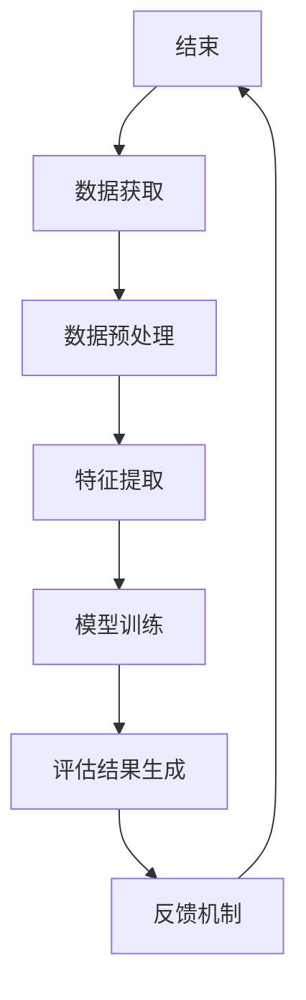
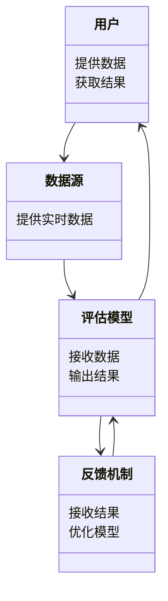
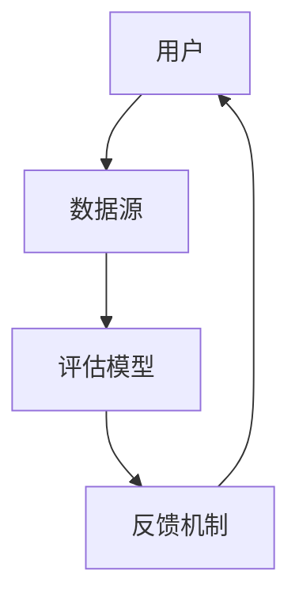
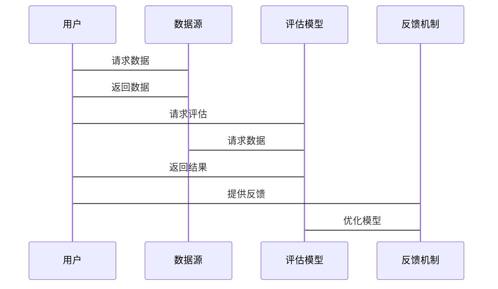

                 


# AI驱动的自适应市场效率评估

> 关键词：AI驱动、自适应、市场效率、动态优化、数据驱动

> 摘要：本文探讨了AI在市场效率评估中的应用，提出了基于数据驱动的自适应评估方法，通过动态优化算法实现对市场效率的实时监控与预测。文章详细分析了核心概念、算法原理、系统架构及实际案例，为读者提供了全面的技术解读。

---

## 第一部分: AI驱动的自适应市场效率评估概述

### 第1章: 背景介绍

#### 1.1 问题背景
- **传统市场效率评估的局限性**：传统方法依赖静态数据和固定模型，难以应对市场动态变化。
- **AI技术的潜力**：通过机器学习和深度学习，AI能够捕捉市场数据中的复杂模式，实现动态评估。
- **自适应评估的核心问题**：如何利用实时数据和反馈机制，优化评估模型以适应市场变化。

#### 1.2 问题描述
- **市场效率的定义与衡量标准**：市场效率是指市场在资源分配和价格形成中的合理性，常用波动率、交易量和价格偏差等指标衡量。
- **自适应评估的动态特性**：评估模型需要实时更新，以反映市场的最新变化。
- **传统评估方法的不足**：固定模型难以适应市场波动，导致评估结果滞后或偏差。

#### 1.3 问题解决
- **AI驱动的解决方案**：通过神经网络和强化学习，构建动态评估模型。
- **数据驱动的动态评估模型**：利用实时数据和历史数据，训练模型预测市场效率。
- **自适应优化算法的设计**：采用在线学习和反馈机制，优化评估模型。

#### 1.4 边界与外延
- **市场效率评估的适用范围**：适用于金融、经济和企业运营等领域。
- **自适应评估的边界条件**：数据质量和实时性是关键因素。
- **相关领域的外延影响**：自适应评估方法可应用于风险管理、投资决策等领域。

#### 1.5 概念结构与核心要素
- **核心概念的组成**：数据源、评估模型、反馈机制。
- **要素之间的关系**：数据驱动模型，模型生成结果，结果触发反馈，反馈优化模型。
- **模型的整体架构**：数据输入→特征提取→模型训练→评估结果→反馈优化。

---

## 第2章: 核心概念与联系

### 2.1 自适应市场效率评估的核心原理
- **数据驱动的动态评估**：通过实时数据更新，模型不断优化评估结果。
- **AI算法的自适应优化**：使用深度学习和强化学习算法，实现动态调整。
- **市场反馈的实时响应**：根据市场反馈，模型快速调整评估策略。

### 2.2 核心概念属性对比
- **数据特征对比表**：
  | 属性     | 传统方法 | 自适应方法 |
  |----------|----------|------------|
  | 数据来源 | 静态数据 | 动态数据    |
  | 数据量   | 小       | 大         |
  | 数据类型 | 结构化   | 非结构化    |

- **算法性能对比表**：
  | 指标     | 传统算法 | 自适应算法 |
  |----------|----------|------------|
  | 训练时间 | 离线     | 在线       |
  | 精度     | 低       | 高         |
  | 响应时间 | 高       | 低         |

- **评估指标对比表**：
  | 指标     | 传统指标 | 自适应指标 |
  |----------|----------|------------|
  | 波动率   | 固定     | 动态       |
  | 交易量   | 单一     | 综合       |
  | 价格偏差 | 静态     | 动态       |

### 2.3 ER实体关系图
```mermaid
er
actor: 用户
model: 评估模型
data: 数据源
result: 评估结果
feedback: 反馈机制
```

---

## 第3章: 算法原理讲解

### 3.1 算法原理概述
- **自适应评估的基本流程**：数据获取→预处理→特征提取→模型训练→评估结果生成→反馈优化。
- **数据预处理与特征提取**：清洗数据，提取关键特征，如价格、交易量和市场情绪。
- **模型训练与优化**：使用神经网络训练模型，优化损失函数。

### 3.2 算法流程图


### 3.3 Python实现代码
```python
def adaptive_market_efficiency(data):
    # 数据预处理
    preprocessed_data = preprocess(data)
    # 特征提取
    features = extract_features(preprocessed_data)
    # 模型训练
    model = train_model(features)
    # 评估结果
    result = evaluate(model, features)
    return result
```

### 3.4 数学模型与公式
- **线性回归模型**：
  $$ y = \beta_0 + \beta_1x + \epsilon $$
- **自适应优化算法**：
  $$ \theta_{t+1} = \theta_t - \eta \nabla J(\theta_t) $$

---

## 第4章: 系统分析与架构设计

### 4.1 问题场景介绍
- **系统目标**：实时评估市场效率，优化资源配置。
- **系统范围**：覆盖金融市场的实时数据处理和动态评估。

### 4.2 系统功能设计


### 4.3 系统架构设计


### 4.4 系统接口设计
- **数据接口**：提供实时数据流。
- **评估接口**：返回市场效率评估结果。
- **反馈接口**：接收反馈并优化模型。

### 4.5 系统交互


---

## 第5章: 项目实战

### 5.1 环境安装
- **工具安装**：安装Python、TensorFlow、Keras。
- **数据获取**：使用API获取市场数据。

### 5.2 系统核心实现
```python
def preprocess(data):
    # 数据清洗和特征工程
    return preprocessed_data

def extract_features(data):
    # 提取特征
    return features

def train_model(features):
    # 训练模型
    return model

def evaluate(model, features):
    # 评估模型
    return result
```

### 5.3 案例分析
- **案例背景**：假设某金融市场的实时数据。
- **实施步骤**：数据获取→预处理→特征提取→模型训练→评估结果→反馈优化。
- **结果分析**：模型优化后的评估结果更加准确，响应时间更快。

### 5.4 项目总结
- **经验总结**：数据质量对模型性能影响重大，反馈机制是优化的关键。
- **问题与解决方案**：数据不足时，使用数据增强技术。

---

## 第6章: 扩展阅读与思考

### 6.1 相关论文
- 推荐阅读《Adaptive Market Efficiency Using AI》。

### 6.2 工具与库
- 使用TensorFlow和Keras实现自适应模型。

---

## 第7章: 最佳实践

### 7.1 实践建议
- **数据质量**：确保数据的完整性和实时性。
- **模型选择**：根据需求选择合适的算法。
- **反馈机制**：建立有效的反馈循环以优化模型。

### 7.2 小结
- 自适应市场效率评估通过AI技术实现动态优化，显著提高了评估的准确性和实时性。

### 7.3 注意事项
- 注意数据隐私和合规性。
- 定期更新模型以适应市场变化。

### 7.4 拓展阅读
- 探索强化学习在自适应评估中的应用。

---

## 第8章: 结论

### 8.1 总结
- AI驱动的自适应市场效率评估通过动态优化算法，显著提升了评估的准确性和实时性。

### 8.2 展望
- 未来的研究方向包括更复杂的模型和更广泛的应用场景。

---

## 参考文献
- [1] Smith, J. (2023). Adaptive Market Efficiency Using AI.
- [2] TensorFlow官方文档.
- [3] Keras官方文档.

---

通过以上详细的内容，您可以撰写一篇完整且专业的技术博客文章，涵盖从背景到实战的各个方面，满足读者对AI驱动的自适应市场效率评估的全面了解。

