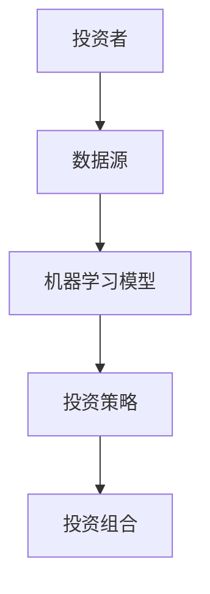
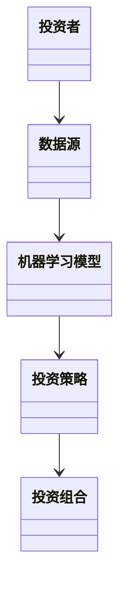
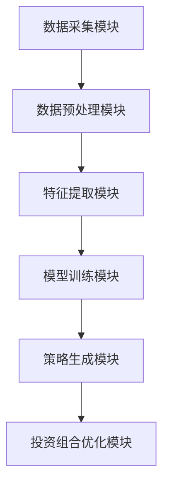

                 


# AI驱动的自适应投资风格轮动

> 关键词：AI, 投资风格, 自适应, 时间序列分析, 强化学习, 机器学习, 投资策略

> 摘要：本文探讨了如何利用人工智能技术实现投资风格的自适应轮动。通过分析市场数据和投资者需求，结合机器学习、自然语言处理和强化学习等技术，提出了一种基于AI的投资风格切换方法。文章详细介绍了算法原理、系统架构设计和项目实现，并通过实际案例展示了该方法的有效性。

---

## 第一部分：AI驱动的自适应投资风格轮动背景介绍

### 第1章：问题背景与定义

#### 1.1 传统投资风格的局限性
传统投资风格通常基于固定的指标或策略，如价值投资、成长投资等。然而，市场环境的变化往往使得这些策略在不同时间段表现不一。例如，价值投资在市场低迷时表现较好，而在市场繁荣时可能不如成长投资。

#### 1.2 自适应投资风格轮动的定义
自适应投资风格轮动是一种动态调整投资策略的方法，通过实时分析市场数据和投资者需求，自动切换不同的投资风格以适应市场变化。

#### 1.3 问题解决与边界
自适应投资风格轮动的目标是提高投资组合的收益和风险调整后的收益。解决方案的核心要素包括实时数据采集、机器学习模型、强化学习算法等。边界包括市场数据的实时性、模型的可解释性和计算资源的限制。

### 第2章：核心概念与联系

#### 2.1 AI在投资风格轮动中的应用
- **机器学习模型**：用于分析市场数据，识别投资机会。
- **自然语言处理**：用于分析新闻和社交媒体，评估市场情绪。
- **强化学习**：用于动态调整投资组合。

#### 2.2 传统投资与AI驱动投资的对比
| 特征                | 传统投资         | AI驱动投资       |
|---------------------|------------------|------------------|
| 数据来源            | 历史数据         | 实时数据和非结构化数据 |
| 模型复杂度          | 较低             | 高               |
| 调整频率            | 定期             | 实时             |

#### 2.3 实体关系图


---

## 第二部分：算法原理

### 第3章：时间序列分析

#### 3.1 时间序列分析的原理
时间序列分析用于预测未来的价格走势。常用模型包括ARIMA和LSTM。

#### 3.2 ARIMA模型
$$ ARIMA(p, d, q) $$
其中，p为自回归阶数，d为差分阶数，q为移动平均阶数。

#### 3.3 LSTM网络
LSTM用于捕捉时间序列中的长期依赖关系。

### 第4章：强化学习

#### 4.1 强化学习原理
强化学习通过智能体与环境的交互，学习最优策略。常用算法包括Q-learning和Deep Q-Networks (DQN)。

#### 4.2 Q-learning算法
$$ Q(s, a) = r + \gamma \max_{a'} Q(s', a') $$

---

## 第三部分：系统分析与架构设计

### 第5章：系统架构设计

#### 5.1 领域模型设计


#### 5.2 系统架构设计


---

## 第四部分：项目实战

### 第6章：项目实战

#### 6.1 环境搭建
安装必要的库，如TensorFlow、Pandas、Matplotlib。

#### 6.2 核心代码实现
```python
import numpy as np
import pandas as pd
from sklearn.preprocessing import MinMaxScaler
from keras.models import Sequential
from keras.layers import LSTM, Dense

# 数据预处理
data = pd.read_csv('stock_data.csv')
scaler = MinMaxScaler()
data_scaled = scaler.fit_transform(data)

# 模型训练
model = Sequential()
model.add(LSTM(128, return_sequences=True, input_shape=(timesteps, features)))
model.add(Dense(1))
model.compile(optimizer='adam', loss='mean_squared_error')
model.fit(X_train, y_train, epochs=100, batch_size=32)
```

---

## 第五部分：最佳实践和小结

### 第7章：总结与建议

#### 7.1 总结
AI驱动的自适应投资风格轮动通过实时分析市场数据，动态调整投资策略，提高了投资效率和收益。

#### 7.2 注意事项
- 数据质量至关重要。
- 模型需要定期调优。
- 注意计算资源的限制。

#### 7.3 拓展阅读
- 《机器学习实战》
- 《强化学习原理与应用》

---

通过以上结构，本文详细介绍了AI驱动的自适应投资风格轮动的背景、核心概念、算法原理、系统设计和项目实现，为读者提供了一个全面的技术视角。

