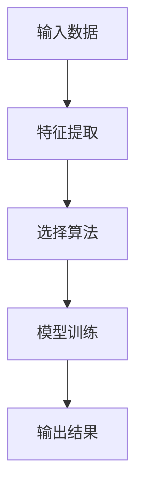
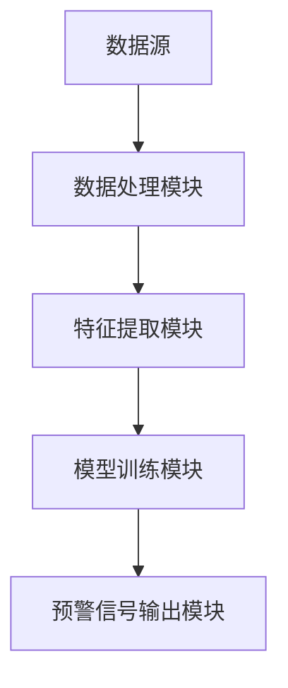
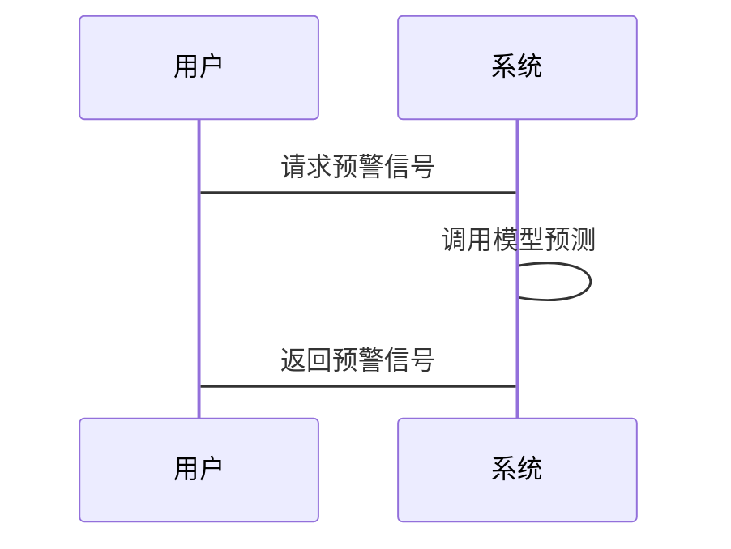

                 


# AI驱动的自适应投资风险预警

> 关键词：AI、投资风险预警、自适应系统、机器学习、深度学习、时间序列分析、系统架构

> 摘要：本文将详细探讨AI驱动的自适应投资风险预警系统的核心原理、算法实现和系统设计。通过分析投资风险预警的背景与挑战，结合机器学习和深度学习的算法原理，设计一套基于时间序列分析的自适应预警模型，并通过实际案例展示系统的实现与应用。

---

# 第1章: 投资风险预警的背景与挑战

## 1.1 投资风险预警的定义与重要性

### 1.1.1 投资风险的定义
投资风险是指在投资过程中，由于市场波动、经济周期变化或其他不可预见因素，导致投资收益低于预期甚至出现损失的可能性。有效的风险预警系统能够提前识别潜在风险，帮助投资者采取应对措施，从而降低损失。

### 1.1.2 风险预警的核心作用
风险预警系统通过实时监测市场数据，利用数据分析和机器学习算法，识别潜在的风险信号，并发出预警。其核心作用包括：
- 提前发现潜在风险，减少投资损失。
- 帮助投资者做出快速决策，抓住市场机会。
- 提高风险管理的效率和准确性。

### 1.1.3 数字化时代的投资风险管理
在数字化时代，数据的爆炸式增长和计算能力的提升为投资风险管理提供了新的可能性。通过AI技术，可以实时处理海量数据，发现隐藏的风险信号，从而构建更加智能和自适应的风险预警系统。

---

## 1.2 AI在投资风险管理中的应用背景

### 1.2.1 传统投资风险管理的局限性
传统投资风险管理主要依赖人工分析和简单的统计模型，存在以下问题：
- 数据处理能力有限，难以应对海量数据。
- 预警模型静态，难以适应市场变化。
- 风险识别的及时性不足，容易错过最佳应对时机。

### 1.2.2 AI技术的兴起与投资领域的结合
随着AI技术的快速发展，特别是在深度学习和自然语言处理领域的突破，AI开始广泛应用于投资领域。AI能够处理复杂的数据模式，发现传统方法难以察觉的潜在风险。

### 1.2.3 自适应投资风险预警的必要性
市场环境复杂多变，单一的、固定的预警模型难以应对各种突发情况。自适应系统能够根据市场变化动态调整预警策略，提高预警的准确性和实用性。

---

## 1.3 问题背景与目标

### 1.3.1 投资风险预警的核心问题
- 如何从海量数据中提取有效的风险特征。
- 如何构建动态调整的预警模型。
- 如何实现多维度、多层次的风险预警。

### 1.3.2 问题解决的边界与外延
- 边界：限定于投资领域的风险预警，不涉及其他领域。
- 外延：通过AI技术实现动态调整和自适应优化。

### 1.3.3 自适应预警的目标与意义
目标是构建一个能够实时监测市场数据，动态调整预警模型的自适应系统。其意义在于提高风险管理的智能化水平，帮助投资者更好地应对市场波动。

---

# 第2章: AI在投资风险预警中的核心概念

## 2.1 数据驱动的特征提取

### 2.1.1 数据特征的分类与选择
数据特征可以分为定量特征（如价格、成交量）和定性特征（如新闻情绪）。选择特征时需要考虑特征的相关性、重要性和可解释性。

### 2.1.2 时间序列数据的特征提取
时间序列数据具有趋势性和周期性，可以通过差分、移动平均等方法提取特征。

### 2.1.3 文本数据与情感分析
通过对新闻、社交媒体等文本数据进行情感分析，提取市场情绪特征。

---

## 2.2 AI算法与模型选择

### 2.2.1 机器学习算法的适用场景
- 监督学习：适用于有标签的数据，如回归分析。
- 非监督学习：适用于无标签的数据，如聚类分析。

### 2.2.2 深度学习模型的优势
- LSTM：适用于时间序列数据的建模。
- Transformer：适用于长文本和多模态数据。

### 2.2.3 混合模型的应用潜力
将机器学习和深度学习模型结合，利用各自的优势进行特征提取和风险预测。

---

## 2.3 风险预警机制的设计

### 2.3.1 预警指标的构建
- 综合市场情绪、波动率等多维度指标。
- 使用层次分析法（AHP）确定各指标的权重。

### 2.3.2 预警阈值的动态调整
- 根据市场变化动态调整阈值。
- 使用反馈机制优化阈值。

### 2.3.3 多维度预警信号的整合
- 通过加权融合模型整合多源信号。
- 使用逻辑回归模型进行综合判断。

---

## 2.4 自适应系统的实现

### 2.4.1 自适应机制的定义
自适应机制是指系统能够根据市场变化自动调整模型参数和预警策略。

### 2.4.2 系统自适应的实现路径
- 实时数据监测。
- 动态模型更新。
- 预警策略优化。

### 2.4.3 自适应模型的优化策略
- 使用在线学习算法。
- 结合强化学习进行策略优化。

---

# 第3章: 机器学习算法原理

## 3.1 监督学习与回归分析

### 3.1.1 线性回归模型
线性回归是一种简单但有效的回归模型，适用于线性关系的预测。

$$ y = \beta_0 + \beta_1x + \epsilon $$

### 3.1.2 逻辑回归模型
逻辑回归用于分类问题，可以将连续的预测值映射到0和1之间。

$$ P(y=1|x) = \frac{e^{\beta_0 + \beta_1x}}{1 + e^{\beta_0 + \beta_1x}} $$

---

## 3.2 非监督学习与聚类分析

### 3.2.1 K-means聚类算法
K-means是一种常用的无监督聚类算法，适用于将数据划分为若干簇。

$$ \text{目标函数} = \sum_{i=1}^{k} \sum_{j=1}^{n} (x_{ij} - c_j)^2 $$

### 3.2.2 层次聚类算法
层次聚类通过构建树状结构将数据逐步聚类。

---

## 3.3 神经网络与深度学习

### 3.3.1 多层感知机（MLP）
MLP是一种典型的神经网络模型，适用于复杂的非线性关系。

### 3.3.2 长短期记忆网络（LSTM）
LSTM适用于时间序列数据的建模，能够捕捉长距离依赖。

### 3.3.3 卷积神经网络（CNN）
CNN适用于图像和文本数据的特征提取。

---

## 3.4 算法原理的Mermaid流程图


---

## 3.5 Python代码示例
```python
import numpy as np
from sklearn.linear_model import LinearRegression

# 示例数据
X = np.array([[1], [2], [3], [4]])
y = np.array([2, 4, 6, 8])

# 线性回归模型
model = LinearRegression()
model.fit(X, y)

# 预测
print(model.predict([[5]]))  # 输出 [10.]
```

---

# 第4章: 系统分析与架构设计

## 4.1 问题场景介绍
系统需要实时监测金融市场数据，识别潜在风险信号，并发出预警。

## 4.2 系统功能设计
- 数据采集与处理：实时采集市场数据和文本数据。
- 特征提取：提取有效特征并构建特征库。
- 模型训练与部署：训练预警模型并部署到生产环境。
- 预警信号输出：通过可视化界面或API输出预警信号。

## 4.3 系统架构设计


---

## 4.4 系统接口设计
- 数据接口：提供REST API用于数据输入和输出。
- 预警接口：提供实时预警信号的订阅接口。

---

## 4.5 系统交互序列图


---

# 第5章: 项目实战

## 5.1 环境配置
- 安装Python和必要的库：numpy、pandas、scikit-learn、tensorflow。
- 配置数据源：股票数据API或数据库。

---

## 5.2 核心代码实现

### 5.2.1 数据处理模块
```python
import pandas as pd
import requests

# 获取股票数据
def get_stock_data(ticker):
    url = f"https://api.example.com/stock/{ticker}"
    response = requests.get(url)
    return pd.DataFrame(response.json())
```

### 5.2.2 特征提取模块
```python
from sklearn.feature_selection import SelectKBest, chi2

def extract_features(data):
    selector = SelectKBest(score_func=chi2, k=5)
    features = selector.fit_transform(data)
    return features
```

### 5.2.3 模型训练模块
```python
from sklearn.ensemble import RandomForestClassifier

def train_model(features, labels):
    model = RandomForestClassifier()
    model.fit(features, labels)
    return model
```

---

## 5.3 案例分析
以某股票为例，展示系统如何识别潜在风险信号并发出预警。

---

## 5.4 项目总结
通过实际案例验证了系统的有效性和实用性，为后续优化提供了方向。

---

# 第6章: 最佳实践与总结

## 6.1 小结
本文详细介绍了AI驱动的自适应投资风险预警系统的核心概念、算法原理和系统设计，并通过实际案例展示了系统的实现过程。

## 6.2 注意事项
- 数据质量对模型性能影响重大，需确保数据的准确性和完整性。
- 模型的动态调整需要实时数据和快速计算能力。

## 6.3 拓展阅读
- 《机器学习实战》
- 《深度学习入门》
- 《时间序列分析》

---

通过本文的分析，读者可以深入了解AI在投资风险预警中的应用，并为实际应用提供参考。

