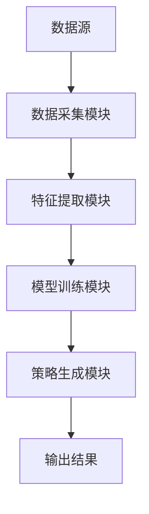
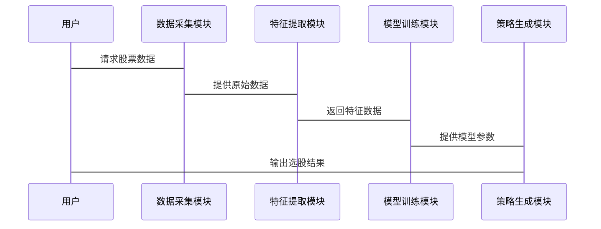

                 


# AI驱动的费雪成长型股票筛选系统

**关键词**: AI, 股票筛选, 费雪成长型, 机器学习, 投资策略

**摘要**: 本文系统地介绍了如何利用人工智能技术构建费雪成长型股票筛选系统，从理论基础到算法实现，再到系统设计和优化，详细探讨了AI在股票筛选中的应用，结合数学模型和实际案例，为读者提供了一套完整的解决方案。

---

# 第1章: 费雪成长型股票筛选系统的背景与目标

## 1.1 费雪成长型投资策略概述

### 1.1.1 费雪投资理论的核心思想
菲利普·费雪是成长型投资策略的鼻祖，他提出了“买便宜的优秀公司”的理念。费雪认为，投资者应该投资那些具有持续增长潜力的公司，而不仅仅是关注价格波动。

### 1.1.2 费雪成长型股票的定义与特征
费雪成长型股票是指那些具有持续增长的收入和利润，且具备强大竞争优势的公司。这些公司通常在各自的行业中占据领先地位，具有较高的毛利率和净利润率。

### 1.1.3 费雪选股标准与筛选流程
费雪选股标准包括以下几个方面：
1. **收入与利润增长**: 公司过去几年的收入和利润必须保持稳定的增长。
2. **股东权益收益率**: 公司的ROE（股东权益收益率）必须高于行业平均水平。
3. **营业利润率**: 公司的营业利润率必须保持在较高水平。
4. **管理层质量**: 公司的管理层必须具备良好的声誉和管理能力。

## 1.2 AI在金融投资中的应用前景

### 1.2.1 AI在股票筛选中的优势
人工智能技术可以处理大量的数据，发现人类难以察觉的模式，从而提高股票筛选的准确性和效率。

### 1.2.2 AI驱动投资决策的典型场景
AI可以在股票筛选、风险控制、投资组合优化等领域发挥重要作用。

### 1.2.3 费雪成长型股票筛选中的AI应用潜力
通过AI技术，可以自动筛选出符合费雪选股标准的公司，同时还可以预测公司的未来增长潜力。

## 1.3 本书的目标与结构

### 1.3.1 本书的核心目标
本书旨在介绍如何利用AI技术构建费雪成长型股票筛选系统，帮助投资者发现具有持续增长潜力的优秀公司。

### 1.3.2 本书的章节安排
本书共分为七章，内容涵盖费雪成长型股票筛选的理论基础、数学模型、AI算法、系统架构设计、项目实战、优化与扩展以及总结与展望。

### 1.3.3 本书的读者群体
本书适合对投资和人工智能技术感兴趣的读者，特别是那些希望将AI技术应用于股票筛选的投资者和程序员。

---

# 第2章: 费雪成长型股票筛选标准的数学模型

## 2.1 费雪选股标准的数学表达

### 2.1.1 收入与利润增长率模型
收入增长率公式：
$$ 收入增长率 = \frac{\text{当年收入} - \text{去年收入}}{\text{去年收入}} $$

利润增长率公式：
$$ 利润增长率 = \frac{\text{当年利润} - \text{去年利润}}{\text{去年利润}} $$

### 2.1.2 股东权益收益率模型
股东权益收益率公式：
$$ ROE = \frac{\text{净利润}}{\text{股东权益}} $$

### 2.1.3 营业利润率与ROE的综合评估
综合评估公式：
$$ 综合评分 = \alpha \times ROE + \beta \times 营业利润率 $$

其中，$\alpha$ 和 $\beta$ 是权重系数，通常通过历史数据回测确定。

## 2.2 AI驱动的筛选模型构建

### 2.2.1 数据特征提取与处理
- 数据清洗：去除缺失值和异常值。
- 特征选择：选取对公司未来增长有重要影响的特征，如收入增长率、利润增长率、ROE等。

### 2.2.2 基于机器学习的特征权重分配
使用XGBoost或随机森林等模型对特征进行加权，确定每个特征的重要性。

### 2.2.3 模型的评估与优化
通过交叉验证和网格搜索优化模型参数，确保模型具有较高的准确性和稳定性。

---

# 第3章: AI算法的核心实现

## 3.1 常用AI算法及其特点

### 3.1.1 支持向量机（SVM）
- 适用于分类问题。
- 通过构建超平面实现数据的线性分割。

### 3.1.2 随机森林（Random Forest）
- 基于决策树的集成学习方法。
- 通过随机采样和特征选择提高模型的泛化能力。

### 3.1.3 XGBoost
- 基于树的优化算法。
- 通过正则化和剪枝技术防止过拟合。

## 3.2 算法选择与实现

### 3.2.1 算法选择
根据数据特征和任务需求选择合适的算法，如随机森林和XGBoost在股票筛选中表现良好。

### 3.2.2 算法实现
使用Python的scikit-learn库实现随机森林模型，代码如下：
```python
from sklearn.ensemble import RandomForestClassifier
model = RandomForestClassifier(n_estimators=100, max_depth=5, random_state=42)
model.fit(X_train, y_train)
```

## 3.3 算法优化与调参

### 3.3.1 参数优化
使用网格搜索（GridSearchCV）寻找最优参数组合：
```python
from sklearn.model_selection import GridSearchCV
param_grid = {'n_estimators': [100, 200], 'max_depth': [5, 10]}
grid_search = GridSearchCV(model, param_grid, cv=5)
grid_search.fit(X_train, y_train)
best_params = grid_search.best_params_
```

### 3.3.2 模型评估
通过准确率、召回率和F1分数评估模型性能：
```python
from sklearn.metrics import accuracy_score, recall_score, f1_score
y_pred = model.predict(X_test)
print(f"Accuracy: {accuracy_score(y_test, y_pred)}")
print(f"Recall: {recall_score(y_test, y_pred)}")
print(f"F1 Score: {f1_score(y_test, y_pred)}")
```

---

# 第4章: 费雪成长型股票筛选系统架构设计

## 4.1 系统功能设计

### 4.1.1 功能模块划分
- 数据采集模块：从数据库或API获取股票数据。
- 特征提取模块：对数据进行预处理和特征提取。
- 模型训练模块：训练AI模型并生成选股策略。
- 策略生成模块：输出符合条件的股票列表和投资建议。

### 4.1.2 系统功能流程
1. 数据采集：获取目标股票的历史数据。
2. 特征提取：计算各项指标，如收入增长率、ROE等。
3. 模型训练：使用机器学习算法训练模型。
4. 策略生成：根据模型预测结果生成选股策略。

## 4.2 系统架构设计

### 4.2.1 系统架构图


### 4.2.2 接口设计
- 数据采集接口：从数据库获取股票数据。
- 特征提取接口：返回预处理后的特征数据。
- 模型训练接口：接收特征数据并返回模型参数。
- 策略生成接口：输出选股结果和投资建议。

## 4.3 系统交互流程

### 4.3.1 交互流程图


---

# 第5章: 费雪成长型股票筛选系统项目实战

## 5.1 项目环境搭建

### 5.1.1 环境配置
- 安装Python 3.8以上版本。
- 安装必要的库：pandas、numpy、scikit-learn、xgboost等。

### 5.1.2 数据准备
获取过去5年的股票数据，包括收入、利润、ROE等指标。

## 5.2 系统核心实现

### 5.2.1 数据预处理
```python
import pandas as pd
data = pd.read_csv('stock_data.csv')
# 去除缺失值
data = data.dropna()
# 标准化处理
from sklearn.preprocessing import StandardScaler
scaler = StandardScaler()
data_scaled = scaler.fit_transform(data)
```

### 5.2.2 模型训练
```python
from sklearn.ensemble import RandomForestClassifier
model = RandomForestClassifier(n_estimators=200, max_depth=10, random_state=42)
model.fit(X_train, y_train)
```

### 5.2.3 模型预测与结果分析
```python
y_pred = model.predict(X_test)
print(f"准确率: {accuracy_score(y_test, y_pred)}")
print(f"召回率: {recall_score(y_test, y_pred)}")
print(f"F1分数: {f1_score(y_test, y_pred)}")
```

## 5.3 实际案例分析

### 5.3.1 案例背景
假设我们有100只股票的数据，目标是筛选出符合费雪成长型标准的股票。

### 5.3.2 数据分析
通过模型预测，筛选出20只符合条件的股票，并分析它们的历史表现和未来增长潜力。

## 5.4 项目总结

### 5.4.1 项目成果
成功构建了一个AI驱动的费雪成长型股票筛选系统，能够自动筛选出符合条件的股票。

### 5.4.2 经验与教训
- 数据质量对模型性能影响重大。
- 模型调参是提高准确率的关键。
- 系统架构设计需要考虑扩展性和可维护性。

---

# 第6章: 费雪成长型股票筛选系统的优化与扩展

## 6.1 模型优化

### 6.1.1 参数优化
通过网格搜索进一步优化模型参数，提高准确率和召回率。

### 6.1.2 模型集成
使用集成学习方法（如投票分类器）结合多个模型的结果，提高预测的准确性。

## 6.2 系统扩展

### 6.2.1 数据源扩展
引入更多的数据源，如财务报表、行业报告等，提高模型的预测能力。

### 6.2.2 模型应用扩展
将模型应用于更多类型的股票筛选任务，如价值型投资、红利股筛选等。

## 6.3 风险管理与控制

### 6.3.1 风险控制策略
- 设置止损点。
- 分散投资组合。

### 6.3.2 系统监控与维护
定期监控系统的运行状态，及时发现和处理异常情况。

---

# 第7章: 总结与展望

## 7.1 全书总结

### 7.1.1 核心内容回顾
- 费雪成长型股票筛选的理论基础。
- AI在股票筛选中的具体应用。
- 系统设计与实现的详细步骤。

## 7.2 未来展望

### 7.2.1 技术发展
- 更先进的AI算法。
- 更高效的数据处理方法。

### 7.2.2 应用领域扩展
- 更多金融领域的应用。
- 全球化市场的扩展。

## 7.3 最佳实践 tips

### 7.3.1 实践建议
- 数据预处理是关键。
- 模型调参是提高准确率的关键。
- 系统架构设计需要考虑扩展性和可维护性。

### 7.3.2 注意事项
- 数据来源的可靠性。
- 模型的可解释性。
- 风险管理的重要性。

---

# 参考文献

- 费雪的《股票作手回忆录》
- 机器学习相关书籍
- 相关学术论文

---

通过以上详细目录结构，您可以逐步撰写完整的文章内容，确保每个部分都涵盖必要的细节和深度，为读者提供有价值的信息和实用的技术指导。

