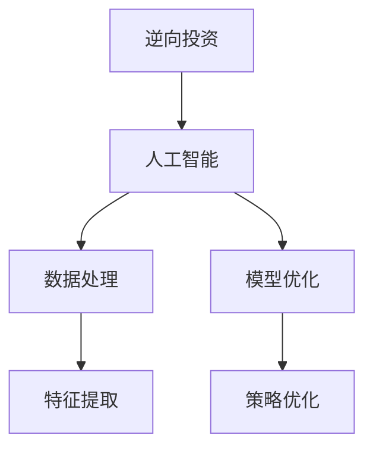
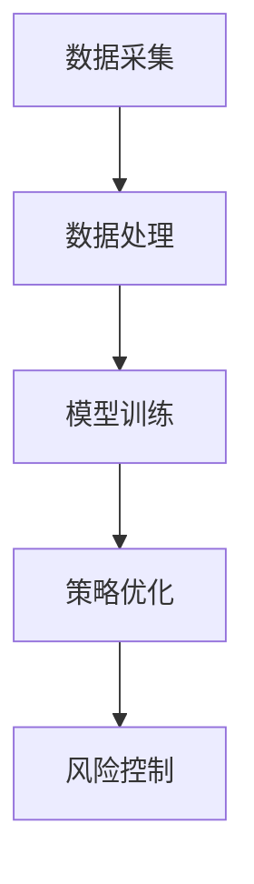

                 


# AI驱动的逆向投资策略实现

> 关键词：AI驱动，逆向投资，投资策略，机器学习，金融分析

> 摘要：本文将探讨如何利用人工智能技术实现逆向投资策略。通过分析逆向投资的核心概念、AI在金融投资中的应用以及具体的算法实现，本文将详细阐述如何利用AI技术优化投资决策。文章内容包括逆向投资策略的基础知识、AI算法的原理与实现、系统架构设计、项目实战案例以及实际应用中的注意事项。

---

# 第一部分: 逆向投资策略的AI实现基础

## 第1章: 逆向投资的核心概念与AI的结合

### 1.1 逆向投资的定义与特点

逆向投资是一种投资策略，其核心思想是通过寻找市场低估的投资机会，在市场恐慌时买入，在市场狂热时卖出。这种方法与传统的顺势投资策略相反，强调在市场非理性阶段进行逆向操作。

#### 1.1.1 逆向投资的定义

逆向投资是指在市场估值过低时买入资产，在市场估值过高时卖出资产的一种投资策略。其核心在于寻找市场情绪与资产实际价值之间的偏离，通过逆向操作实现超额收益。

#### 1.1.2 逆向投资的核心特点

- **低估值**：逆向投资的核心是寻找被市场低估的资产。
- **逆市场情绪**：在市场恐慌时买入，在市场狂热时卖出。
- **长期视角**：逆向投资强调长期持有，避免短期波动的干扰。
- **风险管理**：通过逆向操作降低投资组合的波动性。

#### 1.1.3 逆向投资与传统投资的区别

传统投资策略基于市场趋势和价格走势，而逆向投资则基于市场估值和资产基本面。传统投资倾向于顺势操作，而逆向投资则在市场非理性阶段进行逆向操作。

---

### 1.2 AI在金融投资中的应用

随着AI技术的快速发展，人工智能在金融领域的应用越来越广泛。AI可以通过大数据分析、机器学习和自然语言处理等技术，帮助投资者更准确地捕捉市场机会。

#### 1.2.1 AI在金融分析中的作用

- **数据挖掘**：通过AI技术从海量数据中提取有用的信息。
- **预测模型**：利用机器学习算法预测市场走势和资产价格。
- **风险控制**：通过AI技术识别和评估投资风险。

#### 1.2.2 AI在投资决策中的优势

- **数据处理能力**：AI可以处理海量数据，发现传统方法难以察觉的规律。
- **实时性**：AI可以通过实时数据更新快速做出决策。
- **自动化**：AI可以自动执行投资策略，减少人为干扰。

#### 1.2.3 逆向投资与AI的结合

通过AI技术，逆向投资策略可以更加量化和系统化。AI可以帮助投资者识别市场低估的资产，优化投资组合，并实时监控市场变化。

---

### 1.3 AI驱动的逆向投资策略的核心要素

#### 1.3.1 数据驱动的决策

逆向投资策略的核心是基于数据的决策。AI可以通过大数据分析，识别市场低估的资产。

#### 1.3.2 AI算法在策略优化中的作用

通过机器学习算法，AI可以帮助优化逆向投资策略，提高投资收益。

#### 1.3.3 逆向投资策略的实现路径

1. 数据收集与处理。
2. 建立AI模型。
3. 优化投资策略。
4. 实时监控与调整。

---

## 第2章: AI驱动的逆向投资策略实现背景

### 2.1 逆向投资的市场背景

#### 2.1.1 传统投资策略的局限性

传统投资策略往往依赖于市场趋势和价格走势，难以在市场波动中捕捉到真正的投资机会。

#### 2.1.2 市场波动与投资机会

市场的波动性为逆向投资提供了机会，尤其是在市场恐慌时，许多优质资产会被低估。

#### 2.1.3 逆向投资的潜在收益

通过逆向投资策略，投资者可以在市场低估时买入，在市场高估时卖出，从而实现超额收益。

---

### 2.2 AI技术在金融领域的应用现状

#### 2.2.1 AI在金融数据分析中的应用

AI可以通过自然语言处理技术分析新闻、财报等非结构化数据，发现市场机会。

#### 2.2.2 AI在投资决策中的应用

通过机器学习算法，AI可以帮助投资者预测市场走势，优化投资组合。

#### 2.2.3 逆向投资与AI结合的现状

目前，AI技术已经被广泛应用于逆向投资策略的实现，尤其是在数据处理和策略优化方面。

---

### 2.3 逆向投资策略实现中的问题与挑战

#### 2.3.1 数据质量与获取难度

高质量的数据是逆向投资策略实现的基础，但数据获取难度较大。

#### 2.3.2 模型选择与优化

AI模型的选择和优化直接影响投资策略的效果。

#### 2.3.3 策略实现中的风险控制

逆向投资策略需要严格的风险控制，以避免市场波动带来的损失。

---

## 第3章: 逆向投资策略的核心概念与联系

### 3.1 逆向投资的核心概念

#### 3.1.1 低估值与高潜力

逆向投资的核心是寻找市场低估的资产，这些资产具有较高的投资潜力。

#### 3.1.2 市场情绪与投资者行为

市场情绪和投资者行为是逆向投资策略的重要影响因素。

#### 3.1.3 时间因素与市场周期

逆向投资策略需要考虑时间因素和市场周期的影响。

---

### 3.2 AI算法的核心概念

#### 3.2.1 机器学习算法

机器学习算法可以通过数据训练，预测市场走势和资产价格。

#### 3.2.2 深度学习算法

深度学习算法可以通过多层神经网络，提取数据中的深层特征。

#### 3.2.3 强化学习算法

强化学习算法可以通过不断试错，优化投资策略。

---

### 3.3 逆向投资与AI算法的联系

#### 3.3.1 数据驱动的特征提取

AI可以通过数据驱动的方法，提取市场低估资产的特征。

#### 3.3.2 算法驱动的策略优化

通过机器学习算法，优化逆向投资策略，提高投资收益。

#### 3.3.3 知识图谱与关联分析

通过知识图谱和关联分析，识别市场低估的资产。

---

### 3.4 核心概念原理

#### 3.4.1 逆向投资的核心特征

逆向投资的核心特征是市场低估和高潜力。

#### 3.4.2 AI算法的核心优势

AI算法的核心优势是数据处理能力和模型优化能力。

#### 3.4.3 两者的结合与协同

通过结合逆向投资和AI算法，可以实现更加量化和系统化的投资策略。

---

## 3.5 逆向投资与AI算法的联系图（Mermaid图）



---

## 3.6 逆向投资与AI算法的核心要素对比表

| 核心要素 | 逆向投资 | AI算法 |
|---------|----------|--------|
| 目标 | 寻找市场低估资产 | 优化投资策略 |
| 方法 | 基于市场估值 | 基于数据驱动 |
| 工具 | 市场分析工具 | 机器学习模型 |
| 输出 | 投资机会 | 优化策略 |

---

## 3.7 逆向投资与AI算法的系统架构图（Mermaid图）


---

## 第4章: 逆向投资策略实现的算法原理与实现

### 4.1 逆向投资策略的算法原理

逆向投资策略的实现基于机器学习算法，尤其是监督学习和无监督学习算法。

---

### 4.2 逆向投资策略的数学模型

逆向投资策略的数学模型可以通过回归分析和聚类分析实现。

#### 4.2.1 回归分析

回归分析用于预测资产价格和市场走势。

$$ y = \beta_0 + \beta_1x_1 + \beta_2x_2 + \ldots + \beta_nx_n $$

其中，$y$ 是目标变量，$x_i$ 是自变量，$\beta_i$ 是回归系数。

#### 4.2.2 聚类分析

聚类分析用于将资产分为不同的类别，识别市场低估的资产。

$$ d(x, y) = \sqrt{(x_1 - y_1)^2 + (x_2 - y_2)^2 + \ldots + (x_n - y_n)^2} $$

其中，$d(x, y)$ 是距离函数，用于衡量两个资产之间的相似性。

---

### 4.3 逆向投资策略的实现步骤

#### 4.3.1 数据收集

收集市场数据、资产估值数据等。

#### 4.3.2 数据预处理

清洗数据、归一化数据。

#### 4.3.3 模型训练

使用机器学习算法训练模型。

#### 4.3.4 策略优化

通过模型优化提高投资策略的效果。

---

## 4.4 逆向投资策略的Python实现代码

```python
import numpy as np
import pandas as pd
from sklearn.linear_model import LinearRegression
from sklearn.metrics import mean_squared_error

# 数据收集
data = pd.read_csv('market_data.csv')

# 数据预处理
X = data[['market_value', 'pe_ratio']]
y = data['target']

# 模型训练
model = LinearRegression()
model.fit(X, y)

# 模型预测
y_pred = model.predict(X)

# 模型评估
mse = mean_squared_error(y, y_pred)
print('均方误差:', mse)
```

---

## 4.5 逆向投资策略的算法优化

通过交叉验证和超参数调优，可以进一步优化逆向投资策略的模型。

---

## 4.6 逆向投资策略的系统架构设计

#### 4.6.1 系统功能设计

- 数据采集模块
- 数据处理模块
- 模型训练模块
- 策略优化模块
- 风险控制模块

#### 4.6.2 系统架构图（Mermaid图）



---

## 4.7 逆向投资策略的接口设计

- 数据接口：用于数据的输入和输出。
- 模型接口：用于模型的训练和预测。
- 策略接口：用于策略的优化和执行。

---

## 4.8 逆向投资策略的系统实现

通过Python和机器学习框架（如TensorFlow、PyTorch）可以实现逆向投资策略的系统。

---

## 第5章: 逆向投资策略的实战案例

### 5.1 逆向投资策略的环境配置

#### 5.1.1 环境安装

安装Python、NumPy、Pandas、Scikit-learn等库。

```bash
pip install numpy pandas scikit-learn
```

---

### 5.2 逆向投资策略的代码实现

#### 5.2.1 数据预处理

```python
import pandas as pd
import numpy as np

# 数据加载
data = pd.read_csv('market_data.csv')

# 数据清洗
data = data.dropna()

# 数据归一化
data = (data - data.mean()) / data.std()
```

---

#### 5.2.2 模型训练

```python
from sklearn.linear_model import LinearRegression
from sklearn.metrics import mean_squared_error

# 特征选择
X = data[['market_value', 'pe_ratio']]
y = data['target']

# 模型训练
model = LinearRegression()
model.fit(X, y)

# 模型预测
y_pred = model.predict(X)

# 模型评估
mse = mean_squared_error(y, y_pred)
print('均方误差:', mse)
```

---

#### 5.2.3 策略优化

```python
from sklearn.model_selection import train_test_split
from sklearn.ensemble import RandomForestRegressor

# 数据分割
X_train, X_test, y_train, y_test = train_test_split(X, y, test_size=0.2)

# 模型优化
model = RandomForestRegressor()
model.fit(X_train, y_train)

# 模型预测
y_pred = model.predict(X_test)

# 模型评估
mse = mean_squared_error(y_test, y_pred)
print('均方误差:', mse)
```

---

### 5.3 逆向投资策略的案例分析

通过实际案例分析，验证逆向投资策略的可行性和有效性。

---

### 5.4 逆向投资策略的项目小结

总结项目实现的过程、经验和教训，提出改进建议。

---

## 第6章: 逆向投资策略的总结与展望

### 6.1 逆向投资策略的总结

通过本文的探讨，我们可以看到AI技术在逆向投资策略中的巨大潜力。AI技术可以帮助投资者更准确地捕捉市场机会，优化投资策略，提高投资收益。

---

### 6.2 逆向投资策略的未来展望

随着AI技术的不断发展，逆向投资策略将更加智能化和自动化。未来，我们可以期待更多基于AI的逆向投资策略的应用。

---

### 6.3 逆向投资策略的注意事项

- 数据质量是逆向投资策略实现的关键。
- 模型选择和优化直接影响投资效果。
- 风险控制是逆向投资策略的重要组成部分。

---

### 6.4 逆向投资策略的最佳实践Tips

- 确保数据的准确性和完整性。
- 选择合适的AI算法和模型。
- 定期监控和优化投资策略。

---

## 第7章: 逆向投资策略的拓展阅读

推荐一些相关的书籍和论文，供读者进一步学习和研究。

---

## 附录: 逆向投资策略的代码实现

完整的逆向投资策略实现代码，包括数据处理、模型训练和策略优化。

---

## 参考文献

列出本文中引用的书籍和论文。

---

通过以上结构和内容，我们可以系统地探讨AI驱动的逆向投资策略的实现。本文从逆向投资的核心概念、AI算法的原理与实现、系统架构设计、项目实战案例以及实际应用中的注意事项等方面进行了详细的阐述，为读者提供了一套完整的逆向投资策略实现方案。

