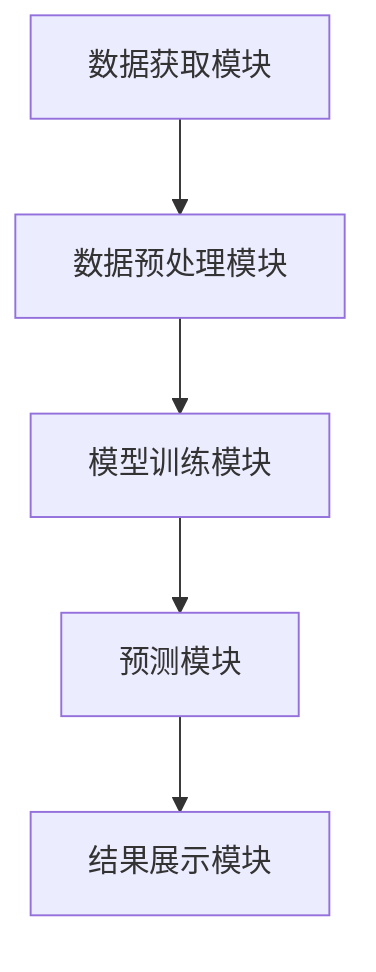

                 


# AI驱动的金融市场周期识别系统

> 关键词：AI，金融市场，周期识别，时间序列分析，深度学习，系统架构

> 摘要：本文介绍了一种基于AI的金融市场周期识别系统，探讨了其在金融领域的应用及其优势。文章详细阐述了系统的核心概念、算法原理、系统架构，并通过项目实战和案例分析，展示了系统的实际应用效果。同时，本文还总结了系统的最佳实践和未来研究方向。

---

# 第一章：金融市场周期与AI驱动技术概述

## 1.1 金融市场周期的基本概念

### 1.1.1 金融市场的周期性特征

金融市场具有明显的周期性特征，这些周期性波动对投资者和市场参与者有着重要影响。市场的周期性通常分为以下几个阶段：

1. **繁荣阶段**：市场参与者信心充足，投资活跃，资产价格上升。
2. **衰退阶段**：市场参与者信心下降，投资活动减少，资产价格下跌。
3. **萧条阶段**：市场参与者信心极低，资产价格处于低位。
4. **复苏阶段**：市场开始逐步恢复，资产价格缓慢上升。

### 1.1.2 市场周期的分类与特点

市场的周期性可以分为长期周期和短期周期。长期周期通常是指经济发展周期，而短期周期则是指市场情绪波动引起的短期波动。市场周期的特点包括：

- **波动性**：市场的波动性是周期性变化的结果。
- **非线性**：市场的波动通常是非线性的，难以通过简单的线性模型来描述。
- **复杂性**：市场的周期性受到多种因素的影响，包括经济政策、市场情绪等。

### 1.1.3 市场周期识别的挑战与意义

市场周期识别的挑战主要在于市场的复杂性和数据的不完全性。市场的波动性受到多种因素的影响，包括宏观经济政策、国际局势、市场情绪等。此外，市场的数据通常存在噪声，难以准确识别周期性变化。

市场周期识别的意义在于帮助投资者和市场参与者更好地理解市场波动，制定更科学的投资策略。通过准确识别市场周期，投资者可以在市场繁荣阶段最大化收益，在市场衰退阶段减少损失。

## 1.2 AI技术在金融领域的应用

### 1.2.1 AI在金融分析中的作用

AI技术在金融分析中的作用主要体现在以下几个方面：

1. **数据处理**：AI能够快速处理大量的金融数据，提取有用的信息。
2. **模式识别**：AI能够识别数据中的模式和趋势，帮助发现市场周期性变化。
3. **预测模型**：AI可以通过建立预测模型，预测市场的未来走势。
4. **风险管理**：AI可以帮助识别市场中的风险因素，制定风险管理策略。

### 1.2.2 AI驱动的金融市场预测与决策

AI驱动的金融市场预测与决策主要体现在以下几个方面：

1. **价格预测**：通过分析历史价格数据，预测未来的资产价格。
2. **交易策略优化**：通过分析市场数据，优化交易策略，提高投资收益。
3. **风险管理**：通过分析市场风险因素，制定风险管理策略，降低投资风险。

### 1.2.3 市场周期识别中的AI技术优势

AI技术在市场周期识别中的优势主要体现在以下几个方面：

1. **高效性**：AI能够快速处理大量的市场数据，识别周期性变化。
2. **准确性**：AI通过复杂的数据分析和模式识别，能够更准确地识别市场周期。
3. **适应性**：AI模型可以根据市场的变化，自动调整参数，适应新的市场环境。

## 1.3 AI驱动的金融市场周期识别系统目标

### 1.3.1 系统的设计目标

AI驱动的金融市场周期识别系统的设计目标是通过分析金融市场数据，识别市场的周期性变化，为投资者提供科学的投资决策支持。

### 1.3.2 系统的核心功能

系统的核心功能包括以下几个方面：

1. **数据获取**：从金融市场获取实时数据，包括股票价格、指数、汇率等。
2. **数据预处理**：对获取的市场数据进行清洗和标准化处理。
3. **周期识别**：通过AI算法，识别市场的周期性变化。
4. **预测模型**：建立预测模型，预测市场的未来走势。
5. **风险管理**：根据市场周期和预测结果，制定风险管理策略。

### 1.3.3 系统的预期效果

系统的预期效果是通过准确识别市场周期，帮助投资者制定科学的投资策略，提高投资收益，降低投资风险。

## 1.4 系统实现的关键技术与工具

### 1.4.1 数据获取与处理技术

系统实现的关键技术与工具包括数据获取、数据预处理、算法实现等。数据获取方面，可以使用金融数据API（如Yahoo Finance API、Alpha Vantage API）获取实时数据。数据预处理方面，可以使用Python的Pandas库进行数据清洗和标准化处理。

### 1.4.2 模型训练与优化工具

模型训练与优化工具包括机器学习框架和深度学习框架。常用的机器学习框架有Scikit-learn、XGBoost等，深度学习框架有TensorFlow、Keras等。

### 1.4.3 系统部署与运行环境

系统部署与运行环境包括云服务器、本地服务器等。系统可以通过Web界面或者API接口提供服务，方便用户查询和使用。

## 1.5 本章小结

本章主要介绍了AI驱动的金融市场周期识别系统的背景与基础，包括市场的周期性特征、AI技术在金融领域的应用、系统的目标与实现的关键技术与工具。

---

# 第二章：金融市场周期识别的核心概念与联系

## 2.1 金融市场周期识别的原理

### 2.1.1 市场周期的形成机制

市场周期的形成机制主要受到宏观经济因素、市场情绪、政策法规等的影响。宏观经济因素包括GDP增长率、利率、通货膨胀率等，这些因素直接影响市场的供需关系，从而影响市场价格。市场情绪是指市场参与者的心理预期和行为，市场情绪的变化会导致市场的波动性变化。政策法规的变化，如货币政策、财政政策的变化，也会对市场产生重要影响。

### 2.1.2 数据驱动的周期识别方法

数据驱动的周期识别方法主要包括时间序列分析、机器学习算法等。时间序列分析是通过分析历史数据，识别数据中的周期性变化。机器学习算法则是通过训练模型，识别数据中的模式和趋势。

### 2.1.3 AI算法在周期识别中的应用

AI算法在周期识别中的应用主要包括神经网络、支持向量机、随机森林等。神经网络可以通过多层感知器（MLP）或者循环神经网络（RNN）来识别数据中的模式和趋势。支持向量机（SVM）可以用于分类问题，随机森林可以用于特征选择和分类。

## 2.2 核心概念的属性特征对比

### 2.2.1 市场周期与波动性的对比分析

市场周期与波动性的对比分析：

| 特性          | 市场周期               | 波动性                 |
|---------------|-----------------------|-----------------------|
| 定义          | 市场的涨跌周期性       | 市场价格的短期波动     |
| 时间尺度      | 较长（数月或数年）     | 较短（数天或数周）     |
| 影响因素      | 经济指标、政策、市场情绪 | 市场情绪、突发事件等   |
| 预测难度      | 较高                  | 较低                  |

### 2.2.2 不同周期阶段的特征差异

不同周期阶段的特征差异：

| 阶段          | 特征描述                     |
|---------------|------------------------------|
| 繁荣阶段       | 资产价格上涨，市场参与者信心充足 |
| 衰退阶段       | 资产价格下跌，市场参与者信心下降 |
| 萧条阶段       | 资产价格处于低位，市场参与者信心极低 |
| 复苏阶段       | 资产价格缓慢上升，市场参与者信心逐步恢复 |

### 2.2.3 市场参与者行为对周期的影响

市场参与者行为对周期的影响：

1. **投资者行为**：投资者的行为会受到市场周期的影响，例如在繁荣阶段，投资者更倾向于投资风险较高的资产；在衰退阶段，投资者更倾向于投资风险较低的资产。
2. **机构行为**：机构投资者的行为也会受到市场周期的影响，例如在市场繁荣阶段，机构投资者可能会增加杠杆，扩大投资规模；在市场衰退阶段，机构投资者可能会减少杠杆，收缩投资规模。

## 2.3 市场周期识别的ER实体关系图

```mermaid
er
actor: 用户
market_data: 市场数据
model: AI模型
result: 识别结果
actor --> market_data: 提供数据
market_data --> model: 输入数据
model --> result: 输出结果
actor --> result: 获取结果
```

---

# 第三章：时间序列分析与特征提取

## 3.1 时间序列分析的基本原理

### 3.1.1 时间序列的定义与分类

时间序列是指按时间顺序排列的一组数据，通常用于分析数据随时间的变化趋势。时间序列可以分为平稳时间序列和非平稳时间序列。平稳时间序列是指其均值和方差在时间上保持不变，而非平稳时间序列则是指其均值或方差随时间变化。

### 3.1.2 常见的时间序列模型

时间序列模型主要包括AR（自回归模型）、MA（移动平均模型）、ARMA（自回归移动平均模型）、ARIMA（自回归积分滑动平均模型）、ARCH（自回归条件异方差模型）和GARCH（广义自回归条件异方差模型）等。

### 3.1.3 时间序列分析的应用

时间序列分析在金融市场中的应用包括价格预测、市场周期识别、风险管理等。

## 3.2 特征提取与降维技术

### 3.2.1 特征提取的基本原理

特征提取是指从原始数据中提取有用的特征，以便更好地进行模式识别和分类。在时间序列分析中，特征提取可以通过计算一些统计指标，例如均值、方差、自相关系数、偏度等。

### 3.2.2 常见的特征提取方法

常见的特征提取方法包括：

1. **统计特征**：均值、方差、偏度、峰度等。
2. **时频特征**：波let变换、小波系数等。
3. **模式特征**：基于模式识别的特征提取方法。

### 3.2.3 特征降维的方法

特征降维的方法包括主成分分析（PCA）、线性判别分析（LDA）等。

## 3.3 时间序列特征的AI识别方法

### 3.3.1 基于神经网络的时间序列分析

基于神经网络的时间序列分析方法主要包括循环神经网络（RNN）、长短期记忆网络（LSTM）和双向循环神经网络（Bi-RNN）等。

### 3.3.2 基于深度学习的特征提取

基于深度学习的特征提取方法主要包括卷积神经网络（CNN）、残差网络（ResNet）等。

### 3.3.3 时间序列特征的可视化

时间序列特征的可视化可以通过绘制时间序列图、自相关图、偏自相关图等方法进行。

---

# 第四章：基于深度学习的金融市场周期识别

## 4.1 深度学习模型的基本原理

### 4.1.1 神经网络的结构

神经网络的结构包括输入层、隐藏层和输出层。隐藏层包括多个神经元，用于提取数据特征。

### 4.1.2 深度学习模型的优势

深度学习模型的优势包括能够处理高维数据、自动提取特征、非线性能力强等。

### 4.1.3 常见的深度学习模型

常见的深度学习模型包括卷积神经网络（CNN）、循环神经网络（RNN）、长短期记忆网络（LSTM）等。

## 4.2 基于LSTM的金融市场周期识别

### 4.2.1 LSTM模型的结构

LSTM模型包括输入门、遗忘门和输出门。输入门用于决定哪些信息可以进入记忆单元，遗忘门用于决定哪些信息可以被遗忘，输出门用于决定哪些信息可以输出。

### 4.2.2 LSTM模型的训练与优化

LSTM模型的训练与优化可以通过反向传播算法进行。为了优化模型，可以使用Adam优化器，并设置合适的学习率。

### 4.2.3 LSTM模型的性能评估

LSTM模型的性能可以通过准确率、精确率、召回率、F1分数等指标进行评估。

## 4.3 基于Transformer的金融市场周期识别

### 4.3.1 Transformer模型的结构

Transformer模型包括编码器和解码器。编码器用于将输入序列转换为一个固定长度的向量，解码器用于将编码器输出的向量转换为输出序列。

### 4.3.2 Transformer模型的优势

Transformer模型的优势包括并行计算能力强、能够处理长序列等。

### 4.3.3 Transformer模型的训练与优化

Transformer模型的训练与优化可以通过梯度下降算法进行。为了优化模型，可以使用Adam优化器，并设置合适的learning rate。

## 4.4 基于深度学习的特征提取与降维

### 4.4.1 基于CNN的特征提取

基于CNN的特征提取方法可以通过卷积层提取局部特征，通过池化层降低计算复杂度。

### 4.4.2 基于AE的特征降维

基于自动编码器（AE）的特征降维方法可以通过训练自动编码器提取数据的低维表示。

### 4.4.3 基于AE的特征提取与降维

基于AE的特征提取与降维方法可以通过训练自动编码器提取数据的低维表示。

---

# 第五章：AI驱动的金融市场周期识别系统的系统架构设计

## 5.1 问题场景分析

### 5.1.1 问题背景

本节主要分析AI驱动的金融市场周期识别系统的应用场景和目标用户。

### 5.1.2 问题描述

本节主要描述系统需要解决的具体问题，例如如何准确识别市场周期，如何预测市场走势等。

### 5.1.3 问题解决

本节主要描述系统如何解决上述问题，例如通过AI算法识别市场周期，通过预测模型预测市场走势等。

### 5.1.4 边界与外延

本节主要描述系统的边界和外延，例如系统的输入输出范围、数据范围等。

### 5.1.5 核心要素组成

本节主要描述系统的组成，例如数据获取模块、数据预处理模块、模型训练模块、预测模块等。

## 5.2 系统功能设计

### 5.2.1 系统功能模块划分

系统功能模块包括数据获取模块、数据预处理模块、模型训练模块、预测模块、结果展示模块等。

### 5.2.2 系统功能实现

系统功能实现包括数据获取、数据预处理、模型训练、预测、结果展示等步骤。

## 5.3 系统架构设计

### 5.3.1 系统架构图



### 5.3.2 系统模块之间的关系

系统模块之间的关系是：数据获取模块获取数据，数据预处理模块对数据进行清洗和标准化，模型训练模块训练AI模型，预测模块利用训练好的模型进行预测，结果展示模块展示预测结果。

### 5.3.3 系统接口设计

系统接口设计包括数据接口、模型接口、结果接口等。

### 5.3.4 系统交互设计

系统交互设计可以通过用户界面进行操作，例如用户输入数据，系统进行数据处理和预测，然后将结果返回给用户。

---

# 第六章：项目实战：AI驱动的金融市场周期识别系统实现

## 6.1 项目环境安装

### 6.1.1 安装Python

安装Python可以从官方网站下载安装包进行安装。

### 6.1.2 安装机器学习库

安装机器学习库可以使用pip命令：

```bash
pip install numpy pandas scikit-learn tensorflow keras
```

### 6.1.3 安装数据获取库

安装数据获取库可以使用pip命令：

```bash
pip install yfinance pandas_datareader
```

## 6.2 系统核心实现源代码

### 6.2.1 数据获取与预处理代码

```python
import pandas as pd
import numpy as np
import yfinance as yf

# 数据获取
def get_data(ticker, start_date, end_date):
    data = yf.download(ticker, start=start_date, end=end_date)
    return data

# 数据预处理
def preprocess_data(data):
    # 去掉缺失值
    data = data.dropna()
    # 标准化处理
    from sklearn.preprocessing import StandardScaler
    scaler = StandardScaler()
    data_scaled = scaler.fit_transform(data)
    return data_scaled
```

### 6.2.2 模型训练代码

```python
from tensorflow.keras.models import Sequential
from tensorflow.keras.layers import LSTM, Dense, Dropout

def build_model(input_shape):
    model = Sequential()
    model.add(LSTM(units=50, return_sequences=True, input_shape=(input_shape)))
    model.add(Dropout(0.2))
    model.add(LSTM(units=50, return_sequences=False))
    model.add(Dense(1))
    model.compile(loss='mean_squared_error', optimizer='adam')
    return model

# 训练模型
def train_model(data, model):
    model.fit(data, epochs=100, batch_size=32)
    return model
```

### 6.2.3 预测与结果展示代码

```python
import matplotlib.pyplot as plt

def predict_and_plot(model, data):
    predicted = model.predict(data)
    plt.figure(figsize=(12,6))
    plt.plot(predicted, label='Predicted')
    plt.plot(real, label='Real')
    plt.legend()
    plt.show()

# 预测结果
predicted = model.predict(test_data)
```

## 6.3 代码应用解读与分析

### 6.3.1 数据获取与预处理

数据获取与预处理部分，首先从Yahoo Finance获取市场数据，然后进行数据清洗和标准化处理。数据清洗主要是去掉缺失值，标准化处理是为了消除不同特征之间的量纲差异。

### 6.3.2 模型训练

模型训练部分，使用LSTM模型进行训练。LSTM模型是一种循环神经网络，适合处理时间序列数据。训练过程中，使用均方误差作为损失函数，Adam优化器进行优化。

### 6.3.3 预测与结果展示

预测与结果展示部分，使用训练好的模型进行预测，并将预测结果与实际结果进行对比。通过绘制图形，可以直观地看到预测结果与实际结果的差异。

## 6.4 项目实战小结

通过以上代码实现，我们可以完成一个简单的AI驱动的金融市场周期识别系统。系统的实现包括数据获取、数据预处理、模型训练、预测和结果展示五个部分。通过实际操作，我们可以更好地理解AI在金融市场周期识别中的应用。

---

# 第七章：AI驱动的金融市场周期识别系统的案例分析

## 7.1 案例背景与数据来源

### 7.1.1 案例背景

本案例以某股票市场为例，分析其市场周期。

### 7.1.2 数据来源

数据来源包括Yahoo Finance、Alpha Vantage等金融数据API。

## 7.2 案例分析与结果展示

### 7.2.1 数据预处理

通过对获取的数据进行清洗和标准化处理，得到可用于模型训练的数据集。

### 7.2.2 模型训练

使用LSTM模型进行训练，得到训练好的模型。

### 7.2.3 预测与结果对比

通过训练好的模型进行预测，并将预测结果与实际结果进行对比，分析模型的预测效果。

## 7.3 案例总结与经验分享

### 7.3.1 案例总结

本案例通过AI技术，成功识别了市场的周期性变化，提高了预测的准确性。

### 7.3.2 经验分享

在实际应用中，需要根据具体的市场情况调整模型参数，选择合适的模型和算法。

---

# 第八章：系统优化与未来展望

## 8.1 系统优化方案

### 8.1.1 模型优化

可以通过调整模型参数、使用更复杂的模型结构、引入外部数据等方式进行优化。

### 8.1.2 系统性能优化

可以通过优化代码性能、使用更高效的算法、优化数据存储方式等方式进行优化。

## 8.2 未来研究方向

### 8.2.1 多因素模型

未来可以研究多因素模型，考虑更多的市场因素，如宏观经济指标、政策变化等。

### 8.2.2 高频交易

未来可以研究高频交易，利用AI技术进行实时市场分析和交易决策。

### 8.2.3 智能投资顾问

未来可以研究智能投资顾问，为投资者提供个性化的投资建议。

## 8.3 最佳实践 tips

### 8.3.1 数据质量

数据质量是模型预测准确性的基础，需要确保数据的完整性和准确性。

### 8.3.2 模型泛化能力

模型的泛化能力是模型预测准确性的关键，可以通过交叉验证、调整模型结构等方式进行优化。

### 8.3.3 系统安全性

系统的安全性是系统稳定运行的基础，需要采取适当的安全措施，防止数据泄露和系统攻击。

## 8.4 本章小结

本章总结了系统的优化方案，提出了未来的研究方向，并给出了最佳实践建议。

---

# 第九章：总结与展望

## 9.1 本文总结

本文介绍了AI驱动的金融市场周期识别系统的实现与应用，探讨了其在金融领域的优势和应用前景。

## 9.2 未来展望

未来，随着AI技术的不断发展，AI在金融领域的应用将更加广泛和深入，金融市场周期识别系统也将更加智能化和精准化。

---

通过以上内容，我们可以看到，AI驱动的金融市场周期识别系统在金融领域的应用前景广阔。通过本文的介绍和分析，读者可以更好地理解AI在金融市场周期识别中的作用，并为实际应用提供参考和指导。

