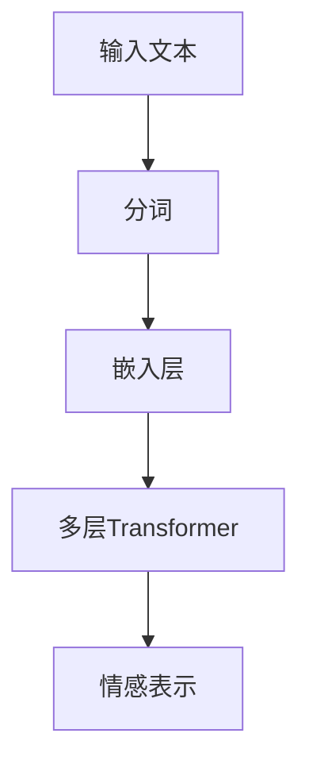
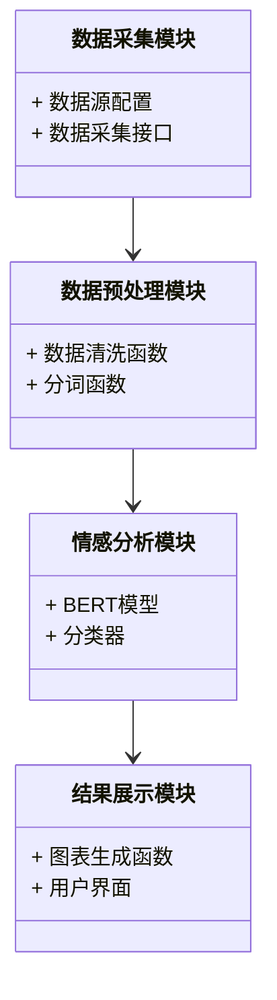

                 


# AI驱动的金融新闻情感分析系统

> 关键词：金融新闻、情感分析、人工智能、深度学习、自然语言处理

> 摘要：本文介绍了一种基于人工智能的金融新闻情感分析系统，该系统利用自然语言处理和深度学习技术，结合金融领域的特殊性，实现对金融新闻的自动情感分析。本文详细探讨了系统的设计背景、核心算法、系统架构及实现过程，并通过实际案例展示了系统的应用效果。

---

## 第1章 金融新闻情感分析的背景与意义

### 1.1 情感分析的定义与应用领域

情感分析（Sentiment Analysis）是自然语言处理（NLP）中的一个重要分支，旨在判断文本中蕴含的情感倾向，通常分为正面、负面和中性三类。情感分析广泛应用于社交媒体分析、舆情监控、产品评论分析等领域。

在金融领域，情感分析可以帮助投资者理解市场情绪，辅助投资决策。金融新闻作为金融市场的重要信息来源，其情感倾向直接影响投资者的心理和行为。

### 1.2 金融新闻的特点与挑战

金融新闻具有以下特点：
1. **专业性**：金融新闻通常涉及复杂的金融术语和专业领域知识。
2. **时效性**：金融新闻的发布和传播具有很强的时效性，需要快速处理和分析。
3. **数据稀疏性**：某些金融事件或公司新闻的数据量较少，导致训练数据不足。
4. **情感复杂性**：金融新闻中的情感倾向可能较为隐含，需要结合上下文进行判断。

### 1.3 本系统的构建目标与意义

本系统的构建目标是开发一个能够实时处理金融新闻、准确识别情感倾向的AI系统。该系统的意义在于：
1. **辅助投资决策**：帮助投资者快速了解市场情绪，做出更明智的投资决策。
2. **提升效率**：通过自动化处理大量金融新闻，节省时间和成本。
3. **风险预警**：及时发现市场中的负面情绪，预警潜在风险。

---

## 第2章 AI驱动的金融新闻情感分析系统概述

### 2.1 系统的整体架构

本系统由以下几个主要模块组成：
1. **数据采集模块**：负责从新闻网站、金融平台等来源实时采集金融新闻数据。
2. **数据预处理模块**：对采集的文本数据进行清洗、分词、去除停用词等处理。
3. **情感分析模块**：利用深度学习模型（如BERT）对预处理后的文本进行情感分类。
4. **结果展示模块**：将分析结果以可视化的方式展示，供用户查看和决策。

### 2.2 系统的核心技术

#### 2.2.1 基于BERT的情感表示模型

BERT（Bidirectional Encoder Representations from Transformers）是一种预训练的深度学习模型，能够有效捕捉文本中的上下文信息。在金融新闻情感分析中，BERT模型可以用于生成高质量的文本表示。

**BERT模型的工作流程**：
1. 输入文本经过分词和嵌入层处理。
2. 通过多层Transformer结构进行编码，捕捉全局语义信息。
3. 输出隐藏层的表示结果，用于后续情感分类。



#### 2.2.2 情感分类算法

**支持向量机（SVM）**是一种经典的监督学习算法，适用于小规模数据的情感分类。其核心思想是通过找到一个超平面，将不同类别的数据点分开。

**长短期记忆网络（LSTM）**是一种循环神经网络（RNN）变体，能够有效处理长序列数据，适用于文本情感分析。

### 2.3 系统的预期功能

1. **新闻数据的实时采集与预处理**：系统能够自动从多个金融新闻源采集数据，并进行清洗和格式化处理。
2. **情感分析结果的可视化**：通过图表、颜色标记等方式展示情感倾向，帮助用户快速理解市场情绪。
3. **结果的可解释性与反馈机制**：系统能够提供情感分析的解释性结果，并根据用户反馈不断优化模型。

---

## 第3章 金融新闻情感分析的核心算法

### 3.1 基于BERT的情感表示模型

#### BERT模型的结构与特点

BERT模型采用双向Transformer结构，能够同时捕捉文本中的左右语境信息。其核心公式为：

$$
\text{BERT}(x) = \text{FFN}(\text{FFN}(x))
$$

其中，FFN表示前馈神经网络层。

#### BERT在金融新闻中的应用

在金融新闻中，BERT模型可以用于生成新闻标题和正文的情感表示。例如，对于新闻标题“股市今日上涨”，BERT模型能够生成一个高维向量表示，反映其积极的情感倾向。

### 3.2 情感分类算法

#### 基于SVM的情感分类

支持向量机（SVM）是一种常用的分类算法，其目标函数如下：

$$
\text{minimize } \frac{1}{2}\|\theta\|^2 + C \sum_{i=1}^n \xi_i
$$

其中，$\theta$为参数，$C$为惩罚系数，$\xi_i$为松弛变量。

#### 基于LSTM的情感分类

LSTM模型通过门控机制有效处理序列数据，其基本结构包括输入门、遗忘门和输出门。

$$
i_t = \sigma(W_i x_t + U_i h_{t-1} + b_i)
$$
$$
f_t = \sigma(W_f x_t + U_f h_{t-1} + b_f)
$$
$$
o_t = \sigma(W_o x_t + U_o h_{t-1} + b_o)
$$
$$
h_t = i_t \cdot \tilde{h}_t + f_t \cdot h_{t-1}
$$

其中，$i_t$为输入门，$f_t$为遗忘门，$o_t$为输出门，$\tilde{h}_t$为候选隐藏层状态。

### 3.3 算法的比较与优化

通过实验对比，BERT模型在金融新闻情感分类中的表现优于SVM和LSTM模型。为了进一步优化模型性能，可以采用以下策略：
1. **模型调优**：调整学习率、批量大小等超参数。
2. **数据增强**：通过数据扩增技术（如同义词替换）增加训练数据量。
3. **集成学习**：将多种模型的结果进行集成，提升分类准确率。

---

## 第4章 系统架构与设计

### 4.1 系统的功能模块划分

系统功能模块包括：
1. **数据采集模块**：负责采集金融新闻数据。
2. **数据预处理模块**：对采集的数据进行清洗和格式化处理。
3. **情感分析模块**：利用深度学习模型进行情感分类。
4. **结果展示模块**：将分析结果以可视化方式展示。

### 4.2 系统的架构设计

系统采用分层架构，主要包括数据层、业务逻辑层和表现层。



### 4.3 系统的接口设计

系统主要接口包括：
1. **数据接口**：用于采集和预处理模块之间的数据传递。
2. **模型接口**：用于情感分析模块与结果展示模块之间的交互。
3. **用户接口**：用于用户与系统的交互，包括输入参数和显示结果。

---

## 第5章 项目实战与实现

### 5.1 环境搭建与数据准备

#### 环境搭建

安装必要的库：
```bash
pip install tensorflow bert-for-tf2 numpy pandas scikit-learn
```

#### 数据准备

从金融新闻网站（如东方财富网）采集新闻数据，保存为CSV格式。

### 5.2 模型的训练与优化

#### 模型训练

使用预训练好的BERT模型，在金融新闻数据上进行微调。

```python
import tensorflow as tf
from bert_for_tf2 import BertForPretraining

# 加载BERT模型
model = BertForPretraining.from_pretrained('bert-base-uncased')
# 定义训练步骤
def train_step(model, inputs, labels):
    with tf.GradientTape() as tape:
        outputs = model(inputs)
        loss = tf.keras.losses.sparse_categorical_crossentropy(labels, outputs logits)
    gradients = tape.gradient(loss, model.trainable_weights)
    optimizer.apply_gradients(zip(gradients, model.trainable_weights))
    return loss
```

#### 模型优化

通过调整学习率和批量大小，优化模型性能。

### 5.3 代码实现与结果分析

完成代码实现后，进行测试和结果分析，验证模型的准确性和稳定性。

---

## 总结

本文详细介绍了AI驱动的金融新闻情感分析系统的构建过程，从背景分析到系统设计，再到实战实现，为读者提供了全面的技术指导。通过本系统的实现，可以帮助投资者更好地理解市场情绪，辅助投资决策。

---

以上是完整的目录大纲内容，接下来是具体的文章正文部分。

