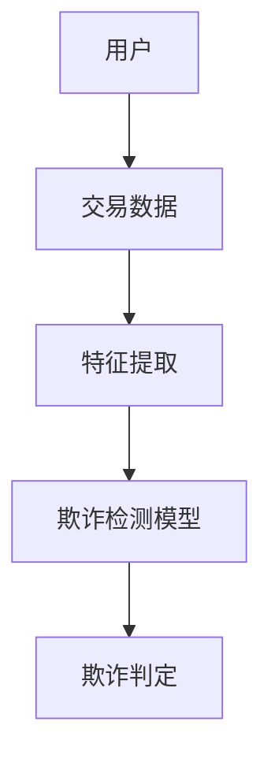
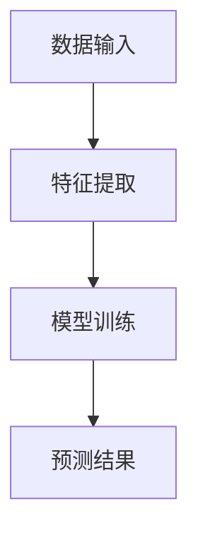
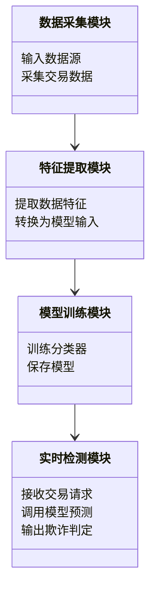
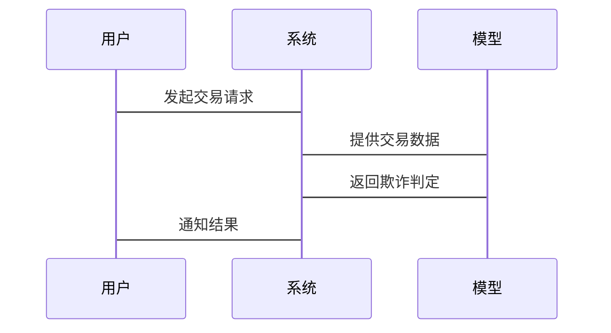

                 

# AI驱动的金融欺诈检测系统

> 关键词：AI，金融欺诈检测，机器学习，深度学习，系统架构

> 摘要：本文详细探讨了AI在金融欺诈检测中的应用，分析了系统的构建过程，从算法原理到系统架构，再到实际项目实现，全面解析了如何利用AI技术提升金融欺诈检测的效率和准确性。

---

# 第1章：AI驱动的金融欺诈检测系统引论

## 1.1 金融欺诈检测的背景与挑战

### 1.1.1 金融欺诈的定义与类型

金融欺诈是指通过欺骗手段获取不正当经济利益的行为，主要类型包括信用卡欺诈、网络支付诈骗、洗钱等。随着金融交易的复杂化，欺诈手段也在不断演变，传统的基于规则的检测方法逐渐显得力不从心。

### 1.1.2 传统金融欺诈检测的局限性

传统方法依赖于预定义的规则和阈值，难以应对新型欺诈手段。此外，规则的维护成本高，且容易受到欺诈者规避策略的影响，导致检测效率低下。

### 1.1.3 AI技术在金融欺诈检测中的优势

AI技术能够从海量数据中提取复杂模式，实时分析交易行为，显著提高了检测的准确性和效率。机器学习和深度学习算法能够自动适应新的欺诈模式，有效降低误报和漏报率。

## 1.2 AI驱动的金融欺诈检测系统的核心概念

### 1.2.1 人工智能与金融欺诈检测的结合

AI通过分析交易数据中的异常行为，识别潜在的欺诈交易。系统能够实时处理数据，快速做出判断，显著提升检测速度和精度。

### 1.2.2 系统的主要功能与目标

系统的主要功能包括数据采集、特征提取、模型训练、实时检测等。目标是实现高准确率的欺诈检测，保护用户和金融机构的财产安全。

### 1.2.3 系统的边界与外延

系统的边界包括前端交互、后端处理、数据存储等模块，外延则涉及数据源的多样性和模型的可扩展性。

## 1.3 本书的结构与内容概述

### 1.3.1 各章的主要内容

各章内容包括背景介绍、核心概念、算法原理、系统架构、项目实战和总结。每章都详细分析相关内容，提供实际案例和代码实现。

### 1.3.2 学习本书的前置知识

读者需要具备基本的编程能力和对机器学习的了解，熟悉Python和相关数据处理工具。

### 1.3.3 本书的创新点与价值

本书通过系统化的分析和实践，展示了AI在金融欺诈检测中的广泛应用，提供了实用的代码和案例，帮助读者快速掌握相关技术。

---

# 第2章：AI驱动的金融欺诈检测系统的核心概念与原理

## 2.1 金融欺诈检测的核心概念

### 2.1.1 数据特征与欺诈行为的关系

数据特征包括交易金额、时间、地点等，这些特征与欺诈行为密切相关。通过分析这些特征，可以识别异常交易模式。

### 2.1.2 模型特征与检测准确性的关联

模型特征如交易频率、用户行为模式等，直接影响检测的准确性。选择合适的特征能够显著提高模型性能。

### 2.1.3 系统性能与实际应用场景的匹配

系统的性能参数如响应时间、检测准确率等，需要与实际应用场景相匹配，确保在不同场景下都能有效运行。

## 2.2 核心概念的属性特征对比

### 2.2.1 数据特征的分类与对比

数据特征可以分为数值型、类别型和文本型。不同类型的特征在处理方式和分析方法上存在差异。

### 2.2.2 模型特征的分类与对比

模型特征包括输入特征和目标特征，输入特征用于训练模型，目标特征是模型预测的结果。

### 2.2.3 系统性能的分类与对比

系统性能指标包括准确率、召回率、F1值等，不同指标适用于不同的评估场景。

## 2.3 实体关系图与系统架构

---

# 第3章：AI驱动的金融欺诈检测算法原理

## 3.1 常见的金融欺诈检测算法

### 3.1.1 基于规则的传统算法

传统算法依赖预定义规则，适用于已知的欺诈模式。但面对新型欺诈手段，效果有限。

### 3.1.2 基于机器学习的算法

机器学习算法如随机森林、支持向量机等，能够从数据中自动学习特征，适用于复杂场景。

### 3.1.3 基于深度学习的算法

深度学习算法如神经网络、循环神经网络等，能够处理非结构化数据，检测复杂模式。

## 3.2 算法原理与流程图

### 3.2.1 随机森林算法

随机森林是一种集成学习算法，通过构建多个决策树并进行投票或平均，提高模型的准确性和鲁棒性。

随机森林的投票机制可以用以下公式表示：

$$
\text{预测结果} = \text{多数投票}(\text{各树的预测结果})
$$

---

# 第4章：AI驱动的金融欺诈检测系统架构与设计

## 4.1 系统架构设计

### 4.1.1 系统模块划分

系统主要模块包括数据采集、特征提取、模型训练、实时检测等。

### 4.1.2 系统交互流程

系统交互流程包括用户发起交易请求，系统提取特征，调用模型进行预测，返回检测结果。

---

# 第5章：AI驱动的金融欺诈检测系统实战

## 5.1 项目实战：构建AI驱动的金融欺诈检测系统

### 5.1.1 环境搭建

需要安装Python、scikit-learn、XGBoost等库，建议使用虚拟环境管理依赖。

### 5.1.2 数据集准备

使用公开数据集如Kaggle的信用卡欺诈检测数据集，包含合法和欺诈交易记录。

### 5.1.3 数据预处理

清洗数据，处理缺失值，标准化或归一化特征。

### 5.1.4 模型训练

选择合适的算法，如随机森林或XGBoost，进行模型训练和调优。

### 5.1.5 模型评估

通过准确率、召回率等指标评估模型性能，调整参数优化结果。

### 5.1.6 实际案例分析

分析真实交易数据，展示模型如何检测欺诈行为。

### 5.1.7 系统部署

将模型部署为API服务，集成到金融机构的交易系统中，实时检测欺诈交易。

---

# 第6章：总结与展望

## 6.1 本系统的总结

AI驱动的金融欺诈检测系统通过先进的算法和高效的架构设计，显著提升了欺诈检测的效率和准确性。

## 6.2 本系统的优缺点

优点包括高准确率、实时性，缺点是模型训练成本高，需要大量数据支持。

## 6.3 对本系统的改进建议

可以结合多种算法，优化模型结构，引入实时数据流处理技术，进一步提升检测能力。

## 6.4 本系统的未来展望

随着AI技术的发展，金融欺诈检测将更加智能化，可能出现新的检测方法和工具，进一步降低欺诈风险。

---

通过以上内容，我们详细分析了AI在金融欺诈检测中的应用，从理论到实践，从算法到系统架构，为读者提供了全面的指导和深入的分析。希望对您有所帮助！

