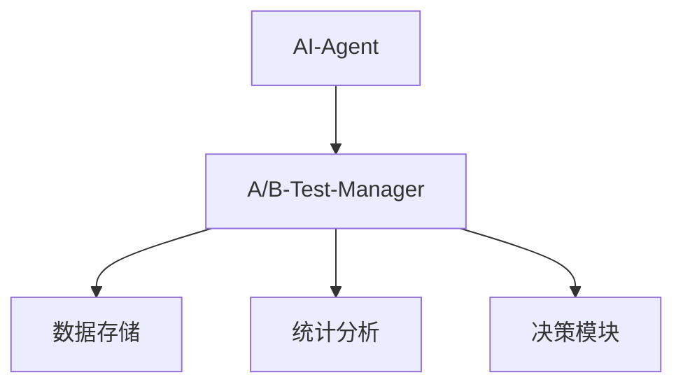
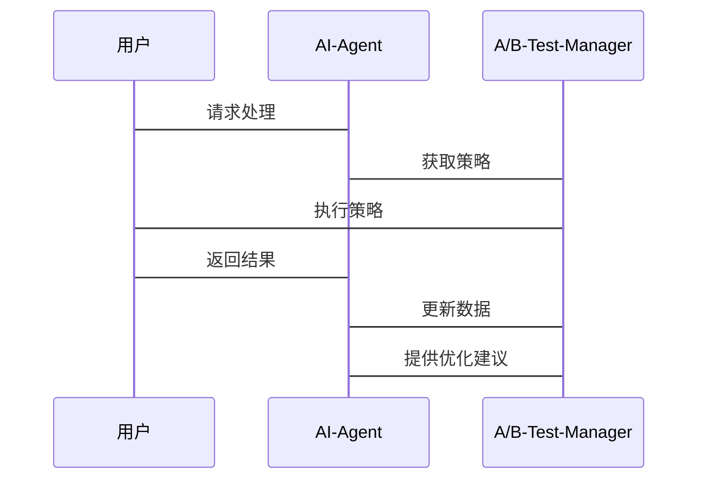

                 


# A/B测试框架：持续优化AI Agent性能

## 关键词：A/B测试框架，AI Agent，性能优化，实验设计，统计显著性，机器学习

## 摘要：本文探讨了A/B测试框架在优化AI Agent性能中的应用，详细分析了A/B测试的基本原理、算法实现、系统设计及项目实战，结合实际案例，总结了最佳实践，帮助读者全面理解并高效应用A/B测试框架优化AI Agent性能。

---

# 第1章: A/B测试框架与AI Agent概述

## 1.1 A/B测试的基本概念

### 1.1.1 什么是A/B测试

A/B测试是一种实验方法，通过将用户分成两组，一组使用当前版本（A组），另一组使用新版本（B组），比较两组用户的行为数据，以确定新版本是否优于当前版本。

### 1.1.2 A/B测试的基本原理

A/B测试的核心是随机分组和统计显著性检验。通过随机分组确保两组用户的特征相似，然后通过统计方法分析结果差异是否具有显著性。

### 1.1.3 A/B测试的应用场景

- 产品功能优化
- 界面改版测试
- 推荐系统评估
- 算法性能对比

## 1.2 AI Agent的定义与特点

### 1.2.1 AI Agent的定义

AI Agent是指能够感知环境、自主决策并执行任务的智能体。它通过传感器获取信息，利用算法处理信息，并通过执行器与环境交互。

### 1.2.2 AI Agent的核心特点

- 智能性：能够自主决策和学习。
- 反应性：能实时感知环境并做出反应。
- 目标导向：基于目标优化自身行为。

### 1.2.3 AI Agent与传统AI的区别

AI Agent不仅依赖于数据和算法，还能主动与环境交互，动态调整策略以实现目标。

## 1.3 A/B测试在AI Agent优化中的作用

### 1.3.1 优化AI Agent性能的重要性

AI Agent的性能直接影响用户体验和任务执行效率，优化性能可提升用户满意度和系统效率。

### 1.3.2 A/B测试在优化中的具体应用

- 算法参数调优
- 策略对比测试
- 新功能上线评估

### 1.3.3 A/B测试与传统优化方法的对比

A/B测试通过实时实验数据提供科学依据，而传统优化方法依赖人工经验，可能不够准确。

## 1.4 本章小结

本章介绍了A/B测试的基本概念和AI Agent的特点，分析了A/B测试在AI Agent优化中的重要性。

---

# 第2章: A/B测试框架的核心概念与联系

## 2.1 A/B测试框架的原理

### 2.1.1 实验设计的基本原则

- 随机化：确保分组的公平性。
- 对比：设置对照组和实验组。
- 统计显著性：确保结果差异具有实际意义。

### 2.1.2 A/B测试的实施步骤

1. 确定目标和指标。
2. 设计实验方案。
3. 随机分组。
4. 收集数据。
5. 分析结果并决策。

### 2.1.3 A/B测试的统计学基础

- 假设检验：零假设和备择假设。
- 显著性水平：α值，通常为0.05。
- 统计功效：检测真实差异的能力。

## 2.2 AI Agent性能优化的核心要素

### 2.2.1 性能指标的定义

- 响应时间：任务执行的时间。
- 成功率：任务完成的比例。
- 用户满意度：用户的反馈评分。

### 2.2.2 优化目标的设定

- 提高任务成功率。
- 减少响应时间。
- 增强用户体验。

### 2.2.3 优化策略的选择

- 参数调优：调整算法参数。
- 策略对比：测试不同策略的效果。
- 动态优化：根据实时数据调整策略。

## 2.3 A/B测试框架与AI Agent性能优化的关系

### 2.3.1 A/B测试框架在优化中的作用

- 提供科学实验依据。
- 动态调整优化策略。
- 实时监控优化效果。

### 2.3.2 优化效果的评估方法

- 显著性检验：判断结果差异是否由新策略引起。
- 效益分析：计算优化带来的收益。

### 2.3.3 案例分析：A/B测试如何提升AI Agent性能

案例：优化AI Agent的响应时间，通过A/B测试对比两种算法，结果显示新算法使响应时间减少10%。

## 2.4 本章小结

本章分析了A/B测试框架的核心概念，并探讨了其在AI Agent优化中的应用。

---

# 第3章: A/B测试框架的算法原理

## 3.1 A/B测试的基本算法

### 3.1.1 随机分组算法

- 随机数生成：确保分组的随机性。
- 分组比例：通常为1:1或1:9等。

### 3.1.2 对比实验算法

- A组：当前策略。
- B组：新策略。
- 对比指标：如点击率、转化率等。

### 3.1.3 统计显著性检验

- Z检验：适用于大样本。
- T检验：适用于小样本。

## 3.2 AI Agent性能优化的算法选择

### 3.2.1 常见优化算法概述

- 随机搜索：随机调整参数。
- 非线性规划：优化复杂目标函数。
- 强化学习：基于反馈优化策略。

### 3.2.2 A/B测试框架下的优化算法

- 多臂老虎机算法：动态分配用户到不同策略。
- 上界信心区间法：平衡探索与开发。

### 3.2.3 算法选择的依据

- 问题规模：数据量和计算能力。
- 优化目标：单指标还是多指标。
- 实验周期：时间限制。

## 3.3 算法原理的数学模型

### 3.3.1 统计显著性检验的公式

$$ t = \frac{\bar{x}_1 - \bar{x}_2}{\sqrt{\frac{s_1^2}{n_1} + \frac{s_2^2}{n_2}}} $$

其中，$\bar{x}_1$和$\bar{x}_2$是两组的均值，$s_1$和$s_2$是标准差，$n_1$和$n_2$是样本数量。

### 3.3.2 A/B测试的置信区间计算

$$ CI = \bar{x} \pm z \cdot \frac{s}{\sqrt{n}} $$

其中，$\bar{x}$是样本均值，$z$是显著性水平对应的Z值，$s$是标准差，$n$是样本数量。

## 3.4 算法实现的Python代码示例

### 3.4.1 随机分组代码

```python
import random

def assign_groups(users, group_size):
    group_a = []
    group_b = []
    random.shuffle(users)
    for i in range(len(users)):
        if i % 2 == 0:
            group_a.append(users[i])
        else:
            group_b.append(users[i])
    return group_a, group_b
```

### 3.4.2 统计显著性检验代码

```python
from scipy.stats import ttest_ind

def perform_ttest(group_a, group_b):
    t_stat, p_value = ttest_ind(group_a, group_b)
    return t_stat, p_value
```

## 3.5 本章小结

本章详细介绍了A/B测试的基本算法及其在AI Agent优化中的应用，通过公式和代码展示了算法实现。

---

# 第4章: AI Agent性能优化的系统分析与架构设计

## 4.1 问题场景介绍

AI Agent需要优化的任务可能包括：提高客服系统的响应速度，优化推荐系统的准确性，提升自动驾驶的决策效率等。

## 4.2 系统功能设计

### 4.2.1 领域模型（Mermaid类图）

```mermaid
classDiagram
    class AI-Agent {
        +name: string
        +goal: string
        +state: string
        +感知环境()
        +执行动作()
        +学习优化()
    }
    class A/B-Test-Manager {
        +test_groups: dict
        +current_strategy: string
        +performance_metrics: dict
        +分配实验组()
        +收集数据()
        +分析结果()
    }
    AI-Agent --> A/B-Test-Manager
```

### 4.2.2 系统架构设计（Mermaid架构图）



### 4.2.3 系统接口设计

- 分配实验组接口：`assign_group(user_id)`
- 收集数据接口：`record_data(user_id, action, result)`
- 分析结果接口：`analyze_results()`

### 4.2.4 系统交互（Mermaid序列图）



## 4.3 本章小结

本章通过系统分析和架构设计，展示了如何将A/B测试框架应用于AI Agent的性能优化。

---

# 第5章: A/B测试框架优化AI Agent的项目实战

## 5.1 环境安装

### 5.1.1 安装Python环境

```bash
python -m pip install --upgrade pip
pip install numpy scipy matplotlib
```

### 5.1.2 安装A/B测试工具

```bash
pip install hypothesisit
pip install bandit
```

## 5.2 系统核心实现

### 5.2.1 A/B测试管理模块

```python
import random
from collections import defaultdict

class ABTestManager:
    def __init__(self, groups):
        self.groups = groups
        self.current_strategy = 'A'
        self.data = defaultdict(list)

    def assign_group(self, user_id):
        group = random.choice(self.groups)
        return group

    def record_data(self, group, metric):
        self.data[group].append(metric)

    def analyze_results(self):
        # 示例分析方法
        a_data = self.data.get('A', [])
        b_data = self.data.get('B', [])
        t_stat, p_value = ttest_ind(a_data, b_data)
        return {
            't_stat': t_stat,
            'p_value': p_value
        }
```

### 5.2.2 AI Agent实现模块

```python
class AIAssistant:
    def __init__(self, strategy='A'):
        self.strategy = strategy

    def perceive_environment(self):
        # 示例感知环境方法
        return 'environment_state'

    def execute_action(self, action):
        # 示例执行动作方法
        return 'action_result'

    def learn_optimize(self, feedback):
        # 示例学习优化方法
        pass
```

## 5.3 代码应用解读与分析

### 5.3.1 A/B测试管理模块的运行流程

1. 初始化实验组，分配用户到A组或B组。
2. 记录各组的性能数据。
3. 分析数据，得出优化策略。

### 5.3.2 AI Agent实现模块的核心功能

- 感知环境：获取当前环境状态。
- 执行动作：根据策略执行操作。
- 学习优化：根据反馈调整策略。

## 5.4 实际案例分析

### 5.4.1 案例背景

某AI Agent的任务是优化客服系统的响应时间。当前策略A的平均响应时间为3秒，策略B采用新算法，平均响应时间为2.8秒。

### 5.4.2 实验设计

- 分组：用户随机分配到A组或B组，每组各500人。
- 指标：响应时间。
- 显著性水平：α=0.05。

### 5.4.3 数据分析

- A组：平均响应时间3秒，标准差0.5秒。
- B组：平均响应时间2.8秒，标准差0.6秒。
- T检验结果：t=3.2，p_value=0.001 < 0.05，拒绝零假设，策略B显著优于策略A。

## 5.5 项目小结

本章通过实际案例展示了A/B测试框架在AI Agent优化中的应用，验证了其有效性和科学性。

---

# 第6章: A/B测试框架优化AI Agent的

