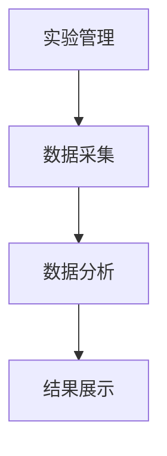

                 


# A/B测试：持续优化AI Agent的表现

---

## 关键词：
- A/B测试
- AI Agent
- 优化算法
- 统计显著性
- 实验设计
- 数据分析

---

## 摘要：
本文深入探讨了A/B测试在AI Agent优化中的应用，从基础概念到算法实现，再到系统架构和项目实战，全面解析如何通过A/B测试持续提升AI Agent的表现。文章结合数学公式、流程图和代码示例，详细讲解了A/B测试的原理、流程和实际案例，帮助读者掌握A/B测试的核心方法和技术细节。

---

## 第1章：A/B测试概述

### 1.1 A/B测试的基本概念

#### 1.1.1 什么是A/B测试
A/B测试是一种实验方法，通过将用户随机分配到不同的实验组，比较不同版本（A和B）的效果，从而找出最优方案。在AI Agent领域，A/B测试常用于优化算法、策略和交互设计。

#### 1.1.2 A/B测试的原理
A/B测试的核心在于统计假设检验，通过比较实验组和对照组的指标差异，判断改进步骤是否具有统计显著性。

#### 1.1.3 A/B测试在AI Agent优化中的作用
- 比较不同算法或策略的效果。
- 评估新功能或参数调整的有效性。
- 提供数据支持决策，减少人为偏差。

### 1.2 A/B测试的核心概念

#### 1.2.1 实验组与对照组
- 实验组：采用新策略或算法的用户。
- 对照组：保持现状的用户。

#### 1.2.2 显著性水平与置信区间
- 显著性水平α：拒绝原假设的概率（常用0.05）。
- 置信区间：估计总体参数的范围，通常为95%置信区间。

#### 1.2.3 统计假设检验
- 原假设H0：新策略与旧策略无差异。
- 备择假设H1：新策略优于旧策略。

### 1.3 A/B测试的流程

1. **确定目标与指标**
   - 明确优化目标（如提升准确率、减少响应时间）。
   - 选择衡量指标（如准确率、F1分数）。

2. **设计实验方案**
   - 确定实验组和对照组的比例。
   - 定义实验时间范围。

3. **数据收集与分析**
   - 收集实验数据。
   - 使用统计方法分析数据。

4. **结果解读与决策**
   - 判断结果是否具有统计显著性。
   - 根据结果调整策略或部署新版本。

---

## 第2章：A/B测试的数学基础

### 2.1 基础概率与分布

#### 2.1.1 概率的基本概念
- 概率是随机事件发生的可能性。
- 常见概率分布包括正态分布、二项分布等。

#### 2.1.2 常见概率分布
- 正态分布：对称分布，适用于大量数据。
- 二项分布：适用于伯努利试验（成功或失败）。

### 2.2 假设检验基础

#### 2.2.1 T检验的基本原理
- T检验用于比较两组数据的均值差异。
- 计算t值和p值，判断差异是否显著。

#### 2.2.2 卡方检验的应用
- 卡方检验用于分类变量的独立性检验。

### 2.3 统计显著性与置信区间

#### 2.3.1 显著性水平的设定
- 常用α=0.05或α=0.01。

#### 2.3.2 置信区间的计算
- 使用样本均值、标准差和样本量计算置信区间。

---

## 第3章：A/B测试的算法实现

### 3.1 基于统计的A/B测试方法

#### 3.1.1 T检验的数学公式
- t值计算公式：
  $$ t = \frac{\bar{x}_1 - \bar{x}_2}{\sqrt{\frac{s_1^2}{n_1} + \frac{s_2^2}{n_2}}} $$
- 其中，$\bar{x}_1$和$\bar{x}_2$是两组的样本均值，$s_1$和$s_2$是样本标准差，$n_1$和$n_2$是样本数量。

#### 3.1.2 Z检验的应用场景
- 当样本量大时，使用Z检验代替T检验。

### 3.2 基于机器学习的A/B测试

#### 3.2.1 机器学习在A/B测试中的应用
- 使用机器学习模型预测实验结果。
- 结合A/B测试数据优化模型。

#### 3.2.2 基于模型的预测与测试
- 利用模型预测实验组和对照组的性能差异。

### 3.3 算法实现的代码示例

#### 3.3.1 基于Python的T检验实现
```python
import numpy as np
from scipy import stats

# 生成两组数据
group_a = np.random.normal(0, 1, 100)
group_b = np.random.normal(0.5, 1, 100)

# 进行T检验
t_stat, p_val = stats.ttest_ind(group_a, group_b)
print(f"t统计量: {t_stat}, p值: {p_val}")
```

#### 3.3.2 使用scipy库进行假设检验
```python
from scipy.stats import chi2

# 卡方检验示例
observed = [20, 10]
expected = [15, 15]
chi_stat, p_val = chi2.fit(observed)
print(f"卡方统计量: {chi_stat}, p值: {p_val}")
```

---

## 第4章：A/B测试系统的架构设计

### 4.1 系统功能模块

#### 4.1.1 实验管理模块
- 管理实验设计和执行。

#### 4.1.2 数据采集模块
- 收集实验数据。

#### 4.1.3 数据分析模块
- 处理数据并生成报告。

#### 4.1.4 结果展示模块
- 可视化实验结果。

### 4.2 系统架构图


### 4.3 系统接口设计

#### 4.3.1 API接口定义
- POST /start_experiment：启动实验。
- GET /get_results：获取实验结果。

#### 4.3.2 数据接口的交互流程
```mermaid
sequenceDiagram
    用户 -> API: 发起实验请求
    API -> 数据库: 存储实验设计
    API -> 数据采集模块: 开始采集数据
    数据采集模块 -> API: 返回数据完成信号
    API -> 数据分析模块: 分析数据
    数据分析模块 -> API: 返回结果
    用户 <- API: 获取结果
```

---

## 第5章：A/B测试的项目实战

### 5.1 项目背景与目标

#### 5.1.1 项目背景介绍
- 优化AI Agent的响应时间。

#### 5.1.2 项目目标设定
- 比较两种算法的效果。

### 5.2 环境安装与配置

#### 5.2.1 安装Python环境
- 使用Anaconda或虚拟环境。

#### 5.2.2 安装必要的库
- 安装pandas、scipy、matplotlib。

### 5.3 核心代码实现

#### 5.3.1 数据预处理代码
```python
import pandas as pd

# 读取数据
data = pd.read_csv('experiment_data.csv')

# 分割实验组和对照组
group_a = data[data['group'] == 'A']
group_b = data[data['group'] == 'B']
```

#### 5.3.2 假设检验代码
```python
from scipy.stats import ttest_ind

# 进行T检验
t_stat, p_val = ttest_ind(group_a['response_time'], group_b['response_time'])
print(f"t统计量: {t_stat}, p值: {p_val}")
```

#### 5.3.3 结果可视化代码
```python
import matplotlib.pyplot as plt

# 绘制箱线图
plt.figure(figsize=(10,6))
plt.boxplot([group_a['response_time'], group_b['response_time']], labels=['A', 'B'])
plt.title('响应时间分布')
plt.show()
```

### 5.4 实验结果分析

#### 5.4.1 数据分析与结果解读
- 如果p值小于α（如0.05），拒绝原假设，新算法更优。

#### 5.4.2 实验结果对AI Agent优化的启示
- 结果显著时，部署新算法；否则，继续优化或尝试其他方案。

---

## 第6章：总结与展望

### 6.1 核心知识点回顾

#### 6.1.1 A/B测试的基本概念
- 实验设计、显著性检验。

#### 6.1.2 统计检验的方法
- T检验、卡方检验。

#### 6.1.3 系统架构的设计要点
- 功能模块划分、接口设计。

### 6.2 最佳实践与注意事项

#### 6.2.1 实验设计的常见误区
- 样本量不足、实验组和对照组不平衡。

#### 6.2.2 数据分析中的注意事项
- 确保数据分布符合假设检验的前提条件。

#### 6.2.3 系统优化的建议
- 使用自动化工具，实时监控实验结果。

### 6.3 未来发展趋势

#### 6.3.1 A/B测试在AI优化中的未来方向
- 结合机器学习，动态调整实验策略。

#### 6.3.2 结合实时反馈的A/B测试方法
- 实时分析数据，快速迭代优化。

---

## 附录：工具与资源

### 附录A：常用工具与库

#### 附录A.1 Python中的统计库
- scipy.stats：假设检验。
- pandas：数据处理。
- matplotlib：数据可视化。

---

通过以上结构，您可以系统地撰写一篇关于A/B测试在AI Agent优化中的技术博客文章。每一部分都详细展开，确保内容全面且易于理解。

