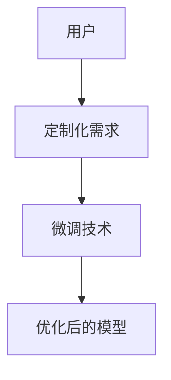
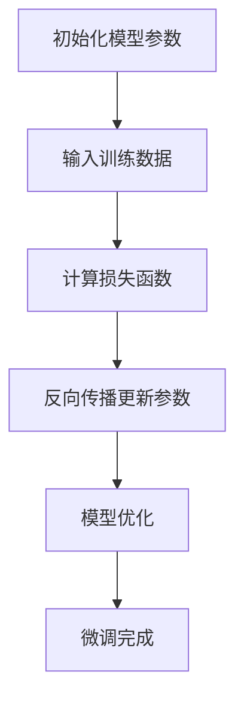
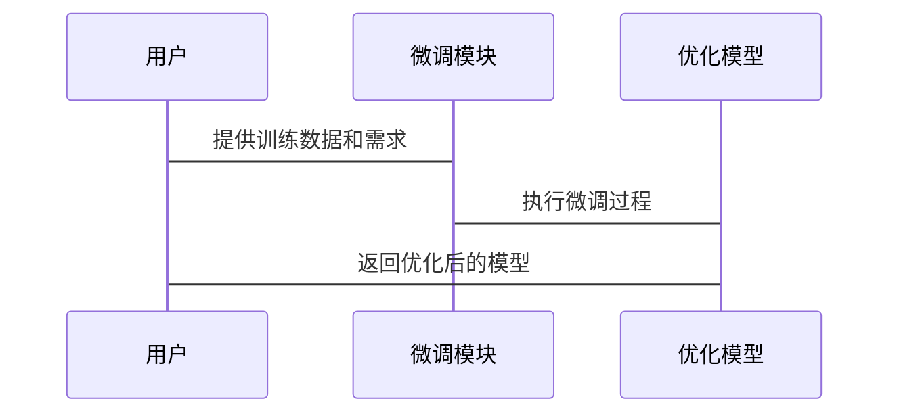

                 


---

# LLM Fine-tuning技术：定制化AI Agent的关键

## 关键词：
LLM微调技术、定制化AI Agent、大语言模型、AI代理、NLP微调、深度学习优化

## 摘要：
本文系统地探讨了LLM（大语言模型）微调技术在定制化AI代理中的关键作用。从基础概念到高级算法，从系统架构到项目实战，全面解析了如何通过微调技术实现高效、精准的定制化AI代理。文章结合数学公式、流程图和实际案例，深入剖析了微调技术的核心原理、应用场景、系统设计和优化策略，为读者提供了从理论到实践的全面指导。

---

# 目录

## 第一部分: LLM微调技术基础

### 第1章: LLM微调技术的背景与概述

#### 1.1 LLM的定义与特点
- 1.1.1 大语言模型（LLM）的定义  
- 1.1.2 LLM的核心特点  
- 1.1.3 LLM与传统NLP模型的区别  

#### 1.2 微调技术的背景与重要性
- 1.2.1 微调技术的起源与发展  
- 1.2.2 微调技术在LLM中的作用  
- 1.2.3 微调技术对企业级应用的价值  

#### 1.3 LLM微调技术的应用场景
- 1.3.1 定制化AI代理的需求  
- 1.3.2 微调技术在垂直领域的应用  
- 1.3.3 微调技术在企业内部的应用案例  

#### 1.4 本章小结  

---

## 第二部分: LLM微调技术的核心概念与原理

### 第2章: 微调技术的核心概念与联系

#### 2.1 微调技术的核心原理
- 2.1.1 微调技术的基本流程  
- 2.1.2 微调技术与从头训练的区别  
- 2.1.3 微调技术的数学基础  

#### 2.2 微调技术的关键属性特征对比
- 2.2.1 数据量与训练时间的对比  
- 2.2.2 模型参数调整的灵活性  
- 2.2.3 微调技术的适用场景分析  

#### 2.3 微调技术的ER实体关系图


---

### 第3章: 微调技术的算法原理与流程

#### 3.1 微调技术的数学模型
- 3.1.1 损失函数与优化过程  
- 3.1.2 微调的数学公式  
- 3.1.3 模型参数更新的详细步骤  

#### 3.2 微调技术的算法流程


#### 3.3 微调技术的Python实现示例
```python
import torch
import torch.nn as nn
from torch.utils.data import DataLoader

# 模型定义
class FineTuneModel(nn.Module):
    def __init__(self, base_model, num_classes):
        super(FineTuneModel, self).__init__()
        self.base_model = base_model
        self.classifier = nn.Linear(base_model.output_dim, num_classes)

    def forward(self, x):
        features = self.base_model(x)
        outputs = self.classifier(features)
        return outputs

# 训练函数
def train_model(model, dataloader, criterion, optimizer, num_epochs):
    for epoch in range(num_epochs):
        model.train()
        for inputs, labels in dataloader:
            outputs = model(inputs)
            loss = criterion(outputs, labels)
            loss.backward()
            optimizer.step()
            optimizer.zero_grad()
```

---

## 第三部分: 系统架构与设计

### 第4章: 微调技术的系统架构与设计

#### 4.1 问题场景介绍
- 定制化AI代理的核心需求分析  
- 微调技术在系统中的位置  
- 系统设计的目标与约束  

#### 4.2 系统功能设计
```mermaid
classDiagram
    class LLMModel {
        - params: ModelParameters
        - forward: Function
        - backward: Function
    }
    class FineTune {
        - model: LLMModel
        - dataset: TrainingData
        - optimizer: Optimizer
        - loss_function: LossFunction
    }
    class OptimizedModel {
        - fine_tuned_params: FineTunedParameters
    }
    FineTune -> LLMModel
    FineTune -> TrainingData
    FineTune -> Optimizer
    FineTune -> LossFunction
    FineTune --> OptimizedModel
```

#### 4.3 系统架构设计


#### 4.4 系统接口设计与交互流程


---

## 第四部分: 项目实战

### 第5章: 微调技术的项目实战

#### 5.1 环境安装与配置
- 安装依赖库  
- 配置运行环境  

#### 5.2 核心代码实现
- 数据预处理代码  
- 微调模块实现  
- 优化模型部署  

#### 5.3 实际案例分析
- 案例背景介绍  
- 微调过程详细分析  
- 实验结果与对比  

#### 5.4 项目总结与经验分享

---

## 第五部分: 最佳实践与未来展望

### 第6章: 微调技术的最佳实践

#### 6.1 关键技术总结
- 数据选择与处理的注意事项  
- 模型选择的策略  
- 训练过程中的优化技巧  

#### 6.2 小结与展望
- 当前微调技术的局限性  
- 未来研究方向  

#### 6.3 注意事项与常见问题
- 微调过程中可能出现的问题及解决方案  
- 性能优化的建议  

#### 6.4 拓展阅读与学习资源

---

## 参考文献
（此处列出相关书籍、论文和技术文档）

---

通过以上目录，文章将从理论到实践，系统地探讨LLM微调技术的核心概念、算法原理、系统设计和实际应用，为读者提供全面而深入的技术指导。

