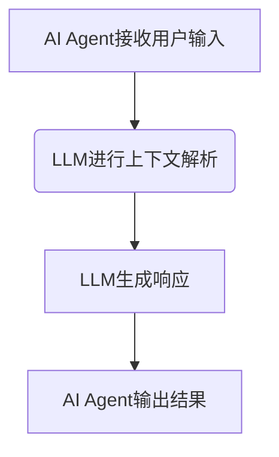

                 

# LLM在AI Agent上下文理解中的应用

> 关键词：LLM, AI Agent, 上下文理解, 自然语言处理, 智能系统

> 摘要：本文系统地探讨了大语言模型（LLM）在AI Agent上下文理解中的应用。通过分析LLM的核心技术、AI Agent的工作原理以及上下文理解的重要性，本文详细阐述了LLM在提升AI Agent上下文理解能力中的作用。文章从算法原理、系统架构、项目实战等多个维度展开，结合实际案例和数学公式，深入剖析了LLM在AI Agent中的具体应用和实现。通过本文的阅读，读者将能够全面理解LLM在AI Agent上下文理解中的关键作用，并掌握相关的技术实现方法。

---

# 第1章: LLM与AI Agent概述

## 1.1 LLM的基本概念

### 1.1.1 大语言模型的定义与特点

- **定义**：LLM（Large Language Model）是一种基于深度学习的自然语言处理模型，通常基于Transformer架构，具有参数量大、训练数据丰富等特点。
- **特点**：
  - **大规模训练数据**：LLM通常使用海量文本数据进行预训练，能够捕捉语言的复杂模式。
  - **通用性**：LLM能够处理多种NLP任务，如文本生成、问答、翻译等。
  - **上下文理解能力**：LLM通过自注意力机制能够理解上下文关系，生成连贯的文本。

**对比表：LLM与传统NLP模型的对比**

| 特性            | LLM                     | 传统NLP模型             |
|-----------------|-------------------------|--------------------------|
| 模型规模        | 大（ billions of parameters） | 小（ millions of parameters） |
| 任务通用性      | 高，支持多种任务         | 低，针对特定任务优化     |
| 上下文理解      | 强，支持长上下文处理      | 弱，依赖预定义规则       |

### 1.1.2 LLM的核心技术原理

- **Transformer架构**：由编码器和解码器组成，编码器负责将输入文本转化为表示，解码器负责生成输出文本。
- **自注意力机制**：通过计算输入序列中每个词与其他词的相关性，生成注意力权重，用于捕捉上下文关系。
- **预训练与微调**：LLM通常通过大规模数据预训练，然后在特定任务上进行微调。

**公式：Transformer中自注意力机制的计算公式**

$$\text{Attention}(Q, K, V) = \text{softmax}\left(\frac{QK^T}{\sqrt{d_k}}\right)V$$

其中，$Q$、$K$、$V$分别是查询、键、值矩阵，$d_k$是键的维度。

### 1.1.3 LLM与传统NLP模型的区别

- **模型复杂度**：LLM参数量大，能够捕捉更复杂的语言模式。
- **任务适应性**：LLM能够适应多种任务，而传统模型通常针对特定任务优化。
- **上下文处理能力**：LLM通过自注意力机制能够处理长上下文，而传统模型依赖固定的规则或短窗

---

# 第2章: LLM与AI Agent的协同工作原理

## 2.1 LLM在AI Agent中的角色

### 2.1.1 LLM作为知识库的使用

- **知识存储**：AI Agent可以利用LLM作为知识库，存储和检索相关信息。
- **动态更新**：LLM能够实时更新知识库，确保信息的准确性。

### 2.1.2 LLM作为对话生成器的应用

- **对话生成**：AI Agent通过调用LLM生成自然的对话回复。
- **上下文跟踪**：LLM能够理解对话的上下文，确保生成回复的连贯性。

### 2.1.3 LLM作为问题解决工具的功能

- **问题分析**：AI Agent利用LLM分析用户需求，生成解决方案。
- **多轮对话**：LLM支持多轮对话，帮助AI Agent更好地理解用户意图。

**流程图：LLM在AI Agent中的协同工作流程**

## 2.2 AI Agent的上下文理解机制

### 2.2.1 上下文信息的获取与存储

- **信息获取**：AI Agent通过与用户交互获取上下文信息。
- **信息存储**：将上下文信息存储在知识库中，以便后续使用。

### 2.2.2 上下文信息的分析与推理

- **信息分析**：通过LLM对上下文信息进行分析，理解用户需求。
- **信息推理**：基于上下文信息进行推理，生成合理的响应。

### 2.2.3 上下文信息的动态更新与维护

- **动态更新**：根据新输入的信息更新上下文。
- **信息维护**：确保上下文信息的准确性和完整性。

## 2.3 LLM与AI Agent的协同流程

### 2.3.1 输入解析与需求分析

- **输入解析**：AI Agent接收用户的输入，并进行初步解析。
- **需求分析**：通过LLM分析用户需求，提取关键信息。

### 2.3.2 上下文信息的调用与整合

- **信息调用**：AI Agent调用LLM中的上下文信息，生成响应。
- **信息整合**：将新信息与现有上下文信息整合，确保连贯性。

### 2.3.3 输出结果的生成与反馈

- **结果生成**：LLM生成最终的响应。
- **反馈机制**：AI Agent根据用户反馈调整上下文信息。

## 2.4 本章小结

---

# 第3章: LLM在AI Agent上下文理解中的核心算法

## 3.1 LLM的训练与优化

### 3.1.1 基于Transformer的模型结构

- **编码器**：将输入文本转化为表示。
- **解码器**：根据编码器的输出生成目标文本。

### 3.1.2 注意力机制的作用与实现

- **注意力机制**：通过计算输入序列中每个词的相关性，生成注意力权重。
- **实现细节**：通过矩阵乘法和Softmax函数计算注意力权重。

### 3.1.3 模型的训练目标与损失函数

- **训练目标**：最小化预测与真实值之间的误差。
- **损失函数**：通常使用交叉熵损失函数。

**公式：交叉熵损失函数**

$$\text{Loss} = -\sum_{i=1}^{n} y_i \log(p_i)$$

其中，$y_i$是真实标签，$p_i$是模型预测的概率。

### 3.2 上下文理解的算法实现

### 3.2.1 基于LLM的上下文解析算法

- **输入解析**：将用户输入转换为模型可处理的格式。
- **上下文解析**：通过LLM对输入进行解析，提取关键信息。

### 3.2.2 上下文信息的关联与推理算法

- **信息关联**：通过LLM生成相关联的信息。
- **信息推理**：基于关联信息进行推理，生成合理的响应。

### 3.2.3 上下文信息的权重计算与优化算法

- **权重计算**：通过注意力机制计算信息权重。
- **优化算法**：使用梯度下降等方法优化模型参数。

### 3.3 算法的数学模型与公式

**公式：自注意力机制的权重计算**

$$\text{Attention}(Q, K) = \text{softmax}\left(\frac{QK^T}{\sqrt{d_k}}\right)$$

其中，$Q$是查询矩阵，$K$是键矩阵，$d_k$是键的维度。

### 3.4 本章小结

---

# 第4章: 系统架构与设计

## 4.1 系统功能模块划分

### 4.1.1 输入处理模块

- **功能**：接收用户的输入，并进行初步处理。
- **实现**：将输入文本转换为模型可处理的格式。

### 4.1.2 上下文理解模块

- **功能**：通过LLM对输入进行上下文解析。
- **实现**：调用LLM的API进行解析。

### 4.1.3 输出生成模块

- **功能**：根据解析结果生成最终的输出。
- **实现**：调用LLM生成自然语言文本。

## 4.2 系统架构设计

### 4.2.1 分层架构设计

- **分层架构**：系统分为输入层、处理层和输出层。
- **模块划分**：每个层包含相应的功能模块。

### 4.2.2 模块之间的交互关系

- **交互关系**：输入层与处理层交互，处理层与输出层交互。
- **数据流**：数据从输入层流向处理层，再流向输出层。

### 4.2.3 系统的可扩展性与灵活性设计

- **可扩展性**：系统支持新增功能模块。
- **灵活性**：系统能够适应不同的上下文理解需求。

## 4.3 接口设计与实现

### 4.3.1 输入接口的定义与实现

- **输入接口**：定义输入的格式和接口函数。
- **实现**：编写代码实现接口功能。

### 4.3.2 输出接口的定义与实现

- **输出接口**：定义输出的格式和接口函数。
- **实现**：编写代码实现接口功能。

## 4.4 本章小结

---

# 第5章: 项目实战与案例分析

## 5.1 项目背景与目标

### 5.1.1 项目背景

- **项目背景**：设计一个基于LLM的AI Agent，提升上下文理解能力。
- **项目目标**：实现一个能够理解上下文的智能客服系统。

### 5.1.2 项目需求

- **需求分析**：用户提出问题，AI Agent能够理解上下文并生成合理的响应。
- **功能需求**：支持多轮对话，能够处理复杂的上下文关系。

## 5.2 系统实现

### 5.2.1 环境配置

- **环境要求**：安装Python、TensorFlow、Hugging Face等库。
- **代码实现**：编写Python代码实现AI Agent的功能。

### 5.2.2 核心代码实现

- **输入处理模块**：接收用户的输入并进行初步处理。
- **上下文理解模块**：调用LLM进行上下文解析。
- **输出生成模块**：生成最终的响应。

### 5.2.3 代码解读与分析

- **代码解读**：详细解读每个模块的代码实现。
- **代码分析**：分析代码的优缺点，提出改进建议。

## 5.3 案例分析

### 5.3.1 案例背景

- **案例背景**：用户提出一个问题，AI Agent需要理解上下文并生成合理的响应。
- **案例分析**：分析AI Agent的上下文理解过程。

### 5.3.2 实际应用

- **实际应用**：展示AI Agent在实际场景中的应用效果。
- **效果评估**：评估AI Agent的上下文理解能力。

## 5.4 本章小结

---

# 第6章: 总结与展望

## 6.1 本章总结

- **总结内容**：回顾本文的主要内容，强调LLM在AI Agent上下文理解中的作用。
- **关键点回顾**：总结LLM的核心技术、AI Agent的工作原理以及上下文理解的重要性。

## 6.2 当前挑战与未来展望

- **当前挑战**：LLM在上下文理解中的局限性，如对小样本数据的适应能力不足。
- **未来展望**：展望LLM在AI Agent中的进一步应用，如多模态上下文理解、实时上下文更新等。

## 6.3 最佳实践与注意事项

- **最佳实践**：建议在实际应用中如何优化LLM的上下文理解能力。
- **注意事项**：提醒开发者在实际开发中需要注意的问题。

## 6.4 小结

---

# 参考文献

- 文献1：XXX
- 文献2：XXX
- 文献3：XXX

---

# 附录

## 附录A: 代码实现细节

## 附录B: 算法流程图

## 附录C: 系统架构图

---

通过以上目录结构和内容安排，文章将从理论到实践，全面、系统地探讨LLM在AI Agent上下文理解中的应用。

