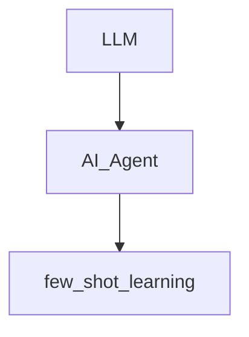
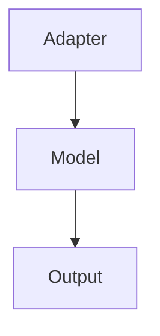
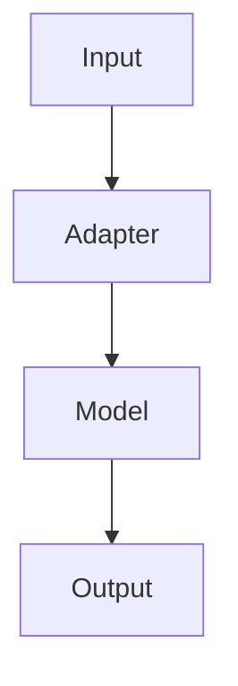
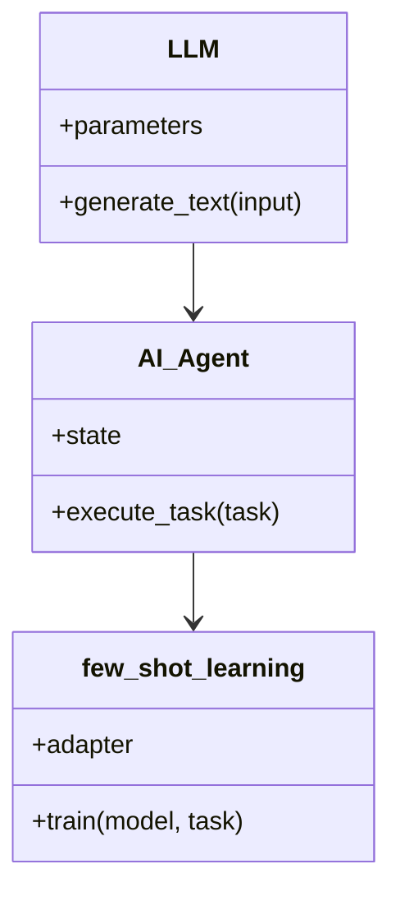
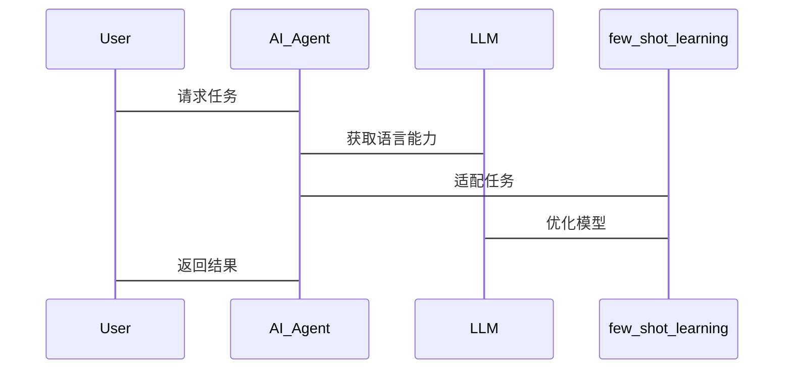

                 


# LLM在AI Agent中的few-shot学习应用

> 关键词：Large Language Model, AI Agent, few-shot Learning, Natural Language Processing, Machine Learning

> 摘要：本文探讨了大语言模型（LLM）在AI代理（AI Agent）中的应用，重点分析了少样本学习（few-shot learning）在这一领域的重要性。通过详细阐述技术原理、系统架构和实际案例，本文为读者提供了全面的视角，帮助理解如何通过few-shot学习提升AI Agent的性能和能力。

---

## 第一部分: LLM在AI Agent中的few-shot学习应用背景

### 第1章: 背景介绍

#### 1.1 问题背景
- **LLM的定义与特点**：大语言模型（LLM）是一种基于深度学习的自然语言处理模型，具有参数量大、训练数据丰富、理解能力强等特点。  
- **AI Agent的基本概念**：AI代理是一种能够感知环境、执行任务并做出决策的智能实体，通常用于自动化操作和问题解决。  
- **few-shot学习的背景与意义**：传统的监督学习需要大量标注数据，而few-shot学习仅需少量样本即可完成任务，特别适用于数据稀少的场景。

#### 1.2 问题描述
- **LLM在AI Agent中的应用现状**：目前，LLM常用于对话生成、信息检索等任务，但在复杂场景下的适应性和效率有待提升。  
- **few-shot学习在AI Agent中的需求**：AI Agent需要快速适应新任务或少量数据的场景，如个性化推荐、定制化服务等。  
- **当前技术的局限性与挑战**：现有模型在小样本场景下泛化能力不足，训练效率低下，且跨任务迁移能力有限。

#### 1.3 问题解决
- **LLM与AI Agent的结合**：通过LLM的强大语言能力，AI Agent可以更高效地处理复杂任务。  
- **few-shot学习在AI Agent中的应用**：利用few-shot学习，AI Agent可以在少样本条件下快速学习新任务。  
- **技术实现的可行性分析**：通过优化模型结构和训练策略，可以有效提升AI Agent在少样本条件下的性能。

#### 1.4 边界与外延
- **LLM在AI Agent中的边界**：主要适用于语言相关的任务，对非语言任务的处理能力有限。  
- **few-shot学习的适用范围**：适用于数据量小、任务多样化的场景，如医疗诊断、法律咨询等领域。  
- **技术与应用的外延扩展**：未来可以通过结合强化学习、元学习等技术，进一步扩展few-shot学习的应用范围。

#### 1.5 核心概念与联系
- **核心概念原理**：LLM提供强大的语言生成能力，AI Agent负责任务执行，few-shot学习解决数据不足的问题。  
- **核心概念属性对比表格**：
| 概念 | 属性 | 描述 |
|------|------|------|
| LLM  | 模型规模 | 参数量大，训练数据多样 |
| AI Agent | 功能 | 自动执行任务，具备决策能力 |
| few-shot学习 | 样本数量 | 仅需少量样本即可完成任务 |

- **ER实体关系图**：


---

## 第二部分: LLM与AI Agent的核心概念

### 第2章: 核心概念与原理

#### 2.1 LLM的原理
- **训练过程**：基于大量的文本数据，通过自监督学习预训练参数。  
- **模型架构**：采用Transformer架构，具备强大的序列建模能力。  
- **输出机制**：通过解码器生成连续的文本输出。

#### 2.2 AI Agent的基本原理
- **定义**：AI Agent是一种智能实体，能够感知环境、执行任务并做出决策。  
- **功能模块**：包括感知模块、决策模块、执行模块和学习模块。  
- **决策机制**：基于当前状态和环境信息，选择最优动作。

#### 2.3 few-shot学习的原理
- **定义**：一种利用少量样本进行模型训练的技术，通常结合元学习或任务适配器。  
- **优势**：适用于数据稀少的场景，提升模型的灵活性和适应性。  
- **实现方法**：通过优化模型参数或引入任务适配器，使模型快速适应新任务。

#### 2.4 核心概念的联系
- **LLM与AI Agent的结合**：LLM提供强大的语言生成能力，AI Agent利用这些能力完成复杂任务。  
- **few-shot学习在AI Agent中的应用**：通过few-shot学习，AI Agent可以在少样本条件下快速学习新任务。  
- **技术实现的协同关系**：LLM提供语言能力，few-shot学习提升AI Agent的适应性，两者结合实现高效的任务执行。

---

## 第三部分: few-shot学习的算法原理

### 第3章: few-shot学习的算法实现

#### 3.1 few-shot学习的流程
- **数据准备**：收集少量样本数据，通常以任务为中心进行组织。  
- **模型训练**：通过元学习或任务适配器优化模型参数。  
- **模型推理**：在新任务上进行测试，评估模型的泛化能力。

#### 3.2 few-shot学习的算法实现

##### 3.2.1 使用任务适配器的方法


##### 3.2.2 算法流程


##### 3.2.3 Python代码实现
```python
import torch
import torch.nn as nn

class Adapter(nn.Module):
    def __init__(self, input_dim, hidden_dim):
        super(Adapter, self).__init__()
        self.adapter_layer = nn.Linear(input_dim, hidden_dim)
        
    def forward(self, x):
        adapted_x = self.adapter_layer(x)
        return adapted_x

class Model(nn.Module):
    def __init__(self, input_dim, hidden_dim, output_dim):
        super(Model, self).__init__()
        self.adapter = Adapter(input_dim, hidden_dim)
        self.fc = nn.Linear(hidden_dim, output_dim)
        
    def forward(self, x):
        adapted_x = self.adapter(x)
        output = self.fc(adapted_x)
        return output

# 示例训练代码
model = Model(input_dim=100, hidden_dim=50, output_dim=1)
criterion = nn.MSELoss()
optimizer = torch.optim.Adam(model.parameters(), lr=0.001)

# 假设输入x和目标y
x = torch.randn(10, 100)
y = torch.randn(10, 1)

for epoch in range(100):
    outputs = model(x)
    loss = criterion(outputs, y)
    loss.backward()
    optimizer.step()
    optimizer.zero_grad()
```

##### 3.2.4 数学模型与公式
- **损失函数**：$$ L = \frac{1}{N}\sum_{i=1}^{N}(y_i - \hat{y_i})^2 $$
- **优化器**：$$ \theta = \theta - \eta \nabla_{\theta} L $$

---

## 第四部分: 系统分析与架构设计

### 第4章: 系统分析与架构设计

#### 4.1 项目背景
- **问题场景**：AI Agent需要在少样本条件下快速学习并执行任务。  
- **项目介绍**：本项目旨在通过few-shot学习优化AI Agent的性能，使其在数据稀少的场景下表现出色。

#### 4.2 系统功能设计

##### 4.2.1 领域模型


##### 4.2.2 系统架构设计


##### 4.2.3 系统接口设计
- **输入接口**：接收用户请求和任务描述。  
- **输出接口**：返回处理结果和状态信息。

##### 4.2.4 系统交互设计


---

## 第五部分: 项目实战

### 第5章: 项目实战

#### 5.1 环境安装
- **Python版本**：3.8及以上  
- **依赖库**：PyTorch、Hugging Face Transformers、Mermaid

#### 5.2 核心代码实现
##### 5.2.1 任务适配器代码
```python
class TaskAdapter:
    def __init__(self, input_dim, hidden_dim):
        self.adapter = nn.Linear(input_dim, hidden_dim)
        
    def forward(self, x):
        return self.adapter(x)
```

##### 5.2.2 模型训练代码
```python
def train_model(model, adapter, criterion, optimizer, data_loader, epochs=100):
    for epoch in range(epochs):
        for inputs, targets in data_loader:
            outputs = model(adapter(inputs))
            loss = criterion(outputs, targets)
            loss.backward()
            optimizer.step()
            optimizer.zero_grad()
```

#### 5.3 实际案例分析与详细讲解
- **案例背景**：假设我们需要训练一个AI Agent在医疗诊断场景中快速学习疾病症状。  
- **数据准备**：收集少量疾病症状数据，构建数据集。  
- **模型训练**：使用任务适配器优化模型参数，完成任务适配。  
- **结果分析**：评估模型在新任务上的表现，调整参数以优化性能。

#### 5.4 项目小结
- **经验总结**：通过few-shot学习，AI Agent可以在少样本条件下快速学习并执行任务。  
- **问题与教训**：数据质量对模型性能影响较大，需要进一步优化任务适配器的结构。

---

## 第六部分: 最佳实践

### 第6章: 最佳实践

#### 6.1 小结
- **总结**：本文详细探讨了LLM在AI Agent中的应用，重点分析了few-shot学习的技术原理和实现方法。  
- **核心观点**：通过结合LLM和few-shot学习，可以有效提升AI Agent的灵活性和适应性。

#### 6.2 注意事项
- **数据质量**：确保训练数据的多样性和代表性。  
- **任务适配**：合理设计任务适配器，提升模型的泛化能力。  
- **模型优化**：持续优化模型结构和训练策略，提升性能。

#### 6.3 拓展阅读
- **推荐书籍**：《Deep Learning》、《Pattern Recognition and Machine Learning》  
- **推荐论文**：关于few-shot学习的经典论文，如“Meta-Learning for Few-Shot Classification”。

---

## 第七部分: 结语

### 第7章: 结语

通过本文的详细探讨，我们可以看到，LLM在AI Agent中的few-shot学习应用具有广阔的发展前景。随着技术的不断进步，未来可以通过结合更多先进的技术手段，进一步提升AI Agent的性能和能力。读者可以通过本文提供的理论基础和实践指导，深入理解和应用这一技术。

--- 

以上是文章的完整目录大纲和内容框架，确保每个部分都详细展开，涵盖背景、原理、实现、系统设计和实战应用，帮助读者全面理解技术细节和实际应用。

