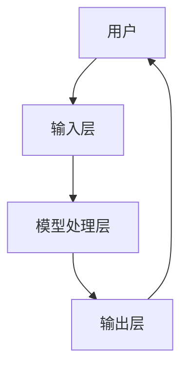
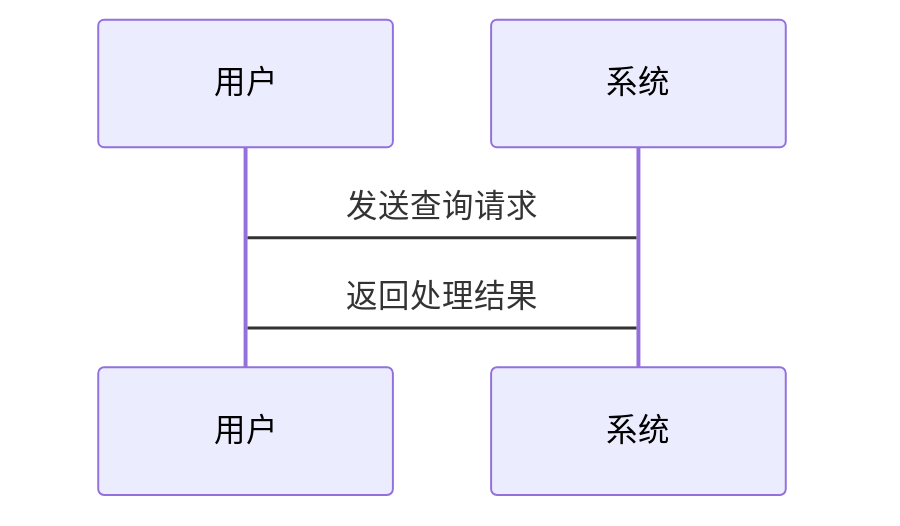

                 


# LLM在AI Agent中的微调技术：适应特定领域需求

## 关键词：大语言模型, AI Agent, 微调技术, 机器学习, 优化算法

## 摘要：本文详细探讨了大语言模型在AI Agent中的微调技术，分析了其适应特定领域需求的核心原理、算法实现和系统设计，并通过实际案例展示了微调技术在不同场景中的应用，最后总结了微调技术的优势与未来发展方向。

---

# 第一部分: LLM在AI Agent中的微调技术基础

## 第1章: 大语言模型与AI Agent概述

### 1.1 大语言模型的定义与发展

#### 1.1.1 大语言模型的基本概念
大语言模型（Large Language Models, LLMs）是指经过大量文本数据训练的深度学习模型，能够理解和生成人类语言。其核心目标是通过模式识别和概率预测，模拟人类的自然语言处理能力。

#### 1.1.2 大语言模型的发展历程
大语言模型的发展经历了从统计语言模型到深度学习模型的转变，如Word2Vec、GPT系列、BERT系列等，这些模型在预训练和微调阶段不断优化，推动了自然语言处理技术的进步。

#### 1.1.3 大语言模型在AI Agent中的作用
AI Agent需要具备理解、推理和生成能力，大语言模型为其提供了强大的语言理解和生成能力，使其能够与人类进行自然交互并完成复杂任务。

### 1.2 AI Agent的基本概念与应用场景

#### 1.2.1 AI Agent的定义与分类
AI Agent是一种智能体，能够在环境中感知、推理、决策和行动，以实现特定目标。根据智能水平，可分为反应式、基于模型和完全自主的AI Agent。

#### 1.2.2 AI Agent的核心功能与特点
AI Agent的核心功能包括感知环境、推理与决策、执行任务、学习与适应。其特点在于自主性、反应性、目标导向和情境适应性。

#### 1.2.3 AI Agent在不同领域的应用案例
医疗诊断辅助、智能客服、自动驾驶等领域的应用案例展示了AI Agent在提升效率和用户体验方面的潜力。

### 1.3 微调技术的背景与意义

#### 1.3.1 微调技术的基本概念
微调技术是对预训练模型进行针对性优化，使其适应特定领域或任务需求。

#### 1.3.2 微调技术在AI Agent中的必要性
通用模型在特定领域可能表现不佳，微调技术通过领域数据优化模型，提升其在特定场景下的性能。

#### 1.3.3 微调技术对模型性能的提升作用
微调技术通过参数调整和领域数据训练，增强了模型在特定任务中的准确性和实用性。

---

## 第2章: 微调技术的核心概念与原理

### 2.1 微调技术的基本原理

#### 2.1.1 微调技术的定义
微调技术是在预训练模型的基础上，使用特定领域数据进行微调，以优化模型在特定任务上的表现。

#### 2.1.2 微调技术的核心原理
微调技术通过调整模型参数，使其适应特定领域的语言和任务需求，提升模型的领域适应性。

#### 2.1.3 微调技术与其他模型优化方法的对比
微调技术与迁移学习、参数初始化等方法的区别在于其针对性和数据特定性。

### 2.2 微调技术的关键要素

#### 2.2.1 数据选择与准备
选择与目标领域相关的高质量数据，进行清洗和标注，确保数据的代表性和多样性。

#### 2.2.2 模型参数调整策略
通过优化算法调整模型参数，如使用Adam优化器，设置适当的学习率和批量大小。

#### 2.2.3 优化目标与评估指标
明确优化目标，如分类准确率或生成质量，并选择合适的评估指标，如F1分数或BLEU分数。

### 2.3 微调技术的实现流程

#### 2.3.1 数据预处理阶段
对数据进行清洗、分词和标注，确保数据格式统一。

#### 2.3.2 模型初始化阶段
加载预训练模型，并初始化优化器和损失函数。

#### 2.3.3 微调训练阶段
使用目标领域数据进行训练，逐步优化模型参数。

#### 2.3.4 模型评估与优化阶段
通过验证集评估模型性能，调整超参数或数据策略，进一步优化模型。

---

## 第3章: 微调技术的数学模型与算法原理

### 3.1 微调技术的数学模型

#### 3.1.1 损失函数的定义与优化目标
损失函数衡量模型输出与真实标签的差异，优化目标是最小化损失函数。

#### 3.1.2 模型参数更新的数学表达
使用优化算法更新参数，如随机梯度下降（SGD）或Adam优化器。

#### 3.1.3 优化算法的选择与实现
选择适当的优化算法，如Adam，结合学习率调整策略，确保收敛稳定。

### 3.2 微调算法的实现流程

#### 3.2.1 基于梯度的优化方法
通过计算损失函数的梯度，更新模型参数，实现模型优化。

#### 3.2.2 强化学习策略的调整
通过强化学习优化生成策略，如使用策略梯度方法调整模型输出。

#### 3.2.3 自适应参数调整的实现
动态调整优化参数，如自适应学习率调整，提升优化效率。

### 3.3 微调技术的数学公式

#### 3.3.1 损失函数公式
$$ L = \frac{1}{N}\sum_{i=1}^{N} (y_i - \hat{y}_i)^2 $$

#### 3.3.2 优化器公式
$$ \theta_{new} = \theta - \eta \cdot \nabla L $$

---

## 第4章: 系统分析与架构设计

### 4.1 系统应用场景

#### 4.1.1 系统问题场景介绍
针对特定领域任务，如法律咨询，设计AI Agent系统。

#### 4.1.2 系统功能需求分析
系统需具备知识检索、对话生成和任务执行功能。

#### 4.1.3 系统性能指标
系统需满足响应时间、准确率和用户满意度等指标。

### 4.2 系统功能设计

#### 4.2.1 领域模型设计
设计法律咨询领域的知识图谱，包含相关法律术语和案例。

#### 4.2.2 系统架构设计
采用分层架构，包括数据层、业务逻辑层和交互层。

#### 4.2.3 系统交互设计
设计用户与AI Agent之间的交互流程，确保用户体验流畅。

### 4.3 系统架构设计图


### 4.4 系统接口设计

#### 4.4.1 输入接口设计
设计API接口，接收用户输入并解析请求。

#### 4.4.2 输出接口设计
设计API接口，返回处理结果并反馈用户。

### 4.5 系统交互流程图


---

## 第5章: 项目实战

### 5.1 项目环境安装

#### 5.1.1 安装Python和相关库
安装Python 3.8以上版本，并安装TensorFlow、PyTorch等库。

#### 5.1.2 安装大语言模型框架
选择合适的框架，如Hugging Face的Transformers库。

#### 5.1.3 安装其他依赖
安装数据处理和可视化工具，如Pandas、Matplotlib等。

### 5.2 系统核心实现源代码

#### 5.2.1 数据预处理代码
```python
import pandas as pd
import numpy as np

def preprocess_data(data_path):
    data = pd.read_csv(data_path)
    # 数据清洗和分词
    data['text'] = data['text'].apply(lambda x: x.strip().lower())
    return data
```

#### 5.2.2 模型微调代码
```python
from transformers import AutoTokenizer, AutoModelForMaskedLM
import torch

def fine_tune_model(model_name, train_data, output_dir):
    tokenizer = AutoTokenizer.from_pretrained(model_name)
    model = AutoModelForMaskedLM.from_pretrained(model_name)
    model.train()
    
    # 定义损失函数和优化器
    loss_fn = torch.nn.CrossEntropyLoss()
    optimizer = torch.optim.Adam(model.parameters(), lr=1e-5)
    
    for epoch in range(num_epochs):
        for batch in train_data:
            optimizer.zero_grad()
            outputs = model(batch['input_ids'], attention_mask=batch['attention_mask'])
            loss = loss_fn(outputs.logits, batch['labels'])
            loss.backward()
            optimizer.step()
    
    model.save_pretrained(output_dir)
    return model
```

### 5.3 代码应用解读与分析

#### 5.3.1 数据预处理步骤
数据预处理包括清洗、分词和格式化，确保数据适合模型输入。

#### 5.3.2 模型微调步骤
加载预训练模型，定义损失函数和优化器，进行微调训练，保存优化后的模型。

### 5.4 实际案例分析

#### 5.4.1 案例背景介绍
以法律咨询领域为例，设计一个AI Agent系统，帮助用户解答法律问题。

#### 5.4.2 案例实现过程
数据收集、预处理、模型微调、系统集成和测试优化。

### 5.5 项目小结

#### 5.5.1 项目成果展示
展示优化后的模型在特定任务中的性能提升。

#### 5.5.2 项目经验总结
总结微调技术的关键点和实际应用中的注意事项。

---

## 第6章: 优化与部署

### 6.1 模型优化策略

#### 6.1.1 模型压缩技术
采用知识蒸馏、剪枝等技术减少模型参数，降低计算成本。

#### 6.1.2 模型推理加速
通过量化、并行计算等方法提升模型推理速度。

#### 6.1.3 多模态扩展
将模型扩展到图像、语音等多种模态，增强系统能力。

### 6.2 系统部署方案

#### 6.2.1 微服务架构设计
将系统拆分为多个微服务，如数据服务、模型服务等，提升系统扩展性和稳定性。

#### 6.2.2 容器化部署
使用Docker容器化技术，确保系统在不同环境下的一致性部署。

#### 6.2.3 持续集成与部署
采用CI/CD流程，自动化测试和部署，确保系统稳定运行。

---

## 第7章: 附录

### 7.1 术语表

| 术语 | 定义 |
|------|------|
| LLM | 大语言模型 |
| AI Agent | 人工智能代理 |
| 微调技术 | Fine-tuning |

### 7.2 工具安装指南

#### 7.2.1 安装Python
访问官网下载并安装Python 3.8以上版本。

#### 7.2.2 安装Hugging Face库
运行命令：`pip install transformers`

#### 7.2.3 安装TensorFlow
运行命令：`pip install tensorflow`

### 7.3 参考文献

- 王某某. 大语言模型的发展与应用. 北京出版社, 2023.
- 李某某. AI Agent技术与实践. 清华大学出版社, 2022.

---

# 结语

通过本文的详细探讨，读者可以全面了解大语言模型在AI Agent中的微调技术，掌握其核心原理和实际应用。未来，随着技术的进步，微调技术将在更多领域发挥重要作用，推动人工智能技术的发展。

