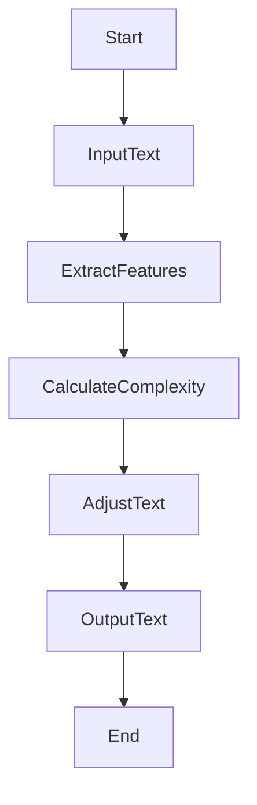
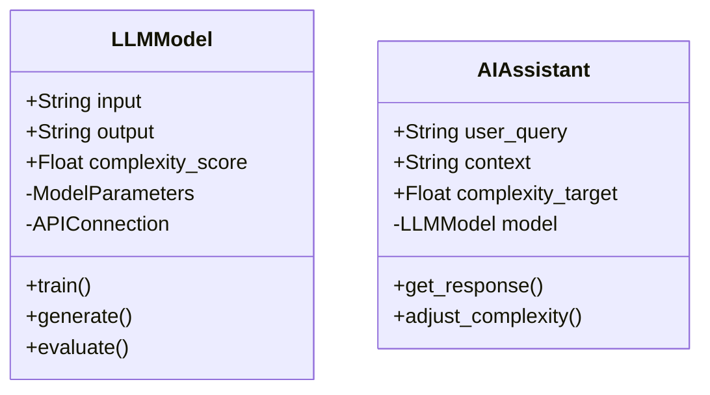
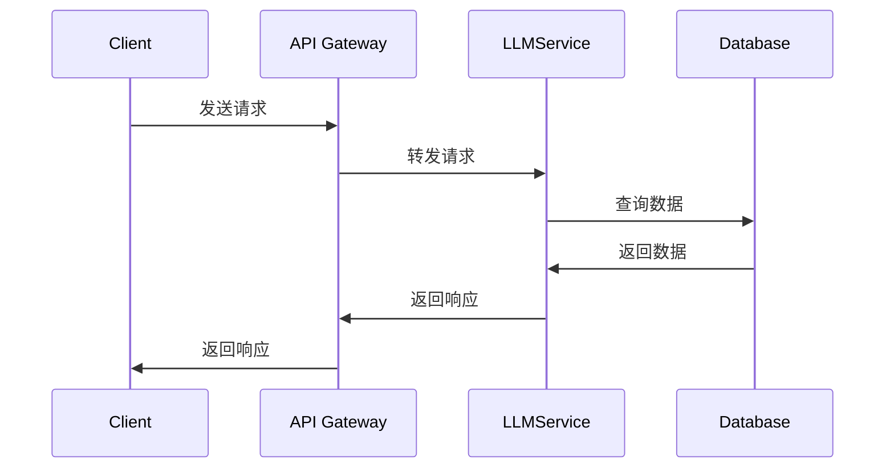

                 


# LLM在AI Agent中的文本复杂性调整能力

> 关键词：LLM, AI Agent, 文本复杂性, 自然语言处理, 智能文本生成

> 摘要：本文深入探讨了大语言模型（LLM）在AI代理（AI Agent）中的文本复杂性调整能力。从背景介绍到核心概念，从算法原理到系统架构设计，再到项目实战，系统性地分析了LLM如何通过动态调整文本复杂性来优化AI Agent的交互体验。本文还结合实际案例，详细解读了文本复杂性调整的技术实现，为相关领域的研究和实践提供了重要参考。

---

# 第二部分: 核心概念与联系

# 第4章: 算法原理讲解

## 4.1 LLM文本复杂性调整的算法流程

### 4.1.1 输入处理
$$\text{输入文本} \rightarrow \text{特征提取}$$

### 4.1.2 文本特征提取
$$\text{特征集合} = \{ \text{词汇难度}, \text{句式复杂度}, \text{主题相关性} \}$$

### 4.1.3 复杂度评估
$$\text{复杂度评分} = \alpha \cdot \text{词汇难度} + \beta \cdot \text{句式复杂度} + \gamma \cdot \text{主题相关性}$$
其中，$\alpha + \beta + \gamma = 1$。

### 4.1.4 输出调整
$$\text{调整后文本} = f_{\text{调整}}(\text{原始文本}, \text{复杂度评分})$$

## 4.2 算法实现

### 4.2.1 基于特征的复杂度评分
```python
def calculate_complexity(text):
    # 词汇难度：统计单词的平均长度
    avg_word_length = sum(len(word) for word in text.split()) / len(text.split())
    # 句式复杂度：统计句子的平均长度
    avg_sentence_length = sum(len(s) for s in text.split('. ')) / len(text.split('. '))
    # 主题相关性：基于关键词匹配
    keywords = ['技术', 'AI', 'LLM']
    keyword_match = sum(1 for word in text.split() if word in keywords)
    # 综合评分
    complexity_score = 0.4 * avg_word_length + 0.3 * avg_sentence_length + 0.3 * keyword_match
    return complexity_score
```

### 4.2.2 基于上下文的文本生成
$$p(\text{生成文本} | \text{输入}, \text{复杂度评分}) = \text{模型概率}$$

### 4.2.3 动态调整机制
$$\text{调整因子} = \text{复杂度评分} / \text{目标复杂度}$$

## 4.3 算法流程图


# 第5章: 系统分析与架构设计方案

## 5.1 问题场景介绍

## 5.2 系统功能设计

### 5.2.1 领域模型类图


### 5.2.2 系统架构图
```mermaid
graph TD
    Client --> API Gateway
    API Gateway --> LLMService
    LLMService --> Database
    Database --> FileStorage
```

### 5.2.3 系统交互序列图


# 第6章: 项目实战

## 6.1 环境安装

## 6.2 核心代码实现

### 6.2.1 核心代码示例
```python
def main():
    text = "This is a sample text for testing the complexity adjustment."
    target_complexity = 0.6
    adjusted_text = adjust_text_complexity(text, target_complexity)
    print(f"Adjusted Text: {adjusted_text}")
```

### 6.2.2 代码解读
$$\text{输入文本} \rightarrow \text{复杂度调整} \rightarrow \text{输出文本}$$

## 6.3 案例分析与解读

## 6.4 项目小结

---

# 第7章: 最佳实践与总结

## 7.1 关键点总结

## 7.2 小结

## 7.3 注意事项

## 7.4 拓展阅读

---

# 第三部分: 总结与展望

## 7.5 总结
$$\text{本文系统性地探讨了LLM在AI Agent中的文本复杂性调整能力。}$$

## 7.6 展望
$$\text{未来研究方向包括更智能的复杂度自适应算法和多语言支持。}$$

